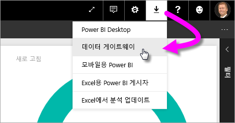
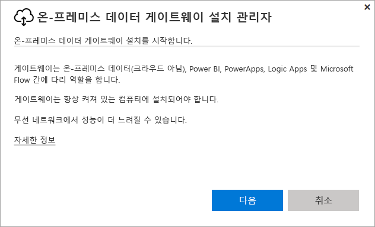
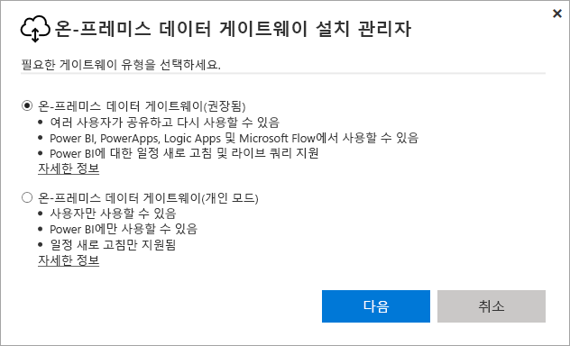
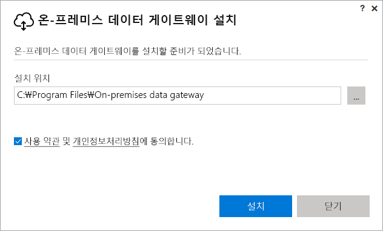
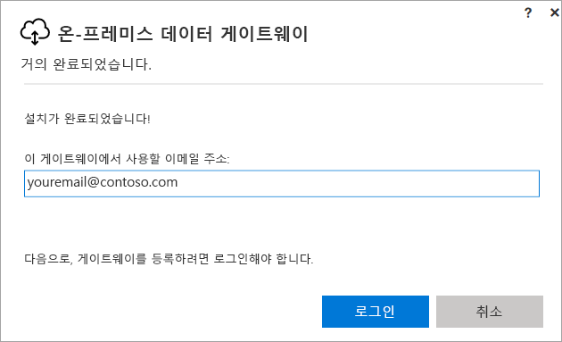
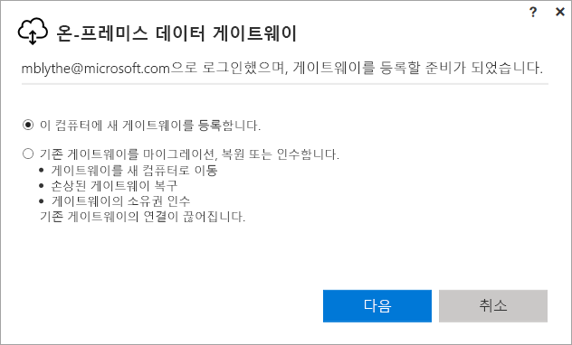
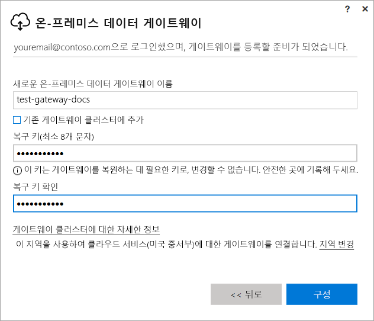
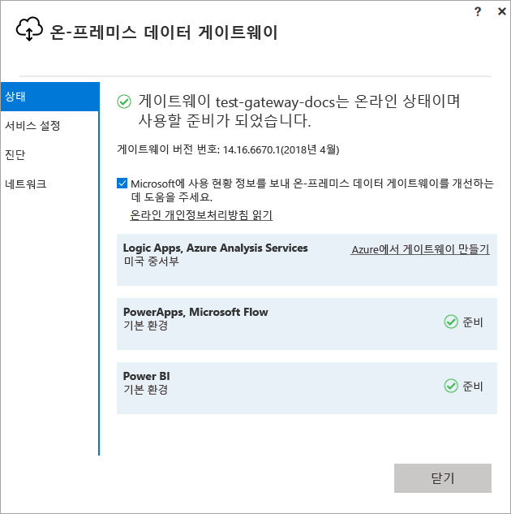
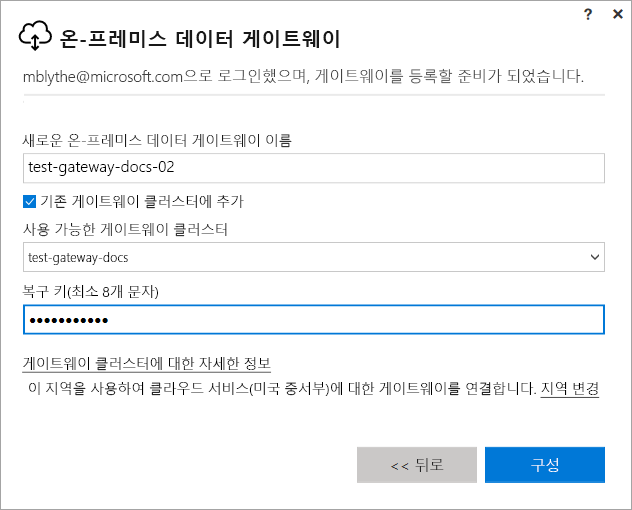

# Power BI용 게이트웨이 설치

Power BI 게이트웨이는 온-프레미스 네트워크 내에 설치하는 소프트웨어로서, 이 게이트웨이를 통해 해당 네트워크의 데이터에 액세스할 수 있습니다. [개요](service-gateway-getting-started.md)에 설명된 대로, 개인 모드 또는 표준 모드(권장)에서 게이트웨이를 설치할 수 있습니다. 표준 모드에서는 독립 실행형 게이트웨이를 설치하거나 ‘클러스터’에 게이트웨이를 추가(고가용성을 위해 권장)할 수 있습니다. 이 문서에서는 표준 게이트웨이를 설치한 다음, 다른 게이트웨이를 추가하여 클러스터를 만드는 방법을 보여줍니다.

아직 Power BI에 등록하지 않은 경우 시작하기 전에 [평가판에 등록합니다](https://app.powerbi.com/signupredirect?pbi_source=web).

## 게이트웨이 다운로드 및 설치

게이트웨이는 설치된 컴퓨터에서 실행되므로 항상 켜져 있는 컴퓨터에 설치해야 합니다. 성능과 안정성을 향상시키려면 컴퓨터는 무선 네트워크가 아닌 유선 네트워크에 있는 것이 좋습니다.

1. 오른쪽 위 모서리의 Power BI 서비스에서 **다운로드 아이콘**  > **데이터 게이트웨이**를 선택합니다.

    

2. 다운로드 페이지에서 **게이트웨이 다운로드** 단추를 선택합니다.

3. **다음**을 선택합니다.     

    

4. **온-프레미스 데이터 게이트웨이(권장)** >  **다음**을 선택합니다.

    

5. 기본 설치 경로를 유지하고 조건 > **설치**에 동의합니다.

    

6. Power BI > **로그인**에 로그인에 사용할 계정을 입력합니다.

    

    게이트웨이는 Power BI 계정과 연결되고 사용자는 Power BI 서비스 내에서 게이트웨이를 관리합니다. 이제 계정에 로그인되었습니다.

7. **이 컴퓨터에 새 게이트웨이를 등록합니다.** > **다음**을 선택합니다.

    

8. 게이트웨이 이름(테넌트에서 고유해야 함) 및 복구 키를 입력합니다. 게이트웨이를 복구하거나 이동하려면 이 키가 필요합니다. **구성** 을 선택합니다.

    

    **기존 게이트웨이 클러스터에 추가** 옵션을 확인합니다. 이 옵션은 문서의 다음 섹션에서 사용합니다.

9. 마지막 창의 정보를 검토합니다. 게이트웨이는 세 가지 모두에 동일한 계정을 사용하기 때문에 Power BI뿐 아니라 PowerApps 및 Flow에도 사용할 수 있습니다. **닫기**를 선택합니다.

    

이제 게이트웨이를 성공적으로 설치했으므로 다른 게이트웨이를 추가하여 클러스터를 만들 수 있습니다.

## 다른 게이트웨이를 추가하여 클러스터 만들기

클러스터를 사용하면 게이트웨이 관리자가 온-프레미스 데이터 액세스를 위한 단일 실패 지점을 포함하지 않게 할 수 있습니다. 기본 게이트웨이를 사용할 수 없는 경우 데이터 요청은 추가하는 두 번째 게이트웨이로 라우팅됩니다. 하나의 표준 게이트웨이만 컴퓨터에 설치할 수 있으므로 클러스터에 대한 두 번째 게이트웨이는 다른 컴퓨터에 설치해야 합니다. 클러스터에서 중복성을 원하기 때문에 이렇게 하는 것이 좋습니다.

고가용성 게이트웨이 클러스터를 만들려면 온-프레미스 데이터 게이트웨이에 대한 2017년 11월 이상 업데이트가 필요합니다.

1. 게이트웨이를 다른 컴퓨터에 다운로드하여 설치합니다.

2. Power BI 계정에 로그인한 후 게이트웨이를 등록합니다. **기존 클러스터에 추가**를 선택합니다. **사용 가능 게이트웨이 클러스터** 아래에서 설치한 첫 번째 게이트웨이(‘기본 게이트웨이’)를 선택하고 해당 게이트웨이에 대한 복구 키를 입력합니다. **구성** 을 선택합니다.

    

## 다음 단계

[Power BI 게이트웨이 관리](service-gateway-manage.md)

궁금한 점이 더 있나요? [Power BI 커뮤니티를 이용하세요.](http://community.powerbi.com/)