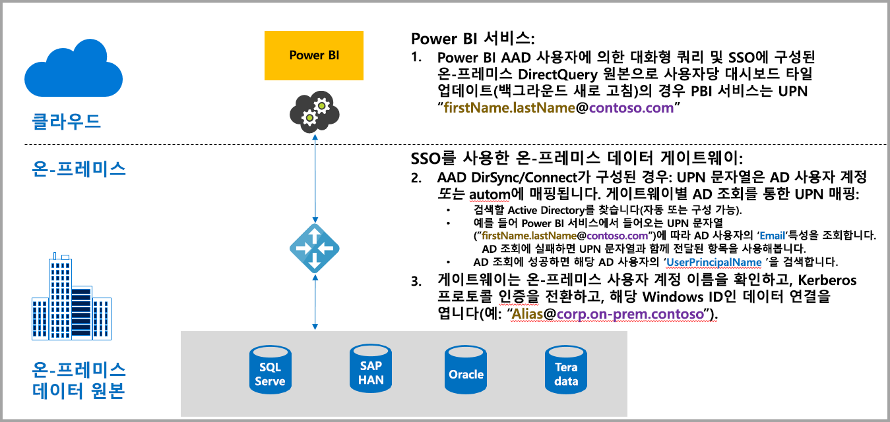
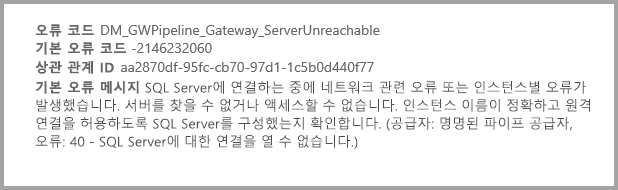
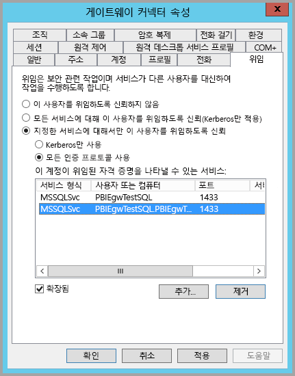
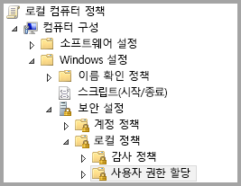
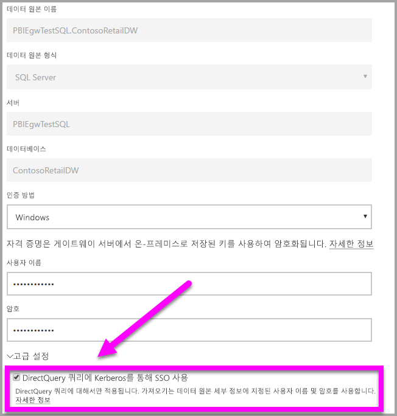
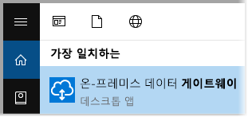
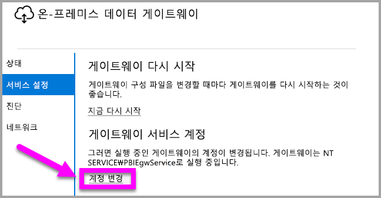

# Power BI에서 온-프레미스 데이터 원본으로 SSO(Single Sign-On)에 대해 Kerberos 사용
온-프레미스 데이터 게이트웨이를 Kerberos로 구성하여 Power BI 보고서 및 대시보드를 온-프레미스 데이터에서 업데이트할 수 있도록 하는 원활한 Single Sign-On 연결을 가져올 수 있습니다. 온-프레미스 데이터 게이트웨이는 온-프레미스 데이터 원본에 연결하는 데 사용하는 DirectQuery를 사용하는 SSO(Single Sign-On)를 용이하게 합니다.

[Kerberos 제한된 위임](https://technet.microsoft.com/library/jj553400.aspx)을 기반으로 하는 다음 데이터 원본, SQL Server, SAP HANA 및 Teradata는 현재 지원됩니다.

* SQL Server
* SAP HANA
* SAP BW
* Teradata

사용자가 Power BI 서비스에서 DirectQuery 보고서와 상호 작용하는 경우 각 교차 필터, 조각, 정렬 및 보고서 편집 작업은 기본 온-프레미스 데이터 원본에 대해 라이브를 실행하는 쿼리에서 발생할 수 있습니다.  Single Sign-On이 데이터 원본에 대해 구성된 경우 쿼리는 Power BI와 상호 작용하는 사용자의 ID에서 실행합니다(즉, 웹 환경 또는 Power BI 모바일 앱을 통해). 따라서 각 사용자는 구성된 Single Sign-On으로 기본 데이터 원본에서 사용 권한이 있는 데이터를 정확하게 보며, 서로 다른 사용자 간에는 공유 데이터 캐싱이 없습니다.

## SSO로 쿼리 실행 - 발생하는 단계
SSO로 실행하는 쿼리는 다음 다이어그램에 나와 있는 것처럼 세 단계로 구성됩니다.

> [!NOTE]
> Oracle에 대한 SSO이 아직 활성화되지 않었지만 개발 및 출시 예정입니다.
> 
> 

이러한 단계에 대한 자세한 내용은 다음과 같습니다.

1. 각 쿼리의 경우 **Power BI 서비스**는 구성된 게이트웨이에 쿼리 요청을 보낼 때 *사용자 계정 이름*(UPN)을 포함합니다.
2. 게이트웨이는 Azure Active Directory UPN을 로컬 Active Directory ID에 매핑해야 합니다.
   
   a.  AAD DirSync(*AAD Connect*라고도 함)가 구성된 경우 매핑이 게이트웨이에서 자동으로 적용됩니다. 
   
   b.  그렇지 않으면 게이트웨이가 로컬 Active Directory 도메인에 대해 조회를 수행하여 조회 후 로컬 사용자에게 Azure AD UPN을 매핑합니다.
3. 게이트웨이 서비스 프로세스는 매핑된 로컬 사용자를 가장하고, 기본 데이터베이스에 대한 연결을 열고 쿼리를 보냅니다. 게이트웨이를 데이터베이스와 동일한 컴퓨터에 설치할 필요가 없습니다.
   
   - 데이터베이스에 대한 사용자 가장 및 연결은 게이트웨이 서비스 계정이 도메인 계정일 때와, 데이터베이스에 대해 Kerberos 제한된 위임이 게이트웨이 서비스 계정으로부터의 Kerberos 티켓을 수락하도록 구성된 경우에만 성공합니다.  
   
   > [!NOTE]
   > 서비스 SID와 관련하여, AAD DirSync/Connect가 구성되고 사용자 계정이 동기화된 경우 게이트웨이 서비스는 런타임 시 로컬 AD 조회를 수행하지 않아도 되며 게이트웨이 서비스에 대해 로컬 서비스 SID(도메인 계정 요구 대신)를 사용할 수 있습니다.  이 문서에서 설명하는 Kerberos 제한된 위임 구성 단계는 동일합니다(도메인 계정 대신 서비스 SID에 따라 간단히 적용됨).
   > 
   > 

> [!NOTE]
> SAP HANA에 대해 SSO를 사용하도록 설정하려면:
>
> - SAP HANA 서버가 SAP HANA 서버 플랫폼 수준에 필요한 최소 버전을 실행 중인지 확인합니다.
>     - [HANA 2 SPS 01 Rev 012.03](https://launchpad.support.sap.com/#/notes/2557386)
>     - [HANA 2 SPS 02 Rev 22](https://launchpad.support.sap.com/#/notes/2547324)
>     - [HANA 1 SP 12 Rev 122.13](https://launchpad.support.sap.com/#/notes/2528439)
>
> - 게이트웨이 머신에 SAP의 최신 HANA ODBC 드라이버를 설치합니다.  최소 버전은 HANA ODBC 2017년 8월 릴리스된 2.00.020.00 버전입니다.
>
> Kerberos를 사용하여 SAP HANA에 대한 Single Sign-On을 설정하고 구성하는 방법에 대한 자세한 내용은 SAP HANA 보안 가이드의 [Single Sign-on Using Kerberos](https://help.sap.com/viewer/b3ee5778bc2e4a089d3299b82ec762a7/2.0.03/en-US/1885fad82df943c2a1974f5da0eed66d.html)(Kerberos를 사용한 Single Sign-On) 항목과 해당 페이지의 링크(특히 SAP Note 1837331 – HOWTO HANA DBSSO Kerberos/Active Directory)를 참조하세요. 
>
>

## 부족한 Kerberos 구성의 오류
기본 데이터베이스 서버 및 게이트웨이가 **Kerberos 제한된 위임**에 대해 제대로 구성되지 않은 경우 다음 오류 메시지를 받을 수 있습니다.

오류 메시지와 관련된 기술 세부 정보는 다음과 같이 나타날 수 있습니다.

결과는 불충분한 Kerberos 구성 때문이며, 게이트웨이는 원래 사용자를 적절하게 가장할 수 없었고, 데이터베이스 연결 시도가 실패했습니다.

## Kerberos 제한된 위임 준
Kerberos 제한된 위임을 적절하게 작동하기 위해 *서비스 사용자 이름*(SPN) 및 서비스 계정의 위임 설정을 포함한 여러 개의 항목을 구성해야 합니다.

### 필수 구성 요소 1: 온-프레미스 데이터 게이트웨이 설치 및 구성
온-프레미스 데이터 게이트웨이의 이 릴리스는 기존 게이트웨이의 인계 설정뿐만 아니라 전체 업그레이드를 지원합니다.

### 필수 구성 요소 2: 도메인 계정으로 게이트웨이 Windows 서비스 실행
표준 설치에서 게이트웨이는 다음 그림에 표시되는 것과 같이 컴퓨터 로컬 서비스 계정(특히 *NT Service\PBIEgwService*)으로 실행됩니다.

**Kerberos 제한된 위임**을 활성화하기 위해 게이트웨이는 AAD가 이미 로컬 Active Directory(AAD DirSync/Connect 사용)와 동기화되지 않는 한 도메인 계정으로 실행해야 합니다. 이 계정 변경 내용을 제대로 작동하기 위한 두 가지 옵션이 있습니다.

* 이전 버전의 온-프레미스 데이터 게이트웨이로 시작한 경우 다음 문서에서 설명된 5단계를 모두 순서대로(3단계의 게이트웨이 구성기 실행 포함) 정확하게 수행합니다.
  
  * [게이트웨이 서비스 계정을 도메인 사용자로 변경](https://powerbi.microsoft.com/documentation/powerbi-gateway-proxy/#changing-the-gateway-service-account-to-a-domain-user)
  * 미리 보기 버전의 온-프레미스 데이터 게이트웨이를 이미 설치한 경우 게이트웨이의 구성기 내에서 직접 서비스 계정을 전환하는 새로운 UI 기반 방식이 있습니다. 이 문서의 끝 근처의 **도메인 계정으로 게이트웨이 전환** 섹션을 참조하세요.

> [!NOTE]
> AAD DirSync/Connect가 구성되고 사용자 계정이 동기화된 경우 게이트웨이 서비스는 런타임 시 로컬 AD 조회를 수행하지 않아도 되며 게이트웨이 서비스에 대해 로컬 서비스 SID(도메인 계정 요구 대신)를 사용할 수 있습니다. 이 문서에서 설명하는 Kerberos 제한된 위임 구성 단계는 해당 구성과 동일합니다(도메인 계정 대신 서비스 SID에 따라 간단히 적용됨).
> 
> 

### 필수 구성 요소 3: SPN(SetSPN) 및 Kerberos 제한된 위임 설정을 구성하는 도메인 관리자 권한 갖기
도메인 관리자가 도메인 관리자 권한을 요구하지 않고 다른 사용자에게 SPN 및 Kerberos 위임을 구성하는 권한을 일시적 또는 영구적으로 허용하는 것은 기술적으로 가능하지만 이는 권장되는 방법이 아닙니다. 다음 섹션에서 **필수 구성 요소 3**에 필요한 구성 단계를 자세히 설명합니다.

## 게이트웨이 및 데이터 원본에 대해 Kerberos 제한된 위임 구성
시스템을 제대로 구성하려면 다음 두 항목을 구성하거나 유효성을 검사해야 합니다.

1. 필요한 경우 게이트웨이 서비스 도메인 계정에 대한 SPN을 구성합니다(아직 아무것도 만들어지지 않은 경우).
2. 게이트웨이 서비스 도메인 계정에서 위임 설정을 구성합니다.

두 개의 구성 단계를 수행하기 위한 도메인 관리자여야 합니다.

다음 섹션에서는 이러한 단계를 차례로 설명합니다.

### 게이트웨이 서비스 계정에 대해 SPN 구성
먼저 게이트웨이 서비스 계정으로 사용된 도메인 계정에 대해 SPN이 이미 만들어졌는지 확인합니다. 다음 단계를 따릅니다.

1. 도메인 관리자로 **Active Directory 사용자 및 컴퓨터**를 시작합니다.
2. 도메인을 마우스 오른쪽 단추로 클릭하고, **찾기**를 선택하고, 게이트웨이 서비스 계정의 계정 이름을 입력합니다.
3. 검색 결과에서 게이트웨이 서비스 계정을 마우스 오른쪽 단추로 클릭하고 **속성**을 선택합니다.
   
   * **위임** 탭을 **속성** 대화 상자에서 볼 수 있는 경우 SPN이 이미 만들어졌으며 위임 설정 구성에 대한 다음 하위 섹션으로 바로 이동할 수 있습니다.

**속성** 대화 상자 **위임** 탭이 없는 경우 해당 계정에서 **위임** 탭을 추가하는 SPN을 수동으로 만들 수 있습니다(위임 설정을 구성하는 가장 쉬운 방법임). SPN 만들기는 Windows와 함께 제공되는 [setspn 도구](https://technet.microsoft.com/library/cc731241.aspx)를 사용하여 수행할 수 있습니다(SPN을 만드는 도메인 관리자 권한 필요).

예를 들어, 게이트웨이 서비스 계정이 "PBIEgwTest\GatewaySvc"이며 실행 중인 게이트웨이 서비스가 있는 컴퓨터 이름이 **Machine1**이라고 가정합니다. 이 예에서 해당 컴퓨터에 대한 게이트웨이 서비스 계정의 SPN을 설정하려면 다음 명령을 실행합니다.

해당 단계가 완료되면 위임 설정 구성으로 이동할 수 있습니다.

### 게이트웨이 서비스 계정에서 위임 설정 구성
두 번째 구성 요구 사항은 게이트웨이 서비스 계정에서 위임 설정입니다. 이러한 단계를 수행할 수 있는 여러 도구가 있습니다. 이 문서에서는 디렉터리에서 정보를 관리하고 게시하는 데 사용할 수 있으며 기본적으로 도메인 컨트롤러에서 사용할 수 있는 MMC(Microsoft Management Console) 스냅인 **Active Directory 사용자 및 컴퓨터**를 사용합니다. 다른 컴퓨터에서 **Windows 기능** 구성을 통해 설정할 수도 있습니다.

프로토콜 전송을 사용하여 **Kerberos 제한된 위임**을 구성해야 합니다. 제한된 위임을 사용하여 위임하려는 서비스로 명시적이어야 합니다. 예를 들어, SQL Server 또는 SAP HANA 서버만 게이트웨이 서비스 계정의 위임 호출을 수락합니다.

이 섹션에서는 기본 데이터 원본에 대해 SPN을 이미 구성했다고 가정합니다(예: SQL Server, SAP HANA, Teradata 등). 이러한 데이터 원본 서버 SPN을 구성하는 방법을 알아보려면 해당 데이터베이스 서버에 대한 기술 설명서를 참조하세요. [*앱에서 필요한 SPN*](https://blogs.msdn.microsoft.com/psssql/2010/06/23/my-kerberos-checklist/)을 설명하는 블로그 게시물을 살펴볼 수도 있습니다.

다음 단계에서는 두 개의 컴퓨터, 게이트웨이 컴퓨터 및 데이터베이스 서버(SQL Server 데이터베이스)가 있는 온-프레미스 환경을 가정합니다. 또한 이 예제를 위해 다음 설정 및 이름을 가정합니다.

* 게이트웨이 컴퓨터 이름: **PBIEgwTestGW**
* 게이트웨이 서비스 계정: **PBIEgwTest\GatewaySvc**(계정 표시 이름: 게이트웨이 커넥터)
* SQL Server 데이터 원본 컴퓨터 이름: **PBIEgwTestSQL**
* SQL Server 데이터 원본 서비스 계정: **PBIEgwTest\SQLService**

지정된 이러한 예제 이름 및 설정, 구성 단계는 다음과 같습니다.

1. 도메인 관리자 권한으로 **Active Directory 사용자 및 컴퓨터**를 시작합니다.
2. 게이트웨이 서비스 계정(**PBIEgwTest\GatewaySvc**)을 마우스 오른쪽 단추로 클릭하고 **속성**을 선택합니다.
3. **위임** 탭을 선택합니다.
4. **지정한 서비스에 대한 위임의 경우 이 컴퓨터 신뢰**를 선택합니다.
5. **모든 인증 프로토콜 사용**을 선택합니다.
6. **이 계정이 위임된 자격 증명을 표시할 수 있는 서비스**에서 **추가**를 선택합니다.
7. 새 대화 상자에서 **사용자 또는 컴퓨터**를 선택합니다.
8. SQL Server Database 서비스(**PBIEgwTest\SQLService**)에 대한 서비스 계정을 입력하고 **확인**을 선택합니다.
9. 데이터베이스 서버에 대해 만든 SPN을 선택합니다. 예제에서 SPN은 **MSSQLSvc**로 시작합니다. 데이터베이스 서비스에 대해 FQDN 및 NetBIOS SPN 모두를 추가한 경우 둘 다 선택합니다. 하나만 표시될 수 있습니다.
10. **확인**을 선택합니다. 이제 목록에서 SPN이 표시됩니다.
11. 경우에 따라 **확장됨**을 선택하여 FQDN과 NetBIOS SPN을 모두 표시할 수 있습니다.
12. **확장됨**을 선택한 경우 대화 상자는 다음과 유사하게 표시됩니다.
    
    
13. **확인**을 선택합니다.
    
    마지막으로, 게이트웨이 서비스(예에서 **PBIEgwTestGW**)를 실행 중인 컴퓨터에서 게이트웨이 서비스 계정은 로컬 정책 "인증 후 클라이언트 가장"을 부여해야 합니다. 로컬 그룹 정책 편집기(**gpedit**)를 사용하여 이를 수행/확인할 수 있습니다.
14. 게이트웨이 컴퓨터에서 *gpedit.msc*를 실행합니다.
15. 다음 그림에 표시된 것처럼 **로컬 컴퓨터 정책 > 컴퓨터 구성 > Windows 설정 > 보안 설정 > 로컬 정책 > 사용자 권한 할당**으로 이동합니다.
    
    
16. **사용자 권한 할당** 아래의 정책 목록에서 **인증 후 클라이언트 가장**을 선택합니다.
    
    
    
    **인증 후 클라이언트 가장**에 대해 **속성**을 마우스 오른쪽 단추로 클릭하고 열고 계정의 목록을 확인합니다. 게이트웨이 서비스 계정을 포함해야 합니다(**PBIEgwTest\GatewaySvc**).
17. **사용자 권한 할당** 아래의 정책 목록에서 **운영 체제의 일부로 작동(SeTcbPrivilege)** 을 선택합니다. 게이트웨이 서비스 계정이 계정 목록에도 포함되어 있는지 확인합니다.
18. **온-프레미스 데이터 게이트웨이** 서비스 프로세스를 다시 시작합니다.

## Power BI 보고서 실행
이 문서의 앞부분에 설명된 모든 구성 단계를 완료한 후 Power BI에서 **게이트웨이 관리** 페이지를 사용하여 데이터 원본을 구성할 수 있으며 해당 **고급 설정** 아래에서 SSO를 활성화한 다음 해당 데이터 원본에 보고서 및 데이터 집합 바인딩을 게시할 수 있습니다.

이 구성은 대부분의 경우에서 작동합니다. 그러나 Kerberos를 사용하는 경우 환경에 따라 서로 다른 구성이 있을 수 있습니다. 보고서가 여전히 로드되지 않는 경우 추가 조사를 위해 도메인 관리자에게 문의해야 합니다.

## 도메인 계정으로 게이트웨이 전환
이 문서의 앞부분에서 **온-프레미스 데이터 게이트웨이** 사용자 인터페이스를 사용하여 도메인 계정으로 실행되도록 로컬 서비스 계정에서 게이트웨이 전환을 설명했습니다. 이렇게 하는 데 필요한 단계는 다음과 같습니다.

1. **온-프레미스 데이터 게이트웨이** 구성 도구를 시작합니다.
   
   
2. 기본 페이지에서 **로그인** 단추를 선택하고 Power BI 계정으로 로그인합니다.
3. 로그인을 완료한 후 **서비스 설정** 탭을 선택합니다.
4. **계정 변경**을 클릭하여 다음 그림에 나와 있는 것처럼 단계별 연습을 시작합니다.
   
   

## 다음 단계
**온-프레미스 데이터 게이트웨이** 및 **DirectQuery**에 대한 자세한 내용은 다음 리소스를 확인하세요.

* [온-프레미스 데이터 게이트웨이](service-gateway-onprem.md)
* [Power BI의 DirectQuery](desktop-directquery-about.md)
* [DirectQuery에서 지원하는 데이터 원본](desktop-directquery-data-sources.md)
* [DirectQuery 및 SAP BW](desktop-directquery-sap-bw.md)
* [DirectQuery 및 SAP HANA](desktop-directquery-sap-hana.md)

