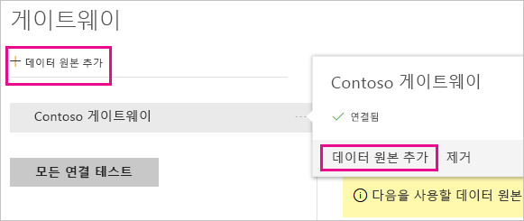
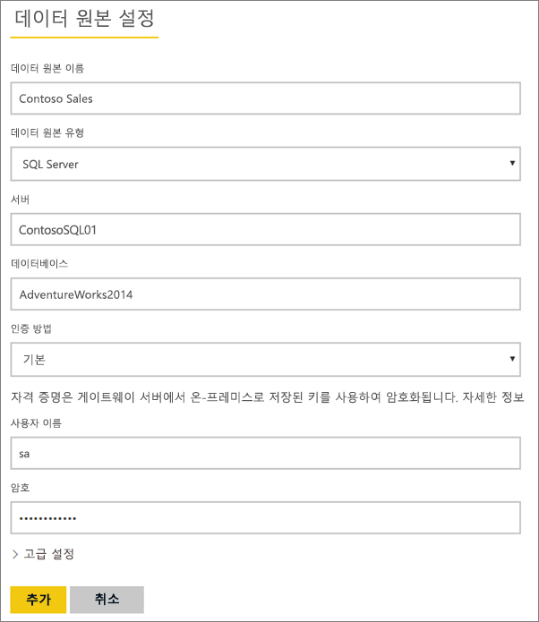
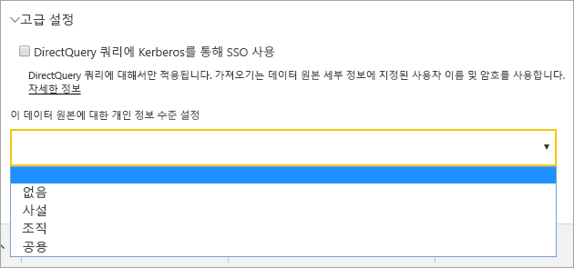
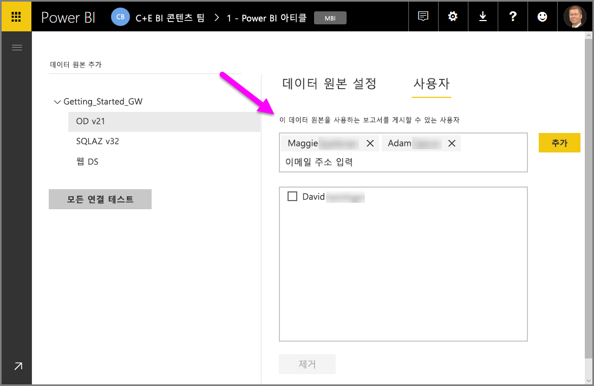
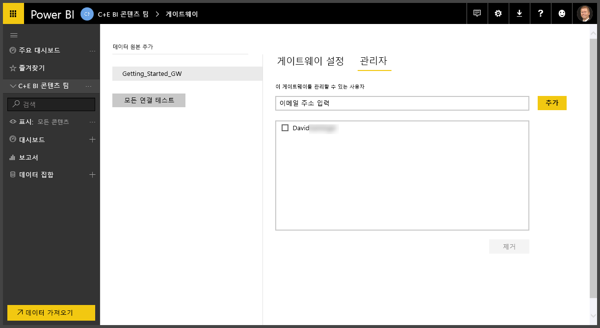
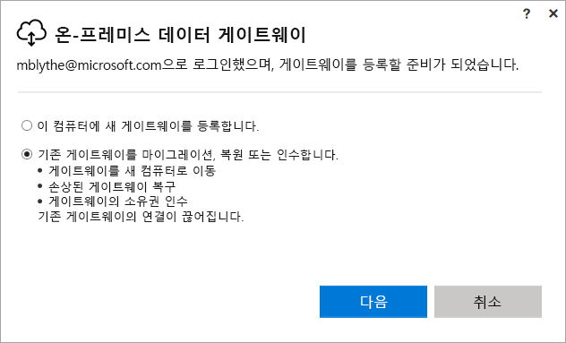
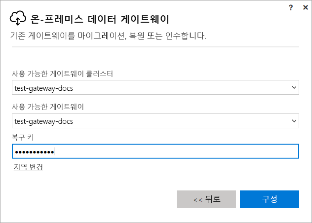

# Power BI 온-프레미스 게이트웨이 관리

[Power BI 데이터 게이트웨이를 설치](service-gateway-install.md)한 후 필요에 따라 관리합니다. 이 항목에서는 데이터 원본 및 사용자 추가 및 제거, 게이트웨이 다시 시작, 게이트웨이 마이그레이션, 복원, 인수 및 제거 방법에 대해 알아봅니다.

로컬 컴퓨터의 게이트웨이 앱에서 PowerShell 스크립트를 사용하여 Power BI 서비스의 **게이트웨이 관리** 영역을 통해 게이트웨이를 관리할 수 있습니다. 이 문서에서는 Power BI 서비스에 대해 중점적으로 설명합니다.

게이트웨이를 방금 설치한 경우 다음으로 [데이터 원본을 추가](#add-a-data-source)하고 사용자가 데이터 원본에 액세스할 수 있도록 [사용자를 추가](#add-users-to-a-data-source)하는 것이 좋습니다.

## 데이터 원본 관리

Power BI는 다양한 온-프레미스 데이터 원본을 지원하고 각 데이터 원본에는 고유한 요구 사항이 있습니다. 단일 데이터 원본이나 여러 데이터 원본에 게이트웨이를 사용할 수 있습니다. 이 예제에서는 SQL Server를 데이터 원본으로 추가하는 방법을 보여주지만 단계는 다른 데이터 원본의 경우와 비슷합니다.

### 데이터 소스 추가

1. Power BI 서비스의 오른쪽 위 모서리에서 기어 아이콘  > **게이트웨이 관리**를 선택합니다.

    

2. 게이트웨이 > **데이터 원본 추가**를 선택하거나 게이트웨이 > **데이터 원본 추가**로 이동합니다.

    

3. **데이터 원본 유형**을 선택합니다.

    

4. 데이터 원본에 대한 정보를 입력합니다. 이 예제에서는 **서버**, **데이터베이스** 및 기타 정보입니다.  

    

5. SQL Server의 경우 **Windows** 또는 **기본**(SQL 인증)의 **인증 방법**을 선택합니다.  **기본**을 선택하는 경우 데이터 원본에 대한 자격 증명을 입력합니다.

6. **고급 설정**에서 선택적으로 데이터 원본에 대한 [개인 정보 수준](https://support.office.com/article/Privacy-levels-Power-Query-CC3EDE4D-359E-4B28-BC72-9BEE7900B540)을 구성합니다([DirectQuery](desktop-directquery-about.md)에 적용되지 않음).

    

7. **추가**를 선택합니다. 프로세스가 성공하면 ‘연결 성공’이 표시됩니다.

    

이제 이 데이터 원본을 사용하여 Power BI 대시보드 및 보고서에 SQL Server의 데이터를 포함할 수 있습니다.

### 데이터 원본 제거

더 이상 사용하지 않는 경우 데이터 원본을 제거할 수 있습니다. 데이터 원본을 제거하면 해당 데이터 원본을 사용하는 모든 대시보드와 보고서가 제거된다는 것에 유의하세요.

데이터 원본을 제거하려면 데이터 원본으로 이동한 다음, **제거**를 선택합니다.

## 사용자 및 관리자 관리

게이트웨이에 데이터 원본을 추가한 후 사용자와 보안 그룹에게 특정 데이터 원본(전체 게이트웨이가 아님)에 대한 액세스 권한을 부여합니다. 데이터 원본 사용자 목록은 데이터 원본의 데이터를 포함하는 보고서를 게시할 수 있는 사용자만 제어합니다. 보고서 소유자는 대시보드, 콘텐츠 팩 또는 앱을 만든 다음, 이를 다른 사용자와 공유할 수 있습니다.

사용자 및 보안 그룹에게 게이트웨이에 대한 관리 권한을 부여할 수도 있습니다.

### 데이터 원본에 사용자 추가

1. Power BI 서비스의 오른쪽 위 모서리에서 기어 아이콘  > **게이트웨이 관리**를 선택합니다.

2. 사용자를 추가할 데이터 원본을 선택합니다.

3. **사용자**를 선택하고 선택한 데이터 원본에 대한 액세스 권한을 부여하려는 조직 내 사용자를 입력합니다. 다음 화면에서는 Maggie와 Adam을 추가하고 있습니다.

    

4. **추가**를 선택하면 추가된 구성원이 상자에 표시됩니다.

    

매우 간단합니다. 액세스를 부여하려는 각각의 데이터 원본에 사용자를 추가해야 합니다. 각 데이터 원본에는 별도의 사용자 목록이 있고 각 데이터 원본마다 개별적으로 사용자를 추가해야 합니다.

### 데이터 원본에서 사용자 제거

데이터 원본에 대한 **사용자** 탭에서 이 데이터 원본을 사용하는 사용자 및 보안 그룹을 제거할 수 있습니다.

### 관리자 추가 및 제거

게이트웨이에 대한 **관리자** 탭에서 게이트웨이를 관리할 수 있는 사용자(또는 보안 그룹)를 추가 및 제거합니다.

## 게이트웨이 클러스터 관리

두 개 이상의 게이트웨이로 구성된 클러스터를 만들면 데이터 원본 추가 또는 게이트웨이에 관리 권한 부여 등의 모든 게이트웨이 관리 작업이 클러스터의 일부인 모든 게이트웨이에 적용됩니다. 

관리자가 **Power BI 서비스**의 기어 아이콘 아래에서 찾을 수 있는 **게이트웨이 관리** 메뉴 항목을 사용할 때 등록된 클러스터 또는 개별 게이트웨이 목록은 보이지만, 클러스터의 구성원인 개별 게이트웨이 인스턴스는 보이지 않습니다.

모든 새 **예약된 새로 고침** 요청 및 DirectQuery 작업은 지정된 게이트웨이 클러스터의 기본 인스턴스에 자동으로 라우팅됩니다. 기본 게이트웨이 인스턴스가 오프라인이면 요청이 클러스터의 다른 게이트웨이 인스턴스로 라우팅됩니다.

## 게이트웨이 공유

게이트웨이를 그 자체로는 ‘공유’할 수 없지만, 게이트웨이에 관리자를 추가할 수 있으며, 게이트웨이의 데이터 원본에 사용자를 추가할 수 있습니다. 

게이트웨이를 설치한 후에는 기본적으로 해당 게이트웨이의 관리자가 됩니다. 이전에 설명한 것처럼, 다른 사용자를 관리자로 추가할 수 있습니다. 이러한 관리자는 데이터 원본을 추가하고, 구성하고, 게이트웨이를 제거할 수 있습니다.

각 게이트웨이 아래에 작성한 데이터 원본에 사용자를 할당할 수도 있습니다. 그러면 사용자는 이러한 데이터 원본을 사용하여 Power BI 보고서를 새로 고칠 수 있습니다. 그러나 데이터 원본 또는 게이트웨이 설정은 변경할 수 없습니다.

## 게이트웨이 마이그레이션, 복원 또는 인수

게이트웨이를 마이그레이션, 복원 또는 인수하려는 컴퓨터에서 게이트웨이 설치 관리자를 실행합니다.

1. 게이트웨이를 다운로드하여 설치합니다.

2. Power BI 계정에 로그인한 후 게이트웨이를 등록합니다. **기존 게이트웨이 마이그레이션, 복원 또는 인수** > **다음**을 선택합니다.

    

3. 사용 가능한 클러스터 및 게이트웨이 중에서 선택하고 선택한 게이트웨이에 대한 복구 키를 입력합니다. **구성** 을 선택합니다.

    

## 게이트웨이 다시 시작

게이트웨이는 Windows 서비스로 실행됩니다. Windows 서비스처럼 게이트웨이를 시작 및 중지하는 여러 방법이 있습니다. 명령 프롬프트에서 이를 수행하는 방법을 다음과 같습니다.

1. 게이트웨이가 실행 중인 머신에서 관리자 권한으로 명령 프롬프트를 시작합니다.

2. 서비스를 중지하려면 `net stop PBIEgwService`를 입력합니다.

3. 서비스를 다시 시작하려면 `net start PBIEgwService`를 입력합니다.

## 게이트웨이 제거

더 이상 사용하지 않는 경우 게이트웨이를 제거할 수 있습니다. 그러나 게이트웨이를 제거하면 그 아래의 모든 데이터 원본이 삭제됩니다. 이로 인해 해당 데이터 원본을 사용하는 모든 대시보드 및 보고서와의 연결도 끊어집니다.

1. Power BI 서비스의 오른쪽 위 모서리에서 기어 아이콘  > **게이트웨이 관리**를 선택합니다.

2. 게이트웨이 > **제거**를 선택합니다.
   
   

## 다음 단계

[데이터 게이트웨이 배포 지침](service-gateway-deployment-guidance.md)

궁금한 점이 더 있나요? [Power BI 커뮤니티를 이용하세요.](http://community.powerbi.com/)
