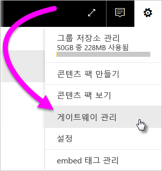
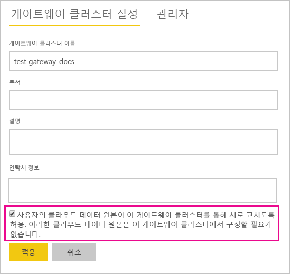
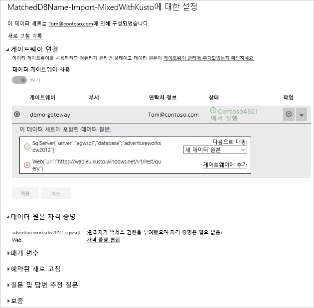

# 온-프레미스 및 클라우드 데이터 원본 병합 또는 추가

[!INCLUDE [gateway-rewrite](includes/gateway-rewrite.md)]

온-프레미스 데이터 게이트웨이를 사용하여 동일한 쿼리에서 온-프레미스 및 클라우드 데이터 원본을 병합하거나 추가할 수 있습니다. 이 솔루션은 별도의 쿼리를 사용하지 않고 여러 원본의 데이터를 결합하려는 경우에 유용합니다.

>[!NOTE]
>이 문서는 클라우드 및 온-프레미스 데이터 원본이 단일 쿼리에서 병합 또는 추가되는 데이터 세트에만 적용됩니다. 한 쿼리는 온-프레미스 데이터 원본에 연결되고 다른 쿼리는 클라우드 데이터 원본에 연결된 개별 쿼리를 포함하는 데이터 세트의 경우 게이트웨이에서 클라우드 데이터 원본에 대한 쿼리를 실행하지 않습니다.

## 필수 조건

- 로컬 컴퓨터에 [게이트웨이가 설치되었습니다](/data-integration/gateway/service-gateway-install).
- 온-프레미스 및 클라우드 데이터 원본을 결합하는 쿼리가 포함된 Power BI Desktop 파일입니다.

>[!NOTE]
>클라우드 데이터 원본에 액세스하려면 게이트웨이에서 해당 데이터 원본에 액세스할 수 있는지 확인해야 합니다.

1. Power BI 서비스의 오른쪽 위 모서리에서 기어 아이콘  > **게이트웨이 관리**를 선택합니다.

    

2. 구성할 게이트웨이를 선택합니다.

3. **게이트웨이 클러스터 설정**에서 **사용자의 클라우드 데이터 원본이 이 게이트웨이 클러스터를 통해 새로 고치도록 허용** > **적용**을 선택합니다.

    

4. 이 게이트웨이 클러스터 아래에서 쿼리에 사용된 모든 [온-프레미스 데이터 원본](service-gateway-enterprise-manage-scheduled-refresh.md#add-a-data-source)을 추가합니다. 여기에 클라우드 데이터 원본을 추가할 필요가 없습니다.

5. 온-프레미스 및 클라우드 데이터 원본을 결합한 쿼리로 Power BI Desktop 파일을 Power BI 서비스에 업로드합니다.

6. 새 데이터 세트의 **데이터 세트 설정** 페이지에서 다음을 수행합니다.

   - 온-프레미스 원본의 경우 이 데이터 원본과 연결된 게이트웨이를 선택합니다.
   - **데이터 원본 자격 증명**에서 필요에 따라 클라우드 데이터 원본 자격 증명을 편집합니다.

    클라우드 및 온-프레미스 데이터 원본의 프라이버시 수준이 둘 다 조인을 안전하게 처리하도록 제대로 설정되었는지 확인합니다.

     

7. 클라우드 자격 증명이 설정되었으면 이제 **지금 새로 고침** 옵션을 사용하여 데이터 세트를 새로 고칠 수 있습니다. 또는 정기적으로 새로 고치도록 예약할 수 있습니다.

## 다음 단계

게이트웨이에 대해 데이터 새로 고침에 대한 자세한 내용은 [예약된 새로 고침을 위해 데이터 원본 사용](service-gateway-enterprise-manage-scheduled-refresh.md#using-the-data-source-for-scheduled-refresh)을 참조하세요.
