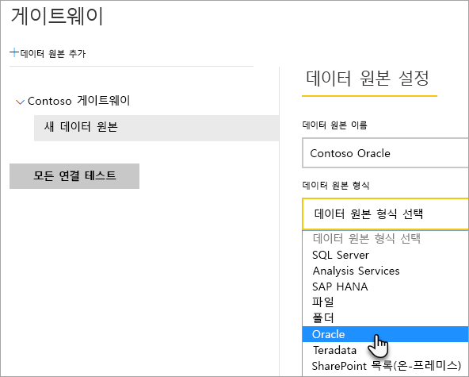
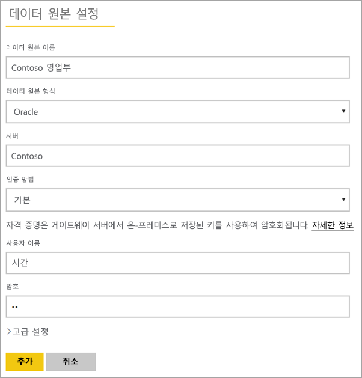
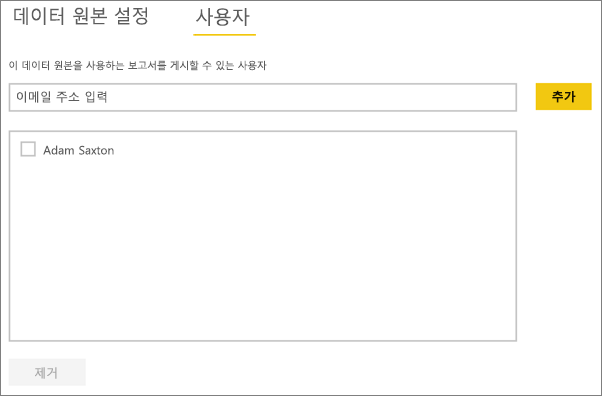
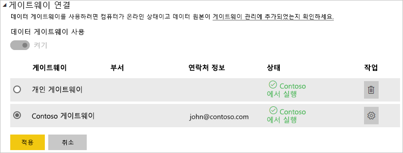

# <a name="manage-your-data-source---oracle"></a>데이터 원본 관리 - Oracle
온-프레미스 데이터 게이트웨이를 설치한 후에는 게이트웨이와 함께 사용할 수 있는 데이터 원본을 추가해야 합니다. 이 문서에서는 게이트웨이 및 데이터 소스로 작업하는 방법을 살펴봅니다. 예약된 새로 고침 또는 DirectQuery에 대해 Oracle 데이터 원본을 사용할 수 있습니다.

## <a name="download-and-install-the-gateway"></a>게이트웨이 다운로드 및 설치
Power BI 서비스에서 게이트웨이를 다운로드할 수 있습니다. **다운로드** > **데이터 게이트웨이**를 선택하거나 [게이트웨이 다운로드 페이지](https://go.microsoft.com/fwlink/?LinkId=698861)로 이동합니다.


> [!WARNING]
> 게이트웨이를 Oracle 서버에 연결할 수 있으려면 Oracle Data Provider for .NET(ODP.NET)을 설치하고 구성해야 합니다. ODAC(Oracle Data Access Components)의 일부입니다. Oracle 공급자를 다운로드하는 방법에 대한 자세한 내용은 아래 [Oracle 클라이언트 설치](#installing-the-oracle-client)를 참조하세요.
> 
> 

## <a name="installing-the-oracle-client"></a>Oracle 클라이언트 설치
**32비트** 버전의 Power BI Desktop의 경우 다음 링크를 사용하여 **32비트** Oracle 클라이언트를 다운로드 및 설치합니다.

* [Visual Studio(12.1.0.2.4)용 Oracle 개발자 도구와 32비트 ODAC(Oracle Data Access Components)](http://www.oracle.com/technetwork/topics/dotnet/utilsoft-086879.html)

**64비트** 버전의 Power BI Desktop 또는 온-프레미스 데이터 게이트웨이의 경우 다음 링크를 사용하여 **64비트** Oracle 클라이언트를 다운로드 및 설치합니다.

* [Windows x64용 64비트 ODAC 12.2c 릴리스 1(12.2.0.1.0)](http://www.oracle.com/technetwork/database/windows/downloads/index-090165.html)

설치된 후에 데이터베이스에 대한 적절한 정보로 tnsnames.ora 파일을 구성해야 합니다. Power BI Desktop 및 게이트웨이는 tnsnames.ora 파일에 정의된 net_service_name 외부로 이동합니다. 구성되지 않으면 연결할 수 없습니다. tnsnames.ora에 대한 기본 경로는 다음 `[Oracle Home Directory]\Network\Admin\tnsnames.ora`와(과) 같습니다. tnsnames.ora 파일을 구성하는 방법에 대한 자세한 내용은 [Oracle: 로컬 이름 지정 매개 변수(tnsnames.ora)](https://docs.oracle.com/cd/B28359_01/network.111/b28317/tnsnames.htm)를 참조하세요.

### <a name="example-tnsnamesora-file-entry"></a>예제 tnsnames.ora 파일 항목
tnsname.ora에 있는 항목의 기본 형식은 다음과 같습니다.

```
net_service_name=
 (DESCRIPTION=
   (ADDRESS=(protocol_address_information))
   (CONNECT_DATA=
     (SERVICE_NAME=service_name)))
```

작성되는 서버 및 포트 정보의 예는 다음과 같습니다.

```
CONTOSO =
  (DESCRIPTION =
    (ADDRESS = (PROTOCOL = TCP)(HOST = oracleserver.contoso.com)(PORT = 1521))
    (CONNECT_DATA =
      (SERVER = DEDICATED)
      (SERVICE_NAME = CONTOSO)
    )
  )
```

## <a name="add-a-gateway"></a>게이트웨이 추가
게이트웨이를 추가하려면 해당 환경의 서버에 게이트웨이를 [다운로드](https://go.microsoft.com/fwlink/?LinkId=698861)하여 설치하기만 하면 됩니다. 게이트웨이를 설치하면 **게이트웨이 관리**아래의 게이트웨이 목록에 표시됩니다.

> [!NOTE]
> 하나 이상의 게이트웨이에 대한 관리자가 아닌 경우 **게이트웨이 관리**가 표시되지 않습니다. 이를 위해서는 관리자로 추가되거나 게이트웨이를 설치 및 구성해야 합니다.
> 
> 

## <a name="remove-a-gateway"></a>게이트웨이 제거
게이트웨이를 제거하면 해당 게이트웨이에 속한 모든 데이터 원본도 삭제됩니다.  또한 이러한 데이터 소스를 사용하는 모든 대시보드 및 보고서와의 연결도 끊어집니다.

1. 오른쪽 위 모퉁이에서 기어 아이콘  > **게이트웨이 관리**를 선택합니다.
2. 게이트웨이 > **제거**
   
   

## <a name="add-a-data-source"></a>데이터 소스 추가
게이트웨이를 선택하고 **데이터 소스 추가**를 클릭하거나 게이트웨이 > **데이터 소스 추가**로 이동하여 데이터 소스를 추가할 수 있습니다.


그런 다음 목록에서 **데이터 소스 형식** 을 선택합니다.



그런 다음 **서버** 및 **데이터베이스**를 포함하는 데이터 소스에 대한 정보를 입력합니다.  

**인증 방법**을 선택해야 할 수 있습니다.  인증 방법은 **Windows** 또는 **기본**입니다.  Windows 인증 대신 Oracle 내에서 만든 계정을 사용하려는 경우 **기본** 을 선택합니다. 그런 다음 이 데이터 소스에 사용할 자격 증명을 입력합니다.

> [!NOTE]
> 데이터 소스에 대한 모든 쿼리는 이러한 자격 증명을 사용하여 실행됩니다. 자세한 내용은 기본 온-프레미스 데이터 게이트웨이 문서를 참조하여 [자격 증명](service-gateway-onprem.md#credentials)이 저장되는 방식에 대해 자세히 알아보세요.
> 
> 



모든 항목을 입력한 다음 **추가**를 클릭합니다.  이제 온-프레미스의 Oracle 서버에 대해 예약된 새로 고침 또는 DirectQuery를 위해 이 데이터 원본을 사용할 수 있습니다. 성공한 경우 *연결 성공* 이 표시됩니다.


### <a name="advanced-settings"></a>고급 설정
데이터 원본에 대한 개인 정보 보호 수준을 구성할 수 있습니다. 데이터가 조합되는 방식을 제어합니다. 예정된 새로 고침에만 사용됩니다. DirectQuery에는 적용되지 않습니다. [자세히 알아보기](https://support.office.com/article/Privacy-levels-Power-Query-CC3EDE4D-359E-4B28-BC72-9BEE7900B540)


## <a name="remove-a-data-source"></a>데이터 원본 제거
데이터 원본을 제거하면 지정된 데이터 원본을 사용하는 모든 대시보드 또는 보고서와의 연결이 끊어집니다.  

데이터 원본을 제거하려면 데이터 원본 > **제거**로 이동합니다.


## <a name="manage-administrators"></a>관리자 관리
게이트웨이의 관리자 탭에서 게이트웨이를 관리할 수 있는 사용자(또는 보안 그룹)를 추가 및 제거할 수 있습니다.


## <a name="manage-users"></a>사용자 관리
사용자 탭에서 데이터 원본에 대해 이 데이터 원본을 사용할 수 있는 사용자 또는 보안 그룹을 추가 및 제거할 수 있습니다.

> [!NOTE]
> 사용자 목록은 보고서를 게시할 수 있는 사용자를 제어합니다. 보고서 소유자는 대시보드 또는 콘텐츠 팩을 만들 수 있으며 이를 다른 사용자와 공유합니다. 보고서 또는 대시보드를 사용하는 사용자는 사용자 목록에 포함될 필요가 없습니다.
> 
> 



## <a name="using-the-data-source"></a>데이터 원본 사용
데이터 원본을 만든 후 DirectQuery 연결 또는 예약된 새로 고침을 통해 사용할 수 있습니다.

> [!WARNING]
> 서버 및 데이터베이스 이름은 온-프레미스 데이터 게이트웨이 내에서 Power BI Desktop 및 데이터 원본 간에 일치해야 합니다.
> 
> 

게이트웨이 내에서 데이터 집합 및 데이터 원본 간의 링크는 서버 이름 및 데이터베이스 이름을 기반으로 합니다. 이는 일치해야 합니다! 예를 들어 Power BI Desktop 내에서 서버 이름에 대한 IP 주소를 제공하는 경우 게이트웨이 구성 내에서 데이터 원본에 대한 IP 주소를 사용해야 합니다. 이 이름은 tnsnames.ora 파일 내에서 정의된 별칭과 일치해야 합니다. tnsnames.ora 파일에 대한 자세한 내용은 [Oracle 클라이언트 설치](#installing-the-oracle-client)를 참조하세요.

DirectQuery와 예약된 새로 고침에 대한 경우입니다.

### <a name="using-the-data-source-with-directquery-connections"></a>DirectQuery 연결로 데이터 원본 사용
서버 및 데이터베이스 이름이 Power BI Desktop 및 게이트웨이에 대해 구성된 데이터 원본 간과 일치하는지 확인해야 합니다. DirectQuery 데이터 집합을 게시하기 위해 사용자가 데이터 원본의 **사용자** 탭에 나열되는지 확인해야 합니다. Directquery의 경우 처음으로 데이터를 가져올 때 Power BI Desktop 내에서 선택이 발생합니다. [자세히 알아보기](desktop-use-directquery.md)

게시한 후 Power BI Desktop 또는 **데이터 가져오기**에서 보고서 작업을 시작해야 합니다. 연결을 사용할 수 있으려면 게이트웨이 내에서 데이터 원본을 만든 후 몇 분 정도가 걸릴 수 있습니다.

### <a name="using-the-data-source-with-scheduled-refresh"></a>예약된 새로 고침으로 데이터 원본 사용
게이트웨이 내에서 구성된 데이터 원본의 **사용자** 탭에 나열되고 서버 및 데이터베이스 이름이 일치하는 경우 예약된 새로 고침으로 사용하기 위한 옵션으로 게이트웨이가 표시됩니다.



## <a name="troubleshooting"></a>문제 해결
명명 구문이 잘못되었거나 적절히 구성되지 않은 경우 Oracle에서 여러 오류가 발생할 수 있습니다.

* ORA-12154: TNS: 지정된 연결 식별자를 확인할 수 없습니다  
* ORA-12514: TNS 수신기는 현재 연결 설명자에서 요청된 서비스를 알지 못합니다  
* ORA-12541: TNS: 수신기 없음  
* ORA-12170: TNS: 연결 시간 초과가 발생함  
* ORA-12504: TNS 수신기가 CONNECT_DATA에서 SERVICE_NAME을 제공받지 못했습니다  

Oracle 클라이언트가 설치되지 않거나 제대로 구성되지 않은 경우 이러한 오류가 발생할 수 있습니다. 설치된 경우 tnsnames.ora 파일이 제대로 구성되어 있고 적절한 net_service_name을 사용하는지 확인합니다. net_service_name이 Power BI Desktop을 사용하는 컴퓨터와 게이트웨이를 실행하는 컴퓨터 간에 동일한지 확인해야 합니다. 자세한 내용은 [Oracle 클라이언트 설치](#installing-the-oracle-client)를 참조하세요.

> [!NOTE]
> Oracle 서버 버전과 Oracle 클라이언트 버전 사이의 호환성으로 인해 문제가 발생할 수도 있습니다. 일반적으로 일치하도록 합니다.
> 
> 

게이트웨이와 관련된 추가 문제 해결 정보는 [온-프레미스 데이터 게이트웨이 문제 해결](service-gateway-onprem-tshoot.md)을 참조하세요.

## <a name="next-steps"></a>다음 단계
[온-프레미스 데이터 게이트웨이](service-gateway-onprem.md)  
[온-프레미스 데이터 게이트웨이 심층 분석](service-gateway-onprem-indepth.md)  
[온-프레미스 데이터 게이트웨이 문제 해결](service-gateway-onprem-tshoot.md)  
[Power BI 프리미엄](service-premium.md)

궁금한 점이 더 있나요? [Power BI 커뮤니티에 질문합니다.](http://community.powerbi.com/)

