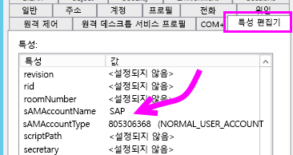
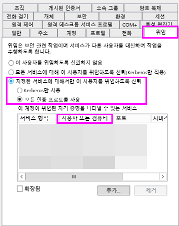

# <a name="troubleshoot-gateways---power-bi"></a>게이트웨이 문제 해결 - Power BI

[!INCLUDE [gateway-rewrite](includes/gateway-rewrite.md)]

이 문서에서는 Power BI와 함께 온-프레미스 데이터 게이트웨이를 사용할 때 몇 가지 일반적인 문제에 관해 설명합니다. 여기에 나열되지 않은 문제가 발생하면 Power BI [커뮤니티](https://community.powerbi.com) 사이트를 사용할 수 있습니다. 또는 [지원 티켓](https://powerbi.microsoft.com/support)을 만들 수 있습니다.

## <a name="configuration"></a>구성

### <a name="error-power-bi-service-reported-local-gateway-as-unreachable-restart-the-gateway-and-try-again"></a>오류: Power BI 서비스에서 로컬 게이트웨이에 연결할 수 없다고 보고했습니다. 게이트웨이를 다시 시작한 다음, 다시 시도하세요.

구성 마지막에 게이트웨이를 검사하기 위해 Power BI 서비스가 다시 호출됩니다. Power BI 서비스에서 게이트웨이를 라이브 상태로 보고하지 않습니다. Windows 서비스를 다시 시작하면 통신이 성공할 수 있습니다. [온-프레미스 데이터 게이트웨이 앱에서 로그 수집](/data-integration/gateway/service-gateway-tshoot#collect-logs-from-the-on-premises-data-gateway-app)에 설명된 대로 로그를 수집 및 검토하여 자세한 정보를 확인할 수 있습니다.

## <a name="data-sources"></a>데이터 원본

### <a name="error-unable-to-connect-details-invalid-connection-credentials"></a>오류: 연결할 수 없습니다. 세부 정보: “잘못된 연결 자격 증명입니다.”

**세부 정보 표시**에 데이터 원본에서 받은 오류 메시지가 표시됩니다. SQL Server의 경우 다음과 유사한 출력이 표시됩니다.

    Login failed for user 'username'.

사용자 이름과 암호가 올바른지 확인합니다. 또한 해당 자격 증명을 데이터 원본에 연결할 수 있는지 확인합니다. 사용 중인 계정이 인증 방법과 일치하는지 확인합니다.

### <a name="error-unable-to-connect-details-cannot-connect-to-the-database"></a>오류: 연결할 수 없습니다. 세부 정보: “데이터베이스에 연결할 수 없습니다.”

서버에는 연결할 수 있지만 제공된 데이터베이스에는 연결할 수 없습니다. 데이터베이스의 이름을 확인하고 사용자 자격 증명에 해당 데이터베이스에 액세스할 수 있는 적절한 사용 권한이 있는지 확인합니다.

**세부 정보 표시**에 데이터 원본에서 받은 오류 메시지가 표시됩니다. SQL Server의 경우 다음과 유사한 출력이 표시됩니다.

    Cannot open database "AdventureWorks" requested by the login. The login failed. Login failed for user 'username'.

### <a name="error-unable-to-connect-details-unknown-error-in-data-gateway"></a>오류: 연결할 수 없습니다. 세부 정보: “데이터 게이트웨이에서 알 수 없는 오류 발생”

이 오류는 다양한 이유로 발생할 수 있습니다. 게이트웨이를 호스트하는 컴퓨터에서 데이터 원본에 연결할 수 있는지 확인해야 합니다. 이 상황은 서버에 액세스할 수 없기 때문에 발생할 수 있습니다.

**세부 정보 표시**에 오류 코드 **DM_GWPipeline_UnknownError**가 표시될 수 있습니다.

자세한 정보는 **이벤트 로그** > **애플리케이션 및 서비스 로그** > **온-프레미스 데이터 게이트웨이 서비스**도 확인할 수 있습니다.

### <a name="error-we-encountered-an-error-while-trying-to-connect-to-server-details-we-reached-the-data-gateway-but-the-gateway-cant-access-the-on-premises-data-source"></a>오류: \<server\>에 연결하는 중 오류가 발생했습니다. 세부 정보: “데이터 게이트웨이에 연결했지만 해당 게이트웨이에서 온-프레미스 데이터 원본에 액세스할 수 없습니다.”

지정된 데이터 원본에 연결할 수 없습니다. 해당 데이터 원본에 제공된 정보의 유효성을 검사해야 합니다.

**세부 정보 표시**에 오류 코드 **DM_GWPipeline_Gateway_DataSourceAccessError**가 표시될 수 있습니다.

기본 오류 메시지가 다음과 유사한 경우 데이터 원본에 사용하는 계정이 해당 Analysis Services 인스턴스에 대한 서버 관리자가 아니라는 뜻입니다. 자세한 내용은 [Analysis Services 인스턴스에 서버 관리 권한 부여](https://docs.microsoft.com/sql/analysis-services/instances/grant-server-admin-rights-to-an-analysis-services-instance)를 참조하세요.

    The 'CONTOSO\account' value of the 'EffectiveUserName' XML for Analysis property is not valid.

기본 오류 메시지가 다음과 유사한 경우 Analysis Services에 대한 서비스 계정에서 TGGAU([token-groups-global-and-universal](https://msdn.microsoft.com/library/windows/desktop/ms680300.aspx)) 디렉터리 특성이 누락되었을 수 있습니다.

    The username or password is incorrect.

Windows 2000 이전 호환성 액세스 권한이 있는 도메인에는 TGGAU 특성이 설정되어 있습니다. 최근 새로 만든 도메인에는 기본적으로 이 특성이 설정되어 있지 않습니다. 자세한 내용은 [일부 애플리케이션 및 API에서 계정 개체에 대한 인증 정보에 액세스권한이 필요함](https://support.microsoft.com/kb/331951)을 참조하세요.

특성을 사용할 수 있는지 확인하려면 다음 단계를 수행합니다.

1. SQL Server Management Studio 내에서 Analysis Services 컴퓨터에 연결합니다. 고급 연결 속성 내에서 문제의 사용자에 대한 EffectiveUserName을 포함하고 이와 같이 추가한 결과 오류가 생성되는지 확인합니다.
2. dsacls Active Directory 도구를 사용하여 특성이 나열되는지 여부를 확인할 수 있습니다. 이 도구는 도메인 컨트롤러에 있습니다. 계정에 해당하는 고유 도메인 이름을 알아야 하며 이 이름을 도구에 전달해야 합니다.

        dsacls "CN=John Doe,CN=UserAccounts,DC=contoso,DC=com"

    다음과 유사한 결과를 얻으려 합니다.

            Allow BUILTIN\Windows Authorization Access Group
                                          SPECIAL ACCESS for tokenGroupsGlobalAndUniversal
                                          READ PROPERTY

이 문제를 해결하려면 Analysis Services Windows 서비스에 사용되는 계정에서 TGGAU를 사용하도록 설정해야 합니다.

#### <a name="another-possibility-for-the-username-or-password-is-incorrect"></a>“사용자 이름 또는 암호가 잘못됨”이 될 다른 가능성

이 오류는 Analysis Services 서버가 사용자와 다른 도메인에 있고 양방향 트러스트가 설정되지 않았기 때문에 발생할 수도 있습니다.

도메인 관리자와 협력하여 도메인 간에 트러스트 관계를 확인하세요.

#### <a name="unable-to-see-the-data-gateway-data-sources-in-the-get-data-experience-for-analysis-services-from-the-power-bi-service"></a>Power BI 서비스의 Analysis Services에 대한 데이터 가져오기 환경에서 데이터 게이트웨이 데이터 원본을 볼 수 없음

계정이 게이트웨이 구성 내에서 데이터 원본의 **사용자** 탭에 나열되는지 확인합니다. 게이트웨이에 대한 액세스가 없는 경우 게이트웨이의 관리자에게 문의하고 확인하도록 요청합니다. **사용자** 목록의 계정에만 Analysis Services 목록에 나열된 데이터 원본이 표시될 수 있습니다.

### <a name="error-you-dont-have-any-gateway-installed-or-configured-for-the-data-sources-in-this-dataset"></a>오류: 이 데이터 세트의 데이터 원본에 대해 설치되거나 구성된 게이트웨이가 없습니다.

[데이터 원본 추가](service-gateway-data-sources.md#add-a-data-source)에 설명된 대로 하나 이상의 데이터 원본을 게이트웨이에 추가했는지 확인합니다. 게이트웨이가 **게이트웨이 관리** 아래의 관리 포털에 표시되지 않는 경우 브라우저 캐시를 지우거나 서비스에서 로그아웃한 다음, 다시 로그인하세요.

## <a name="datasets"></a>데이터 세트

### <a name="error-there-is-not-enough-space-for-this-row"></a>오류: 이 행에 필요한 공간이 부족합니다.

단일 행의 크기가 4MB를 초과할 경우 이 오류가 발생합니다. 데이터 원본에서 해당 행이 무엇인지 확인하고 해당 행을 필터링하거나 해당 행의 크기를 줄여야 합니다.

### <a name="error-the-server-name-provided-doesnt-match-the-server-name-on-the-sql-server-ssl-certificate"></a>오류: 제공된 서버 이름이 SQL Server SSL 인증서의 서버 이름과 일치하지 않습니다.

인증서 일반 이름이 서버에 대한 FQDN(정규화된 도메인 이름)이지만 서버에 대해 NetBIOS 이름만 입력한 경우에 이 오류가 발생할 수 있습니다. 이 경우 인증서가 일치하지 않습니다. 이 문제를 해결하려면 게이트웨이 데이터 원본 내에 서버 이름을 만들고 PBIX 파일을 만들어 서버의 FQDN을 사용해야 합니다.

### <a name="error-you-dont-see-the-on-premises-data-gateway-present-when-you-configure-scheduled-refresh"></a>오류: 예약된 새로 고침을 구성하는 경우 온-프레미스 데이터 게이트웨이가 표시되지않습니다.

이 오류를 발생시킬 수 있는 몇 가지 다른 시나리오는 다음과 같습니다.

- 서버 및 데이터베이스 이름은 Power BI Desktop에 입력한 이름과 게이트웨이에 대해 구성된 데이터 원본 간에 일치하지 않습니다. 해당 이름은 같아야 합니다. 대/소문자를 구분하지 않습니다.
- 계정이 게이트웨이 구성 내 데이터 원본의 **사용자** 탭에 나와 있지 않습니다. 게이트웨이 관리자가 해당 목록에 사용자를 추가해야 합니다.
- Power BI Desktop 파일에 여러 데이터 원본이 있고 모든 데이터 원본이 게이트웨이로 구성되어 있지 않습니다. 각 데이터 원본을 예약된 새로 고침 내에 표시하려면 게이트웨이에 대한 게이트웨이를 사용하여 정의해야 합니다.

### <a name="error-the-received-uncompressed-data-on-the-gateway-client-has-exceeded-the-limit"></a>오류: 게이트웨이 클라이언트에 대해 수신한 압축을 푼 데이터가 제한을 초과했습니다.

정확한 제한량은 각 테이블당 10GB의 비압축 데이터입니다. 이 문제가 발생하는 경우 몇 가지 좋은 옵션으로 최적화하여 문제를 방지할 수 있습니다. 특히, 긴 상수, 긴 문자열 값의 사용을 줄이고 대신 정규화된 키를 사용합니다. 또는 열을 사용하지 않는 경우 해당 열을 제거하는 것이 좋습니다.

## <a name="reports"></a>보고서

### <a name="error-report-could-not-access-the-data-source-because-you-do-not-have-access-to-our-data-source-via-an-on-premises-data-gateway"></a>오류: 온-프레미스 데이터 게이트웨이를 통해 데이터 원본에 액세스할 수 없기 때문에 보고서가 데이터 원본에 액세스하지 못했습니다.

이 오류의 원인은 일반적으로 다음 중 하나입니다.

- 데이터 원본 정보가 기본 데이터 세트에 포함된 내용과 일치하지 않습니다. 서버 및 데이터베이스 이름이 온-프레미스 데이터 게이트웨이에 대해 정의된 데이터 원본과 Power BI Desktop 내에서 제공하는 내용 간에 일치해야 합니다. Power BI Desktop에서 IP 주소를 사용하는 경우 온-프레미스 데이터 게이트웨이에 대해서도 데이터 원본이 IP 주소를 사용해야 합니다.
- 조직 내에 게이트웨이에서 사용할 수 있는 데이터 원본이 없습니다. 새 온-프레미스 데이터 게이트웨이나 기존 온-프레미스 데이터 게이트웨이에서 데이터 원본을 구성할 수 있습니다.

### <a name="error-data-source-access-error-please-contact-the-gateway-administrator"></a>오류: 데이터 원본 액세스 오류가 발생했습니다. 게이트웨이 관리자에게 문의하세요.

이 보고서가 라이브 Analysis Services 연결을 활용하는 경우 유효하지 않거나 Analysis Services 머신에 대한 사용 권한이 없는 EffectiveUserName에 전달되는 값에서 문제가 발생했을 수 있습니다. 일반적으로 인증 문제는 EffectiveUserName에 대해 전달되는 값이 로컬 UPN(사용자 계정 이름)과 일치하지 않는다는 사실 때문입니다.

유효한 사용자 이름을 확인하려면 다음 단계를 수행합니다.

1. [게이트웨이 로그](/data-integration/gateway/service-gateway-tshoot#collect-logs-from-the-on-premises-data-gateway-app) 내에서 유효한 사용자 이름을 찾습니다.
2. 값이 전달된 후에는 값이 정확한지 확인합니다. 자신의 사용자인 경우 명령 프롬프트에서 다음 명령을 사용하여 UPN을 확인할 수 있습니다. UPN은 이메일 주소와 유사합니다.

        whoami /upn

필요에 따라 Power BI가 Azure Active Directory에서 가져오는 것을 확인할 수 있습니다.

1. [https://developer.microsoft.com/graph/graph-explorer](https://developer.microsoft.com/graph/graph-explorer)으로 이동합니다.
2. 오른쪽 위 모퉁이에서 **로그인**을 선택합니다.
3. 다음 쿼리를 실행합니다. 큰 JSON 응답이 표시됩니다.

        https://graph.windows.net/me?api-version=1.5
4. **userPrincipalName**을 찾습니다.

Azure Active Directory UPN이 로컬 Active Directory UPN과 일치하지 않는 경우 [사용자 이름 매핑](service-gateway-enterprise-manage-ssas.md#map-user-names-for-analysis-services-data-sources) 기능을 사용하여 올바른 값으로 바꿀 수 있습니다. 또는 테넌트 관리자, 로컬 Active Directory 관리자와 작업하여 UPN을 변경할 수 있습니다.

## <a name="kerberos"></a>Kerberos

[Kerberos 제한 위임](service-gateway-sso-kerberos.md)의 기본 데이터베이스 서버 및 온-프레미스 데이터 게이트웨이가 제대로 구성되지 않은 경우 게이트웨이에서 [자세한 로깅](/data-integration/gateway/service-gateway-performance#slow-performing-queries)을 사용으로 설정하세요. 그런 다음 문제 해결을 위한 시작점으로 게이트웨이의 로그 파일에 있는 오류 또는 추적을 기준으로 조사합니다. 확인할 게이트웨이 로그를 수집하려면 [온-프레미스 데이터 게이트웨이 앱에서 로그 수집](/data-integration/gateway/service-gateway-tshoot#collect-logs-from-the-on-premises-data-gateway-app)을 참조하세요.

### <a name="impersonationlevel"></a>ImpersonationLevel

ImpersonationLevel은 SPN 설정 또는 로컬 정책 설정과 관련되어 있습니다.

```
[DataMovement.PipeLine.GatewayDataAccess] About to impersonate user DOMAIN\User (IsAuthenticated: True, ImpersonationLevel: Identification)
```

**솔루션**

문제를 해결하려면 다음 단계를 따르세요.

1. 온-프레미스 게이트웨이에 대한 SPN을 설정합니다.
2. AD(Active Directory)에서 제한된 위임을 설정합니다.

### <a name="failedtoimpersonateuserexception-failed-to-create-windows-identity-for-user-userid"></a>FailedToImpersonateUserException: 사용자의 사용자 ID에 대한 Windows ID를 만들지 못함

FailedToImpersonateUserException은 다른 사용자를 대신해서 가장할 수 없는 경우에 발생합니다. 이 오류는 가장하려는 계정이 게이트웨이 서비스 도메인이 있는 도메인이 아닌 다른 도메인에 속할 경우에도 발생할 수 있습니다. 이는 제한 사항입니다.

**솔루션**

* 이전 “ImpersonationLevel” 섹션에 있는 단계에 따라 구성이 올바른지 확인합니다.
* 가장하려는 사용자 ID가 유효한 AD(Active Directory) 계정인지 확인합니다.

### <a name="general-error-1033-error-while-you-parse-the-protocol"></a>일반 오류: 프로토콜을 구문 분석하는 동안 1033 오류 발생

사용자가 UPN(alias@domain.com)을 사용하여 가장된 경우 SAP HANA에서 구성된 외부 ID가 로그인과 일치하지 않으면 1033 오류가 발생합니다. 로그에는 “원래 UPN ‘alias@domain.com’이 아래 표시된 대로 오류 로그 맨 위에 새 UPN 'alias@domain.com'으로 바뀌었습니다”가 표시됩니다.

```
[DM.GatewayCore] SingleSignOn Required. Original UPN 'alias@domain.com' replaced with new UPN 'alias@domain.com.'
```

**솔루션**

* SAP HANA를 사용하려면 가장된 사용자가 Active Directory(사용자 별칭)에 sAMAccountName 특성을 사용해야 합니다. 이 특성이 올바르지 않으면 1033 오류가 표시됩니다.

    

* 로그에는 UPN이 아닌 sAMAccountName(별칭)이 표시됩니다. 이 별칭 뒤에는 도메인(alias@doimain.com)이 표시됩니다.

    

```xml
      <setting name="ADUserNameReplacementProperty" serializeAs="String">
        <value>sAMAccount</value>
      </setting>
      <setting name="ADServerPath" serializeAs="String">
        <value />
      </setting>
      <setting name="CustomASDataSource" serializeAs="String">
        <value />
      </setting>
      <setting name="ADUserNameLookupProperty" serializeAs="String">
        <value>AADEmail</value>
```

### <a name="sap-aglibodbchdb-dllhdbodbc-communication-link-failure-10709-connection-failed-rte-1-kerberos-error-major-miscellaneous-failure-851968-minor-no-credentials-are-available-in-the-security-package"></a>[SAP AG][LIBODBCHDB DLL][HDBODBC] 통신 연결 오류,-10709 연결 실패(RTE:[-1] Kerberos 오류. 주: “기타 실패[851968].” 부: “보안 패키지에서 사용할 수 있는 자격 증명 없음.”

위임이 Active Directory에서 올바르게 구성되지 않은 경우 “-10709 연결 실패” 오류 메시지가 표시됩니다.

**솔루션**

* 게이트웨이 서비스 계정에 대한 Active Directory의 [위임] 탭에 SAP Hana 서버가 있는지 확인합니다.

   

## <a name="refresh-history"></a>새로 고침 기록

예약된 새로 고침에 게이트웨이를 사용하는 경우 **새로 고침 기록**에서 발생한 오류를 확인할 수 있습니다. 지원 요청을 만들어야 하는 경우 유용한 데이터도 제공할 수 있습니다. 예약된 새로 고침 및 요청 시 새로 고침을 볼 수 있습니다. 다음 단계는 새로 고침 기록에 액세스할 수 있는 방법을 보여 줍니다.

1. Power BI 탐색 창의 **데이터 세트**에서 데이터 세트를 선택합니다. 메뉴를 열고 **새로 고침 예약**을 선택합니다.

    

2. **설정...** &gt; **새로 고침 예약**에서 **새로 고침 기록**을 선택합니다.

    

    

새로 고침 문제 해결 시나리오에 관한 자세한 내용은 [새로 고침 문제 해결 시나리오](refresh-troubleshooting-refresh-scenarios.md)를 참조하세요.

## <a name="fiddler-trace"></a>Fiddler 추적

[Fiddler](https://www.telerik.com/fiddler)는 HTTP 트래픽을 모니터링하는 Telerik의 무료 도구입니다. 클라이언트 컴퓨터에서 Power BI 서비스를 사용하여 앞뒤로 볼 수 있습니다. 이 트래픽 목록에는 오류 및 기타 관련 정보가 표시될 수 있습니다.


## <a name="next-steps"></a>다음 단계

* [온-프레미스 데이터 게이트웨이 문제 해결](/data-integration/gateway/service-gateway-tshoot)
* [온-프레미스 데이터 게이트웨이에 대한 프록시 설정 구성](/data-integration/gateway/service-gateway-proxy)  
* [데이터 원본 관리 - Analysis Services](service-gateway-enterprise-manage-ssas.md)  
* [데이터 원본 관리 - SAP HANA](service-gateway-enterprise-manage-sap.md)  
* [데이터 원본 관리 - SQL Server](service-gateway-enterprise-manage-sql.md)  
* [데이터 원본 관리 - 가져오기/예약된 새로 고침](service-gateway-enterprise-manage-scheduled-refresh.md)  

궁금한 점이 더 있나요? [Power BI 커뮤니티](https://community.powerbi.com/)를 사용해 보세요.
