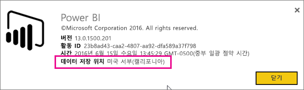
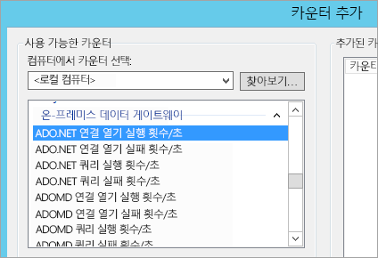
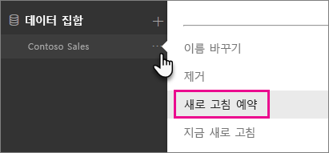
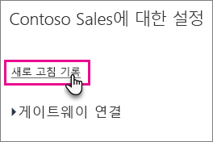

# <a name="troubleshooting-the-on-premises-data-gateway"></a>온-프레미스 데이터 게이트웨이 문제 해결
이 문서에서는 **온-프레미스 데이터 게이트웨이**를 사용할 때 발생할 수 있는 몇 가지 일반적인 문제에 대해 설명합니다.

<!-- Shared Community & support links Include -->
[!INCLUDE [gateway-onprem-tshoot-support-links-include](./includes/gateway-onprem-tshoot-support-links-include.md)]

<!-- Shared Troubleshooting Install Include -->
[!INCLUDE [gateway-onprem-tshoot-install-include](./includes/gateway-onprem-tshoot-install-include.md)]

## <a name="configuration"></a>구성
### <a name="how-to-restart-the-gateway"></a>게이트웨이를 다시 시작하는 방법
게이트웨이는 Windows 서비스로 실행되어 사용자가 여러 가지 방법으로 시작하고 중지할 수 있습니다. 예를 들어, 게이트웨이가 실행되고 있는 컴퓨터에서 높은 권한으로 명령을 연 다음, 다음 명령 중 하나를 실행할 수 있습니다.

* 서비스를 중지하려면 이 명령을 실행합니다.
  
    '''   net stop PBIEgwService   '''
* 서비스를 시작하려면 이 명령을 실행합니다.
  
    '''   net start PBIEgwService   '''

### <a name="error-failed-to-create-gateway-please-try-again"></a>오류: 게이트웨이를 만들지 못했습니다. 다시 시도하세요.
모든 세부 정보를 사용할 수 있지만 Power BI 서비스를 호출하면 오류가 반환됩니다. 오류 및 활동 ID가 표시됩니다. 이런 상황은 여러 가지 이유로 발생할 수 있습니다. 아래에 언급된 대로 로그를 수집 및 검토하여 자세한 정보를 얻을 수 있습니다.

또한 프록시 구성 문제 때문일 수 있습니다. 이제 사용자 인터페이스를 통해 프록시를 구성할 수 있습니다. [프록시 구성 변경](service-gateway-proxy.md)에 대해 자세히 알아볼 수 있습니다.

### <a name="error-failed-to-update-gateway-details--please-try-again"></a>오류: 게이트웨이 세부 정보를 업데이트하지 못했습니다.  다시 시도하세요.
정보가 Power BI 서비스에서 게이트웨이로 전달되었습니다. 정보가 로컬 Windows 서비스에 전달되었지만 반환하지 못했습니다. 또는 대칭 키를 생성하지 못했습니다. **세부 정보 표시**아래 내부 예외가 표시됩니다. 아래에 언급된 대로 로그를 수집 및 검토하여 자세한 정보를 얻을 수 있습니다.

### <a name="error-power-bi-service-reported-local-gateway-as-unreachable-please-restart-the-gateway-and-try-again"></a>오류: Power BI 서비스에서 로컬 게이트웨이에 연결할 수 없다고 보고했습니다. 게이트웨이를 다시 시작한 다음 다시 시도하세요.
구성 마지막에 게이트웨이를 검사하기 위해 Power BI 서비스가 다시 호출됩니다. Power BI 서비스에서 게이트웨이를 라이브상태로 보고하지 않습니다. Windows 서비스를 다시 시작하면 통신이 성공할 수 있습니다. 아래에 언급된 대로 로그를 수집 및 검토하여 자세한 정보를 얻을 수 있습니다.

### <a name="script-error-during-sign-into-power-bi"></a>Power BI에 로그인하는 동안 스크립트 오류
온-프레미스 데이터 게이트웨이 구성의 일부분으로 Power BI에 로그인할 경우 스크립트 오류가 나타날 수 있습니다. 다음 보안 업데이트를 설치하여 문제를 해결해야 합니다. 이는 Windows Update를 통해 설치할 수 있습니다.

[MS16-051: Internet Explorer용 보안 업데이트: 2016년 5월 10일(KB 3154070)](https://support.microsoft.com/kb/3154070)

### <a name="gateway-configuration-failed-with-a-null-reference-exception"></a>Null 참조 예외로 게이트웨이 구성 실패
다음과 유사한 오류가 발생할 수 있습니다.

        Failed to update gateway details.  Please try again.
        Error updating gateway configuration.

여기에는 스택 추적이 포함되며 스택 추적에는 다음이 포함될 수 있습니다.

        Microsoft.PowerBI.DataMovement.Pipeline.Diagnostics.CouldNotUpdateGatewayConfigurationException: Error updating gateway configuration. ----> System.ArgumentNullException: Value cannot be null.
        Parameter name: serviceSection

이전 게이트웨이에서 업그레이드하는 경우 구성 파일을 유지합니다. 누락된 섹션이 있을 수 있습니다. 게이트웨이에서 읽기를 시도하면 위의 Null 참조 예외가 발생합니다.

이를 수정하려면 다음을 수행합니다.

1. 게이트웨이를 제거합니다.
2. 다음 폴더를 삭제합니다.
   
        c:\Program Files\on-premises data gateway
3. 게이트웨이를 다시 설치합니다.
4. 필요에 따라 복구 키를 적용하여 기존 게이트웨이를 복원합니다.

### <a name="support-for-tls-1112"></a>TLS 1.1/1.2에 대한 지원
2017년 8월 업데이트 및 그 이후에 온-프레미스 데이터 게이트웨이는 기본적으로 TLS(전송 계층 보안) 1.1 또는 1.2를 사용하여 **Power BI 서비스**와 통신합니다. 온-프레미스 데이터 게이트웨이의 이전 버전은 기본적으로 TLS 1.0을 사용합니다. 2017년 11월 1일에 TLS 1.0에 대한 지원이 종료되므로, 게이트웨이가 계속 작동하도록 하려면 그때까지 온-프레미스 데이터 게이트웨이 설치를 2017년 8월 릴리스 이상으로 업그레이드해야 합니다.

11월 1일 이전까지 TLS 1.0은 온-프레미스 데이터 게이트웨이로 계속 지원되며, 대체 메커니즘으로 게이트웨이에서 사용됩니다. 모든 게이트웨이 트래픽에서 TLS 1.1 또는 1.2를 사용하도록 하려면(및 게이트웨이에서 TLS 1.0을 사용하지 않도록 하려면) 게이트웨이 서비스를 실행하는 컴퓨터에서 다음 레지스트리 키를 추가하거나 수정해야 합니다.

        [HKEY_LOCAL_MACHINE\SOFTWARE\Microsoft\.NETFramework\v4.0.30319]"SchUseStrongCrypto"=dword:00000001
        [HKEY_LOCAL_MACHINE\SOFTWARE\Wow6432Node\Microsoft\.NETFramework\v4.0.30319]"SchUseStrongCrypto"=dword:00000001

> [!NOTE]
> 이러한 레지스트리 키를 추가하거나 수정하면 변경 내용이 모든 .NET 응용 프로그램에 적용됩니다. 다른 응용 프로그램에 대한 TLS에 영향을 주는 레지스트리 변경에 대한 정보는 [TLS(전송 계층 보안) 레지스트리 설정](https://docs.microsoft.com/windows-server/security/tls/tls-registry-settings)을 참조하세요.
> 
> 

## <a name="data-sources"></a>데이터 소스
### <a name="error-unable-to-connect-details-invalid-connection-credentials"></a>오류: 연결할 수 없습니다. 세부 정보: "연결 자격 증명이 잘못되었습니다."
**세부 정보 표시**에 데이터 소스에서 받은 오류 메시지가 표시됩니다. SQL Server의 경우 다음과 유사한 출력이 표시됩니다.

    Login failed for user 'username'.

사용자 이름과 암호가 올바른지 확인합니다. 또한 해당 자격 증명을 데이터 소스에 연결할 수 있는지 확인합니다. 사용 중인 계정이 **인증 방법**과 일치하는지 확인합니다.

### <a name="error-unable-to-connect-details-cannot-connect-to-the-database"></a>오류: 연결할 수 없습니다. 세부 정보: "데이터베이스에 연결할 수 없습니다."
서버에는 연결할 수 있지만 제공된 데이터베이스에는 연결할 수 없습니다. 데이터베이스의 이름을 확인하고 사용자 자격 증명에 해당 데이터베이스에 액세스할 수 있는 적절한 사용 권한이 있는지 확인합니다.

**세부 정보 표시**에 데이터 소스에서 받은 오류 메시지가 표시됩니다. SQL Server의 경우 다음과 유사한 출력이 표시됩니다.

    Cannot open database "AdventureWorks" requested by the login. The login failed. Login failed for user 'username'.

### <a name="error-unable-to-connect-details-unknown-error-in-data-gateway"></a>오류: 연결할 수 없습니다. 세부 정보: "데이터 게이트웨이에서 알 수 없는 오류 발생"
이 오류는 다양한 이유로 발생할 수 있습니다. 게이트웨이를 호스트하는 컴퓨터에서 데이터 소스에 연결할 수 있는지 확인해야 합니다. 서버에서 액세스할 수 없기 때문에 발생한 결과일 수 있습니다.

**세부 정보 표시**에 오류 코드 **DM_GWPipeline_UnknownError**가 나타납니다.

또한 이벤트 로그 > **응용 프로그램 및 서비스 로그** > **온-프레미스 데이터 게이트웨이 서비스**에서 자세한 내용을 참조하세요.

### <a name="error-we-encountered-an-error-while-trying-to-connect-to-server-details-we-reached-the-data-gateway-but-the-gateway-cant-access-the-on-premises-data-source"></a>오류: 에 연결하는 중 오류가 발생했습니다<server>. 세부 내역: "데이터 게이트웨이에 연결했지만 해당 게이트웨이가 온-프레미스 데이터 원본에 액세스할 수 없습니다."
지정된 데이터 원본에 연결할 수 없습니다. 해당 데이터 원본에 제공된 정보의 유효성을 검사해야 합니다.

**세부 정보 표시**에 오류 코드 **DM_GWPipeline_Gateway_DataSourceAccessError**가 나타납니다.

기본 오류 메시지가 다음과 유사한 경우 데이터 원본에 사용하는 계정이 해당 Analysis Services 인스턴스에 대한 서버 관리자가 아닌 것입니다. [자세히 알아보기](https://docs.microsoft.com/sql/analysis-services/instances/grant-server-admin-rights-to-an-analysis-services-instance)

    The 'CONTOSO\account' value of the 'EffectiveUserName' XML for Analysis property is not valid.

기본 오류 메시지가 다음과 유사한 경우 Analysis Services에 대한 서비스 계정에서 TGGAU([token-groups-global-and-universal](https://msdn.microsoft.com/library/windows/desktop/ms680300.aspx)) 디렉터리 특성이 누락되었을 수 있습니다.

    The user name or password is incorrect.

Windows 2000 이전 호환성 액세스 권한이 있는 도메인에는 TGGAU 특성이 설정되어 있습니다. 그러나 최근 새로 만든 도메인에는 기본적으로 이 특성이 설정되어 있지 않습니다. [여기](https://support.microsoft.com/kb/331951)에서 이 내용에 대해 자세히 알아볼 수 있습니다.

다음을 수행하여 이를 확인할 수 있습니다.

1. SQL Server Management Studio 내에서 Analysis Services 컴퓨터에 연결합니다. 고급 연결 속성 내에서 문제의 사용자에 대한 EffectiveUserName을 포함하고 여기에서 오류가 생성되는지 확인합니다.
2. dsacls Active Directory 도구를 사용하여 특성이 나열되는지 여부를 확인할 수 있습니다. 일반적으로 도메인 컨트롤러에 있는 도구입니다. 계정에 해당하는 고유 도메인 이름을 알아야 하며 이 이름을 도구에 전달해야 합니다.
   
        dsacls "CN=John Doe,CN=UserAccounts,DC=contoso,DC=com"
   
    다음과 유사한 결과를 얻고 싶어합니다.
   
            Allow BUILTIN\Windows Authorization Access Group
                                          SPECIAL ACCESS for tokenGroupsGlobalAndUniversal
                                          READ PROPERTY

이 문제를 해결하려면 Analysis Services Windows 서비스에 사용되는 계정에서 TGGAU를 사용하도록 설정해야 합니다.

**사용자 이름 또는 암호가 잘못될 다른 가능성**

이 오류는 Analysis Services 서버가 사용자와 다른 도메인에 있고 양방향 트러스트가 설정되지 않았기 때문에 발생할 수도 있습니다.

도메인 관리자와 협력하여 도메인 간에 트러스트 관계를 확인해야 합니다.

**Power BI 서비스의 Analysis Services에 대한 ‘데이터 가져오기’ 환경에서 데이터 게이트웨이 데이터 원본을 볼 수 없음**

계정이 게이트웨이 구성 내에서 데이터 원본의 **사용자** 탭에 나열되는지 확인합니다. 게이트웨이에 대한 액세스가 없는 경우 게이트웨이의 관리자에게 문의하고 확인하도록 요청합니다. **사용자** 목록의 계정에만 Analysis Services 목록에 나열된 데이터 원본이 표시됩니다.

## <a name="datasets"></a>데이터 집합
### <a name="error-there-is-not-enough-space-for-this-row"></a>오류: 이 행에 필요한 공간이 부족합니다.
단일 행의 크기가 4MB를 초과할 경우 이 오류가 발생합니다. 데이터 원본에서 해당 행이 무엇인지 확인하고 해당 행을 필터링하거나 해당 행의 크기를 줄여야 합니다.

### <a name="error-the-server-name-provided-doesnt-match-the-server-name-on-the-sql-server-ssl-certificate"></a>오류: 제공된 서버 이름이 SQL Server SSL 인증서의 서버 이름과 일치하지 않습니다.
인증서 CN이 서버에 대해 전체 주소 도메인 네임(FQDN)을 가진 서버에 대한 이름이지만 서버에 대해 netbios 이름만 입력하는 경우 발생할 수 있습니다. 이렇게 하면 인증서에 대한 불일치를 초래하게 됩니다. 이 문제를 해결하려면 게이트웨이 데이터 원본 내에 서버 이름을 만들고 PBIX 파일을 만들어 서버의 FQDN을 사용해야 합니다.

### <a name="i-dont-see-the-on-premises-data-gateway-persent-when-configuring-scheduled-refresh"></a>예약된 새로 고침을 구성하는 경우 온-프레미스 데이터 게이트웨이 백분율로 표시되지 않습니다.
몇 가지 다른 시나리오 때문일 수 있습니다.

1. 서버 및 데이터베이스 이름은 Power BI Desktop에 입력한 이름과 게이트웨이에 대해 구성된 데이터 원본 간에 일치하지 않습니다. 이러한 이름은 동일한 값이 되어야 합니다. 대소문자를 구분하지 않습니다.
2. 계정이 게이트웨이 구성 내 데이터 원본의 **사용자** 탭에 나와 있지 않습니다. 해당 목록에 추가할 게이트웨이의 관리자에게 가져와야 합니다.
3. Power BI Desktop 파일에 여러 데이터 원본이 있고 모든 데이터 원본이 게이트웨이로 구성되어 있지 않습니다. 각 데이터 원본을 예약된 새로 고침 내에 표시하려면 게이트웨이에 대한 게이트웨이를 사용하여 정의해야 합니다.

### <a name="error-the-received-uncompressed-data-on-the-gateway-client-has-exceeded-limit"></a>오류: 게이트웨이 클라이언트의 받은 비압축 데이터가 한도를 초과했습니다.
정확한 제한량은 각 테이블당 10GB의 비압축 데이터입니다. 이 문제가 발생하는 경우 몇 가지 좋은 옵션으로 최적화하여 문제가 발생하지 않도록 할 수 있습니다. 특히 정규화된 키를 사용하거나 사용하지 않는 열을 제거하는 대신 매우 반복되는 긴 문자열 값의 사용을 줄이는 것이 도움이 됩니다.

## <a name="reports"></a>보고서
### <a name="report-could-not-access-the-data-source-because-you-do-not-have-access-to-our-data-source-via-an-on-premises-data-gateway"></a>온-프레미스 데이터 게이트웨이를 통해 데이터 원본에 액세스할 수 없기 때문에 보고서가 데이터 원본에 액세스하지 못했습니다.
이 문제의 원인은 일반적으로 다음 중 하나입니다.

1. 데이터 원본 정보가 기본 데이터 집합에 포함된 내용과 일치하지 않습니다. 서버 및 데이터베이스 이름이 온-프레미스 데이터 게이트웨이에 대해 정의된 데이터 원본과 Power BI Desktop 내에서 제공하는 내용 간에 일치해야 합니다. Power BI Desktop에서 IP 주소를 사용하는 경우 온-프레미스 데이터 게이트웨이에 대해서도 데이터 원본이 IP 주소를 사용해야 합니다.
2. 조직 내에 게이트웨이에서 사용할 수 있는 데이터 원본이 없습니다. 새 온-프레미스 데이터 게이트웨이나 기존 온-프레미스 데이터 게이트웨이에서 데이터 원본을 구성할 수 있습니다.

### <a name="error-data-source-access-error-please-contact-the-gateway-administrator"></a>오류: 데이터 원본 액세스 오류가 발생했습니다. 게이트웨이 관리자에게 문의하세요.
이 보고서가 라이브 Analysis Services 연결을 활용하는 경우 유효하지 않거나 Analysis Services 컴퓨터에서 권한이 없는EffectiveUserName에 전달되는 값에서 문제가 발생했을 수 있습니다. 일반적으로 인증 문제는 EffectiveUserName에 대해 전달되는 값이 로컬 UPN(사용자 계정 이름)과 일치하지 않는다는 사실 때문입니다.

이를 확인하기 위해 다음을 수행할 수 있습니다.

1. [게이트웨이 로그](#logs) 내에서 유효한 사용자 이름을 찾습니다.
2. 값이 전달된 후에는 값이 정확한지 확인합니다. 자신의 사용자인 경우 명령 프롬프트에서 다음 명령을 사용하여 UPN이 어떤 모양인지 확인할 수 있습니다. UPN은 전자 메일 주소와 같습니다.
   
        whoami /upn

필요에 따라 Power BI가 Azure Active Directory에서 가져오는 것을 확인할 수 있습니다.

1. [https://graphexplorer.cloudapp.net](https://graphexplorer.cloudapp.net)으로 이동합니다.
2. 오른쪽 위에서 **로그인**을 선택합니다.
3. 다음 쿼리를 실행합니다. 큰 JSON 응답이 표시됩니다.
   
        https://graph.windows.net/me?api-version=1.5
4. **userPrincipalName**을 찾습니다.

Azure Active Directory UPN이 로컬 Active Directory UPN과 일치하지 않는 경우 [사용자 이름 매핑](service-gateway-enterprise-manage-ssas.md#map-user-names) 기능을 사용하여 올바른 값으로 바꿀 수 있습니다. 또는 테넌트 관리자, 로컬 Active Directory 관리자와 작업하여 변경된 UPN을 가져올 수 있습니다.

<!-- Shared Troubleshooting Firewall/Proxy Include -->
[!INCLUDE [gateway-onprem-tshoot-firewall-include](./includes/gateway-onprem-tshoot-firewall-include.md)]

다음을 수행하여 자신이 속한 데이터 센터 지역을 찾을 수 있습니다.

1. Power BI 서비스의 오른쪽 위에서 **?**를 선택합니다.
2. **Power BI 정보**를 선택합니다.
3. 데이터 영역이 **데이터 저장 위치**에 나열됩니다.
   
    

아무 곳도 표시되지 않는 경우 고급 컬렉션 메서드이고 수집된 데이터를 분석하는 데 도움이 필요할 수 있기는 하지만 [fiddler](#fiddler) 또는 netsh와 같은 도구를 사용하여 네트워크 추적 가져오기를 시도할 수 있습니다. 도움이 필요한 경우 [지원](https://support.microsoft.com)에 문의할 수 있습니다.

## <a name="performance"></a>성능
<iframe width="560" height="315" src="https://www.youtube.com/embed/IJ_DJ30VNk4?showinfo=0" frameborder="0" allowfullscreen></iframe>

### <a name="performance-counters"></a>성능 카운터
게이트웨이 활동을 측정하는 데 사용할 수 있는 성능 카운터가 여러 개 있습니다. 이러한 카운터는 대량의 활동 부하가 있어서 새 게이트웨이를 만들어야 하는지 파악하는 데 유용할 수 있습니다. 작업 시간을 반영하지 않습니다.

Windows 성능 모니터 도구를 통해 이러한 카운터에 액세스할 수 있습니다.



이러한 카운터는 일반적으로 다음과 같이 분류됩니다.

| 카운터 종류 | 설명 |
| --- | --- |
| ADO.NET |DirectQuery 연결에 사용됩니다. |
| ADOMD |Analysis Services 2014 이하 버전에 사용됩니다. |
| OLEDB |특정 데이터 원본에서 사용합니다. 여기에는 SAP HANA 및 Analysis Service 2016 이상 버전이 포함됩니다. |
| Mashup |가져온 데이터 원본이 포함됩니다. 새로 고침을 예약하거나 요청 시 새로 고침을 수행하는 경우 매시업 엔진에 연결됩니다. |

사용 가능한 성능 카운터는 다음과 같이 나열됩니다.

| 카운터 | 설명 |
| --- | --- |
| ADO.NET 연결 열기 실행 횟수/초 |초당 ADO.NET 연결 열기 작업을 실행한 횟수(성공 또는 실패)입니다. |
| ADO.NET 연결 열기 실패 횟수/초 |초당 ADO.NET 연결 열기 작업을 실패한 횟수입니다. |
| ADO.NET 쿼리 실행 횟수/초 |초당 ADO.NET 쿼리를 실행한 횟수(성공 또는 실패)입니다. |
| ADO.NET 쿼리 실패 횟수/초 |초당 ADO.NET 쿼리 실행을 실패한 횟수입니다. |
| ADOMD 연결 열기 실행 횟수/초 |초당 ADOMD 연결 열기 작업을 실행한 횟수(성공 또는 실패)입니다. |
| ADOMD 연결 열기 실패 횟수/초 |초당 ADOMD 연결 열기 작업을 실패한 횟수입니다. |
| ADOMD 쿼리 실행 횟수/초 |초당 ADOMD 쿼리를 실행한 횟수(성공 또는 실패)입니다. |
| ADOMD 쿼리 실패 횟수/초 |초당 ADOMD 쿼리 실행을 실패한 횟수입니다. |
| 모든 연결 열기 실행 횟수/초 |초당 연결 열기 작업을 실행한 횟수(성공 또는 실패)입니다. |
| 모든 연결 열기 실패 횟수/초 |초당 연결 열기 작업 실행을 실패한 횟수입니다. |
| 모든 쿼리 실행 횟수/초 |초당 쿼리를 실행한 횟수(성공 또는 실패)입니다. |
| ADO.NET 연결 풀의 항목 수 |ADO.NET 연결 풀의 항목 수입니다. |
| OLEDB 연결 풀의 항목 수 |OLEDB 연결 풀의 항목 수입니다. |
| Service Bus 풀의 항목 수 |서비스 버스 풀의 항목 수입니다. |
| Mashup 연결 열기 실행 횟수/초 |초당 Mashup 연결 열기 작업을 실행한 횟수(성공 또는 실패)입니다. |
| Mashup 연결 열기 실패 횟수/초 |초당 Mashup 연결 열기 작업을 실패한 횟수입니다. |
| Mashup 쿼리 실행 횟수/초 |초당 Mashup 쿼리를 실행한 횟수(성공 또는 실패)입니다. |
| Mashup 쿼리 실패 횟수/초 |초당 Mashup 쿼리 실행을 실패한 횟수입니다. |
| 다중 결과 집합 OLEDB 쿼리 실패 횟수/초 |초당 다중 결과 집합 OLEDB 쿼리 실행을 실패한 횟수입니다. |
| OLEDB 다중 결과 집합 쿼리 실행 횟수/초 |초당 OLEDB 다중 결과 집합 쿼리를 실행한 횟수(성공 또는 실패)입니다. |
| OLEDB 연결 열기 실행 횟수/초 |초당 OLEDB 연결 열기 작업을 실행한 횟수(성공 또는 실패)입니다. |
| OLEDB 연결 열기 실패 횟수/초 |초당 OLEDB 연결 열기 작업을 실패한 횟수입니다. |
| OLEDB 쿼리 실행 횟수/초 |초당 OLEDB 다중 결과 집합 쿼리를 실행한 횟수(성공 또는 실패)입니다. |
| OLEDB 쿼리 실패 횟수/초 |초당 OLEDB 다중 결과 집합 쿼리 실행을 실패한 횟수입니다. |
| OLEDB 단일 결과 집합 쿼리 실행 횟수/초 |초당 OLEDB 단일 결과 집합 쿼리를 실행한 횟수(성공 또는 실패)입니다. |
| 쿼리 실패 횟수/초 |초당 쿼리 실행을 실패한 횟수입니다. |
| 단일 결과 집합 OLEDB 쿼리 실패 횟수/초 |초당 단일 결과 집합 OLEDB 쿼리 실행을 실패한 횟수입니다. |

## <a name="reviewing-slow-performing-queries"></a>느린 성능 쿼리 검토
게이트웨이를 통한 응답이 느리다는 것을 알 수 있습니다. 이는 DirectQuery 쿼리 또는 가져온 데이터 집합을 새로 고칠 때 필요할 수 있습니다. 출력 쿼리 및 타이밍에 대한 추가 로깅을 사용하여 무엇이 느리게 수행되는지 알 수 있습니다. 길게 실행되는 쿼리를 알고 있으면 쿼리 성능을 튜닝하기 위해 데이터 원본에서 추가 수정이 필요할 수 있습니다. 예를 들어, SQL Server 쿼리를 위해 인덱스를 조정합니다.

쿼리 지속 시간을 확인하려면 두 개의 구성 파일을 수정해야 합니다.

### <a name="microsoftpowerbidatamovementpipelinegatewaycoredllconfig"></a>Microsoft.PowerBI.DataMovement.Pipeline.GatewayCore.dll.config
*Microsoft.PowerBI.DataMovement.Pipeline.GatewayCore.dll.config* 파일에 있는 `EmitQueryTraces` 값을 `False`에서 `True`로 수정해야 합니다. 이 파일은 기본적으로 C:\Program Files\On-premises data gateway에 있습니다. `EmitQueryTraces`를 사용하면 게이트웨이에서 데이터 원본으로 전송된 쿼리를 기록하기 시작합니다.

> [!IMPORTANT]
> EmitQueryTraces를 사용하면 게이트웨이 사용량에 따라 로그 크기가 대폭 증가할 수 있습니다. 로그 검토 작업이 완료되면 EmitQueryTraces를 False로 설정합니다. 이 설정을 장기간 사용하는 것은 좋지 않습니다.
> 
> 

```
<setting name="EmitQueryTraces" serializeAs="String">
    <value>True</value>
</setting>
```

**쿼리 항목의 예**

```
DM.EnterpriseGateway Information: 0 : 2016-09-15T16:09:27.2664967Z DM.EnterpriseGateway    4af2c279-1f91-4c33-ae5e-b3c863946c41    d1c77e9e-3858-4b21-3e62-1b6eaf28b176    MGEQ    c32f15e3-699c-4360-9e61-2cc03e8c8f4c    FF59BC20 [DM.GatewayCore] Executing query (timeout=224) "<pi>
SELECT
TOP (1000001) [t0].[ProductCategoryName],[t0].[FiscalYear],SUM([t0].[Amount])
 AS [a0]
FROM
(
(select [$Table].[ProductCategoryName] as [ProductCategoryName],
    [$Table].[ProductSubcategory] as [ProductSubcategory],
    [$Table].[Product] as [Product],
    [$Table].[CustomerKey] as [CustomerKey],
    [$Table].[Region] as [Region],
    [$Table].[Age] as [Age],
    [$Table].[IncomeGroup] as [IncomeGroup],
    [$Table].[CalendarYear] as [CalendarYear],
    [$Table].[FiscalYear] as [FiscalYear],
    [$Table].[Month] as [Month],
    [$Table].[OrderNumber] as [OrderNumber],
    [$Table].[LineNumber] as [LineNumber],
    [$Table].[Quantity] as [Quantity],
    [$Table].[Amount] as [Amount]
from [dbo].[V_CustomerOrders] as [$Table])
)
 AS [t0]
GROUP BY [t0].[ProductCategoryName],[t0].[FiscalYear] </pi>"
```

### <a name="microsoftpowerbidatamovementpipelinegatewaycoredllconfig"></a>Microsoft.PowerBI.DataMovement.Pipeline.GatewayCore.dll.config
*Microsoft.PowerBI.DataMovement.Pipeline.Diagnostics.dll.config* 파일에 있는 `TraceVerbosity` 값을 `4`에서 `5`로 수정해야 합니다. 이 파일은 기본적으로 C:\Program Files\On-premises data gateway에 있습니다. 이 설정을 변경하면 세부 정보 표시 항목을 게이트웨이 로그에 기록하기 시작합니다. 여기에는 지속 시간을 표시 하는 항목이 포함 됩니다.

> [!IMPORTANT]
> TraceVerbosity `5`를 사용하면 게이트웨이 사용량에 따라 로그 크기가 대폭 증가될 수 있습니다. 로그 검토 작업이 완료되면 TraceVerbosity를 `4`로 설정합니다. 이 설정을 장기간 사용하는 것은 좋지 않습니다.
> 
> 

```
<setting name="TracingVerbosity" serializeAs="String">
    <value>5</value>
</setting>
```

<a name="activities"></a>

### <a name="activity-types"></a>활동 유형
| 활동 유형 | 설명 |
| --- | --- |
| MGEQ |ADO.NET을 통해 실행되는 쿼리입니다. 여기에는 DirectQuery 데이터 원본이 포함됩니다. |
| MGEO |OLEDB를 통해 실행되는 쿼리입니다. 여기에는 SAP HANA 및 Analysis Services 2016이 포함됩니다. |
| MGEM |매시업 엔진에서 실행되는 쿼리입니다. 가져온 데이터 집합에 사용되어 예약된 새로 고침을 사용하거나 요청 시 새로 고칩니다. |

### <a name="determine-the-duration-of-a-query"></a>쿼리 지속 시간 확인
데이터 원본을 쿼리하는 데 걸린 시간을 확인하려면 다음과 같이 수행할 수 있습니다.

1. 게이트웨이 로그를 엽니다.
2. [활동 유형](#activities)을 검색하여 쿼리를 찾습니다. 이러한 예로 MGEQ가 있습니다.
3. 두 번째 GUID는 요청 ID이기 때문에 기록해 둡니다.
4. 지속 시간이 포함된 FireActivityCompletedSuccessfullyEvent 항목을 찾을 때까지 MGEQ를 계속 검색합니다. 동일한 요청 ID를 가지고 있는 항목을 확인할 수 있습니다. 지속 시간의 단위는 밀리초입니다.
   
        DM.EnterpriseGateway Verbose: 0 : 2016-09-26T23:08:56.7940067Z DM.EnterpriseGateway    baf40f21-2eb4-4af1-9c59-0950ef11ec4a    5f99f566-106d-c8ac-c864-c0808c41a606    MGEQ    21f96cc4-7496-bfdd-748c-b4915cb4b70c    B8DFCF12 [DM.Pipeline.Common.TracingTelemetryService] Event: FireActivityCompletedSuccessfullyEvent (duration=5004)
   
   > [!NOTE]
   > FireActivityCompletedSuccessfullyEvent은 세부 정보 표시 항목입니다. TraceVerbosity 수준 5에 있지 않으면 이 항목을 기록하지 않습니다.
   > 
   > 

<!-- Shared Troubleshooting tools Include -->
[!INCLUDE [gateway-onprem-tshoot-tools-include](./includes/gateway-onprem-tshoot-tools-include.md)]

### <a name="refresh-history"></a>새로 고침 기록
예약된 새로 고침에 게이트웨이를 사용하는 경우 **새로 고침 기록**을 사용하면 지원을 요청해야 할 때 유용한 데이터를 제공할 뿐만 아니라 어떤 오류가 발생했는지 확인할 수 있습니다. 예약된 새로 고침을 비롯하여 요청에 따른 새로 고침도 볼 수 있습니다. **새로 고침 기록**을 가져오는 방법은 다음과 같습니다.

1. Power BI 탐색 창의 **데이터 집합**에서 데이터 집합 &gt; 열기 메뉴 &gt; **새로 고침 예약**을 선택합니다.
   
    
2. **다음 설정...** &gt; **새로 고침 예약**에서 **기록 새로 고침**을 선택합니다.
   
    
   
    

새로 고침 시나리오 문제를 해결하는 방법에 대한 자세한 내용은 [새로 고침 시나리오 문제 해결](refresh-troubleshooting-refresh-scenarios.md) 문서를 참조하세요.

## <a name="next-steps"></a>다음 단계
[Power BI 게이트웨이에 대한 프록시 설정 구성](service-gateway-proxy.md)  
[온-프레미스 데이터 게이트웨이](service-gateway-onprem.md)  
[온-프레미스 데이터 게이트웨이 심층 분석](service-gateway-onprem-indepth.md)  
[데이터 원본 관리 - Analysis Services](service-gateway-enterprise-manage-ssas.md)  
[데이터 원본 관리 - SAP HANA](service-gateway-enterprise-manage-sap.md)  
[데이터 원본 관리 - SQL Server](service-gateway-enterprise-manage-sql.md)  
[데이터 원본 관리 - 가져오기/예약된 새로 고침](service-gateway-enterprise-manage-scheduled-refresh.md)  
궁금한 점이 더 있나요? [Power BI 커뮤니티를 이용하세요.](http://community.powerbi.com/)

