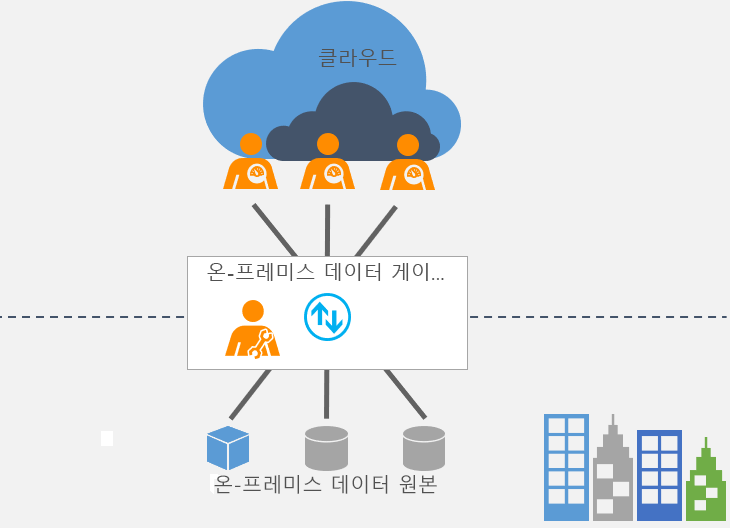

# 온-프레미스 데이터 게이트웨이란?

[!INCLUDE [gateway-rewrite](includes/gateway-rewrite.md)]

온-프레미스 데이터 게이트웨이는 온-프레미스 데이터(클라우드에 없는 데이터)와 여러 Microsoft 클라우드 서비스 간에 빠르고 안전한 데이터 전송을 제공하는 역할을 합니다. 이러한 클라우드 서비스에는 Power BI, PowerApps, Power Automate, Azure Analysis Services 및 Azure Logic Apps가 포함됩니다. 조직은 게이트웨이를 사용하여 데이터베이스 및 기타 데이터 원본을 온-프레미스 네트워크에 유지하면서 클라우드 서비스에서도 해당 온-프레미스 데이터를 안전하게 사용할 수 있습니다.

## 게이트웨이 작동 방식

게이트웨이 작동 원리에 대한 자세한 내용은 [On-premises data gateway architecture](/data-integration/gateway/service-gateway-onprem-indepth)(온-프레미스 데이터 게이트웨이 아키텍처)를 참조하세요.

## 게이트웨이 형식

각각의 시나리오에는 다음 두 가지 형식의 게이트웨이가 있습니다.

* **온-프레미스 데이터 게이트웨이**를 사용하면 여러 사용자가 여러 온-프레미스 데이터 원본에 연결할 수 있습니다. 단일 게이트웨이 설치를 사용하면 모든 지원되는 서비스에서 온-프레미스 데이터 게이트웨이를 사용할 수 있습니다. 이 게이트웨이는 여러 사용자가 여러 데이터 원본에 액세스하는 복잡한 시나리오에 적합합니다.

* **온-프레미스 데이터 게이트웨이(개인 모드)** 를 사용하면 사용자 한 명이 원본에 연결할 수 있으며 다른 사용자와 게이트웨이를 공유할 수 없습니다. 온-프레미스 데이터 게이트웨이(개인 모드)는 Power BI에서만 사용할 수 있습니다. 이 게이트웨이는 보고서를 만드는 사용자가 한 명이며 다른 사용자와 데이터 원본을 공유할 필요가 없는 시나리오에 적합합니다.

## 게이트웨이 사용

게이트웨이를 사용하기 위한 네 가지 기본 단계는 다음과 같습니다.

1. 로컬 컴퓨터에 [게이트웨이를 다운로드하여 설치](/data-integration/gateway/service-gateway-install)합니다.
1. 방화벽 및 기타 네트워크 요구 사항에 따라 게이트웨이를 [구성](/data-integration/gateway/service-gateway-app)합니다.
1. 다른 네트워크 요구 사항도 관리할 수 있는 [게이트웨이 관리자](/data-integration/gateway/service-gateway-manage)를 추가합니다.
1. [게이트웨이를 사용](service-gateway-sql-tutorial.md)하여 온-프레미스 데이터 원본을 새로 고칩니다.
1. 오류가 발생하는 경우 게이트웨이 [문제를 해결](service-gateway-onprem-tshoot.md)합니다.

## 다음 단계

* [온-프레미스 데이터 게이트웨이 설치](/data-integration/gateway/service-gateway-install)

궁금한 점이 더 있나요? [Power BI 커뮤니티를 이용하세요.](https://community.powerbi.com/)
