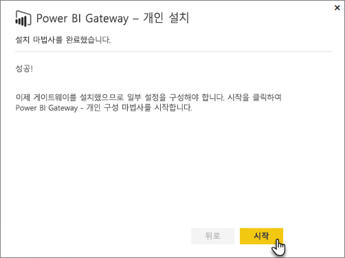
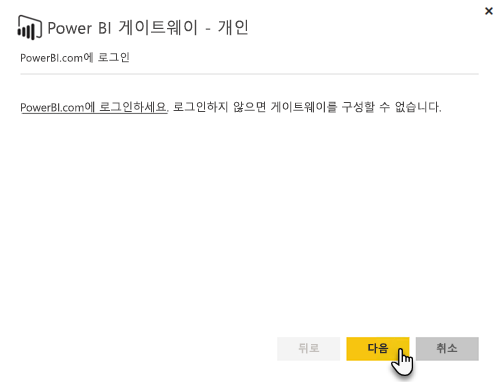
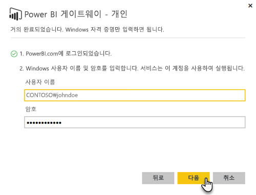

# 온-프레미스 데이터 게이트웨이

온-프레미스 데이터 게이트웨이는 온-프레미스 데이터(클라우드에 없는 데이터)와 Power BI, Microsoft Flow, Logic Apps, PowerApps 서비스 간에 빠르고 안전한 데이터 전송을 제공하는 브리지 역할을 합니다.

다양한 서비스에 단일 게이트웨이를 동시에 사용할 수 있습니다. Power BI와 PowerApps를 사용하는 경우 둘 다에 대해 단일 게이트웨이를 사용할 수 있습니다. 이는 로그인에 사용한 계정에 종속되어 있습니다.

> [!NOTE]
> 온-프레미스 데이터 게이트웨이는 모든 모드에서 데이터 압축 및 전송 암호화를 구현합니다.
> 
> 

<!-- Shared Requirements Include -->
[!INCLUDE [gateway-onprem-requirements-include](./includes/gateway-onprem-requirements-include.md)]

### Analysis Services 라이브 연결의 제한 사항
테이블 형식 또는 다차원 인스턴스에 대해 라이브 연결을 사용할 수 있습니다.

| **서버 버전** | **필수 SKU** |
| --- | --- |
| 2012 SP1 CU4 이상 |비즈니스 인텔리전스 및 Enterprise SKU |
| 2014 |비즈니스 인텔리전스 및 Enterprise SKU |
| 2016 |표준 SKU 이상 |

* 셀 수준 형식 지정 및 변환 기능은 지원되지 않습니다.
* 작업 및 명명된 집합은 Power BI에 노출되지 않지만, 작업 또는 명명된 집합을 포함하고 시각적 개체 및 보고서를 만드는 다차원 큐브에는 계속 연결할 수 있습니다.

<!-- Shared Install steps Include -->
[!INCLUDE [gateway-onprem-datasources-include](./includes/gateway-onprem-datasources-include.md)]

## 온-프레미스 데이터 게이트웨이 다운로드 및 설치
게이트웨이를 다운로드하려면 다운로드 메뉴에서 **데이터 게이트웨이** 를 선택합니다. [온-프레미스 데이터 게이트웨이](http://go.microsoft.com/fwlink/?LinkID=820925)를 다운로드합니다.

<!-- Shared Install steps Include -->
[!INCLUDE [gateway-onprem-install-include](./includes/gateway-onprem-install-include.md)]

## 개인 모드에서 게이트웨이 설치
> [!NOTE]
> 개인은 Power BI로만 작업합니다.
> 
> 

개인 게이트웨이가 설치된 후에는 **Power BI Gateway - Personal 구성 마법사**를 시작해야 합니다.

그런 다음 Power BI에 로그인하여 클라우드 서비스에 게이트웨이를 등록해야 합니다.

또한 windows 서비스가 실행되는 windows 사용자 이름 및 암호도 제공해야 합니다. 사용자 자신의 서로 다른 Windows 계정을 지정할 수 있습니다. 게이트웨이 서비스는 이 계정을 사용하여 실행됩니다.

설치를 완료한 후에는 Power BI 내의 데이터 집합으로 이동하여 온-프레미스 데이터 원본에 대해 자격 증명이 입력되었는지 확인해야 합니다.

## 클라우드에 암호화된 자격 증명 저장
게이트웨이에 데이터 소스를 추가할 때 해당 데이터 소스에 대한 자격 증명을 제공해야 합니다. 데이터 소스에 대한 모든 쿼리는 이러한 자격 증명을 사용하여 실행됩니다. 자격 증명은 클라우드에서 해독할 수 없도록 클라우드에 저장하기 전에 비대칭형 암호화를 사용하여 안전하게 암호화됩니다. 자격 증명은 게이트웨이를 실행 중인 컴퓨터로 전송되어 데이터 소스가 액세스될 때 온-프레미스에서 해독됩니다.

<!-- Account and Port information -->
[!INCLUDE [gateway-onprem-accounts-ports-more](./includes/gateway-onprem-accounts-ports-more.md)]

<!-- How the gateway works -->
[!INCLUDE [gateway-onprem-how-it-works-include](./includes/gateway-onprem-how-it-works-include.md)]

## 제한 사항 및 고려 사항
* [Azure Information Protection](https://docs.microsoft.com/en-us/microsoft-365/enterprise/protect-files-with-aip
)은 현재 지원되지 않음
* [Access 온라인](https://products.office.com/en-us/access)은 현재 지원되지 않음

## 테넌트 수준 관리 

현재 테넌트 관리자가 다른 사용자가 설치 및 구성한 모든 게이트웨이를 관리할 수 있는 단일 장소가 없습니다.  테넌트 관리자인 경우 설치한 모든 게이트웨이에 자신을 관리자로 추가하도록 조직의 사용자에게 요청하는 것이 좋습니다. 이렇게 하면 게이트웨이 설정 페이지 또는 [PowerShell 명령](https://docs.microsoft.com/power-bi/service-gateway-high-availability-clusters#powershell-support-for-gateway-clusters)을 통해 조직의 모든 게이트웨이를 관리할 수 있습니다. 

## 문제 해결
게이트웨이를 설치하고 구성하는 데 문제가 있는 경우 [온-프레미스 데이터 게이트웨이 문제 해결](service-gateway-onprem-tshoot.md)을 참조하세요. 방화벽에 문제가 있다고 생각되는 경우 문제 해결 문서의 [방화벽 또는 프록시](service-gateway-onprem-tshoot.md#firewall-or-proxy) 섹션을 참조하세요.

게이트웨이로 프록시 문제가 발생하는 경우 [Power BI Gateway에 대한 프록시 설정 구성](service-gateway-proxy.md)을 참조하세요.

## 다음 단계
[데이터 원본 관리 - Analysis Services](service-gateway-enterprise-manage-ssas.md)  
[데이터 원본 관리 - SAP HANA](service-gateway-enterprise-manage-sap.md)  
[데이터 원본 관리 - SQL Server](service-gateway-enterprise-manage-sql.md)  
[데이터 원본 관리 - Oracle](service-gateway-onprem-manage-oracle.md)  
[데이터 원본 관리 - 가져오기/예약된 새로 고침](service-gateway-enterprise-manage-scheduled-refresh.md)  
[온-프레미스 데이터 게이트웨이 심층 분석](service-gateway-onprem-indepth.md)  
[온-프레미스 데이터 게이트웨이(개인 모드) - 새 버전의 개인 게이트웨이](service-gateway-personal-mode.md)
[온-프레미스 데이터 게이트웨이에 대한 프록시 설정 구성](service-gateway-proxy.md)  
궁금한 점이 더 있나요? [Power BI 커뮤니티를 이용하세요.](http://community.powerbi.com/)

