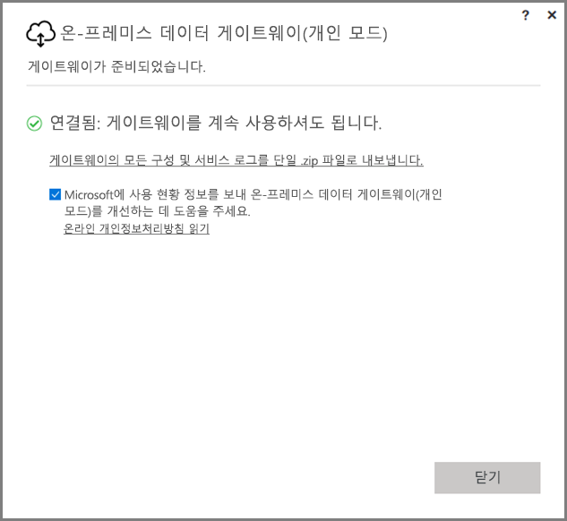
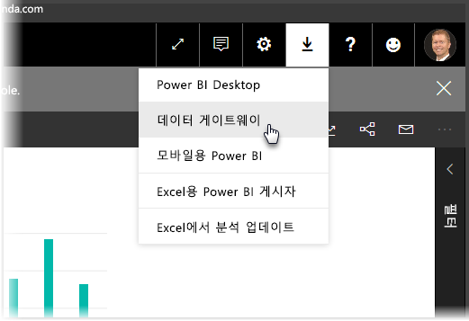
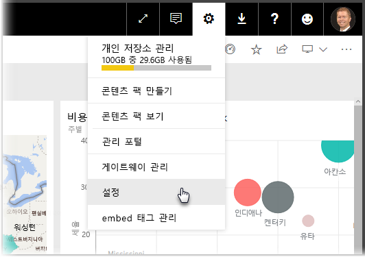
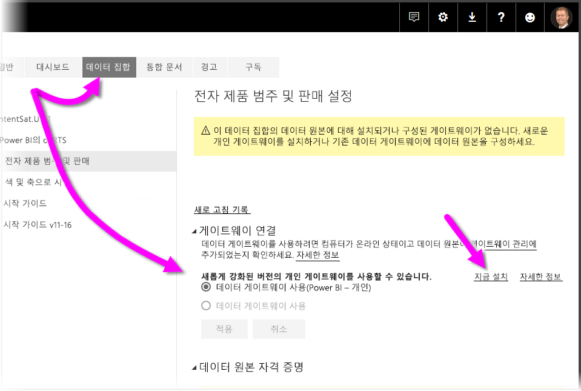
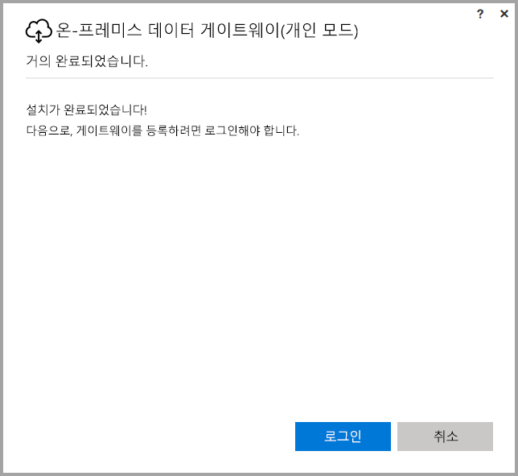
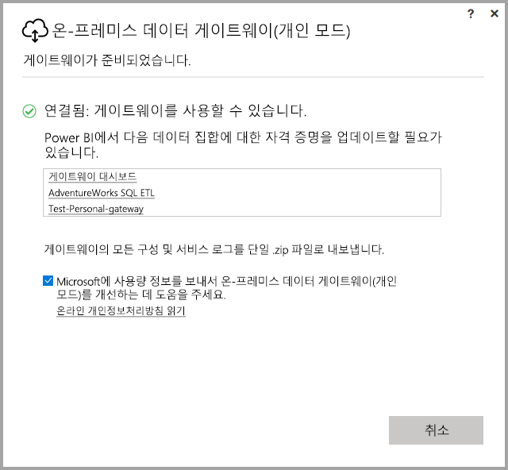

# <a name="on-premises-data-gateway-personal-mode"></a>온-프레미스 데이터 게이트웨이(개인 모드)
온-프레미스 데이터 원본을 사용할 수 있으며, 게이트웨이를 사용하여 Power BI 보고서 및 대시보드를 만들 수 있습니다. **게이트웨이**는 사용자가 **Power BI 서비스**와 같은 온라인 서비스의 데이터를 사용할 수 있게 사설 온-프레미스 네트워크에 저장된 데이터에 대한 액세스를 용이하게 하는 소프트웨어입니다. **온-프레미스 데이터 게이트웨이(개인 모드)**는 최근에 릴리스된 Power BI Gateway에 대한 업데이트로, 개별 사용자가 자신의 컴퓨터에 게이트웨이를 설치하고 온-프레미스 데이터에 대한 액세스를 얻을 수 있도록 합니다.



> [!NOTE]
> **온-프레미스 데이터 게이트웨이(개인 모드)**는 **Power BI Gateway - Personal**이라 불리는 이전에 지원되었던 개인 게이트웨이 버전을 대체합니다. 이전 개인 게이트웨이는 2017년 7월 31일까지만 작동합니다. 새 버전으로 업데이트하는 방법에 대한 자세한 내용은 아래 섹션을 참조하세요.
> 
> 

## <a name="features-of-the-on-premises-data-gateway-personal-mode"></a>온-프레미스 데이터 게이트웨이(개인 모드)의 기능
**온-프레미스 데이터 게이트웨이(개인 모드)**의 릴리스로, 이제 개선 사항 및 기능의 컬렉션을 사용할 수 있습니다. 개인 게이트웨이의 이전 버전(**Power BI Gateway - Personal**이라고 함)에서는 구현에 몇 가지 제한 사항이 있었습니다. 많은 Power BI 제품에서와 마찬가지로 고객의 요구 사항, 요청 및 고객이 어떻게 제품을 사용하는지를 반영하였습니다. 결과적으로 **온-프레미스 데이터 게이트웨이(개인 모드)**는 근본적으로 재설계되었으며 다음과 같은 기능 및 개선 사항을 포함합니다.

* **안정성 향상** - 새 버전의 개인 게이트웨이는 코드 및 구조적 소프트웨어 개선을 통해 이전 버전에 비해 안정성이 향상되었습니다.
* **확장성 향상** - 구조적 소프트웨어 향상의 일환으로, 추가 기능을 사용 가능하게 되는 시기에 개인 게이트웨이에 쉽게 추가할 수 있습니다.
* **Power BI 서비스에서 개인 게이트웨이 삭제** - 새 버전을 사용하면 이제 **Power BI 서비스** 내에서 개인 게이트웨이를 삭제할 수 있습니다.
* **구성 및 서비스 로그** - 새 버전을 사용하면 구성 및 서비스 로그를 한 번 클릭으로 .zip 파일로 손쉽게 내보낼 수 있습니다.

## <a name="installing-on-premises-data-gateway-personal-mode"></a>온-프레미스 데이터 게이트웨이(개인 모드) 설치
이전 버전의 게이트웨이 설치 없이 **온-프레미스 데이터 게이트웨이(개인 모드)**를 설치하려면 **Power BI 서비스**에서 톱니 바퀴형 아이콘을 선택하고 **데이터 게이트웨이**를 선택합니다.



[이 위치](https://go.microsoft.com/fwlink/?LinkId=820925&clcid=0x409)에서 게이트웨이를 다운로드할 수도 있습니다. 설치 단계를 수행할 수 있으며, 설치 과정에서 게이트웨이 버전(다른 사용자와 공유할 수 있는 표준 게이트웨이 또는 개인 모드) 중 하나를 설치할 수 있으므로 설치할 게이트웨이 버전이 무엇인지 묻는 메시지가 표시되면 **온-프레미스 데이터 게이트웨이(개인 모드)**를 선택합니다.

### <a name="updating-from-the-previous-personal-gateway"></a>이전 개인 게이트웨이에서 업데이트
이미 **Power BI Gateway - Personal** 게이트웨이가 설치되어 있는 경우 **Power BI 서비스**에서 **설정** 아래 **데이터 집합**을 확인할 때 개인 게이트웨이의 새롭고 향상된 버전을 설치할지 묻는 메시지가 표시됩니다.



데이터 집합을 선택하고 **게이트웨이 연결**을 선택하면 새롭고 향상된 버전의 개인 게이트웨이를 사용할 수 있다는 알림이 표시됩니다. 해당되면 **지금 설치**를 선택합니다.



> [!NOTE]
> **Power BI Gateway - personal**의 이전 버전을 권한 상승된 프로세스로 실행 중인 경우, 데이터 집합 자격 증명이 자동으로 업데이트되도록 권한 상승된 새 게이트웨이 설치 프로세스도 시작해야 합니다. 그렇지 않으면 데이터 집합 자격 증명을 수동으로 업데이트해야 합니다.
> 
> 

설치 완료 메시지가 표시된 후 업데이트 프로세스가 진행됩니다. 아직 화면을 닫지 마세요. 마지막 한 단계가 남아 있습니다.



마지막 단계는 다음과 같습니다. 새 개인 게이트웨이가 설치되면(그리고 여전히 마지막 설치 화면이 표시됨), **Power BI 서비스**에 로그인하고 다음 이미지와 같이 게이트웨이가 온라인 상태임이 표시될 때까지 기다립니다.



이전 게이트웨이가 설치되어 있어서 동일한 컴퓨터에서 개인 게이트웨이를 업데이트한 경우 자격 증명이 자동으로 업데이트되고 모든 새로 고침 작업이 새 게이트웨이를 거치게 됩니다. 이전 게이트웨이가 다른 컴퓨터에 설치된 경우 특정 데이터 집합에서 자격 증명을 업데이트할 것인지 묻는 메시지가 표시됩니다. 이전 이미지에서 데이터 집합의 목록이 창에 표시됩니다. 목록에는 자격 증명을 업데이트해야 할 수도 있는 데이터 집합이 표시됩니다. 나열된 각 데이터 집합은 클릭만으로 손쉽게 자격 증명을 업데이트할 수 있는 직접 링크입니다.

거의 다 끝났습니다. 새 게이트웨이가 설치되면 컴퓨터에 설치되어 있는 이전 버전은 더이상 필요 없으므로 제거해야 합니다. 컴퓨터에서 **Power BI Gateway - Personal**을 검색하여 제거하면 이를 수행할 수 있습니다.

### <a name="determining-which-version-of-the-personal-gateway-you-have-installed"></a>설치한 개인 게이트웨이의 버전 확인
현재 설치한 개인 게이트웨이의 버전을 확인하려면 다음을 수행합니다.

* 개인 게이트웨이의 이전 버전은 **Power BI Gateway - Personal**이라고 하며 설치 대화 상자에서 Power BI 아이콘을 사용합니다.
* 개인 게이트웨이의 새 버전은 **온-프레미스 데이터 게이트웨이(개인 모드)**라고 하며 게이트웨이 아이콘(아래쪽에 위쪽 및 아래쪽 화살표가 있는 구름)을 사용합니다.

**프로그램 추가/제거**로 이동하여 **Power BI Gateway - Personal**이 목록에 표시되는지 확인하여 있다면, 개인 게이트웨이의 이전 버전이 설치되어 있는 것입니다.

## <a name="using-fast-combine-with-the-personal-gateway"></a>개인 게이트웨이로 빠른 결합 사용
이전 게이트웨이를 통해 **빠른 결합**을 사용한 경우 다음 단계를 수행하여 **빠른 결합**을 다시 사용하도록 설정하여 **온-프레미스 데이터 게이트웨이(개인 모드)**로 작업할 수 있도록 해야 합니다.

1. 파일 탐색기를 사용하여 다음 파일을 엽니다.
   
   ```
   %localappdata%\Microsoft\On-premises data gateway (personal mode)\Microsoft.PowerBI.DataMovement.Pipeline.GatewayCore.dll.config
   ```
2. 파일의 맨 아래에 다음 텍스트를 추가합니다.
   
       ```
       <setting name="EnableFastCombine" serializeAs="String">```
       <value>true</value>
       </setting>
       ```
3. 완료되면 약 1분 후 설정에 적용됩니다. 제대로 작동하는지 확인하려면 **Power BI 서비스**에서 주문형 새로 고침을 시도하여 **빠른 결합**이 작동하는지 확인합니다.

## <a name="limitations-and-considerations"></a>제한 사항 및 고려 사항
**온-프레미스 데이터 게이트웨이(개인 모드)**를 사용할 때 다음 목록에 설명된 것처럼 몇 가지 고려해야 할 사항이 있습니다.

* **Windows Hello** 또는 핀 고정을 사용하여 Windows에 로그인하는 경우 다음과 같은 오류가 발생할 수 있습니다. 
  * *선택한 사용자 계정이 응용 프로그램의 요구 사항과 일치하지 않습니다. 다른 계정을 사용하십시오.*
  * 해당 오류를 해결하려면 *다른 계정 사용*을 선택하고 다시 로그인합니다. 

다음 데이터 원본은 현재 **온-프레미스 데이터 게이트웨이(개인 모드)**에 대해 지원되지 않습니다.

* ADO.NET 
* CurrentWorkbook
* FTP
* HDFS
* SAP BusinessObjects         
* Spark

2017년 하반기에 Spark가 지원될 예정입니다.

## <a name="frequently-asked-questions-faq"></a>질문과 대답(FAQ)
* **온-프레미스 데이터 게이트웨이(개인 모드)**를 **온-프레미스 데이터 게이트웨이**(이전에 엔터프라이즈 버전 게이트웨이로 알려짐)와 함께 실행할 수 있습니까?
  
  * **응답**: 예, 새 버전을 사용하여 둘 다 동시에 실행할 수 있습니다.
* **온-프레미스 데이터 게이트웨이(개인 모드)**를 서비스로 실행할 수 있습니까?
  
  * **응답:** 아니요. **온-프레미스 데이터 게이트웨이(개인 모드)**는 응용 프로그램으로만 실행할 수 있습니다. 서비스 및/또는 관리자 모드에서 게이트웨이를 실행해야 하는 경우 [**온-프레미스 데이터 게이트웨이**](service-gateway-onprem.md)(이전에 엔터프라이즈 게이트웨이로 알려짐)를 고려해야 합니다.
* **온-프레미스 데이터 게이트웨이(개인 모드)**의 업데이트 주기는 어떻게 됩니까?
  
  * **응답**: 개인 게이트웨이는 달마다 업데이트할 계획입니다.
* 왜 내 자격 증명 업데이트를 요청해야 합니까?
  
  * **응답**: 대부분의 경우 자격 증명에 대한 요청을 트리거할 수 있습니다. **온-프레미스 데이터 게이트웨이(개인 모드)**를 **Power BI - 개인** 게이트웨이와 다른 컴퓨터에 다시 설치하는 것이 가장 일반적입니다. 데이터 원본에서 문제가 되어 Power BI가 테스트 연결을 수행하지 못하거나 제한 시간 또는 시스템 오류가 발생할 수도 있습니다. **Power BI 서비스**에서 **톱니 바퀴형 아이콘**으로 이동하여 **설정**, **데이터 집합**을 차례로 선택하고, 질문에서 데이터 집합을 찾아 *자격 증명 업데이트*를 클릭하면 자격 증명을 업데이트할 수 있습니다.
* 업그레이드하는 동안 내 이전 개인 게이트웨이는 얼마 동안 오프라인 상태가 됩니까?
  
  * **응답**: 개인 게이트웨이를 새 버전으로 업그레이드하는 데는 몇 분이면 됩니다. 
* 2017년 7월 31일까지 새 개인 게이트웨이로 마이그레이션하지 않으면 어떻게 됩니까?
  
  * **응답**: 현재 게이트웨이를 사용하여 보고서를 새로 고치는 경우 새로 고침이 중지됩니다. 새로운 새로 고침을 설정하는 유일한 방법은 새 게이트웨이를 설치하여 구성하는 것입니다.
* R 스크립트를 사용하고 있습니다. 지원됩니까?
  
  * **응답**: R 스크립트에 대한 지원이 곧 추가될 것입니다.
* **Power BI 서비스**에서 내 게이트웨이를 업데이트하라는 메시지가 표시되지 않는 이유는 무엇입니까?
  
  * **응답**: 아마도 현재 지원되지 않는 데이터 원본을 포함하는 데이터 집합이 하나 이상 있기 때문일 것입니다.

## <a name="next-steps"></a>다음 단계
[Power BI Gateway에 대한 프록시 설정 구성](service-gateway-proxy.md)  
궁금한 점이 더 있나요? [Power BI 커뮤니티를 이용하세요.](http://community.powerbi.com/)

