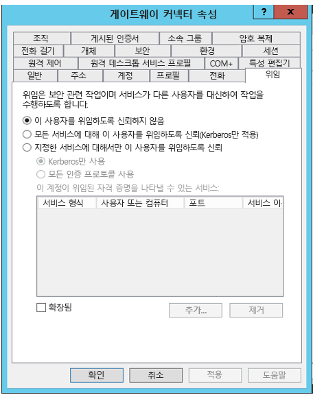
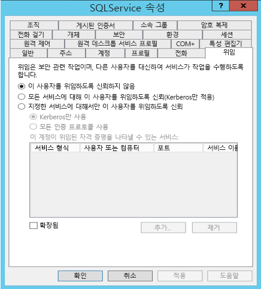
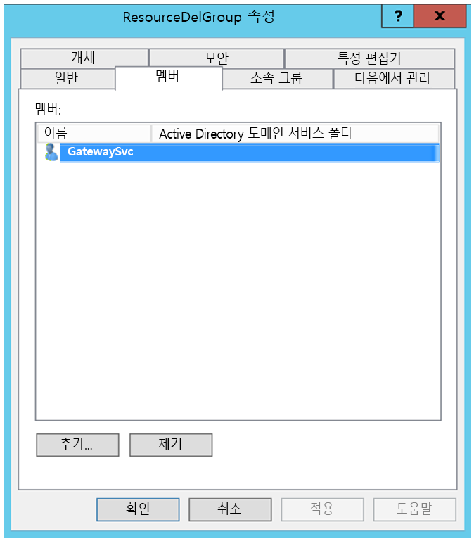
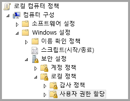
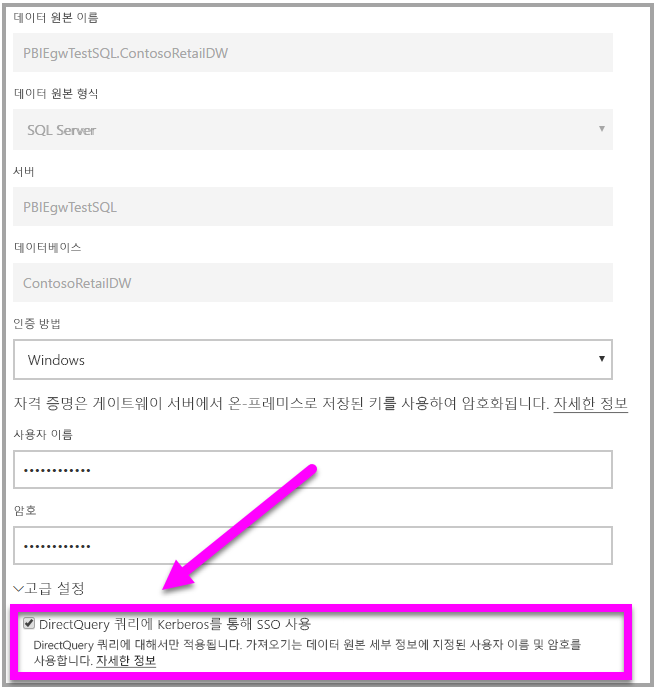

# <a name="use-resource-based-kerberos-for-single-sign-on-sso-from-power-bi-to-on-premises-data-sources"></a>Power BI에서 온-프레미스 데이터 원본으로 SSO(Single Sign-On)에 대해 리소스 기반 Kerberos 사용

[리소스 기반 Kerberos 제한 위임](/windows-server/security/kerberos/kerberos-constrained-delegation-overview)을 사용하여 Windows Server 2012 이상 버전의 Single Sign-On 연결을 사용하도록 설정하여 프런트 엔드 및 백 엔드 서비스가 여러 도메인에 포함되도록 허용합니다. 이렇게 하려면 백 엔드 서비스 도메인이 프런트 엔드 서비스 도메인을 신뢰해야 합니다.

## <a name="preparing-for-resource-based-kerberos-constrained-delegation"></a>리소스 기반 Kerberos 제한 위임 준비

Kerberos 제한 위임을 적절하게 작동하려면 SPN(’서비스 사용자 이름’) 및 서비스 계정의 위임 설정을 포함한 여러 개의 항목을 구성해야 합니다.

### <a name="prerequisite-1-operating-system-requirements"></a>필수 구성 요소 1: 운영 체제 요구 사항

Windows Server 2012 R2 또는 Windows Server 2012 이상을 실행하는 도메인 컨트롤러에서는 리소스 기반 제한 위임만 구성할 수 있습니다.

### <a name="prerequisite-2-install-and-configure-the-on-premises-data-gateway"></a>필수 구성 요소 2: 온-프레미스 데이터 게이트웨이 설치 및 구성

이번 온-프레미스 데이터 게이트웨이 릴리스는 현재 위치 업그레이드 및 기존 게이트웨이의 ‘설정 적용’을 지원합니다.

### <a name="prerequisite-3-run-the-gateway-windows-service-as-a-domain-account"></a>필수 구성 요소 3: 도메인 계정으로 게이트웨이 Windows 서비스 실행

표준 설치에서 게이트웨이는 다음 그림에 표시되는 것과 같이 컴퓨터 로컬 서비스 계정(특히 _NT Service\PBIEgwService_)으로 실행됩니다.


**Kerberos 제한 위임을 활성화하기 위해 게이트웨이는 Azure AD가 이미 로컬 Active Directory(Azure AD DirSync/Connect 사용)와 동기화되지 않는 한 도메인 계정으로 실행해야 합니다. 계정을 도메인 계정으로 전환해야 하는 경우 [게이트웨이를 도메인 계정으로 전환](service-gateway-sso-kerberos.md)을 참조하세요.

Azure AD DirSync/Connect가 구성되고 사용자 계정이 동기화된 경우 게이트웨이 서비스는 런타임 시 로컬 AD 조회를 수행하지 않아도 됩니다. 게이트웨이 서비스에 대해 로컬 서비스 SID(도메인 계정 요구 대신)를 사용할 수 있습니다. 이 아티클에서 간략히 설명한 Kerberos 제한된 위임 구성 단계는 해당 구성과 동일합니다(도메인 계정 대신 Active Directory의 게이트웨이 컴퓨터 개체에 간단히 적용됨).

### <a name="prerequisite-4-have-domain-admin-rights-to-configure-spns-setspn-and-kerberos-constrained-delegation-settings"></a>필수 구성 요소 4: SPN(SetSPN) 및 Kerberos 제한 위임 설정을 구성하는 도메인 관리자 권한 갖기

도메인 관리자가 도메인 관리자 권한을 요구하지 않고 다른 사용자에게 SPN 및 Kerberos 위임을 구성하는 권한을 일시적 또는 영구적으로 허용하는 것은 기술적으로 가능하지만 이는 권장되는 방법이 아닙니다. 다음 섹션에서 **필수 구성 요소 3**에 필요한 구성 단계를 자세히 설명합니다.

## <a name="configuring-kerberos-constrained-delegation-for-the-gateway-and-data-source"></a>게이트웨이 및 데이터 원본에 대해 Kerberos 제한 위임 구성

시스템을 제대로 구성하려면 다음 두 항목을 구성하거나 유효성을 검사해야 합니다.

1. 필요한 경우 게이트웨이 서비스 도메인 계정에 대한 SPN을 구성합니다.

1. 게이트웨이 서비스 도메인 계정에서 위임 설정을 구성합니다.

두 개의 구성 단계를 수행하기 위한 도메인 관리자여야 합니다.

다음 섹션에서는 이러한 단계를 차례로 설명합니다.

### <a name="configure-an-spn-for-the-gateway-service-account"></a>게이트웨이 서비스 계정에 대해 SPN 구성

먼저 게이트웨이 서비스 계정으로 사용된 도메인 계정에 대해 SPN이 이미 만들어졌는지 확인합니다. 다음 단계를 따릅니다.

1. 도메인 관리자로 **Active Directory 사용자 및 컴퓨터**를 시작합니다.

1. 도메인을 마우스 오른쪽 단추로 클릭하고, **찾기**를 선택하고, 게이트웨이 서비스 계정의 계정 이름을 입력합니다.

1. 검색 결과에서 게이트웨이 서비스 계정을 마우스 오른쪽 단추로 클릭하고 **속성**을 선택합니다.

1. **위임** 탭을 **속성** 대화 상자에서 볼 수 있는 경우 SPN이 이미 만들어졌으며 위임 설정 구성에 대한 다음 하위 섹션으로 바로 이동할 수 있습니다.

    **속성** 대화 상자 **위임** 탭이 없는 경우 해당 계정에서 **위임** 탭을 추가하는 SPN을 수동으로 만들 수 있습니다(위임 설정을 구성하는 가장 쉬운 방법임). SPN 만들기는 Windows와 함께 제공되는 [setspn 도구](https://technet.microsoft.com/library/cc731241.aspx)를 사용하여 수행할 수 있습니다(SPN을 만드는 도메인 관리자 권한 필요).

    예를 들어 게이트웨이 서비스 계정이 “PBIEgwTest\GatewaySvc”이며 실행 중인 게이트웨이 서비스가 있는 머신 이름이 **Machine1**이라고 가정합니다. 이 예에서 해당 컴퓨터에 대한 게이트웨이 서비스 계정의 SPN을 설정하려면 다음 명령을 실행합니다.

      

    해당 단계가 완료되면 위임 설정 구성으로 이동할 수 있습니다.

### <a name="configure-delegation-settings"></a>위임 설정 구성

다음 단계에서는 SQL Server를 실행 중인 데이터베이스 서버와 게이트웨이 머신이라는 두 머신이 여러 도메인에 있는 온-프레미스 환경을 가정합니다. 이 예제에서는 다음과 같은 설정 및 이름을 가정합니다.

- 게이트웨이 머신 이름: **PBIEgwTestGW**
- 게이트웨이 서비스 계정: **PBIEgwTestFrontEnd\GatewaySvc**(계정 표시 이름: 게이트웨이 커넥터)
- SQL Server 데이터 원본 머신 이름: **PBIEgwTestSQL**
- SQL Server 데이터 원본 서비스 계정: **PBIEgwTestBackEnd\SQLService**

해당 예제 이름 및 설정이 제공된 경우 다음 구성 단계를 사용합니다.

1. **PBIEgwTestFront-end** 도메인의 도메인 컨트롤러에서 MMC(Microsoft Management Console) 스냅인인 **Active Directory 사용자 및 컴퓨터**를 사용하여 위임 설정이 게이트웨이 서비스 계정에 적용되지 않도록 합니다.

    

1. **PBIEgwTestBack-end** 도메인의 도메인 컨트롤러에서 **Active Directory 사용자 및 컴퓨터**를 사용하여 위임 설정이 백 엔드 서비스 계정에 적용되지 않도록 합니다. 또한 이 계정의 “Msds-allowedtoactonbehalfofotheridentity” 특성이 설정되지 않도록 합니다. 다음 그림과 같이 “특성 편집기”에서 이 특성을 찾을 수 있습니다.

    

1. **PBIEgwTestBack-end** 도메인의 도메인 컨트롤러에서 **Active Directory 사용자 및 컴퓨터**에 그룹을 만듭니다. 다음 그림과 같이 이 그룹에 게이트웨이 서비스 계정을 추가합니다. 이 그림은 _ResourceDelGroup_이라는 새 그룹 및 이 그룹에 추가된 게이트웨이 서비스 계정 **GatewaySvc**를 보여 줍니다.

    

1. 명령 프롬프트를 열고 **PBIEgwTestBack 엔드** 도메인의 도메인 컨트롤러에서 다음 명령을 실행하여 백 엔드 서비스 계정의 Msds-allowedtoactonbehalfofotheridentity 특성을 업데이트합니다.

    ```powershell
    $c=get-adgroupResourceDelGroup
    set-aduser **SQLService** -principalsAllowedToDelegateToAccount$c
    ```

1. **Active Directory 사용자 및 컴퓨터**의 백 엔드 서비스 계정 속성에서 “특성 편집기” 탭에 업데이트가 반영되었는지 확인할 수 있습니다.

마지막으로, 게이트웨이 서비스(예에서 **PBIEgwTestGW**)를 실행 중인 컴퓨터에서 게이트웨이 서비스 계정은 로컬 정책 “인증 후 클라이언트 가장”을 부여해야 합니다. 로컬 그룹 정책 편집기(**gpedit**)를 사용하여 이를 수행/확인할 수 있습니다.

1. 게이트웨이 머신에서 _gpedit.msc_를 실행합니다.

1. 다음 그림에 표시된 것처럼 **로컬 컴퓨터 정책 > 컴퓨터 구성 > Windows 설정 > 보안 설정 > 로컬 정책 > 사용자 권한 할당**으로 이동합니다.

    

1. **사용자 권한 할당** 아래의 정책 목록에서 **인증 후 클라이언트 가장**을 선택합니다.

    

1. **인증 후 클라이언트 가장**의 **속성**을 마우스 오른쪽 단추로 클릭하고 열고 계정의 목록을 확인합니다. 게이트웨이 서비스 계정을 포함해야 합니다(**PBIEgwTestFront-end****\GatewaySvc**).

1. **사용자 권한 할당** 아래의 정책 목록에서 **운영 체제의 일부로 작동(SeTcbPrivilege)** 을 선택합니다. 게이트웨이 서비스 계정이 계정 목록에도 포함되어 있는지 확인합니다.

1. **온-프레미스 데이터 게이트웨이** 서비스 프로세스를 다시 시작합니다.

## <a name="running-a-power-bi-report"></a>Power BI 보고서 실행

이 문서의 앞부분에 설명된 모든 구성 단계를 완료한 후 Power BI에서 **게이트웨이 관리** 페이지를 사용하여 데이터 원본을 구성할 수 있습니다. 해당 **고급 설정** 아래에서 SSO를 활성화하고 해당 데이터 원본에 보고서 및 데이터 세트 바인딩을 게시할 수 있습니다.



이 구성은 대부분의 경우에서 작동합니다. 그러나 Kerberos를 사용하는 경우 환경에 따라 서로 다른 구성이 있을 수 있습니다. 보고서가 여전히 로드되지 않는 경우 추가 조사를 위해 도메인 관리자에게 문의해야 합니다.

## <a name="next-steps"></a>다음 단계

**온-프레미스 데이터 게이트웨이** 및 **DirectQuery**에 대한 자세한 내용은 다음 리소스를 확인하세요.

- [온-프레미스 데이터 게이트웨이](service-gateway-onprem.md)
- [Power BI의 DirectQuery](desktop-directquery-about.md)
- [DirectQuery에서 지원하는 데이터 원본](desktop-directquery-data-sources.md)
- [DirectQuery 및 SAP BW](desktop-directquery-sap-bw.md)
- [DirectQuery 및 SAP HANA](desktop-directquery-sap-hana.md)