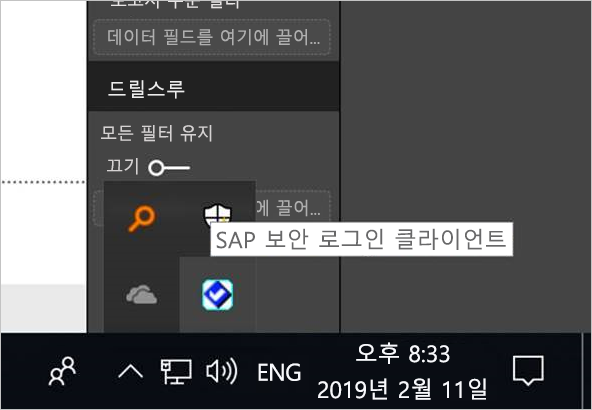
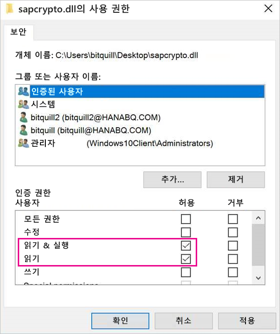
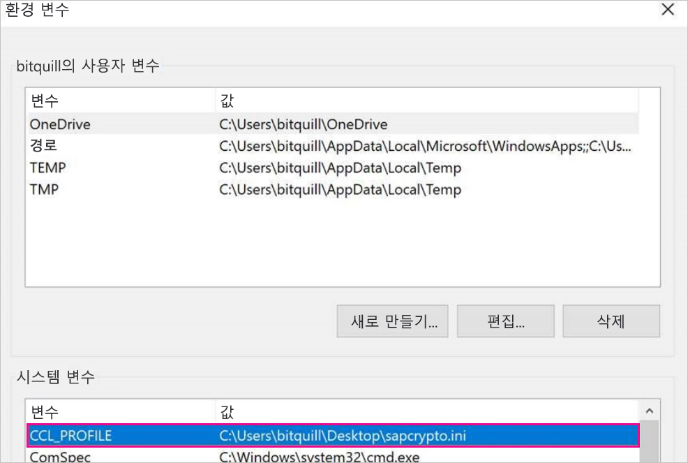
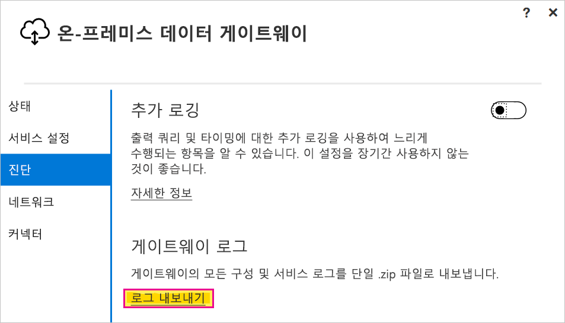

# <a name="use-kerberos-single-sign-on-for-sso-to-sap-bw-using-commoncryptolib-sapcryptodll"></a>CommonCryptoLib(sapcrypto.dll)를 사용하여 SAP BW에 대한 SSO에 Kerberos Single Sign-On 사용

이 문서에서는 CommonCryptoLib(sapcrypto.dll)를 사용하여 Power BI 서비스에서 SSO를 사용하도록 SAP BW 데이터 원본을 구성하는 방법을 설명합니다.

> [!NOTE]
> Kerberos SSO를 사용하는 SAP BW 기반 보고서를 새로 고치기 전에 이 문서의 단계와 [Kerberos SSO 구성](service-gateway-sso-kerberos.md) 단계를 모두 완료합니다. CommonCryptoLib를 SNC 라이브러리로 사용하면 SAP BW 애플리케이션 서버와 SAP BW 메시지 서버 모두에 SSO 연결을 사용할 수 있습니다.

## <a name="configure-sap-bw-to-enable-sso-using-commoncryptolib"></a>CommonCryptoLib를 사용하여 SSO를 활성화하도록 SAP BW 구성

> [!NOTE]
> 온-프레미스 데이터 게이트웨이는 64비트 소프트웨어이므로 BW SSO를 수행하려면 64비트 버전의 CommonCryptoLib(sapcrypto.dll)가 필요합니다. 게이트웨이를 통해 SSO 연결을 시도하기 전에 SAP GUI에서 SAP BW 서버에 대한 SSO 연결을 테스트하려는 경우, SAP GUI가 32비트 소프트웨어이기 때문에 32비트 버전의 CommonCryptoLib도 필요합니다.

1. BW 서버가 CommonCryptoLib를 사용하여 Kerberos SSO에 대해 올바르게 구성되었는지 확인합니다. 올바르게 구성된 경우, SSO를 사용하여 CommonCryptoLib를 사용하도록 구성된 SAP GUI와 같은 SAP 도구로 직접 또는 SAP BW 메시지 서버를 통해 BW 서버에 액세스할 수 있습니다. 

   설정 단계에 대한 자세한 내용은 [SAP Single Sign-On: Authenticate with Kerberos/SPNEGO](https://blogs.sap.com/2017/07/27/sap-single-sign-on-authenticate-with-kerberosspnego/)(Kerberos/SPNEGO를 사용하여 인증)을 참조하세요. BW 서버는 CommonCryptoLib를 SNC 라이브러리로 사용하고 *CN=* 으로 시작하는 SNC 이름(예: *CN = BW1*)이 있어야 합니다. SNC 이름 요구 사항(특히 snc/identity/as 매개 변수)에 대한 자세한 내용은 [SNC Parameters for Kerberos Configuration](https://help.sap.com/viewer/df185fd53bb645b1bd99284ee4e4a750/3.0/en-US/360534094511490d91b9589d20abb49a.html)(Kerberos 구성의 SNC 매개 변수)를 참조하세요.

1. 아직 수행하지 않은 경우 게이트웨이가 설치된 컴퓨터에 [SAP .NET Connector](https://support.sap.com/en/product/connectors/msnet.html) x64 버전을 설치합니다. 
   
   게이트웨이 컴퓨터의 Power BI Desktop에서 BW 서버에 연결을 시도하여 구성 요소가 설치되었는지 확인할 수 있습니다. 2\.0 구현을 사용하여 연결할 수 없는 경우 .NET Connector가 GAC에 설치되어 있지 않거나 설치된 적이 없는 것입니다.

1. 게이트웨이가 설치된 컴퓨터에 SAP SLC(보안 로그인 클라이언트)가 실행되고 있지 않은지 확인합니다. 

   SLC는 SSO를 위해 Kerberos를 사용하는 게이트웨이 기능을 방해할 수 있는 방식으로 Kerberos 티켓을 캐시합니다. 

1. SLC가 설치되어 있으면 제거하거나 SAP 보안 로그인 클라이언트를 종료해야 합니다. 시스템 트레이에서 아이콘을 마우스 오른쪽 단추로 클릭하고 **로그아웃** 및 **종료**를 선택한 다음, 게이트웨이를 사용하여 SSO 연결을 시도합니다. 

   Windows Server 머신에서는 SLC를 사용할 수 없습니다. 자세한 내용은 [SAP Note 2780475](https://launchpad.support.sap.com/#/notes/2780475)(s-user가 필요함)를 참조하세요.

   

1. SLC를 제거하거나 **로그아웃** 및 **종료**를 선택하는 경우, cmd 창을 열고 `klist purge`를 입력하여 캐시된 Kerberos 티켓을 모두 지운 다음, 게이트웨이를 통해 SSO 연결을 시도합니다.

1. SAP 실행 패드에서 64비트 CommonCryptoLib(sapcrypto.dll) 버전 *8.5.25 이상*을 다운로드하고 게이트웨이 머신의 폴더에 복사합니다. sapcrypto.dll을 복사한 디렉터리에 다음 내용이 포함된 sapcrypto.ini라는 파일을 만듭니다.

    ```
    ccl/snc/enable_kerberos_in_client_role = 1
    ```

    .ini 파일에는 CommonCryptoLib가 게이트웨이 시나리오에서 SSO를 사용하도록 설정하는 데 필요한 구성 정보가 포함되어 있습니다.

    > [!NOTE]
    > 두 파일을 동일한 위치에 저장해야 합니다. 즉, _/path/to/sapcrypto/_ 에 sapcrypto.ini와 sapcrypto.dll을 모두 포함해야 합니다.

    서비스 사용자가 가장하는 게이트웨이 서비스 사용자와 AD(Active Directory) 사용자에게 모두, 두 파일에 대한 읽기 및 실행 권한이 있어야 합니다. 인증된 사용자 그룹에 .ini 및 .dll 파일 권한을 모두 부여하는 것이 좋습니다. 테스트에 사용할 게이트웨이 서비스 사용자와 Active Directory 사용자 둘 다에게 테스트 목적으로 이러한 사용 권한을 명시적으로 부여할 수도 있습니다. 다음 스크린샷에서는 인증된 사용자 그룹에 sapcrypto.dll에 대한 **읽기 및 실행** 권한을 부여했습니다.

    

1. SSO 연결이 통과할 게이트웨이와 연결된 SAP BW 데이터 원본이 아직 없는 경우 Power BI 서비스의 **게이트웨이 관리** 페이지에서 추가합니다. 이러한 데이터 원본이 이미 있는 경우 다음과 같이 편집합니다. 
    - BW 애플리케이션 서버에 대한 SSO 연결을 만들려면 **SAP Business Warehouse**를 **데이터 원본 유형**으로 선택합니다. 
    - BW 메시지 서버에 대한 SSO 연결을 만들려면 **Sap Business Warehouse 메시지 서버**를 선택합니다.

1. **SNC 라이브러리**에서 **SNC\_LIB** 또는 **SNC\_LIB\_64** 환경 변수 또는 **사용자 지정**을 선택합니다. 

   - **SNC\_LIB**를 선택하는 경우, 게이트웨이 머신의 **SNC\_LIB\_64** 환경 변수 값을 게이트웨이 머신에 있는 sapcrypto.dll 64비트 버전의 절대 경로로 설정해야 합니다. 예를 들어 *C:\Users\Test\Desktop\sapcrypto.dll*로 설정합니다.

   - **사용자 지정**을 선택하는 경우, **게이트웨이 관리** 페이지에 표시되는 사용자 지정 SNC 라이브러리 경로 필드에 *sapcrypto.dll*의 절대 경로를 붙여넣습니다. 

1. **SNC 파트너 이름**에 BW 서버의 SNC 이름을 입력합니다. **고급 설정**에서 **DirectQuery 쿼리에 Kerberos를 통한 SSO 사용**이 선택되어 있는지 확인합니다. PBI Desktop에서 Windows 인증 연결을 설정하는 것처럼 다른 필드를 채웁니다.

1. **CCL\_PROFILE** 시스템 환경 변수를 만들고 변수 값을 sapcrypto.ini의 경로로 설정합니다.

    

    sapcrypto .dll 및 .ini 파일은 동일한 위치에 있어야 합니다. 위의 예제에서 sapcrypto.ini 및 sapcrypto.dll은 둘 다 바탕 화면에 있습니다.

1. 게이트웨이 서비스를 다시 시작합니다.

    

1. [Power BI 보고서 실행](service-gateway-sso-kerberos.md#run-a-power-bi-report)

## <a name="troubleshooting"></a>문제 해결

Power BI 서비스에서 보고서를 새로 고칠 수 없는 경우 게이트웨이 추적, CPIC 추적 및 CommonCryptoLib 추적을 사용하여 문제를 진단할 수 있습니다. CPIC 추적 및 CommonCryptoLib는 SAP 제품이므로 Microsoft에서 지원할 수 없습니다. BW에 대한 SSO 액세스 권한을 부여받은 Active Directory 사용자의 경우, 일부 Active Directory 구성에서는 사용자가 게이트웨이를 설치한 머신에서 관리자 그룹의 구성원이어야 할 수도 있습니다.

### <a name="gateway-logs"></a>게이트웨이 로그

1. 문제를 재현합니다.

2. [게이트웨이 앱](https://docs.microsoft.com/data-integration/gateway/service-gateway-app)을 열고 **진단** 탭에서 **로그 내보내기**를 선택합니다.

      

### <a name="cpic-tracing"></a>CPIC 추적

1. CPIC 추적을 사용하도록 설정하려면 두 가지 환경 변수 **CPIC**TRACE\_ 및 \_CPIC**TRACE\_DIR**을 설정합니다. 

   첫 번째 변수는 추적 수준을 설정하고, 두 번째 변수는 추적 파일 디렉터리를 설정합니다. 이 디렉터리는 인증된 사용자 그룹의 구성원이 쓸 수 있는 위치여야 합니다. 
 
2. **CPIC\_TRACE**를 *3*으로 설정하고, **CPIC\_TRACE\_DIR**을 추적하려는 파일이 기록된 디렉터리로 설정합니다. 예:

   

 3. 문제를 재현하고, **CPIC\_TRACE\_DIR**에 추적 파일이 있는지 확인합니다.

### <a name="commoncryptolib-tracing"></a>CommonCryptoLib 추적 

1. 앞에서 만든 sapcrypto.ini 파일에 다음 줄을 추가하여 CommonCryptoLib 추적을 켭니다.

    ```
    ccl/trace/level=5
    ccl/trace/directory=<drive>:\logs\sectrace
    ```

2. `ccl/trace/directory` 옵션을 인증된 사용자 그룹의 구성원이 쓸 수 있는 위치로 변경합니다. 

3. 또는 새 .ini 파일을 만들어 이 동작을 변경합니다. sapcrypto.ini 및 sapcrypto.dll과 동일한 디렉터리에 다음 내용이 포함된 sectrace.ini라는 파일을 만듭니다. `DIRECTORY` 옵션을 인증된 사용자 그룹의 구성원이 쓸 수 있는 컴퓨터의 위치로 바꿉니다.

    ```
    LEVEL = 5
    DIRECTORY = <drive>:\logs\sectrace
    ```

4. 이제 문제를 재현하고, **DIRECTORY**가 가리키는 위치에 추적 파일이 있는지 확인합니다. 

5. 작업을 마쳤으면 CPIC 및 CCL 추적을 끕니다.

    CommonCryptoLib 추적에 대한 자세한 내용은 [SAP Note 2491573](https://launchpad.support.sap.com/#/notes/2491573)(SAP s-user 필요)을 참조하세요.

## <a name="next-steps"></a>다음 단계

온-프레미스 데이터 게이트웨이 및 DirectQuery에 대한 자세한 내용은 다음 리소스를 참조하세요.

* [온-프레미스 데이터 게이트웨이란?](/data-integration/gateway/service-gateway-onprem)
* [Power BI의 DirectQuery](desktop-directquery-about.md)
* [DirectQuery에서 지원하는 데이터 원본](desktop-directquery-data-sources.md)
* [DirectQuery 및 SAP BW](desktop-directquery-sap-bw.md)
* [DirectQuery 및 SAP HANA](desktop-directquery-sap-hana.md)
