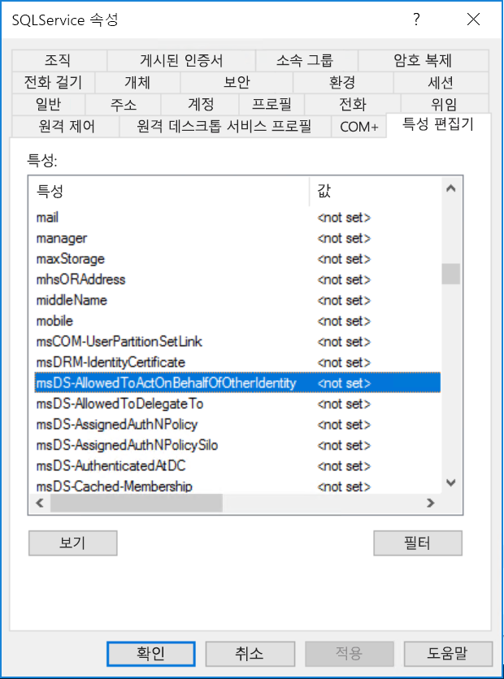

# <a name="configure-kerberos-based-sso-from-power-bi-service-to-on-premises-data-sources"></a>Power BI 서비스에서 온-프레미스 데이터 원본으로 Kerberos 기반 SSO 구성

SSO를 사용하도록 설정하면 Power BI 보고서 및 대시보드가 온-프레미스 원본에 구성된 사용자 수준 권한을 준수하면서 원본의 데이터를 손쉽게 새로 고칠 수 있습니다. [Kerberos 제한 위임](/windows-server/security/kerberos/kerberos-constrained-delegation-overview)을 사용하여 원활한 SSO 연결을 사용하도록 설정합니다. 

## <a name="prerequisites"></a>필수 조건

Kerberos 제한 위임이 제대로 작동하려면 _‘SPN(서비스 사용자 이름)’_ 및 서비스 계정의 위임 설정을 포함한 여러 항목을 구성해야 합니다.

### <a name="install-and-configure-the-microsoft-on-premises-data-gateway"></a>Microsoft 온-프레미스 데이터 게이트웨이 설치 및 구성

온-프레미스 데이터 게이트웨이는 현재 위치 업그레이드 및 기존 게이트웨이의 _설정 적용_을 지원합니다.

### <a name="run-the-gateway-windows-service-as-a-domain-account"></a>도메인 계정으로 게이트웨이 Windows 서비스 실행

표준 설치에서 게이트웨이는 머신-로컬 서비스 계정(**NT Service\PBIEgwService**)으로 실행됩니다.


Kerberos 제한 위임을 사용하도록 설정하려면, Azure AD DirSync/Connect를 통해 Azure AD(Azure Active Directory) 인스턴스가 로컬 Active Directory 인스턴스와 동기화되지 않은 경우 게이트웨이가 도메인 계정으로 실행되어야 합니다. 도메인 계정으로 전환하려면 [게이트웨이 서비스 계정 변경](/data-integration/gateway/service-gateway-service-account)을 참조하세요.

> [!NOTE]
> Azure AD Connect가 구성되고 사용자 계정이 동기화된 경우 게이트웨이 서비스는 런타임 시 로컬 Azure AD 조회를 수행하지 않아도 됩니다. 대신, 게이트웨이 서비스에 대해 로컬 서비스 SID를 사용하여 Azure AD에서 필요한 구성을 모두 완료할 수 있습니다. 이 문서에서 간략하게 설명된 Kerberos 제한 위임 구성 단계는 Azure AD 컨텍스트에서 필요한 구성 단계와 동일합니다. 단, 도메인 계정이 아니라 로컬 서비스 SID로 확인된 Azure AD의 게이트웨이 컴퓨터 개체에 적용됩니다.

## <a name="obtain-domain-admin-rights-to-configure-spns-setspn-and-kerberos-constrained-delegation-settings"></a>SPN(SetSPN) 및 Kerberos 제한 위임 설정을 구성하기 위해 도메인 관리자 권한 얻기

SPN 및 Kerberos 위임 설정을 구성하기 위해 도메인 관리자가 도메인 관리자 권한이 없는 사용자에게 권한을 부여하면 안 됩니다. 다음 섹션에서는 권장되는 구성 단계를 자세하게 다룹니다.

## <a name="configure-kerberos-constrained-delegation-for-the-gateway-and-data-source"></a>게이트웨이 및 데이터 원본에 대해 Kerberos 제한 위임 구성

필요한 경우 게이트웨이 서비스 도메인 계정의 SPN을 도메인 관리자로 구성하고 게이트웨이 서비스 도메인 계정에서 위임 설정을 구성합니다.

### <a name="configure-an-spn-for-the-gateway-service-account"></a>게이트웨이 서비스 계정에 대해 SPN 구성

먼저 게이트웨이 서비스 계정으로 사용된 도메인 계정에 대해 SPN이 이미 생성되어 있는지 확인합니다.

1. 도메인 관리자로, **Active Directory 사용자 및 컴퓨터** MMC(Microsoft Management Console) 스냅인을 시작합니다.

2. 왼쪽 창에서 도메인 이름을 마우스 오른쪽 단추로 클릭하고 **찾기**를 선택한 다음, 게이트웨이 서비스 계정의 계정 이름을 입력합니다.

3. 검색 결과에서 게이트웨이 서비스 계정을 마우스 오른쪽 단추로 클릭하고 **속성**을 선택합니다.

4. **속성** 대화 상자에 **위임** 탭이 표시되는 경우 SPN이 이미 생성된 것이므로 [리사용할 Kerberos 제한 위임 유형 결정](#decide-on-the-type-of-kerberos-constrained-delegation-to-use)으로 건너뛰어도 됩니다.

5. **속성** 대화 상자에 **위임** 탭이 없는 경우, 계정에서 SPN을 수동으로 만들어 사용하도록 설정할 수 있습니다. Windows와 함께 제공되는 [setspn 도구](https://technet.microsoft.com/library/cc731241.aspx)를 사용합니다(SPN을 만드는 도메인 관리자 권한 필요).

   예를 들어 게이트웨이 서비스 계정이 **Contoso\GatewaySvc**이고, 게이트웨이 서비스가 **MyGatewayMachine**이라는 머신에서 실행되고 있다고 가정합니다. 게이트웨이 서비스 계정의 SPN을 설정하려면 다음 명령을 실행합니다.

   ```setspn -a gateway/MyGatewayMachine Contoso\GatewaySvc```

   **Active Directory 사용자 및 컴퓨터** MMC 스냅인을 사용하여 SPN을 설정할 수도 있습니다.

### <a name="decide-on-the-type-of-kerberos-constrained-delegation-to-use"></a>사용할 Kerberos 제한 위임 유형 결정

표준 Kerberos 제한 위임 또는 리소스 기반 Kerberos 제한 위임의 위임 설정을 구성할 수 있습니다. 데이터 원본이 게이트웨이와 다른 도메인에 속해 있는 경우 리소스 기반 위임을 사용합니다(Windows Server 2012 이상 필요). 두 가지 위임 방법의 차이점에 대한 자세한 내용은 [Kerberos 제한 위임 개요](/windows-server/security/kerberos/kerberos-constrained-delegation-overview)를 참조하세요.

 사용하려는 방법에 따라 다음 섹션 중 하나를 진행합니다. 두 섹션을 모두 완료하면 안 됩니다.
 - [표준 Kerberos 제한 위임의 게이트웨이 서비스 계정 구성](#configure-the-gateway-service-account-for-standard-kerberos-constrained-delegation)
- [리소스 기반 Kerberos 제한 위임의 게이트웨이 서비스 계정 구성](#configure-the-gateway-service-account-for-resource-based-kerberos-constrained-delegation) 

## <a name="configure-the-gateway-service-account-for-standard-kerberos-constrained-delegation"></a>표준 Kerberos 제한 위임에 대한 게이트웨이 서비스 계정 구성

> [!NOTE]
> [표준 Kerberos 제한 위임](/windows-server/security/kerberos/kerberos-constrained-delegation-overview)을 사용하도록 설정하려는 경우 이 섹션의 단계를 완료합니다. 리소스 기반 Kerberos 제한 위임을 사용하도록 설정하려는 경우 [리소스 기반 Kerberos 제한 위임의 게이트웨이 서비스 계정 구성](#configure-the-gateway-service-account-for-resource-based-kerberos-constrained-delegation)의 단계를 완료합니다.

이제 게이트웨이 서비스 계정에 대한 위임 설정을 설정하겠습니다. 이러한 단계를 수행할 수 있는 여러 도구가 있습니다. 여기서는 **Active Directory 사용자 및 컴퓨터** MMC 스냅인을 사용하여 디렉터리의 정보를 관리하고 게시합니다. 도메인 컨트롤러에서는 이 스냅인을 기본적으로 사용할 수 있으며, 다른 머신에서는 Windows 기능 구성을 통해 사용하도록 설정할 수 있습니다.

프로토콜 전송을 사용하여 Kerberos 제한 위임을 구성해야 합니다. 제한된 위임을 사용하여 게이트웨이가 위임된 자격 증명을 제공할 수 있도록 허용할 서비스를 명시적으로 지정해야 합니다. 예를 들어, SQL Server 또는 SAP HANA 서버만 게이트웨이 서비스 계정에서 위임 호출을 수락합니다.

이 섹션에서는 기본 데이터 원본에 대해 이미 SPN을 구성했다고 가정합니다(예: SQL Server, SAP HANA, SAP BW, Teradata 또는 Spark). 이러한 데이터 원본 서버 SPN을 구성하는 방법을 알아보려면 해당 데이터베이스 서버에 대한 기술 설명서 및 [My Kerberos Checklist](https://techcommunity.microsoft.com/t5/SQL-Server-Support/My-Kerberos-Checklist-8230/ba-p/316160)(내 Kerberos 검사 목록) 블로그 게시물의 ‘앱에 필요한 SPN’ 섹션을 참조하세요. 

다음 단계에서는 이미 Kerberos 기반 SSO에 대해 구성된 SQL Server를 실행 중인 데이터베이스 서버와 게이트웨이 컴퓨터라는 두 컴퓨터가 동일한 도메인에 있는 온-프레미스 환경을 가정합니다. 데이터 원본이 이미 Kerberos 기반 Single Sign-On에 대해 구성된 경우에는 지원되는 다른 데이터 원본 중 하나에 대해 이 단계를 채택할 수 있습니다. 이 예제에서는 다음 설정을 사용합니다.

* Active Directory 도메인(Netbios): **Contoso**
* 게이트웨이 머신 이름: **MyGatewayMachine**
* 게이트웨이 서비스 계정: **Contoso\GatewaySvc**
* SQL Server 데이터 원본 머신 이름: **TestSQLServer**
* SQL Server 데이터 원본 서비스 계정: **Contoso\SQLService**

위임 설정을 구성하는 방법은 다음과 같습니다.

1. 도메인 관리자 권한으로 **Active Directory 사용자 및 컴퓨터** MMC 스냅인을 엽니다.

2. 게이트웨이 서비스 계정(**Contoso\GatewaySvc**)을 마우스 오른쪽 단추로 클릭하고 **속성**을 선택합니다.

3. **위임** 탭을 선택합니다.

4. **지정한 서비스에 대한 위임용으로만 이 컴퓨터 신뢰** > **모든 인증 프로토콜 사용**을 차례로 선택합니다.

5. **이 계정이 위임된 자격 증명을 표시할 수 있는 서비스**에서 **추가**를 선택합니다.

6. 새 대화 상자에서 **사용자 또는 컴퓨터**를 선택합니다.

7. 데이터 원본의 서비스 계정을 입력하고 **확인**을 선택합니다.

   예를 들어 SQL Server 데이터 원본에는 *Contoso\SQLService*와 같은 서비스 계정이 있을 수 있습니다. 이 계정에는 데이터 원본에 적절한 SPN이 이미 설정되어 있어야 합니다. 

8. 데이터베이스 서버에 대해 만든 SPN을 선택합니다. 

   예제에서 SPN은 *MSSQLSvc*로 시작합니다. 데이터베이스 서비스에 대해 FQDN 및 NetBIOS SPN 모두를 추가한 경우 둘 다 선택합니다. 하나만 표시될 수도 있습니다.

9. **확인**을 선택합니다. 

   이제 게이트웨이 서비스 계정에서 위임된 자격 증명을 제공할 수 있는 서비스 목록에 SPN이 표시됩니다.

    

10. 설정 프로세스를 계속하려면 [게이트웨이 서비스 계정에 게이트웨이 머신에 대한 로컬 정책 권한 부여](#grant-the-gateway-service-account-local-policy-rights-on-the-gateway-machine)를 계속 진행합니다.

## <a name="configure-the-gateway-service-account-for-resource-based-kerberos-constrained-delegation"></a>리소스 기반 Kerberos 제한 위임에 대한 게이트웨이 서비스 계정 구성

> [!NOTE]
> [리소스 기반 Kerberos 제한 위임](/windows-server/security/kerberos/kerberos-constrained-delegation-overview#resource-based-constrained-delegation-across-domains)을 사용하도록 설정하려는 경우 이 섹션의 단계를 완료합니다. 표준 Kerberos 제한 위임을 사용하도록 설정하려는 경우 [표준 Kerberos 제한 위임의 게이트웨이 서비스 계정 구성](#configure-the-gateway-service-account-for-standard-kerberos-constrained-delegation)의 단계를 완료합니다.

[리소스 기반 Kerberos 제한 위임](/windows-server/security/kerberos/kerberos-constrained-delegation-overview#resource-based-constrained-delegation-across-domains)을 사용하여 Windows Server 2012 이상 버전에 대해 Single Sign-On 연결을 사용하도록 설정합니다. 이 위임 유형을 사용하면 프런트 엔드 서비스와 백 엔드 서비스가 서로 다른 도메인에 있을 수 있습니다. 제대로 작동하려면 백 엔드 서비스 도메인이 프런트 엔드 서비스 도메인을 신뢰해야 합니다.

다음 단계에서는 이미 Kerberos 기반 SSO에 대해 구성된 SQL Server를 실행 중인 데이터베이스 서버와 게이트웨이 머신이라는 두 머신이 서로 다른 도메인에 있는 온-프레미스 환경을 가정합니다. 데이터 원본에 Kerberos 기반 Single Sign-On이 이미 구성되어 있기만 하면, 다른 지원되는 데이터 원본 중 하나에서 이 단계를 수행할 수 있습니다. 이 예제에서는 다음 설정을 사용합니다.

* Active Directory 프런트 엔드 도메인(Netbios): **ContosoFrontEnd**
* Active Directory 백 엔드 도메인(Netbios): **ContosoBackEnd**
* 게이트웨이 머신 이름: **MyGatewayMachine**
* 게이트웨이 서비스 계정: **ContosoFrontEnd\GatewaySvc**
* SQL Server 데이터 원본 머신 이름: **TestSQLServer**
* SQL Server 데이터 원본 서비스 계정: **ContosoBackEnd\SQLService**

다음 구성 단계를 완료합니다.

1. **ContosoFrontEnd** 도메인의 도메인 컨트롤러에서 **Active Directory 사용자 및 컴퓨터** MMC 스냅인을 사용하고 게이트웨이 서비스 계정에 대해 위임 설정이 적용되지 않았는지 확인합니다.

    

2. **ContosoBackEnd** 도메인의 도메인 컨트롤러에서 **Active Directory 사용자 및 컴퓨터**를 사용하고 백 엔드 서비스 계정에 대해 위임 설정이 적용되지 않았는지 확인합니다.

    

3. 계정 속성의 **특성 편집기** 탭에서 **msDS-AllowedToActOnBehalfOfOtherIdentity** 특성이 설정되지 않았는지 확인합니다.

    

4. **Active Directory 사용자 및 컴퓨터**에서 **ContosoBackEnd** 도메인의 도메인 컨트롤러에 그룹을 만듭니다. **GatewaySvc** 게이트웨이 서비스 계정을 **ResourceDelGroup** 그룹에 추가합니다. 

    

5. 명령 프롬프트를 열고 **ContosoBackEnd** 도메인의 도메인 컨트롤러에서 다음 명령을 실행하여 백 엔드 서비스 계정의 **msDS-AllowedToActOnBehalfOfOtherIdentity** 특성을 업데이트합니다.

    ```powershell
    $c = Get-ADGroup ResourceDelGroup
    Set-ADUser SQLService -PrincipalsAllowedToDelegateToAccount $c
    ```

6. **Active Directory 사용자 및 컴퓨터**에서 백 엔드 서비스 계정 속성의 **특성 편집기** 탭에 업데이트가 반영되었는지 확인합니다. 

## <a name="grant-the-gateway-service-account-local-policy-rights-on-the-gateway-machine"></a>게이트웨이 서비스 계정에 게이트웨이 머신에 대한 로컬 정책 권한 부여

마지막으로, 게이트웨이 서비스를 실행 중인 머신(예제에서는 **MyGatewayMachine**)에서 게이트웨이 서비스 계정에 로컬 정책 **인증 후 클라이언트 가장** 및 **운영 체제의 일부로 작동(SeTcbPrivilege)** 을 부여합니다. 로컬 그룹 정책 편집기(**gpedit.msc**)를 사용하여 이 구성을 수행합니다.

1. 게이트웨이 머신에서 **gpedit.msc**를 실행합니다.

2. **로컬 컴퓨터 정책** &gt; **컴퓨터 구성** &gt; **Windows 설정** &gt; **보안 설정** &gt; **로컬 정책** &gt; **사용자 권한 할당**으로 이동합니다.

    

3. **사용자 권한 할당**의 정책 목록에서 **인증 후 클라이언트 가장**을 선택합니다.

    
    
4. 정책을 마우스 오른쪽 단추로 클릭하고 **속성**을 연 다음, 계정 목록을 봅니다. 

    목록에는 게이트웨이 서비스 계정(제한된 위임 유형에 따라 **Contoso\GatewaySvc** 또는 **ContosoFrontEnd\GatewaySvc**)이 포함되어 있어야 합니다.

5. **사용자 권한 할당** 아래의 정책 목록에서 **운영 체제의 일부로 작동(SeTcbPrivilege)** 을 선택합니다. 게이트웨이 서비스 계정이 계정 목록에 포함되어 있는지 확인합니다.

6. **온-프레미스 데이터 게이트웨이** 서비스 프로세스를 다시 시작합니다.

### <a name="set-user-mapping-configuration-parameters-on-the-gateway-machine-if-necessary"></a>게이트웨이 머신에서 사용자 매핑 구성 매개 변수 설정(필요한 경우)

Azure AD Connect가 구성되지 않은 경우 다음 단계에 따라 Power BI 서비스 사용자를 로컬 Active Directory 사용자에 매핑합니다. 이러한 방식으로 매핑된 각 Active Directory 사용자는 데이터 원본에 대한 SSO 권한이 있어야 합니다. 자세한 내용은 [Guy in a Cube 동영상](https://www.youtube.com/watch?v=NG05PG9aiRw)을 참조하세요.

1. 기본 게이트웨이 구성 파일 Microsoft.PowerBI.DataMovement.Pipeline.GatewayCore.dll을 엽니다. 이 파일은 기본적으로 C:\Program Files\On-premises data gateway에 저장되어 있습니다.

1. **ADUserNameLookupProperty**를 사용하지 않는 Active Directory 특성으로 설정합니다. 이후 단계에서는 `msDS-cloudExtensionAttribute1`을 사용합니다. 이 특성은 Windows Server 2012 이상에서만 사용할 수 있습니다. 

1. **ADUserNameReplacementProperty**를 `SAMAccountName`으로 설정하고 구성 파일을 저장합니다.

1. 작업 관리자의 **서비스** 탭에서 게이트웨이 서비스를 마우스 오른쪽 단추로 클릭하고 **다시 시작**을 선택합니다.

    

1. Kerberos SSO를 사용하도록 설정할 각 Power BI 서비스 사용자에 대해 로컬 Active Directory 사용자(데이터 원본에 대한 SSO 권한 포함)의 `msDS-cloudExtensionAttribute1` 속성을 Power BI 서비스 사용자의 전체 사용자 이름(UPN)으로 설정합니다. 예를 들어 Power BI 서비스에 test@contoso.com으로 로그인하고 이 사용자를 SSO 권한이 있는 로컬 Active Directory 사용자(예: test@LOCALDOMAIN.COM)로 매핑하려면, 이 사용자의 `msDS-cloudExtensionAttribute1` 특성을 test@contoso.com으로 설정합니다.

    Active Directory 사용자 및 컴퓨터 MMC 스냅인을 사용하여 `msDS-cloudExtensionAttribute1` 속성을 설정할 수 있습니다.
    
    1. 도메인 관리자로 **Active Directory 사용자 및 컴퓨터**를 시작합니다.
    
    1. 도메인 이름을 마우스 오른쪽 단추로 클릭하고 **찾기**를 선택한 다음, 매핑할 로컬 Active Directory 사용자의 계정 이름을 입력합니다.
    
    1. **특성 편집기** 탭을 선택합니다.
    
        `msDS-cloudExtensionAttribute1` 속성을 찾아 두 번 클릭합니다. Power BI 서비스에 로그인하는 데 사용할 사용자의 전체 사용자 이름(UPN)으로 값을 설정합니다.
    
    1. **확인**을 선택합니다.
    
        
    
    1. **적용**을 선택합니다. **값** 열에 올바른 값이 설정되었는지 확인합니다.

## <a name="complete-data-source-specific-configuration-steps"></a>데이터 원본 관련 구성 단계 완료

SAP HANA 및 SAP BW에는 이러한 데이터 원본에 대한 게이트웨이를 통해 SSO 연결을 설정하기 전에 충족해야 하는 추가 데이터 원본 관련 구성 요구 사항 및 필수 구성 요소가 있습니다. 자세한 내용은 [SAP HANA 구성](service-gateway-sso-kerberos-sap-hana.md) 및 [SAP BW - CommonCryptoLib(sapcrypto.dll) 구성 페이지](service-gateway-sso-kerberos-sap-bw-commoncryptolib.md)를 참조하세요. [SAP BW에서 gx64krb5 SNC 라이브러리를 사용하도록 구성](service-gateway-sso-kerberos-sap-bw-gx64krb.md)할 수도 있지만, 이 라이브러리는 SAP에서 더 이상 지원되지 않으므로 권장되지 않습니다. CommonCryptoLib _또는_ gx64krb5를 SNC 라이브러리로 사용해야 합니다. 두 라이브러리에 대해 구성 단계를 모두 완료하면 안 됩니다.

> [!NOTE]
> 다른 SNC 라이브러리도 BW SSO에 사용할 수 있지만 Microsoft에서 공식적으로 지원하지는 않습니다.

## <a name="run-a-power-bi-report"></a>Power BI 보고서 실행

모든 구성 단계를 완료한 후에는 Power BI의 **게이트웨이 관리** 페이지를 사용하여 SSO에 사용할 데이터 원본을 구성할 수 있습니다. 게이트웨이가 여러 개인 경우 Kerberos SSO에 대해 구성한 게이트웨이를 선택해야 합니다. 그런 다음 데이터 원본에 대한 **고급 설정**에서 **DirectQuery 쿼리에 Kerberos를 통한 SSO 사용**이 선택되어 있는지 확인합니다.


 Power BI Desktop에서 DirectQuery 기반 보고서를 게시합니다. 이 보고서는 Power BI 서비스에 로그인하는 (Azure) Active Directory 사용자에 매핑된 사용자가 액세스할 수 있는 데이터를 사용해야 합니다. 새로 고침의 작동 방식 때문에 가져오기 대신 DirectQuery를 사용해야 합니다. 게이트웨이는 가져오기 기반 보고서를 새로 고칠 때 데이터 원본 생성 시 **사용자 이름** 및 **암호** 필드에 입력한 자격 증명을 사용합니다. 즉, Kerberos SSO가 사용되지 *않습니다*. 게시할 때 여러 게이트웨이가 있는 경우 SSO에 대해 구성한 게이트웨이를 선택합니다. Power BI 서비스에서 이제 보고서를 새로 고치거나, 게시된 데이터 세트를 토대로 새 보고서를 만들 수 있습니다.

이 구성은 대부분의 경우에서 작동합니다. 그러나 Kerberos를 사용하는 경우 환경에 따라 서로 다른 구성이 있을 수 있습니다. 보고서가 로드되지 않는 경우, 도메인 관리자에게 자세히 조사하도록 요청해야 합니다. 데이터 원본이 SAP BW인 경우, 선택한 SNC 라이브러리에 따라 [CommonCryptoLib](service-gateway-sso-kerberos-sap-bw-commoncryptolib.md#troubleshooting) 및 [gx64krb5/gsskrb5](service-gateway-sso-kerberos-sap-bw-gx64krb.md#troubleshooting)의 데이터 원본 관련 구성 페이지에서 문제 해결 섹션을 참조하세요.

## <a name="next-steps"></a>다음 단계

온-프레미스 데이터 게이트웨이 및 DirectQuery에 대한 자세한 내용은 다음 리소스를 참조하세요.

* [온-프레미스 데이터 게이트웨이란?](/data-integration/gateway/service-gateway-onprem)
* [Power BI의 DirectQuery](desktop-directquery-about.md)
* [DirectQuery에서 지원하는 데이터 원본](desktop-directquery-data-sources.md)
* [DirectQuery 및 SAP BW](desktop-directquery-sap-bw.md)
* [DirectQuery 및 SAP HANA](desktop-directquery-sap-hana.md)
