# <a name="use-kerberos-for-single-sign-on-sso-from-power-bi-to-on-premises-data-sources"></a>Power BI에서 온-프레미스 데이터 원본으로 SSO(Single Sign-On)에 대해 Kerberos 사용

[Kerberos 제한된 위임](/windows-server/security/kerberos/kerberos-constrained-delegation-overview)을 사용하여 원활한 Single Sign-On 연결을 사용하도록 설정하세요. SSO를 사용하도록 설정하면 Power BI 보고서 및 대시보드가 온-프레미스 원본의 데이터를 손쉽게 새로 고칠 수 있습니다.

## <a name="supported-data-sources"></a>지원되는 데이터 원본

현재 다음 데이터 원본이 지원됩니다.

* SQL Server
* SAP HANA
* SAP BW
* Teradata
* Spark
* Impala

또한 [SAML(Security Assertion Markup Language)](service-gateway-sso-saml.md)을 사용하는 SAP HANA도 지원합니다.

### <a name="sap-hana"></a>SAP HANA

SAP HANA에 SSO를 사용하도록 설정하려면 먼저 다음 단계를 수행합니다.

* SAP HANA 서버가 SAP HANA 서버 플랫폼 수준에 필요한 최소 버전을 실행 중인지 확인합니다.
  * [HANA 2 SPS 01 Rev 012.03](https://launchpad.support.sap.com/#/notes/2557386)
  * [HANA 2 SPS 02 Rev 22](https://launchpad.support.sap.com/#/notes/2547324)
  * [HANA 1 SP 12 Rev 122.13](https://launchpad.support.sap.com/#/notes/2528439)
* 게이트웨이 머신에 SAP의 최신 HANA ODBC 드라이버를 설치합니다.  최소 버전은 HANA ODBC 2017년 8월 릴리스된 2.00.020.00 버전입니다.

Kerberos를 사용하여 SAP HANA에 대한 Single Sign-On을 설정하고 구성하는 방법에 대한 자세한 내용은 SAP HANA 보안 가이드의 [Single Sign-on Using Kerberos](https://help.sap.com/viewer/b3ee5778bc2e4a089d3299b82ec762a7/2.0.03/en-US/1885fad82df943c2a1974f5da0eed66d.html)(Kerberos를 사용한 Single Sign-On) 항목과 해당 페이지의 링크(특히 SAP Note 1837331 – HOWTO HANA DBSSO Kerberos/Active Directory)를 참조하세요.

## <a name="preparing-for-kerberos-constrained-delegation"></a>Kerberos 제한된 위임 준

Kerberos 제한된 위임을 적절하게 작동하기 위해 *서비스 사용자 이름*(SPN) 및 서비스 계정의 위임 설정을 포함한 여러 개의 항목을 구성해야 합니다.

### <a name="prerequisite-1-install--configure-the-on-premises-data-gateway"></a>필수 구성 요소 1: 온-프레미스 데이터 게이트웨이 설치 및 구성

온-프레미스 데이터 게이트웨이의 이 릴리스는 기존 게이트웨이의 인계 설정뿐만 아니라 전체 업그레이드를 지원합니다.

### <a name="prerequisite-2-run-the-gateway-windows-service-as-a-domain-account"></a>필수 구성 요소 2: 도메인 계정으로 게이트웨이 Windows 서비스 실행

표준 설치에서 게이트웨이는 다음 그림에 표시되는 것과 같이 컴퓨터 로컬 서비스 계정(특히 *NT Service\PBIEgwService*)으로 실행됩니다.


**Kerberos 제한된 위임**을 활성화하기 위해 게이트웨이는 Azure AD가 이미 로컬 Active Directory(Azure AD DirSync/Connect 사용)와 동기화되지 않는 한 도메인 계정으로 실행해야 합니다. 계정을 도메인 계정으로 전환해야 하는 경우 이 문서의 뒷부분에서 [게이트웨이를 도메인 계정으로 전환](#switching-the-gateway-to-a-domain-account)을 참조하세요.

> [!NOTE]
> Azure AD DirSync/Connect가 구성되고 사용자 계정이 동기화된 경우 게이트웨이 서비스는 런타임 시 로컬 AD 조회를 수행하지 않아도 되며 게이트웨이 서비스에 대해 로컬 서비스 SID(도메인 계정 요구 대신)를 사용할 수 있습니다. 이 아티클에서 간략히 설명한 Kerberos 제한된 위임 구성 단계는 해당 구성과 동일합니다(도메인 계정 대신 Active Directory의 게이트웨이 컴퓨터 개체에 간단히 적용됨).

### <a name="prerequisite-3-have-domain-admin-rights-to-configure-spns-setspn-and-kerberos-constrained-delegation-settings"></a>필수 구성 요소 3: SPN(SetSPN) 및 Kerberos 제한 위임 설정을 구성하는 도메인 관리자 권한 갖기

도메인 관리자가 도메인 관리자 권한을 요구하지 않고 다른 사용자에게 SPN 및 Kerberos 위임을 구성하는 권한을 일시적 또는 영구적으로 허용하는 것은 기술적으로 가능하지만 이는 권장되는 방법이 아닙니다. 다음 섹션에서 **필수 구성 요소 3**에 필요한 구성 단계를 자세히 설명합니다.

## <a name="configuring-kerberos-constrained-delegation-for-the-gateway-and-data-source"></a>게이트웨이 및 데이터 원본에 대해 Kerberos 제한된 위임 구성

시스템을 제대로 구성하려면 다음 두 항목을 구성하거나 유효성을 검사해야 합니다.

1. 필요한 경우 게이트웨이 서비스 도메인 계정에 대한 SPN을 구성합니다.

2. 게이트웨이 서비스 도메인 계정에서 위임 설정을 구성합니다.

두 개의 구성 단계를 수행하기 위한 도메인 관리자여야 합니다.

다음 섹션에서는 이러한 단계를 차례로 설명합니다.

### <a name="configure-an-spn-for-the-gateway-service-account"></a>게이트웨이 서비스 계정에 대해 SPN 구성

먼저 게이트웨이 서비스 계정으로 사용된 도메인 계정에 대해 SPN이 이미 만들어졌는지 확인합니다. 다음 단계를 따릅니다.

1. 도메인 관리자로 **Active Directory 사용자 및 컴퓨터**를 시작합니다.

2. 도메인을 마우스 오른쪽 단추로 클릭하고, **찾기**를 선택하고, 게이트웨이 서비스 계정의 계정 이름을 입력합니다.

3. 검색 결과에서 게이트웨이 서비스 계정을 마우스 오른쪽 단추로 클릭하고 **속성**을 선택합니다.

4. **위임** 탭을 **속성** 대화 상자에서 볼 수 있는 경우 SPN이 이미 만들어졌으며 위임 설정 구성에 대한 다음 하위 섹션으로 바로 이동할 수 있습니다.

    **속성** 대화 상자 **위임** 탭이 없는 경우 해당 계정에서 **위임** 탭을 추가하는 SPN을 수동으로 만들 수 있습니다(위임 설정을 구성하는 가장 쉬운 방법임). SPN 만들기는 Windows와 함께 제공되는 [setspn 도구](https://technet.microsoft.com/library/cc731241.aspx)를 사용하여 수행할 수 있습니다(SPN을 만드는 도메인 관리자 권한 필요).

    예를 들어, 게이트웨이 서비스 계정이 "PBIEgwTest\GatewaySvc"이며 실행 중인 게이트웨이 서비스가 있는 컴퓨터 이름이 **Machine1**이라고 가정합니다. 이 예에서 해당 컴퓨터에 대한 게이트웨이 서비스 계정의 SPN을 설정하려면 다음 명령을 실행합니다.

    

    해당 단계가 완료되면 위임 설정 구성으로 이동할 수 있습니다.

### <a name="configure-delegation-settings-on-the-gateway-service-account"></a>게이트웨이 서비스 계정에서 위임 설정 구성

두 번째 구성 요구 사항은 게이트웨이 서비스 계정에서 위임 설정입니다. 이러한 단계를 수행할 수 있는 여러 도구가 있습니다. 이 문서에서는 디렉터리에서 정보를 관리하고 게시하는 데 사용할 수 있는 MMC(Microsoft Management Console) 스냅인 **Active Directory 사용자 및 컴퓨터**를 사용합니다. 기본적으로 도메인 컨트롤러에서 사용할 수 있습니다. 다른 컴퓨터에서 **Windows 기능** 구성을 통해 설정할 수도 있습니다.

프로토콜 전송을 사용하여 **Kerberos 제한된 위임**을 구성해야 합니다. 제한된 위임을 사용하여 위임하려고 하는 서비스를 노출해야 합니다. 예를 들어, SQL Server 또는 SAP HANA 서버만 게이트웨이 서비스 계정에서 위임 호출을 수락합니다.

이 섹션에서는 기본 데이터 원본에 대해 SPN을 이미 구성했다고 가정합니다(예: SQL Server, SAP HANA, Teradata, Spark 등). 이러한 데이터 원본 서버 SPN을 구성하는 방법을 알아보려면 해당 데이터베이스 서버에 대한 기술 설명서를 참조하세요. [*앱에서 필요한 SPN*](https://blogs.msdn.microsoft.com/psssql/2010/06/23/my-kerberos-checklist/)을 설명하는 블로그 게시물을 살펴볼 수도 있습니다.

다음 단계에서는 SQL Server를 실행 중인 데이터베이스 서버와 게이트웨이 머신이라는 두 머신을 사용하여 온-프레미스 환경을 가정합니다. 이 예에서는 다음과 같은 설정 및 이름을 가정합니다.

* 게이트웨이 머신 이름: **PBIEgwTestGW**
* 게이트웨이 서비스 계정: **PBIEgwTest\GatewaySvc**(계정 표시 이름: 게이트웨이 커넥터)
* SQL Server 데이터 원본 머신 이름: **PBIEgwTestSQL**
* SQL Server 데이터 원본 서비스 계정: **PBIEgwTest\SQLService**

지정된 이러한 예제 이름 및 설정, 구성 단계는 다음과 같습니다.

1. 도메인 관리자 권한으로 **Active Directory 사용자 및 컴퓨터**를 시작합니다.

2. 게이트웨이 서비스 계정(**PBIEgwTest\GatewaySvc**)을 마우스 오른쪽 단추로 클릭하고 **속성**을 선택합니다.

3. **위임** 탭을 선택합니다.

4. **지정한 서비스에 대한 위임의 경우 이 컴퓨터 신뢰**를 선택합니다.

5. **모든 인증 프로토콜 사용**을 선택합니다.

6. **이 계정이 위임된 자격 증명을 표시할 수 있는 서비스**에서 **추가**를 선택합니다.

7. 새 대화 상자에서 **사용자 또는 컴퓨터**를 선택합니다.

8. SQL Server Database 서비스(**PBIEgwTest\SQLService**)에 대한 서비스 계정을 입력하고 **확인**을 선택합니다.

9. 데이터베이스 서버에 대해 만든 SPN을 선택합니다. 예제에서 SPN은 **MSSQLSvc**로 시작합니다. 데이터베이스 서비스에 대해 FQDN 및 NetBIOS SPN 모두를 추가한 경우 둘 다 선택합니다. 하나만 표시될 수 있습니다.

10. **확인**을 선택합니다. 이제 목록에서 SPN이 표시됩니다.

11. 경우에 따라 **확장됨**을 선택하여 FQDN과 NetBIOS SPN을 모두 표시할 수 있습니다.

12. **확장됨**을 선택한 경우 대화 상자는 다음과 유사하게 표시됩니다. **확인**을 선택합니다.

    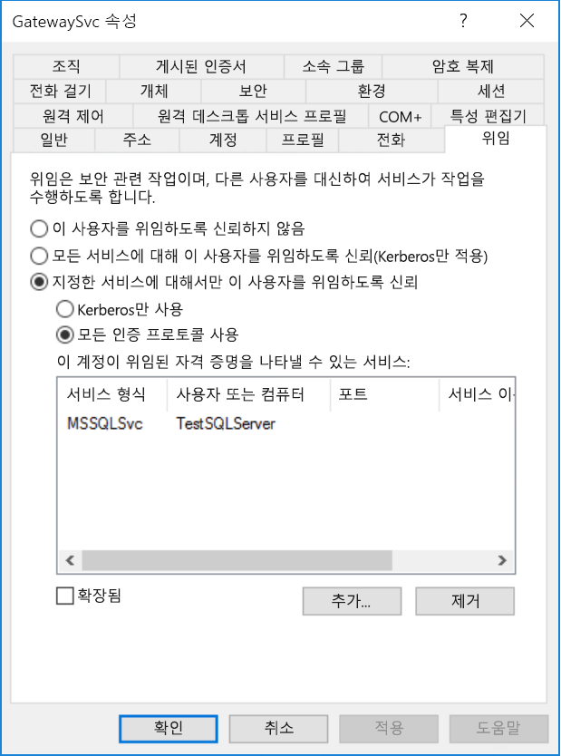

마지막으로, 게이트웨이 서비스(예에서 **PBIEgwTestGW**)를 실행 중인 컴퓨터에서 게이트웨이 서비스 계정은 로컬 정책 "인증 후 클라이언트 가장"을 부여해야 합니다. 로컬 그룹 정책 편집기(**gpedit**)를 사용하여 이를 수행/확인할 수 있습니다.

1. 게이트웨이 머신에서 *gpedit.msc*를 실행합니다.

1. 다음 그림에 표시된 것처럼 **로컬 컴퓨터 정책 > 컴퓨터 구성 > Windows 설정 > 보안 설정 > 로컬 정책 > 사용자 권한 할당**으로 이동합니다.

    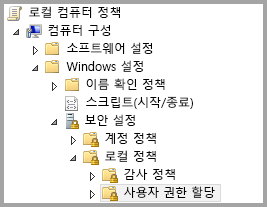

1. **사용자 권한 할당** 아래의 정책 목록에서 **인증 후 클라이언트 가장**을 선택합니다.

    

    **인증 후 클라이언트 가장**에 대해 **속성**을 마우스 오른쪽 단추로 클릭하고 열고 계정의 목록을 확인합니다. 게이트웨이 서비스 계정을 포함해야 합니다(**PBIEgwTest\GatewaySvc**).

1. **사용자 권한 할당** 아래의 정책 목록에서 **운영 체제의 일부로 작동(SeTcbPrivilege)** 을 선택합니다. 게이트웨이 서비스 계정이 계정 목록에도 포함되어 있는지 확인합니다.

1. **온-프레미스 데이터 게이트웨이** 서비스 프로세스를 다시 시작합니다.

SAP HANA를 사용 중인 경우 약간의 성능 개선 효과를 볼 수 있는 다음과 같은 추가 단계를 수행하는 것이 좋습니다.

1. 게이트웨이 설치 디렉터리에서 다음 구성 파일을 찾아서 엽니다. *Microsoft.PowerBI.DataMovement.Pipeline.GatewayCore.dll.config*.

1. *FullDomainResolutionEnabled* 속성을 찾아 값을 *True*로 변경합니다.

    ```xml
    <setting name=" FullDomainResolutionEnabled " serializeAs="String">
          <value>True</value>
    </setting>
    ```

## <a name="running-a-power-bi-report"></a>Power BI 보고서 실행

이 문서의 앞부분에 설명된 모든 구성 단계를 완료한 후 Power BI에서 **게이트웨이 관리** 페이지를 사용하여 데이터 원본을 구성할 수 있습니다. 해당 **고급 설정** 아래에서 SSO를 활성화하고 해당 데이터 원본에 보고서 및 데이터 세트 바인딩을 게시할 수 있습니다.

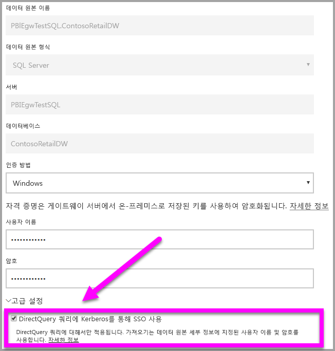

이 구성은 대부분의 경우에서 작동합니다. 그러나 Kerberos를 사용하는 경우 환경에 따라 서로 다른 구성이 있을 수 있습니다. 보고서가 여전히 로드되지 않는 경우 추가 조사를 위해 도메인 관리자에게 문의해야 합니다.

## <a name="switching-the-gateway-to-a-domain-account"></a>도메인 계정으로 게이트웨이 전환

이 문서의 앞부분에서 **온-프레미스 데이터 게이트웨이** 사용자 인터페이스를 사용하여 도메인 계정으로 실행되도록 로컬 서비스 계정에서 게이트웨이 전환을 설명했습니다. 이렇게 하는 데 필요한 단계는 다음과 같습니다.

1. **온-프레미스 데이터 게이트웨이** 구성 도구를 시작합니다.

   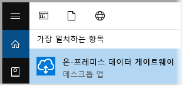

2. 기본 페이지에서 **로그인** 단추를 선택하고 Power BI 계정으로 로그인합니다.

3. 로그인을 완료한 후 **서비스 설정** 탭을 선택합니다.

4. **계정 변경**을 선택하여 다음 이미지에 나와 있는 것처럼 단계별 연습을 시작합니다.

   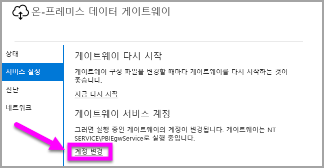

## <a name="configuring-sap-bw-for-sso"></a>SSO용 SAP BW 구성

Kerberos가 게이트웨이에서 어떻게 작동하는지 이해했으므로 SAP BW(SAP Business Warehouse)용 SSO를 구성할 수 있습니다. 다음 단계에서는 이 문서의 앞 부분에서 설명한 것처럼 이미 [Kerberos 제한된 위임이 준비](#preparing-for-kerberos-constrained-delegation)되어 있다고 가정합니다.

이 가이드에서는 가능한 한 포괄적으로 설명하려고 합니다. 이러한 단계 중 일부를 이미 완료한 경우에는 이를 건너뛸 수 있습니다. 예를 들어 BW 서버의 서비스 사용자를 이미 만들고 해당 사용자에게 SPN을 매핑했거나, 이미 gsskrb5 라이브러리를 설치했습니다.

### <a name="setup-gsskrb5-on-client-machines-and-the-bw-server"></a>클라이언트 머신 및 BW 서버에 gsskrb5 설치

게이트웨이를 통해 SSO 연결을 완료하려면 클라이언트 및 서버에서 모두 gsskrb5를 사용 중이어야 합니다. 공용 암호화 라이브러리(sapcrypto)는 현재 지원되지 않습니다.

1. [SAP 노트 2115486](https://launchpad.support.sap.com/)(SAP s-user 필요)에서 gsskrb5/gx64krb5를 다운로드합니다. gsskrb5.dll 및 gx64krb5.dll의 버전이 1.0.11.x 이상인지 확인합니다.

1. 게이트웨이 인스턴스(SAP GUI/로그온을 사용하여 SSO 연결을 테스트하려는 경우 SAP GUI에서도 액세스 가능)에서 액세스할 수 있는 게이트웨이 머신의 특정 위치에 라이브러리를 저장합니다.

1. BW 서버에서 액세스할 수 있는 위치의 BW 서버 머신에 다른 사본을 저장하세요.

1. 클라이언트 및 서버 머신에서 각각 gsskrb5.dll 및 gx64krb5.dll의 위치를 가리키도록 SNC\_LIB 및 SNC\_LIB\_64 환경 변수를 설정합니다.

### <a name="create-a-bw-service-user-and-enable-snc-communication-using-gsskrb5-on-the-bw-server"></a>BW 서비스 사용자를 만들고 BW 서버에서 gsskrb5를 사용하여 SNC 통신을 사용하도록 설정합니다.

이미 완료한 게이트웨이 구성 외에, 몇 가지 추가적인 SAP BW 관련 단계가 있습니다. 이 설명서에서 [**게이트웨이 서비스 계정에서 위임 설정 구성**](#configure-delegation-settings-on-the-gateway-service-account) 섹션은 기본 데이터 원본의 SPN이 이미 구성되어 있다고 가정합니다. SAP BW의 이 구성을 완료하려면

1. Active Directory 도메인 컨트롤러 서버에서 Active Directory 환경의 BW 애플리케이션 서버에 대한 서비스 사용자(처음에는 일반적인 Active Directory 사용자)를 만듭니다. 그런 다음, 여기에 SPN을 할당합니다.

    SAP는 SAP/를 사용하여 SPN을 시작하도록 권장하지만 HTTP/와 같은 다른 접두사를 사용할 수도 있습니다. SAP/ 뒤에는 원하는 것을 지정할 수 있습니다. 한 가지 옵션은 BW 서버의 서비스 사용자 이름을 사용하는 것입니다. 예를 들어 서비스 사용자로 BWServiceUser@\<DOMAIN\>을 만드는 경우 SPN SAP/BWServiceUser를 사용할 수 있습니다. SPN 매핑을 설정하는 한 가지 방법은 setspn 명령입니다. 예를 들어 방금 만든 서비스 사용자에 대한 SPN을 설정하려면 도메인 컨트롤러 머신의 cmd 창에서 `setspn -s SAP/ BWServiceUser DOMAIN\ BWServiceUser`라는 명령을 실행합니다. 자세한 내용은 SAP BW 설명서를 참조하세요.

1. 서비스 사용자에게 BW 애플리케이션 서버에 대한 액세스 권한을 부여합니다.

    1. BW 서버 머신에서 BW 서버의 로컬 관리자 그룹에 서비스 사용자를 추가합니다. 컴퓨터 관리 프로그램을 열고 서버의 로컬 관리자 그룹을 두 번 클릭합니다.

        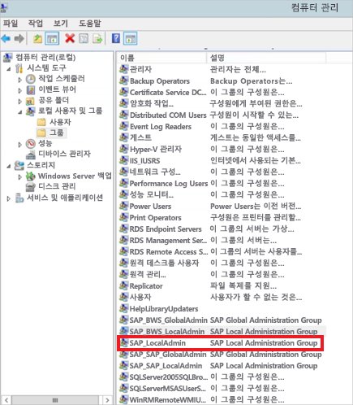

    1. 로컬 관리자 그룹을 두 번 클릭한 다음, **추가**를 선택하여 해당 그룹에 BW 서비스 사용자를 추가합니다. **이름 확인** 단추를 사용하여 이름을 정확하게 입력했는지 확인합니다. **확인**을 선택합니다.

1. BW 서버의 서비스 사용자를 BW 서버 머신에서 BW 서버 서비스를 시작하는 사용자로 설정합니다.

    1. "실행" 프로그램을 열고 "Services.msc"를 입력합니다. BW 애플리케이션 서버 인스턴스에 해당하는 서비스를 찾습니다. 이를 마우스 오른쪽 단추로 클릭하고 **속성**을 선택합니다.

        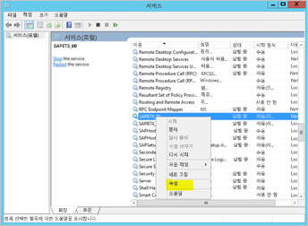

    1. **로그온** 탭으로 전환하고, 위에 지정된 대로 사용자를 BW 서비스 사용자로 변경합니다. 사용자의 암호를 입력하고 **확인**을 선택합니다.

1. SAP GUI/로그온의 서버에 로그인하고 RZ10 트랜잭션을 사용하여 다음 프로필 매개 변수를 설정합니다.

    1. snc/identity/as 프로필 매개 변수를 p:\<자신이 만든 BW 서비스 사용자\>(예: p:BWServiceUser@MYDOMAIN.COM)로 설정합니다. 서비스 사용자의 UPN 앞에 있는 p:을 확인합니다. 공용 암호화 라이브러리가 SNC 라이브러리로 사용될 경우와 같이 p:CN=이 아닙니다.

    1. snc/gssapi\_lib 프로필 매개 변수를o \<서버 머신의 gsskrb5.dll/gx64krb5.dll 경로(OS 비트 수에 따라 사용하는 라이브러리가 달라짐)\>로 설정합니다. 라이브러리는 BW 애플리케이션 서버가 액세스할 수 있는 위치에 보관하는 것을 잊지 마세요.

    1. 또한 다음 추가 프로필 매개 변수를 설정하고 필요에 맞게 값을 변경합니다. 마지막 5개 옵션은 클라이언트가 SNC를 구성하지 않고 SAP 로그온/GUI를 사용하여 BW 서버에 연결할 수 있게 해줍니다.

        | **설정** | **값** |
        | --- | --- |
        | snc/data\_protection/max | 3 |
        | snc/data\_protection/min | 1 |
        | snc/data\_protection/use | 9 |
        | snc/accept\_insecure\_cpic | 1 |
        | snc/accept\_insecure\_gui | 1 |
        | snc/accept\_insecure\_r3int\_rfc | 1 |
        | snc/accept\_insecure\_rfc | 1 |
        | snc/permit\_insecure\_start | 1 |

    1. property snc/enable을 1로 설정합니다.

1. 이러한 프로필 매개 변수를 설정한 후 서버 머신에서 SAP 관리 콘솔을 열고 BW 인스턴스를 다시 시작합니다. 서버가 시작되지 않으면 프로필 매개 변수를 올바르게 설정했는지 다시 확인합니다. 프로필 매개 변수 설정에 자세한 내용은 [SAP 설명서](https://help.sap.com/saphelp_nw70ehp1/helpdata/en/e6/56f466e99a11d1a5b00000e835363f/frameset.htm)를 참조하세요. 또한 문제가 발생할 경우 이 섹션의 뒷부분에서 문제 해결 정보를 참조할 수 있습니다.

### <a name="map-a-bw-user-to-an-active-directory-user"></a>BW 사용자를 Active Directory 사용자에 매핑

SAP BW 애플리케이션 서버 사용자에게 Active Directory 사용자를 매핑하고 SAP GUI/로그온의 SSO 연결을 테스트합니다.

1. SAP GUI/로그온을 사용하여 BW 서버에 로그인합니다. 트랜잭션 SU01을 실행합니다.

1. **사용자**에 SSO 연결을 사용하도록 설정하려는 BW 사용자를 입력합니다(위의 스크린샷에서는 BIUSER의 사용 권한 설정). SAP 로그온 창의 왼쪽 상단 근처에서 **편집** 아이콘(펜 이미지)을 선택합니다.

    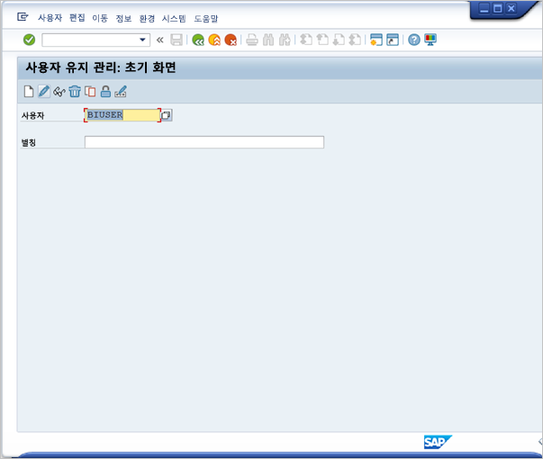

1. **SNC** 탭을 선택합니다. SNC 이름 입력란에 p:\<활성 디렉터리 사용자\>@\<도메인\>을 입력합니다. Active Directory 사용자의 UPN 앞에 와야 하는 p:라는 필수 항목에 유의하세요. 지정된 Active Directory 사용자는 BW 애플리케이션 서버에 대한 SSO 액세스를 허용하려는 개인이나 조직에 속해 있어야 합니다. 예를 들어 [testuser@TESTDOMAIN.COM](mailto:testuser@TESTDOMAIN.COM) 사용자에 대한 SSO 액세스를 허용하려면 p:testuser@TESTDOMAIN.COM을 입력합니다.

    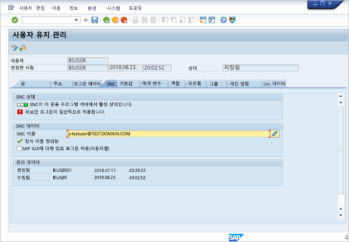

1. 저장 아이콘(화면 왼쪽 상단 모서리 근처 플로피 디스크)을 선택합니다.

### <a name="test-sign-in-using-sso"></a>SSO를 사용하여 로그인 테스트

SAP 로그온/SAP GUI를 사용하여 SSO를 통해 방금 전에 SSO 액세스를 허용한 Active Directory 사용자로 서버에 로그인할 수 있는지 확인합니다.

1. SAP 로그온이 설치된 머신에 *방금 전에 SSO 액세스를 허용한 Active Directory 사용자로* 로그인하고 SAP GUI/로그온을 시작합니다. 새 연결을 만듭니다.

1. **새 시스템 항목 만들기** 창에서 **사용자 지정 시스템**을 선택하고 **다음**을 선택합니다.

    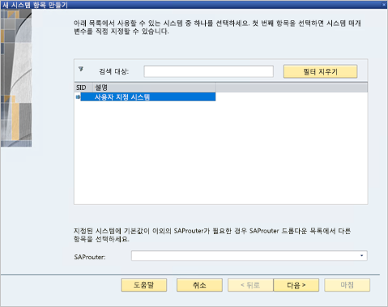

1. 다음 페이지에서 애플리케이션 서버, 인스턴스 번호 및 시스템 ID 등 적절한 세부 정보를 입력한 후 **마침**을 선택합니다.

1. 새 연결을 마우스 오른쪽 단추로 클릭하고 **속성**을 선택합니다. **네트워크** 탭을 선택합니다. **SNC 이름** 창에서 p:\<BW 서비스 사용자의 UPN\>(예: p:BWServiceUser@MYDOMAIN.COM)을 입력한 후 **확인**을 선택합니다.

    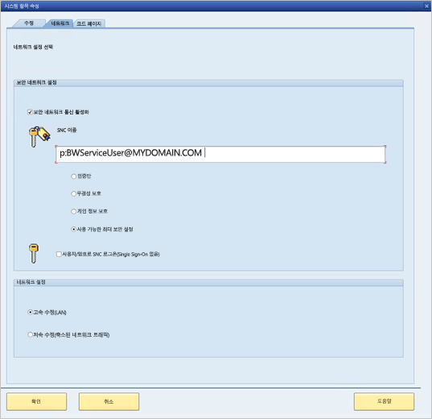

1. 방금 만든 연결을 두 번 클릭하여 BW 서버와의 SSO 연결을 시도합니다. 이 연결에 성공하면 다음 단계를 진행합니다. 또는 이 문서의 이전 단계를 검토하여 올바르게 완료되었는지 확인하거나 아래의 문제 해결 섹션을 검토하세요. 이 컨텍스트에서 SSO를 통해 BW 서버에 연결할 수 없는 경우 게이트웨이 컨텍스트에서 SSO를 사용하여 BW 서버에 연결할 수 없게 됩니다.

### <a name="troubleshoot-installation-and-connections"></a>설치 및 연결 문제 해결

문제가 발생하는 경우 다음 단계를 따라 SAP GUI/로그온에서 gsskrb5 설치 및 SSO 연결 문제를 해결하세요.

1. 서버 로그(서버 머신의 …work\dev\_w0)를 보면 특히 프로필 매개 변수가 변경된 후 BW 서버가 시작되지 않을 경우에 gsskrb5 설정 단계를 완료할 때 발생하는 오류를 해결하는 데 도움이 될 수 있습니다.

1. "로그온 실패"로 인해 BW 서비스를 시작할 수 없는 경우 BW "start-as" 사용자를 설정할 때 잘못된 암호를 제공한 것일 수 있습니다. Active Directory 환경의 머신에 BW 서비스 사용자로 로그인하여 암호를 확인합니다.

1. 서버 시작을 방해하는 SQL 자격 증명 관련 오류가 표시되면 서비스 사용자에게 BW 데이터베이스에 대한 액세스 권한을 부여했는지 확인하세요.

1. "(GSS-API) 지정된 대상을 알 수 없거나 연결할 수 없음": 이는 일반적으로 잘못된 SNC 이름을 지정한 경우에 발생합니다. 클라이언트 애플리케이션에서는 서비스 사용자의 UPN보다는 "p:CN="이 아닌 "p:"만 사용하도록 하세요.

1. "(GSS-API) 잘못된 이름이 지정됨": 서버의 SNC ID 프로필 매개 변수 값에 "p:"가 있는지 확인합니다.

1. "(SNC 오류) 지정된 모듈을 찾을 수 없음": 이는 일반적으로 상승된 권한(관리자 권한)이 있어야 액세스할 수 있는 위치에 gsskrb5.dll/gx64krb5.dll을 보관하는 경우에 발생합니다.

### <a name="add-registry-entries-to-the-gateway-machine"></a>게이트웨이 머신에 레지스트리 항목 추가

게이트웨이가 설치된 머신의 레지스트리에 필요한 레지스트리 항목을 추가합니다.

1. cmd 창에서 다음 명령을 실행합니다.

    1. REG ADD HKLM\SOFTWARE\Wow6432Node\SAP\gsskrb5 /v ForceIniCredOK /t REG\_DWORD /d 1 /f

    1. REG ADD HKLM\SOFTWARE\SAP\gsskrb5 /v ForceIniCredOK /t REG\_DWORD /d 1 /f

### <a name="set-configuration-parameters-on-the-gateway-machine"></a>게이트웨이 머신에서 구성 매개 변수 설정

사용자가 Power BI 서비스에 Azure AD 사용자로 로그인할 수 있도록 Azure AD DirSync를 구성했는지 여부에 따라 구성 매개 변수를 설정하는 두 가지 옵션이 있습니다.

Azure AD DirSync를 구성한 경우에는 다음 단계를 따르세요.

1. 기본 게이트웨이 구성 파일 *Microsoft.PowerBI.DataMovement.Pipeline.GatewayCore.dll*을 엽니다. 기본적으로 이 파일은 *C:\Program Files\On-premises data gateway*에 저장되어 있습니다.

1. **FullDomainResolutionEnabled** 속성이 True로 설정되고 **SapHanaSsoRemoveDomainEnabled**가 False로 설정되었는지 확인합니다.

1. 구성 파일을 저장합니다.

1. 작업 관리자의 서비스 탭을 통해 게이트웨이 서비스 다시 시작(마우스 오른쪽 단추를 클릭하고 다시 시작)

    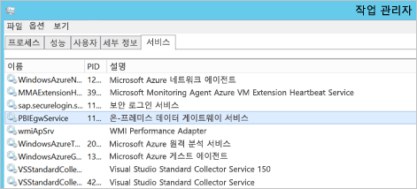

Azure AD DirSync를 구성하지 않은 경우 **Azure AD 사용자에게 매핑하려는 모든 Power BI 서비스 사용자**에 대해 다음 단계를 수행합니다. 이러한 단계는 BW에 로그인할 권한을 가진 Active Directory 사용자에게 Power BI 서비스 사용자를 수동으로 연결합니다.

1. 기본 게이트웨이 구성 파일 Microsoft.PowerBI.DataMovement.Pipeline.GatewayCore.dll을 엽니다. 이 파일은 기본적으로 C:\Program Files\On-premises data gateway에 저장되어 있습니다.

1. **ADUserNameLookupProperty**를 msDS-cloudExtensionAttribute1로 설정하고, **ADUserNameReplacementProperty**를 SAMAccountName으로 설정합니다. 구성 파일을 저장합니다.

1. 작업 관리자의 **서비스** 탭을 통해 게이트웨이 서비스를 다시 시작합니다(마우스 오른쪽 단추를 클릭하고 **다시 시작**).

    

1. BW 사용자에게 매핑한 Active Directory 사용자의 msDS-cloudExtensionAttribute1 속성을 Kerberos SSO를 사용하도록 설정하려는 Power BI 서비스 사용자로 설정합니다. msDS-cloudExtensionAttribute1 속성을 설정하는 한 가지 방법은 Active Directory 사용자 및 컴퓨터 MMC 스냅인을 설정하는 것입니다(다른 방법도 사용 가능).

    1. 도메인 컨트롤러 머신에 관리자 사용자로 로그인합니다.

    1. 스냅인 창에서 **사용자** 폴더를 열고 BW 사용자에게 매핑한 Active Directory 사용자를 두 번 클릭합니다.

    1. **특성 편집기** 탭을 선택합니다.

        이 탭이 보이지 않으면 이를 활성화하는 방법에 대한 지침을 검색하거나 다른 방법을 사용하여 msDS-cloudExtensionAttribute1 속성을 설정해야 합니다. 특성 중 하나를 선택한 다음, 'm' 키를 사용하여 'm'으로 시작되는 Active Directory 속성으로 이동합니다. msDS-cloudExtensionAttribute1 속성을 찾아 두 번 클릭합니다. 그런 다음, Power BI 서비스에 로그인하는 데 사용할 사용자 이름으로 값을 설정합니다(YourUser@YourDomain 형식).

    1. **확인**을 선택합니다.

        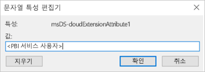

    1. **적용**을 선택합니다. 값 열에 올바른 값이 설정되었는지 확인합니다.

### <a name="add-a-new-bw-application-server-data-source-to-the-power-bi-service"></a>Power BI 서비스에 새 BW 애플리케이션 서버 데이터 원본 추가

게이트웨이에 BW 데이터 원본 추가: 이 문서의 앞부분에 나온 [보고서 실행](#running-a-power-bi-report)에 대한 지침을 따르세요.

1. Power BI Desktop에서 BW 서버에 로그인할 때 입력하는 애플리케이션 서버의 **호스트 이름**, **시스템 번호** 및 **클라이언트 ID**를 데이터 원본 구성 창에 입력합니다. **인증 방법**에 대해서는 **Windows**를 선택합니다.

1. **SNC 파트너 이름** 필드에 p: \<BW 서비스 사용자에 매핑한 SPN\>을 입력합니다. 예를 들어 SPN이 SAP/BWServiceUser@MYDOMAIN.COM인 경우 **SNC 파트너 이름** 필드에 p:SAP/BWServiceUser@MYDOMAIN.COM을 입력해야 합니다.

1. SNC 라이브러리에 SNC\_LIB 또는 SNC\_LIB\_64를 선택합니다.

1. **사용자 이름**과 **암호**는 SSO를 통해 BW 서버에 로그인할 수 있는 권한을 가진 Active Directory 사용자(SU01 트랜잭션을 통해 BW 사용자에게 매핑된 Active Directory 사용자)의 사용자 이름과 암호여야 합니다. 이러한 자격 증명은 **DirectQuery 쿼리에 Kerberos를 통해 SSO 사용** 상자가 선택되지 *않은* 경우에만 사용됩니다.

1. **DirectQuery 쿼리에 Kerberos를 통해 SSO 사용** 상자를 선택하고 **적용**을 선택합니다. 테스트 연결이 실패할 경우 이전의 설정 및 구성 단계가 올바르게 완료되었는지 확인합니다.

    게이트웨이는 항상 입력된 자격 증명을 사용하여 서버와의 테스트 연결을 설정하고, 가져오기 기반 보고서의 예약된 새로 고침을 수행합니다. 게이트웨이는 **DirectQuery 쿼리에 Kerberos를 통해 SSO 사용**이 선택되고 사용자가 직접 쿼리 기반 보고서 또는 데이터 세트에 액세스 중인 경우에만 SSO 연결을 설정하려고 시도합니다.

### <a name="test-your-setup"></a>설정 테스트

Power BI Desktop에서 Power BI 서비스로 DirectQuery 보고서를 게시하여 설정을 테스트합니다. Power BI 서비스에 Azure AD 사용자로 또는 Azure AD 사용자의 msDS-cloudExtensionAttribute1 속성에 매핑한 사용자로 로그인했는지 확인합니다. 설정이 성공적으로 완료된 경우 Power BI 서비스의 게시된 데이터 세트를 기준으로 보고서를 만들고 보고서의 시각적 개체를 통해 데이터를 끌어올 수 있어야 합니다.

### <a name="troubleshooting-gateway-connectivity-issues"></a>게이트웨이 연결 문제 해결

1. 게이트웨이 로그를 확인합니다. 게이트웨이 구성 애플리케이션을 열고 **진단**, **로그 내보내기**를 차례로 선택합니다. 가장 최근의 오류는 표시되는 로그 파일의 맨 아래에 있습니다.

    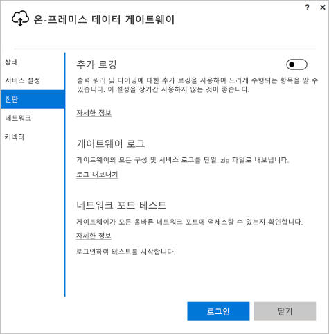

1. BW 추적을 켜고 생성된 로그 파일을 살펴봅니다. 사용할 수 있는 BW 추적은 몇 가지가 있습니다. 자세한 내용은 SAP 설명서를 참조하세요.

## <a name="errors-from-an-insufficient-kerberos-configuration"></a>부족한 Kerberos 구성의 오류

기본 데이터베이스 서버 및 게이트웨이가 **Kerberos 제한된 위임**에 대해 제대로 구성되지 않은 경우 다음 오류 메시지를 받을 수 있습니다.


오류 메시지와 관련된 기술 세부 정보(DM_GWPipeline_Gateway_ServerUnreachable)는 다음과 같이 나타날 수 있습니다.

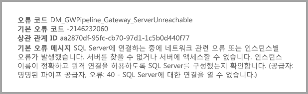

그 결과 게이트웨이는 원래 사용자를 적절하게 가장할 수 없었고, 데이터베이스 연결 시도가 실패했습니다.

## <a name="next-steps"></a>다음 단계

**온-프레미스 데이터 게이트웨이** 및 **DirectQuery**에 대한 자세한 내용은 다음 리소스를 확인하세요.

* [온-프레미스 데이터 게이트웨이](service-gateway-onprem.md)
* [Power BI의 DirectQuery](desktop-directquery-about.md)
* [DirectQuery에서 지원하는 데이터 원본](desktop-directquery-data-sources.md)
* [DirectQuery 및 SAP BW](desktop-directquery-sap-bw.md)
* [DirectQuery 및 SAP HANA](desktop-directquery-sap-hana.md)