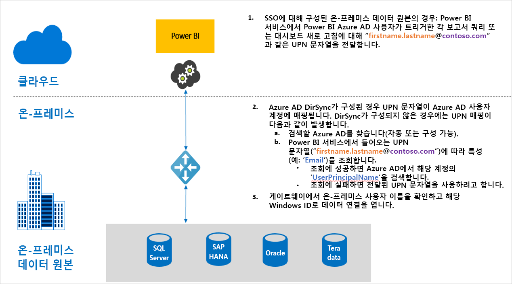

# Power BI의 게이트웨이 SSO(Single Sign-On) 개요

온-프레미스 데이터 게이트웨이를 구성하면 원활한 Single Sign-On 연결을 통해 Power BI 보고서 및 대시보드가 온-프레미스 데이터에서 실시간으로 업데이트되도록 할 수 있습니다. [Kerberos](service-gateway-sso-kerberos.md) 제한 위임 또는 [SAML](service-gateway-sso-saml.md)(Security Assertion Markup Language)을 사용하여 게이트웨이를 구성할 수 있습니다. 온-프레미스 데이터 게이트웨이는 온-프레미스 데이터 원본에 연결되는 [DirectQuery](desktop-directquery-about.md)를 사용하여 SSO 연결을 지원합니다.

Power BI는 다음과 같은 데이터 원본을 지원합니다.

* SQL Server(Kerberos)
* SAP HANA(Kerberos 및 SAML)
* SAP BW 애플리케이션 서버(Kerberos)
* SAP BW 메시지 서버(Kerberos) - 공개 미리 보기
* Oracle(Kerberos) - 공개 미리 보기
* Teradata(Kerberos)
* Spark(Kerberos)
* Impala(Kerberos)

현재 [M 확장](https://github.com/microsoft/DataConnectors/blob/master/docs/m-extensions.md)에서는 SSO가 지원되지 않습니다.

사용자가 Power BI 서비스에서 DirectQuery 보고서를 조작하는 경우 각 교차 필터, 조각, 정렬 및 보고서 편집 작업으로 인해 기본 온-프레미스 데이터 원본에서 라이브로 실행되는 쿼리가 생성될 수 있습니다. 데이터 원본에 대해 SSO가 구성된 경우, 웹 환경이나 Power BI 모바일 앱을 통해 Power BI를 조작하는 사용자의 ID로 쿼리가 실행됩니다. 따라서 각 사용자는 기본 데이터 원본에서 정확히 사용 권한이 있는 데이터만 볼 수 있습니다. Single Sign-On을 구성하면 여러 사용자 간에 공유되는 데이터 캐싱이 없습니다.

## SSO를 실행하는 경우 쿼리 단계

SSO로 실행하는 쿼리는 다음 다이어그램에 나와 있는 것처럼 세 단계로 구성됩니다.

각 단계에 대한 자세한 내용은 다음과 같습니다.

1. ‘Power BI 서비스’에는 구성된 게이트웨이로 쿼리 요청을 보낼 때 현재 Power BI 서비스에 로그인한 사용자의 정규화된 사용자 이름인 ‘UPN(사용자 계정 이름)’을 각 쿼리에 대해 포함합니다. 

2. 게이트웨이는 Azure Active Directory UPN을 로컬 Active Directory ID에 매핑해야 합니다.

   a. Azure AD DirSync(*Azure AD Connect*라고도 함)가 구성된 경우 매핑이 게이트웨이에서 자동으로 적용됩니다.

   b.  구성되지 않은 경우 게이트웨이가 로컬 Active Directory 도메인을 조회하여 Azure AD UPN을 조회 후 로컬 AD 사용자에게 매핑합니다.

3. 게이트웨이 서비스 프로세스는 매핑된 로컬 사용자를 가장하고, 기본 데이터베이스에 대한 연결을 연 다음, 쿼리를 보냅니다. 데이터베이스와 동일한 머신에는 게이트웨이를 설치할 필요가 없습니다.

## 다음 단계

게이트웨이를 통해 SSO를 사용하는 방법의 기본 사항을 이해했으면, 이제 Kerberos 및 SAML에 대한 자세한 내용을 알아보세요.

* [SSO(Single Sign-On) - Kerberos](service-gateway-sso-kerberos.md)
* [SSO(Single Sign-On) - SAML](service-gateway-sso-saml.md)
