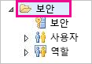
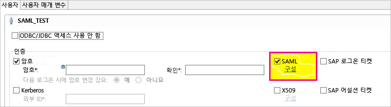
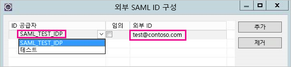
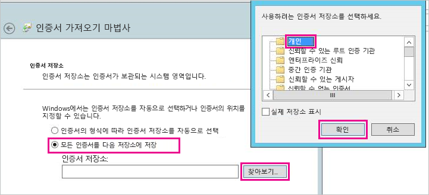
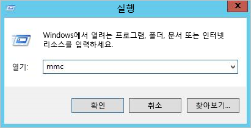
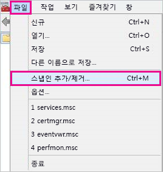
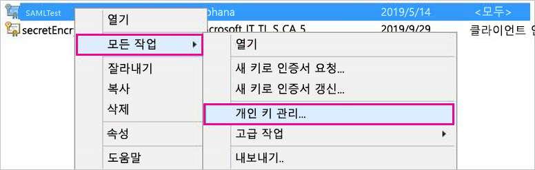
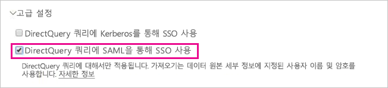

# <a name="use-security-assertion-markup-language-saml-for-single-sign-on-sso-from-power-bi-to-on-premises-data-sources"></a>Power BI에서 온-프레미스 데이터 원본으로 SSO(Single Sign-On)에 SAML(Security Assertion Markup Language)을 사용합니다.

SAML([Security Assertion Markup Language](https://www.onelogin.com/pages/saml))을 사용하여 원활한 Single Sign-On 연결을 구현합니다. SSO를 사용하도록 설정하면 Power BI 보고서 및 대시보드가 온-프레미스 원본의 데이터를 손쉽게 새로 고칠 수 있습니다.

## <a name="supported-data-sources"></a>지원되는 데이터 원본

현재 SAML을 사용하는 SAP HANA가 지원됩니다. SAML을 사용하는 SAP HANA에 Single Sign-On을 설정하고 구성하는 방법에 대한 자세한 내용은 SAP HANA 설명서의 [BI 플랫폼에서 HANA로 SAML SSO 연결](https://wiki.scn.sap.com/wiki/display/SAPHANA/SAML+SSO+for+BI+Platform+to+HANA) 항목을 참조하세요.

[Kerberos](service-gateway-sso-kerberos.md)에 추가 데이터 원본이 지원됩니다.

## <a name="configuring-the-gateway-and-data-source"></a>게이트웨이 및 데이터 원본 구성

SAML을 사용하려면 먼저 SAML ID 공급자의 인증서를 생성한 다음, Power BI 사용자를 ID에 매핑합니다.

1. 인증서를 생성합니다. *일반 이름*을 작성할 때 SAP HANA 서버의 FQDN을 사용하세요. 인증서는 365일 후 만료됩니다.

    ```
    openssl req -newkey rsa:2048 -nodes -keyout samltest.key -x509 -days 365 -out samltest.crt
    ```

1. SAP HANA Studio에서 SAP HANA 서버를 마우스 오른쪽 단추로 클릭한 다음, **보안** > **보안 콘솔 열기** > **SAML ID 공급자** > **OpenSSL 암호화 라이브러리**로 이동합니다.

1. **가져오기**를 선택하고 samltest.crt로 이동하여 가져옵니다.

    

1. SAP HANA Studio에서 **보안** 폴더를 선택합니다.

    

1. **사용자**를 확장한 다음, Power BI 사용자를 매핑하려는 사용자를 선택합니다.

1. **SAML**을 선택한 다음, **구성**을 선택합니다.

    

1. 2단계에서 만든 ID 공급자를 선택합니다. **외부 ID**에 Power BI 사용자의 UPN을 입력한 다음, **추가**를 선택합니다.

    

다음으로, [xmlsec1 도구](http://sgros.blogspot.com/2013/01/signing-xml-document-using-xmlsec1.html)를 사용하여 *SAML 어설션*으로 설정의 유효성을 검사합니다.

1. 아래 어설션을 assertion-template.xml로 저장합니다. \<MyUserId\>를 7단계에서 입력한 Power BI 사용자의 UPN으로 바꿉니다.

    ```xml
    <?xml version="1.0" encoding="UTF-8" ?>
    <saml2:Assertion ID="Assertion12345789" IssueInstant="2015-07-16T04:47:49.858Z" Version="2.0" xmlns:saml2="urn:oasis:names:tc:SAML:2.0:assertion">
      <saml2:Issuer></saml2:Issuer> 
      <Signature xmlns="http://www.w3.org/2000/09/xmldsig#">
        <SignedInfo>
          <CanonicalizationMethod Algorithm="http://www.w3.org/TR/2001/REC-xml-c14n-20010315"/>
          <SignatureMethod Algorithm="http://www.w3.org/2000/09/xmldsig#rsa-sha1"/>
          <Reference URI="">
            <Transforms>
              <Transform Algorithm="http://www.w3.org/2000/09/xmldsig#enveloped-signature"/>
              <Transform Algorithm="http://www.w3.org/2001/10/xml-exc-c14n#"/>
            </Transforms>
            <DigestMethod Algorithm="http://www.w3.org/2000/09/xmldsig#sha1"/>
            <DigestValue />
          </Reference>
        </SignedInfo>
        <SignatureValue />
        <KeyInfo>
          <X509Data />
        </KeyInfo>
      </Signature>
      <saml2:Subject>
        <saml2:NameID Format="urn:oasis:names:tc:SAML:1.1:nameid-format:unspecified"><MyUserId></saml2:NameID>
      </saml2:Subject>
      <saml2:Conditions NotBefore="2010-01-01T00:00:00Z" NotOnOrAfter="2050-01-01T00:00:00Z"/>
    </saml2:Assertion>
    ```

1. 다음 명령을 실행합니다. saltest.key 및 samltest.crt는 1단계에서 생성한 키와 인증서입니다.

    ```
    xmlsec1 --sign --privkey-pem samltest.key, samltest.crt --output signed.xml assertion-template.xml
    ```

1. SAP HANA studio에서 SQL 콘솔 창을 열고 다음 명령을 실행합니다. \<SAMLAssertion\>을 이전 단계의 xml 콘텐츠로 바꿉니다.

    ```SQL
    CONNECT WITH SAML ASSERTION '<SAMLAssertion>'
    ```

쿼리가 성공하면 SAP HANA SAML SSO 설정이 성공적인 것입니다.

인증서와 ID가 성공적으로 구성되었으므로 인증서를 pfx 형식으로 변환하고 인증서를 사용하도록 게이트웨이 머신을 구성합니다.

1. 다음 명령을 실행하여 인증서를 pfx 형식으로 변환합니다.

    ```
    openssl pkcs12 -inkey samltest.key -in samltest.crt -export -out samltest.pfx
    ```

1. 게이트웨이 머신에 pfx 파일을 복사합니다.

    1. samltest.pfx를 두 번 클릭한 다음, **로컬 머신** > **다음**을 선택합니다.

    1. 암호를 입력한 후 **다음**을 선택합니다.

    1. **모든 인증서를 다음 저장소에 저장**, **찾아보기** > **개인** > **확인**을 차례로 선택합니다.

    1. **다음**을 선택한 다음, **마침**을 선택합니다.

    

1. 인증서의 개인 키에 게이트웨이 서비스 계정 액세스 권한을 부여합니다.

    1. 게이트웨이 머신에서 MMC(Microsoft Management Console)를 실행합니다.

        

    1. **파일** 아래에서 **스냅인 추가/제거**를 선택합니다.

        

    1. **인증서** > **추가**를 선택한 후 **컴퓨터 계정** > **다음**을 선택합니다.

    1. **로컬 컴퓨터** > **마침** > **확인**을 선택합니다.

    1. **인증서** > **개인** > **인증서**를 확장하고 인증서를 찾습니다.

    1. 인증서를 마우스 오른쪽 단추로 클릭하고 **모든 작업** > **개인 키 관리**로 이동합니다.

        

    1. 게이트웨이 서비스 계정을 목록에 추가합니다. 기본적으로 이 계정은 **NT SERVICE\PBIEgwService**입니다. **services.msc**를 실행하여 실행 중인 게이트웨이 서비스를 확인하고, **온-프레미스 데이터 게이트웨이 서비스**를 찾을 수 있습니다.

        

마지막으로, 다음 단계를 수행하여 게이트웨이 구성에 인증서 지문을 추가합니다.

1. 다음 PowerShell 명령을 실행하여 머신의 인증서를 나열합니다.

    ```powershell
    Get-ChildItem -path cert:\LocalMachine\My
    ```
1. 만든 인증서의 지문을 복사합니다.

1. 게이트웨이 디렉터리(기본값: C:\Program Files\On-premises data gateway)로 이동합니다.

1. PowerBI.DataMovement.Pipeline.GatewayCore.dll.config를 열고 \*SapHanaSAMLCertThumbprint\* 섹션을 찾습니다. 복사한 지문에 붙여 넣습니다.

1. 게이트웨이 서비스를 다시 시작합니다.

## <a name="running-a-power-bi-report"></a>Power BI 보고서 실행

이제 Power BI에서 **게이트웨이 관리** 페이지를 사용하여 데이터 원본을 구성하고, **고급 설정**에서 SSO를 사용하도록 설정할 수 있습니다. 그런 다음, 해당 데이터 원본에 보고서 및 데이터 집합 바인딩을 게시할 수 있습니다.



## <a name="next-steps"></a>다음 단계

**온-프레미스 데이터 게이트웨이** 및 **DirectQuery**에 대한 자세한 내용은 다음 리소스를 확인하세요.

* [온-프레미스 데이터 게이트웨이](service-gateway-onprem.md)
* [Power BI의 DirectQuery](desktop-directquery-about.md)
* [DirectQuery에서 지원하는 데이터 원본](desktop-directquery-data-sources.md)
* [DirectQuery 및 SAP BW](desktop-directquery-sap-bw.md)
* [DirectQuery 및 SAP HANA](desktop-directquery-sap-hana.md)