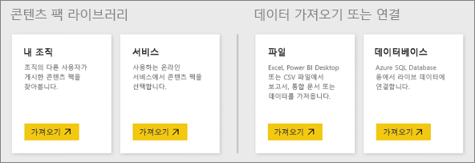

# Power BI 서비스용 데이터 원본
데이터는 Power BI의 핵심입니다. 데이터를 탐색하고 차트 및 대시보드를 만들며 질문 및 답변으로 질문할 때마다 볼 수 있는 모든 해당 시각화 및 답변은 데이터 세트에서 해당하는 기본 데이터를 가져옵니다. 그러나 해당 데이터 세트를 어디서 가져오나요? 데이터 원본에서 가져옵니다.

이 아티클에서는 Power BI 서비스에서 연결할 수 있는 다양한 유형의 데이터 원본을 살펴보겠습니다. 데이터를 가져올 수 있는 다른 많은 유형의 데이터 원본이 있다는 점도 기억합니다. 하지만 이러한 소스는 Power BI Desktop 또는 Excel의 고급 데이터 쿼리와 모델링 기능을 먼저 사용하도록 요구할 수 있습니다. 이에 대해서는 뒷부분에서 자세히 살펴보겠습니다. 지금은 Power BI 서비스 사이트에서 바로 연결할 수 있는 다양한 유형의 데이터 원본을 살펴보겠습니다.

**내 작업 영역** > **데이터 가져오기**를 클릭하여 Power BI의 이러한 데이터 원본에서 데이터를 가져올 수 있습니다.

## 파일

**Excel**(.xlsx, xlxm) – 사용자가 워크시트에 입력한 데이터를 통합 문서에 포함할 수 있다는 점에서 독특하며, 파워 쿼리(Excel 2016에서 가져오기 및 변환) 또는 파워 피벗을 사용하여 외부 데이터 원본에서 데이터를 쿼리하고 로드할 수 있습니다. 워크시트의 테이블에 있는 데이터(데이터가 테이블에 *있어야 함*)를 가져오거나 데이터 모델에 로드된 데이터를 가져올 수 있습니다. 자세한 내용은 [Excel에서 데이터 가져오기](service-get-data-from-files.md)를 참조하세요.

**Power BI Desktop**(.pbix) - Power BI Desktop을 사용하여 외부 데이터 원본에서 데이터를 쿼리하고 로드하며 측정값 및 관계를 사용하여 데이터 모델을 확장하고 보고서를 만들 수 있습니다. Power BI Desktop 파일을 Power BI 사이트로 가져올 수 있습니다. Power BI Desktop은 해당 데이터 원본, 데이터 쿼리 및 변환과 데이터 모델링 개념을 잘 알고 있는 고급 사용자에게 가장 적합합니다. 자세한 내용은 [Power BI Desktop에서 데이터에 연결](desktop-connect-to-data.md)을 참조하세요.

**쉼표로 구분된 값**(.csv) - 파일은 데이터의 행이 있는 간단한 텍스트 파일입니다. 각 행에는 하나 이상의 값이 포함될 수 있고 쉼표로 구분됩니다. 예를 들어 이름 및 주소 데이터가 포함된 .csv에는 이름, 성, 주소, 도시, 상태 등에 대한 값을 가진 많은 행이 있을 수 있습니다. .csv 파일에 데이터를 가져올 수 없지만 Excel과 같은 많은 애플리케이션은 .csv 파일처럼 간단한 테이블 데이터를 저장할 수 있습니다.

XML 테이블(.xml) 또는 텍스트 파일(.txt)과 같은 다른 파일 형식의 경우 가져오기 및 변환을 사용하여 먼저 Excel 또는 Power BI Desktop 파일로 해당 데이터를 쿼리, 변환 및 로드할 수 있습니다. 그런 다음 Excel 또는 Power BI Desktop 파일을 Power BI로 가져올 수 있습니다.

파일을 저장하는 위치가 큰 차이를 가져오기도 합니다. 비즈니스용 OneDrive는 최대한의 유연성 및 Power BI와의 통합을 제공합니다. 로컬 드라이브에 파일을 둔 경우 괜찮지만 데이터를 새로 고쳐야 할 경우 몇 가지 추가 단계가 있습니다. 자세한 내용은 링크된 문서에 제공됩니다.

## 콘텐츠 팩

콘텐츠 팩은 준비해야 하는 데이터 및 보고서를 모두 포함합니다. Power BI에는 두 가지 유형의 콘텐츠 팩이 있습니다. Google 분석, Marketo, 또는 Salesforce와 같은 서비스의 콘텐츠 팩과 조직의 다른 사용자가 생성하고 공유한 콘텐츠 팩입니다.

**서비스** - Power BI용 콘텐츠 팩이 있는 여러 가지 서비스가 있으며 이후에도 계속 추가됩니다. 대부분의 서비스에는 계정이 있어야 합니다. 자세한 내용은 [서비스에 연결](service-connect-to-services.md)을 참조하세요.

**조직** - 사용자 및 조직의 다른 사용자가 Power BI Pro 계정을 갖는 경우 콘텐츠 팩을 만들고 공유하며 사용할 수 있습니다. 자세한 내용은 [조직 콘텐츠 팩](service-organizational-content-pack-introduction.md)을 참조하세요.

## 데이터베이스

**클라우드의 데이터베이스** - Power BI 서비스에서 DirectQuery를 사용하여 Azure SQL Database, Azure SQL Data Warehouse, Azure HD Insight의 Spark 및 SQL Server Analysis Services에 라이브로 연결할 수 있습니다. Power BI에서 이러한 데이터베이스에 연결은 라이브입니다. 즉, Azure SQL Database에 연결하고 Power BI에서 보고서를 만들어서 데이터를 탐색하기 시작하는 경우 언제든지 데이터를 조각내거나 시각화에 다른 필드를 추가합니다. 쿼리는 즉시 데이터베이스로 만들어집니다. 자세한 내용은 [Azure 및 Power BI](service-azure-and-power-bi.md)를 참조하세요.

**온-프레미스 데이터베이스** - Power BI 서비스에서 SQL Server Analysis Services 테이블 형식 모델 데이터베이스에 직접 연결할 수 있습니다. Power BI 엔터프라이즈 게이트웨이가 필요합니다. 조직의 테이블 형식 모델 데이터베이스에 연결하는 방법을 잘 모르는 경우 관리자 또는 IT 부서에 확인합니다. 자세한 내용은 [Power BI의 SQL Server Analysis 테이블 형식 데이터](sql-server-analysis-services-tabular-data.md)를 참조하세요.

조직에서 다른 유형의 데이터베이스의 경우 먼저 Power BI Desktop 또는 Excel을 사용하여 데이터 모델에 데이터를 연결, 쿼리 및 로드해야 합니다. 그런 다음, 데이터 세트가 만들어진 Power BI에 파일을 가져올 수 있습니다. 예정된 새로 고침을 구성하는 경우 Power BI는 업데이트를 위한 데이터 원본 및 쿼리에 직접 연결하도록 구성한 새로 고침 설정과 함께 파일에서 연결 정보를 사용합니다. 그런 다음, 이러한 업데이트는 Power BI의 데이터 세트에 로드됩니다. 자세한 내용은 [Power BI Desktop에서 데이터에 연결](desktop-connect-to-data.md)을 참조하세요.

## 데이터를 다른 원본에서 가져온 경우 어떻게 되나요?
Power BI와 사용할 수 있는 데이터 원본은 수 백 가지입니다. 하지만 데이터를 가져오는 위치와 관계없이 해당 데이터는 Power BI 서비스에서 보고서 및 대시보드를 만들고 질문 및 답변에 대답하는 경우에 사용할 수 있는 형식이어야 합니다.

일부 데이터 원본에서 데이터는 Google 분석, Twilio와 같은 서비스 공급자의 콘텐츠 팩처럼 Power BI 서비스에 맞는 형식으로 준비되었습니다. SQL Server Analysis Services 테이블 형식 모델 데이터베이스도 준비되었습니다. 또한 Azure SQL Database 및 HDInsight의 Spark와 같은 클라우드의 데이터베이스에 라이브로 연결할 수 있습니다.

다른 경우에 원하는 데이터를 파일에 쿼리하고 로드해야 할 수 있습니다. 예를 들어 조직에 있는 서버의 데이터 웨어하우스 데이터베이스에 물류 데이터가 있다고 가정해 보겠습니다. Power BI 서비스에서 해당 데이터베이스에 직접 연결하여 데이터 탐색을 시작할 수 없습니다(테이블 형식 모델 데이터베이스 제외). 그러나 Power BI Desktop 또는 Excel을 사용하여 데이터 모델에 물류 데이터를 쿼리하고 로드한 다음 파일로 저장할 수 있습니다. 그런 다음, 데이터 세트가 만들어진 Power BI에 해당 파일을 가져올 수 있습니다.

하지만 해당 데이터베이스의 물류 데이터는 매일 변경되는데, Power BI의 내 데이터 세트가 새로 고쳐졌는지 어떻게 확인할 수 있을까?라고 생각할 수 있습니다. Power BI Desktop 또는 Excel 파일에서 연결 정보는 데이터와 함께 데이터 세트로 가져옵니다. 예정된 새로 고침을 구성하거나 데이터 세트에 대한 수동 새로 고침을 수행하면 Power BI는 몇 가지 다른 설정과 함께 데이터 세트에서 연결 정보를 사용하여 데이터베이스에 직접 연결하고 업데이트를 쿼리하며 해당 업데이트를 데이터베이스에 직접 로드합니다. Power BI 게이트웨이는 온-프레미스 서버 및 Power BI 간에 데이터 전송을 보호하기 위해 필요합니다. 보고서 및 대시보드의 시각화는 자동으로 새로 고쳐집니다.

Power BI 서비스에서 바로 데이터 원본에 연결할 수 없다고 해서 Power BI로 해당 데이터를 가져올 수 없는 것은 아닙니다. 몇 가지 단계가 더 걸릴 수 있으며 IT 부서의 도움이 필요할 수 있습니다. 자세히 알아보려면 [Power BI Desktop의 데이터 원본](desktop-data-sources.md)을 참조하세요.

## 자세한 세부 정보
Power BI에서는 데이터 세트와 데이터 원본이라는 용어가 자주 사용됩니다. 동의어처럼 자주 사용되는 이 두 용어는 관련되어 있지만 실제로는 다른 개념입니다.

***데이터 세트***는 연결할 데이터 가져오기를 사용하고 콘텐츠 팩, 파일에서 데이터를 가져오거나 라이브 데이터 원본에 연결할 경우 Power BI에 자동으로 생성됩니다. 데이터 세트는 데이터 원본, 데이터 원본 자격 증명 및 대부분의 경우 데이터 원본에서 복사한 데이터의 하위 세트에 대한 정보를 포함합니다. 많은 경우에 보고서 및 대시보드에 시각화를 만들 때 데이터 세트의 데이터를 봅니다.

***데이터 원본***은 데이터 세트의 데이터를 실제로 가져오는 위치입니다. 예를 들어, Google 분석 또는 QuickBooks 등과 같은 온라인 서비스, Azure SQL Database와 같은 클라우드의 데이터베이스 또는 고유한 조직의 로컬 컴퓨터나 서버에 있는 데이터베이스나 파일입니다.

### 데이터 새로 고침
로컬 드라이브 또는 조직 어딘가의 드라이브에 파일을 저장하는 경우 Power BI에서 데이터 세트를 새로 고치기 위해 Power BI 게이트웨이가 필요할 수 있습니다. 새로 고침이 발생하는 경우 파일이 저장되는 컴퓨터가 켜져 있어야 합니다. 또한 파일을 다시 가져오거나 Excel 또는 Power BI Desktop에서 게시를 사용할 수 있지만 자동화된 프로세스가 아닙니다.

비즈니스용 OneDrive 또는 SharePoint - 팀 사이트에 파일을 저장하고 Power BI에 연결하거나 가져오는 경우 데이터 세트, 보고서 및 대시보드는 항상 최신 상태로 유지됩니다. OneDrive와 Power BI는 모두 클라우드에 있기 때문에 Power BI는 한 시간에 한 번 정도 저장된 파일에 직접 연결하여 업데이트를 확인할 수 있습니다. 업데이트가 있는 경우 데이터 세트 및 시각화는 자동으로 새로 고쳐집니다.

서비스에서 콘텐츠 팩을 자동으로 업데이트합니다. 대부분의 경우 하루에 한 번입니다. 수동으로 새로 고칠 수 있지만 업데이트된 데이터의 표시 여부는 서비스 공급자에 따라 달라집니다. 조직의 다른 사용자가 제공한 콘텐츠 팩은 사용된 데이터 원본 및 콘텐츠 팩을 만든 사용자가 새로 고침을 어떻게 설정했는지에 따라 달라집니다.

Azure SQL Database, Azure SQL Data Warehouse 및 Azure HDInsight의 Spark는 클라우드의 데이터 원본이라는 점에서 고유합니다. 또한 Power BI 서비스가 클라우드에 있기 때문에 Power BI는 DirectQuery를 사용하여 라이브로 연결할 수 있습니다. Power BI에 표시된 항목은 항상 동기화된 상태이고 새로 고침을 설정할 필요가 없습니다.

SQL Server Analysis Services는 Power BI에서 연결하는 경우 클라우드의 Azure 데이터베이스와 마찬가지로 라이브 연결이지만 데이터베이스 자체는 조직의 서버에 위치한다는 점에서 고유합니다. 이러한 유형의 연결에는 일반적으로 IT 부서에서 구성한 Power BI 게이트웨이가 필요합니다.

데이터 새로 고침은 Power BI의 매우 중요한 기능이자, 여기서 다루기에는 너무 구체적입니다. 상세하게 알아보고자 할 경우 [Power BI에서 데이터 새로 고침](refresh-data.md)을 확인하세요.

## 고려 사항 및 제한 사항
Power BI 서비스에 사용되는 모든 데이터 원본에 대해 다음과 같은 고려 사항 및 제한 사항이 적용됩니다. 특정 기능에 적용되는 다른 제한 사항이 있지만 다음 목록은 Power BI 서비스에 전반적으로 적용됩니다.

* **데이터 세트 크기 제한** - Power BI 서비스의 각 데이터 세트는 크기가 1GB로 제한됩니다.
* **행 제한** - 데이터 세트의 최대 행 수(DirectQuery를 사용하지 않는 경우)는 20억 개이며, 이 행 중 3개는 예약되어 있습니다(즉, 사용 가능한 최대 행은 1,999,999,997개임). DirectQuery를 사용하는 경우 최대 행 수는 백만 개입니다.
* **열 제한** - 데이터 세트에 허용되는 최대 열 수는, 데이터 세트의 모든 테이블을 통틀어 16,000개입니다. 이것은 Power BI Desktop에 사용되는 데이터 세트 및 Power BI 서비스에 적용됩니다. Power BI는 데이터 세트에 포함된 테이블당 내부 행 번호 열을 사용합니다. 즉, 최대 열 수는 16,000 빼기 1(데이터 세트에 사용된 각 테이블에 대해)입니다.

