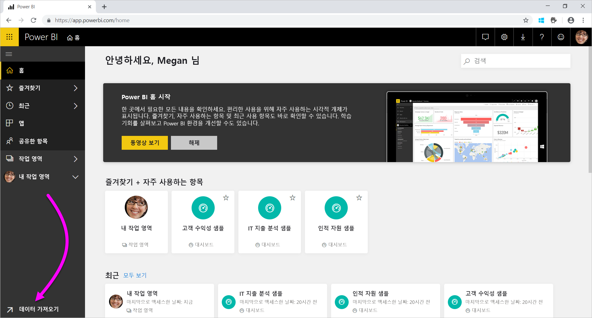
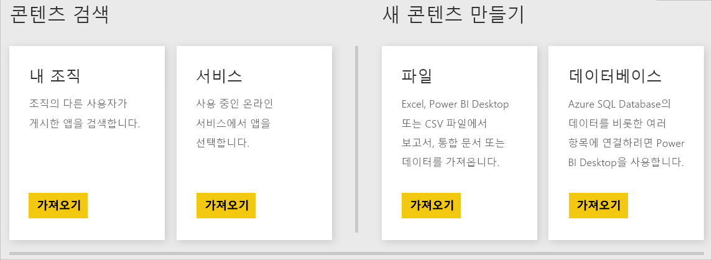
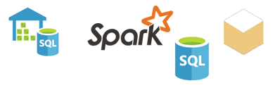

# Power BI 서비스용 데이터 원본
데이터는 Power BI의 핵심입니다. 여러분이 데이터를 탐색하려 한다고 가정해 봅니다. 여러분은 데이터를 탐색하기 위해 차트와 대시보드를 만들거나 **질문 및 답변**을 통해 질문을 합니다. 여러분의 눈에 보이는 시각화 및 답변의 기본 데이터는 데이터 세트에서 가져옵니다. 그러나 해당 데이터 세트를 어디서 가져오나요? 데이터 세트는 데이터 원본에서 가져옵니다.

이 문서에서는 Power BI 서비스에서 연결할 수 있는 데이터 원본 유형을 살펴보겠습니다. 다양한 유형의 데이터 원본에서 데이터를 가져올 수 있습니다. 이러한 데이터 원본을 선택하는 경우 Power BI Desktop 또는 Excel의 고급 데이터 쿼리 및 모델링 기능을 먼저 사용해야 할 수도 있습니다. 이러한 옵션은 뒷부분에서 자세히 살펴보겠습니다. 지금은 Power BI 서비스 사이트에서 바로 사용할 수 있는 다양한 유형의 데이터 원본을 살펴보겠습니다.

페이지의 왼쪽 아래 모서리에서 **데이터 가져오기**를 선택하여 Power BI에서 모든 데이터 원본의 데이터를 가져올 수 있습니다.

 

**데이터 가져오기**를 선택한 후에는 액세스하려는 데이터를 선택할 수 있습니다.

## 콘텐츠 검색

**콘텐츠 검색** 섹션에는 필요한 데이터와 보고서가 이미 준비된 상태로 포함되어 있습니다. Power BI에는 두 가지 유형의 콘텐츠 팩이 있습니다: 조직 및 서비스. 

**조직**: 사용자 그리고 사용자가 속한 조직의 다른 사용자가 Power BI Pro 계정을 갖고 있는 경우 사용자는 콘텐츠 팩을 만들고, 공유하고, 사용할 수 있습니다. 자세한 내용은 [조직 콘텐츠 팩 소개](service-organizational-content-pack-introduction.md)를 참조하세요.

**서비스**: Power BI용 콘텐츠 팩이 포함된 수십 가지 서비스가 있으며, 더 많은 서비스가 계속 추가되고 있습니다. 대부분의 서비스에는 계정이 있어야 합니다. 자세한 내용은 [Power BI를 통해 사용 중인 서비스에 연결](service-connect-to-services.md)을 참조하세요.

## 새 콘텐츠 만들기

**새 콘텐츠 만들기** 섹션에는 콘텐츠를 직접 만들고 가져오는 옵션이 포함되어 있습니다. Power BI에서 사용자 고유의 콘텐츠를 만들거나 가져오는 두 가지 방법이 있습니다. 그것은 바로 파일과 데이터베이스입니다. 

### 파일

**Excel** ( *.xlsx*, *.xlsm*) - Excel의 통합 문서는 여러 데이터 형식을 포함할 수 있습니다. 예를 들어 사용자가 직접 워크시트에 입력한 데이터를 포함할 수 있습니다. 사용자가 파워 쿼리를 사용하여 외부 데이터 원본에서 쿼리하고 로드한 데이터를 포함할 수도 있습니다. 파워 쿼리는 Excel 2016 또는 PowerPivot의 **가져오기 및 변환**을 통해 사용할 수 있습니다. 워크시트의 테이블에서 데이터를 가져오거나 데이터 모델에서 데이터를 가져올 수 있습니다. 자세한 내용은 [Power BI용 파일에서 데이터 가져오기](service-get-data-from-files.md)를 참조하세요.

**Power BI Desktop**( *.pbix*) - Power BI Desktop을 사용하여 외부 데이터 원본에서 데이터를 쿼리 및 로드하고 보고서를 작성할 수 있습니다. 측정값 및 관계를 사용하여 데이터 모델을 확장하거나 Power BI Desktop 파일을 Power BI 사이트로 가져올 수도 있습니다. Power BI Desktop은 고급 사용자에게 적합합니다. 일반적으로 고급 사용자는 자신의 데이터 원본을 잘 이해하고 있습니다. 데이터 쿼리와 변환, 데이터 모델링 개념도 잘 이해하고 있습니다. 자세한 내용은 [Power BI Desktop에서 데이터에 연결](desktop-connect-to-data.md)을 참조하세요.

**쉼표로 구분된 값**( *.csv*) - 파일은 데이터 행이 있는 간단한 텍스트 파일입니다. 각 행은 하나 이상의 값을 포함할 수 있으며 쉼표로 구분됩니다. 예를 들어 이름 및 주소 데이터를 포함하는 *.csv*에는 여러 행이 있을 수 있습니다. 각 행에는 이름, 성, 주소, 도시, 시/도 등에 대한 값이 포함될 수 있습니다. 데이터를 *.csv* 파일로 가져올 수는 없지만, Excel 같은 여러 애플리케이션에서 간단한 테이블 데이터를 *.csv* 파일로 저장할 수 있습니다.

XML 테이블( *.xml*) 또는 텍스트 파일( *.txt*) 같은 기타 유형의 파일은 **가져오기 및 변환**을 사용하여 데이터를 쿼리하고, Excel 또는 Power BI Desktop 파일로 변환하고 로드할 수 있습니다. 그런 다음 Excel 또는 Power BI Desktop 파일을 Power BI로 가져올 수 있습니다.

파일을 저장하는 위치가 큰 차이를 가져오기도 합니다. 비즈니스용 OneDrive는 최대한의 유연성 및 Power BI와의 통합을 제공합니다. 파일을 로컬 드라이브에 보관해도 괜찮습니다. 하지만 데이터를 새로 고쳐야 하는 경우 몇 가지 추가 단계가 있습니다. 자세한 내용은 아래의 문서 링크를 참조하세요.

### 데이터베이스

**클라우드의 데이터베이스** - Power BI 서비스에서는 다음을 실시간으로 연결할 수 있습니다.

* Azure SQL Database
* Azure SQL Data Warehouse
* Azure HDInsight의 Spark

Power BI에서 이러한 데이터베이스에 연결하는 것은 실시간입니다. Azure SQL Database에 연결한다고 가정해 봅시다. 그런 다음, Power BI에서 보고서를 만들어 데이터 탐색을 시작합니다. 데이터를 조각 내거나 시각화에 다른 필드를 추가할 때마다 Power BI는 데이터베이스를 바로 쿼리합니다. 자세한 내용은 [Azure 및 Power BI](service-azure-and-power-bi.md)를 참조하세요.

**온-프레미스 데이터베이스** - Power BI 서비스에서 SQL Server Analysis Services 테이블 형식 모델 데이터베이스에 직접 연결할 수 있습니다. 이렇게 하려면 Power BI Enterprise 게이트웨이가 필요합니다. 조직의 테이블 형식 모델 데이터베이스에 연결하는 방법을 잘 모르는 경우 관리자 또는 IT 부서에 문의합니다. 자세한 내용은 [Power BI의 SQL Server Analysis Services 실시간 데이터](sql-server-analysis-services-tabular-data.md)를 참조하세요.

조직의 다른 데이터베이스 유형의 경우 Power BI Desktop 또는 Excel을 사용하여 데이터 모델에 연결하고, 데이터를 쿼리하고, 데이터 모델에 데이터를 로드해야 합니다. 그런 다음, 데이터 세트가 있는 Power BI로 파일을 가져올 수 있습니다. 예약된 새로 고침을 구성하는 경우 Power BI는 해당 구성 및 파일의 연결 정보를 사용하여 데이터 원본에 직접 연결하고 업데이트를 쿼리합니다. 그런 다음, Power BI는 업데이트를 데이터 세트에 로드합니다. 자세한 내용은 [Power BI Desktop에서 데이터에 연결](desktop-connect-to-data.md)을 참조하세요.

## 데이터를 다른 원본에서 가져온 경우 어떻게 되나요?
Power BI에 사용할 수 있는 수백 가지 데이터 원본이 있습니다. 어디서 데이터를 얻든, 해당 데이터는 Power BI 서비스에서 사용할 수 있는 형식이어야 합니다. Power BI 서비스는 사용 가능한 데이터를 이용하여 보고서 및 대시보드를 만들고, **질문 및 답변**을 통해 질문에 대답합니다.

일부 데이터 원본의 데이터는 이미 Power BI 서비스에 사용할 수 있는 서식입니다. 이러한 원본은 Google Analytics 및 Twilio 같은 서비스 공급 기업의 콘텐츠 팩과 비슷합니다. SQL Server Analysis Services 테이블 형식 모델 데이터베이스도 준비되어 있습니다. 또한 Azure SQL Database 및 HDInsight의 Spark 같은 클라우드의 데이터베이스에 실시간으로 연결할 수 있습니다.

다른 경우에 원하는 데이터를 파일에 쿼리하고 로드해야 할 수 있습니다. 예를 들어 조직에서 물류 데이터를 갖고 있다고 가정해 봅시다. 이 데이터는 서버의 데이터 웨어하우스 데이터베이스에 저장됩니다. 이 데이터베이스가 테이블 형식 모델 데이터베이스가 아닌 이상 Power BI 서비스에서 이 데이터베이스에 연결하여 데이터 탐색을 시작할 수 없습니다. 그러나 Power BI Desktop 또는 Excel을 사용하여 해당 물류 데이터를 쿼리하고 데이터 모델에 로드한 다음, 파일로 저장할 수 있습니다. 그런 다음, 데이터 세트가 있는 Power BI로 해당 파일을 가져올 수 있습니다.

아마도 여러분은 "하지만 해당 데이터베이스의 물류 데이터가 매일 변경되는데, Power BI 데이터 세트를 새로 고치려면 어떻게 해야 하나요?"라고 생각하실 것입니다. 데이터 세트로 데이터를 가져올 때 Power BI Desktop 또는 Excel 파일의 연결 정보까지 가져오게 됩니다.

예약된 새로 고침을 구성하거나 데이터 세트를 수동으로 새로 고친다고 가정해 봅시다. Power BI는 데이터 세트의 연결 정보와 기타 설정 몇 가지를 사용하여 데이터베이스에 직접 연결합니다. 그 후 업데이트를 쿼리하여 해당 업데이트를 데이터 세트로 로드합니다. 덧붙이자면, 온-프레미스 서버와 Power BI 간에 전송되는 데이터를 보호하려면 Power BI 게이트웨이가 필요합니다. 전송이 완료되면 보고서와 대시보드의 모든 시각화가 자동으로 새로 고침됩니다.

Power BI 서비스에서 데이터 원본에 직접 연결할 수 없더라도 해당 데이터를 Power BI로 가져올 수 있습니다. 몇 가지 단계가 더 걸릴 수 있으며 IT 부서의 도움이 필요할 수 있습니다. 자세히 알아보려면 [Power BI Desktop의 데이터 원본](desktop-data-sources.md)을 참조하세요.

## 자세한 세부 정보
Power BI에서는 데이터 세트와 데이터 원본이라는 용어가 자주 사용됩니다. 두 용어는 종종 동의어로 사용됩니다. 두 용어가 서로 관련되어 있기는 하지만, 엄연히 다른 용어입니다.

**데이터 가져오기**를 사용하면 Power BI에서 **데이터 세트**가 자동으로 생성됩니다. **데이터 가져오기**를 사용할 때 콘텐츠 팩에서 데이터에 연결하고 파일을 가져오거나, 실시간 데이터 원본에 연결합니다. 데이터 세트에는 데이터 원본 및 데이터 원본 자격 증명에 대한 정보가 포함됩니다. 데이터 원본에서 복사한 데이터의 하위 세트가 포함되는 경우도 많습니다. 보고서 및 대시보드에서 시각화를 만들 때 데이터 세트의 데이터를 자주 살펴보게 됩니다.

**데이터 원본**은 데이터 세트의 데이터를 가져오는 위치입니다. 예를 들어 다음 위치에서 데이터를 가져올 수 있습니다.

* Google Analytics 또는 QuickBooks 같은 온라인 서비스
* Azure SQL Database 같은 클라우드의 데이터베이스
* 로컬 컴퓨터 또는 조직 내 서버의 데이터베이스 또는 파일

## 데이터 새로 고침
아마도 여러분은 로컬 드라이브 또는 조직 내 어딘가에 있는 드라이브에 파일을 저장할 것입니다. Power BI에서 데이터 세트를 새로 고치려면 Power BI 게이트웨이가 필요할 수 있습니다. 파일을 저장하는 컴퓨터는 새로 고침이 발생할 때 켜져 있어야 합니다. 파일을 다시 가져오거나 Excel 또는 Power BI Desktop의 게시를 사용할 수 있지만, 이러한 옵션은 자동화된 프로세스가 아닙니다.

비즈니스용 OneDrive 또는 SharePoint - 팀 사이트에 파일을 저장하는 경우 해당 파일에 연결하거나 Power BI로 가져올 수 있습니다. 그러면 데이터 세트, 보고서 및 대시보드가 항상 최신 상태로 유지됩니다. OneDrive와 Power BI가 모두 클라우드에 있기 때문에 Power BI는 저장된 파일에 직접 연결할 수 있습니다. Power BI는 한 시간에 한 번 연결하여 업데이트를 확인합니다. 업데이트가 있으면 데이터 세트와 모든 시각화가 자동으로 새로 고침됩니다.

서비스에서 콘텐츠 팩을 자동으로 업데이트합니다. 대부분의 경우 하루에 한 번 업데이트됩니다. 수동으로 새로 고칠 수 있지만, 업데이트된 데이터의 표시 여부는 서비스 공급 기업에 따라 달라집니다. 조직 내 사용자가 콘텐츠 팩을 업데이트하는 방법은 사용된 데이터 원본에 따라 달라집니다. 콘텐츠 팩을 만든 사람이 새로 고침을 구성한 방식에 따라서도 달라집니다.

Azure SQL Database, Azure SQL Data Warehouse 및 Azure HDInsight의 Spark는 클라우드의 데이터 원본입니다. 또한 Power BI 서비스가 클라우드에 있기 때문에 Power BI는 **DirectQuery**를 사용하여 실시간으로 데이터 원본에 연결할 수 있습니다. Power BI에 표시되는 항목은 항상 동기화되며 예약된 새로 고침을 설정할 필요가 없습니다.

Power BI에서 SQL Server Analysis Services에 연결할 때 클라우드의 Azure 데이터베이스와 마찬가지로 실시간으로 연결됩니다. 데이터베이스 자체는 조직 내 서버에 있다는 점이 다릅니다. 이 유형의 연결에는 Power BI 게이트웨이가 필요하며, 이 게이트웨이는 IT 부서에서 구성합니다.

데이터 새로 고침은 Power BI의 매우 중요한 기능이자, 여기서 다루기에는 너무 구체적입니다. 상세하게 알아보고자 할 경우 [Power BI에서 데이터 새로 고침](refresh-data.md)을 확인하세요.

## 고려 사항 및 제한 사항
Power BI 서비스에 사용되는 모든 데이터 원본에는 다음과 같은 제한 사항이 적용됩니다. 특정 기능에 적용되는 다른 제한 사항이 있지만, 다음 목록은 Power BI 서비스 전체에 적용됩니다.

* **데이터 세트 크기 제한** - Power BI 서비스의 공유 용량에 저장되는 데이터 세트는 1GB로 제한됩니다. 더 큰 데이터 세트가 필요한 경우 [Power BI Premium](service-premium-what-is.md)을 사용할 수 있습니다.

* **열에 있는 고유한 값** - Power BI 데이터 세트의 데이터를 캐시할 때('가져오기' 모드라고도 함) 열에 저장할 수 있는 고유한 값의 수는 1,999,999,997로 제한됩니다.

* **행 제한** - **DirectQuery**를 사용하는 경우 Power BI는 기본 데이터 원본으로 전송되는 쿼리 결과에 제한을 적용합니다. 데이터 원본에 전송된 쿼리가 100만개 이상의 행을 반환하는 경우 오류가 표시되고 쿼리가 실패합니다. 하지만 기본 데이터에는 여전히 100만개 이상의 행이 포함될 수 있습니다. 대부분의 보고서는 데이터를 더 작은 결과 집합으로 집계하므로 이러한 제한이 발생할 가능성은 낮습니다.

* **열 제한** - 데이터 세트에 허용되는 최대 열 수는 데이터 세트의 모든 테이블을 통틀어 16,000개입니다. 이 제한은 Power BI 서비스 및 Power BI Desktop에 사용되는 데이터 세트에 적용됩니다. Power BI는 이런 식으로 데이터 세트의 열 및 테이블 수를 추적합니다. 즉, 최대 열 수는 16,000에서 1(데이터 세트의 각 테이블에 사용)을 뺀 값입니다.

