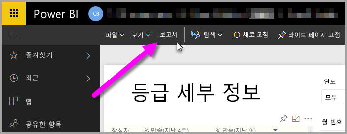
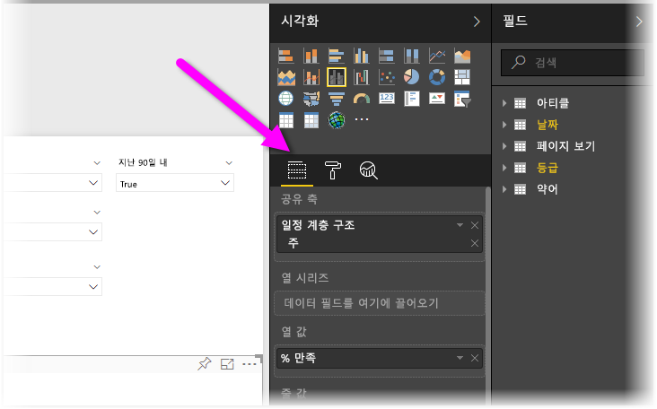
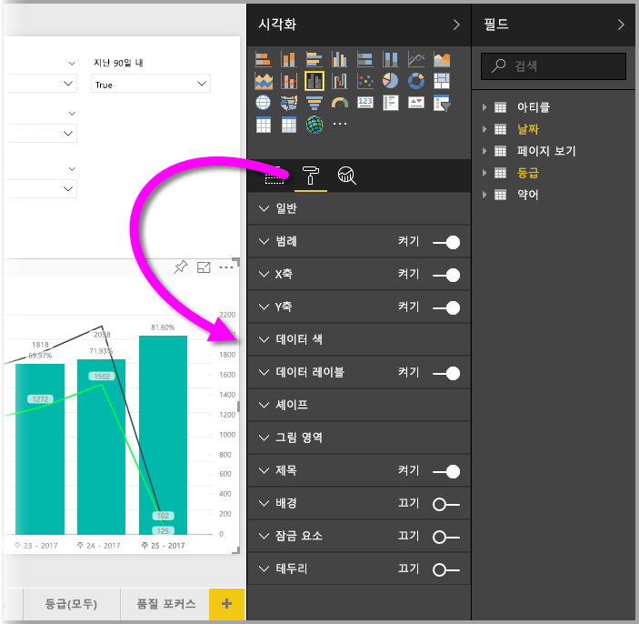
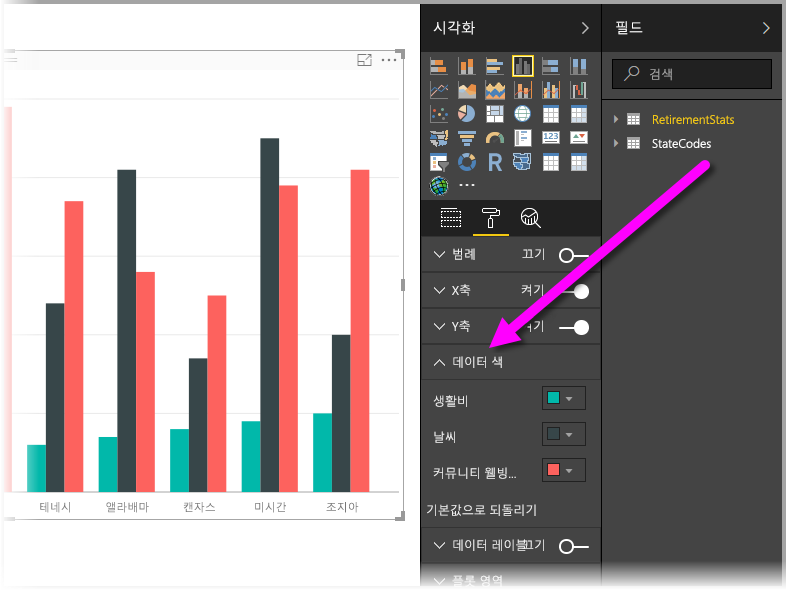
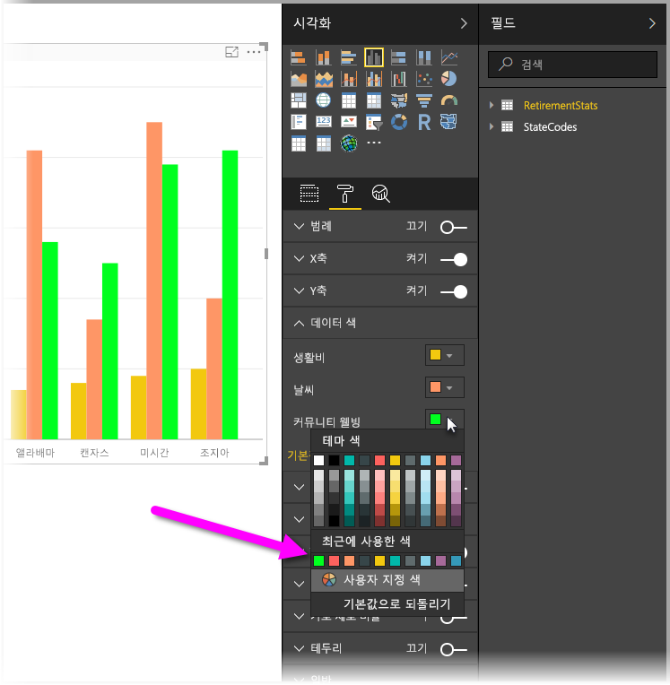
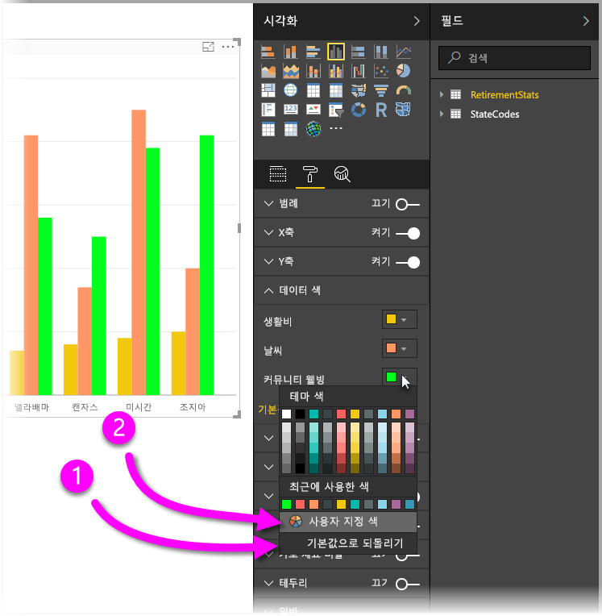
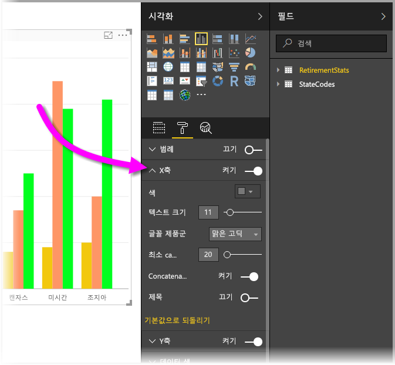

# 색 서식 지정 및 축 속성 시작
**Power BI**에서는 데이터 계열, 데이터 요소 및 시각화의 배경 색까지도 변경할 수 있습니다. x축과 y축의 표시 방법을 변경할 수도 있으며 대시보드 및 보고서가 나타나는 방식을 완전히 제어할 수 있습니다.

시작하려면 **내 작업 영역** 창에서 **보고서** 를 선택합니다. 그런 다음 상단 메뉴 영역에서 **보고서 편집**을 선택합니다.  

보고서를 편집하고 시각화를 선택한 경우 시각화를 추가 또는 변경할 수 있는 **시각화** 창이 나타납니다. 바로 아래에서 사용할 수 있는 시각화는 **필드** 아이콘(막대 모음), **서식** 아이콘(페인트 브러시), **분석** 아이콘(돋보기) 등 세 가지 아이콘입니다. 아래 이미지에서는 **필드** 아이콘을 선택했으며 아이콘 아래 노란색 막대로 표시됩니다.

**서식**을 선택하면 아이콘 아래 영역에 현재 선택한 시각화에 대해 사용할 수 있는 색 및 축 사용자 지정이 표시됩니다.  

각 시각화의 여러 요소를 사용자 지정할 수 있습니다.

* 범례
* X축
* Y축
* 데이터 색
* 데이터 레이블
* 도형
* 그림 영역
* 제목
* 배경
* 잠금 요소
* 테두리

> [!NOTE]
>  
> 각 시각화 유형의 이러한 요소가 모두 표시되지 않습니다. 선택한 시각화에 따라 사용 가능한 사용자 지정이 달라집니다. 예를 들어 원형 차트에는 X축이 없으므로 원형 차트를 선택한 경우 X축이 표시되지 않습니다.
> 
> 

또한 선택한 시각화가 없는 경우 아이콘이 있는 위치에 **필터**가 나타나며 필터를 페이지의 모든 시각화에 적용할 수 있습니다.

두 가지 예제를 살펴보겠습니다. 하나는 색과 관련된 예제이고 다른 하나는 축의 속성 변경과 관련된 예제입니다. 여기에서는 종일 색, 축 및 레이블을 사용자 지정할 준비가 되어야 합니다.

## 색 작업
차트에서 색을 사용자 지정하기 위해 필요한 단계를 살펴보겠습니다.

1. 보고서 캔버스에서 **묶은 세로 막대형 차트** 를 선택합니다.
2. 다음으로 **서식** 아이콘을 선택하여 사용할 수 있는 사용자 지정 항목을 표시합니다.
3. **데이터 색** 사용자 지정 왼쪽에 있는 작은 아래쪽 화살표를 선택합니다. 그러면 선택한 시각화와 관련된 옵션과 함께 데이터 색을 사용자 지정할 수 있는 방법이 표시됩니다.
4. **데이터 색** 을 아래로 확장하면 사용 가능한 사용자 지정이 표시됩니다.  
   

일부를 변경해 보겠습니다. 색 옆에 있는 아래쪽 화살표를 선택하여 사용 가능한 각 데이터 계열에서 변경할 수 있습니다. **주거 비용**은 노란색, **날씨**는 주황색, **커뮤니티 웰빙**은 녹색으로 만들겠습니다. 다음 화면은 **주거 비용**을 변경하는 마지막 단계에서 표시됩니다.  

변경한 내용이 아래 이미지에 표시됩니다. 이제 밝은 차트가 되었습니다. 색 작업에 대해 몇 가지 유용한 요소는 다음과 같습니다. 다음 목록에 있는 숫자는 다음 화면에도 표시되며 이러한 유용한 요소에 액세스하거나 변경할 수 있는 위치를 나타냅니다.

1. 색이 마음에 들지 않나요? 걱정하지 마세요. **기본값으로 되돌리기**를 선택하면 선택 항목이 기본 설정으로 되돌려집니다. 한 가지 색 또는 전체 시각화에 대해 이 작업을 수행할 수 있습니다.
2. 색상표에 없는 색을 원하시나요? **사용자 지정 색**을 선택하고 스펙트럼에서 선택하면 됩니다.  
   

방금 변경한 사항이 마음에 들지 않으세요? 작업을 수행했을 때처럼 **CTRL+Z** 를 사용하여 실행 취소하면 됩니다.

## 축 속성 변경
X축 또는 Y축을 수정하는 것이 유용할 때가 있습니다. 색 작업과 마찬가지로 다음 이미지에 표시된 것처럼 변경할 축 왼쪽에 있는 아래쪽 화살표를 선택하여 축을 수정할 수 있습니다.  

**X축** 옵션을 축소하려면 **X축**옆에 위쪽 화살표 아이콘을 선택하면 됩니다.

**X축**옆에 있는 라디오 단추를 설정/해제하여 X축 레이블을 완전히 제거할 수 있습니다. **제목**옆에 있는 라디오 단추를 선택하여 축 제목을 설정 또는 해제할지 여부를 선택할 수도 있습니다.  

모든 종류의 색을 선택할 수 있으며 Power BI 보고서 및 대시보드에 여러 사용자 지정을 적용할 수 있습니다.

> [!NOTE]
>  
> **서식** 아이콘을 선택하면 사용할 수 있는 이러한 색, 축 및 관련된 사용자 지정 항목을 Power BI Desktop에서도 사용할 수 있습니다.
> 
> 

## 다음 단계
자세한 내용은 다음 아티클을 참조하세요.  

* [Power BI의 색 서식을 위한 팁과 힌트](service-tips-and-tricks-for-color-formatting.md)  

