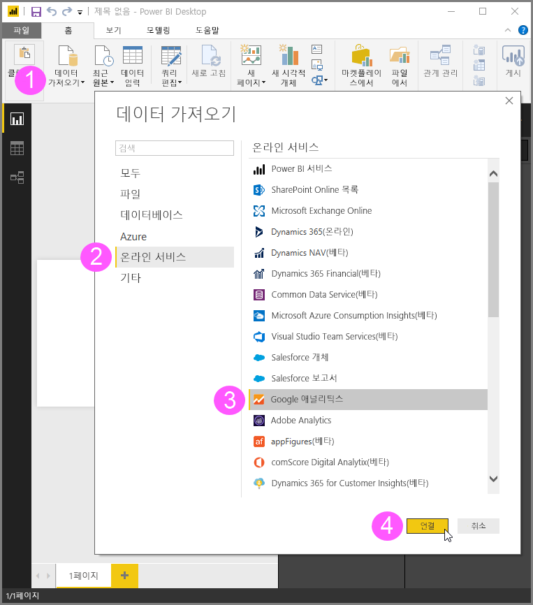
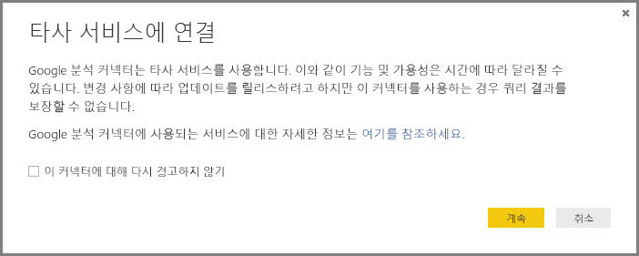
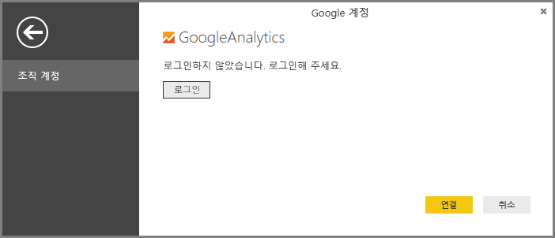
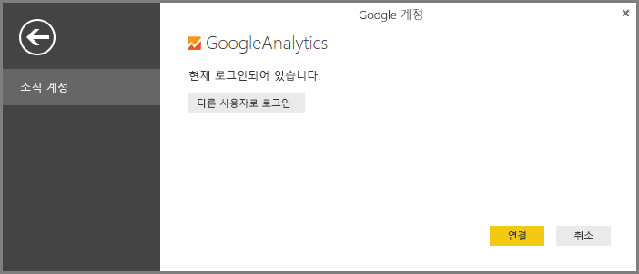
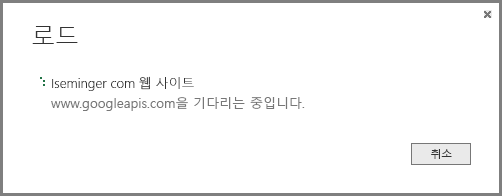

# Power BI Desktop용 Google Analytics 커넥터
> [!NOTE]
> Google Analytics 콘텐츠 팩과 Power BI Desktop의 커넥터는 Google Analytics 핵심 보고 API를 사용합니다. 이와 같이 기능 및 가용성은 시간에 따라 달라질 수 있습니다.
> 
> 

**Google 웹로그 분석** 커넥터를 사용하여 Google 웹로그 분석 데이터에 연결할 수 있습니다. 연결하려면 다음 단계를 따릅니다.

1. **Power BI Desktop**의 **홈** 리본 탭에서 **데이터 가져오기**를 선택합니다.
2. **데이터 가져오기** 창의 왼쪽 창에 있는 범주에서 **온라인 서비스**를 선택합니다.
3. 오른쪽 창의 선택 항목에서 **Google 웹로그 분석** 을 선택합니다.
4. 창 하단에서 **연결**을 선택합니다.  
   

커넥터가 타사 서비스임을 설명하고 시간에 따라 기능 및 가용성이 어떻게 변경될 수 있는지 경고하는 대화 상자와 기타 설명이 표시됩니다.  

**계속**을 선택하면 Google 웹로그 분석에 로그인하라는 메시지가 표시됩니다.  

자격 증명을 입력하면 Power BI의 오프라인 액세스를 원하는지 묻는 메시지가 표시됩니다. 다음은 **Power BI Desktop**을 사용하여 Google 웹로그 분석 데이터에 액세스하는 방법입니다.  

동의하면 **Power BI Desktop**에서 현재 로그인되어 있다고 보여 줍니다.  

**연결**을 선택하면 Google 웹로그 분석 데이터가 **Power BI Desktop**에 연결되고 데이터를 로드합니다.  

## API의 변경 내용
변경 내용에 따라 업데이트 릴리스를 시도하기는 하지만 API로 인해 생성하는 쿼리 결과에 영향을 주는 방식이 변경될 수 있습니다. 특정 쿼리가 더 이상 지원되지 않는 경우도 있습니다. 이 종속성으로 인해 이 커넥터를 사용할 때 쿼리 결과를 보장할 수 없습니다.

Google Analytics API의 변경 내용에 대한 자세한 내용은 해당 [changelog](https://developers.google.com/analytics/devguides/changelog)에서 확인할 수 있습니다.

