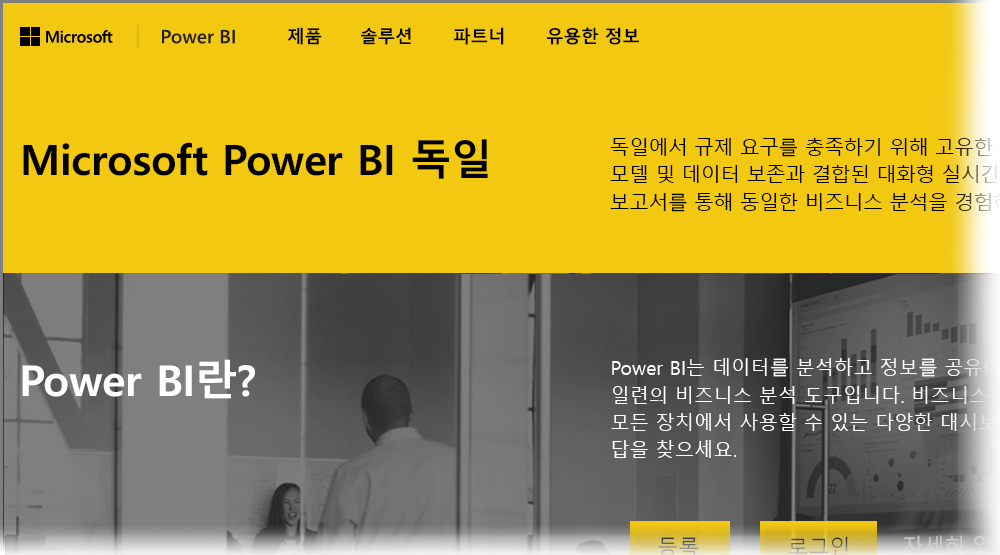

# 독일 클라우드 고객을 위한 Power BI 관련 질문과 대답
**Power BI 서비스**에는 EU/EFTA(유럽 연합/유럽 자유 무역 계약) 고객을 위해 제공되는 버전이 있는데, 주로 MCD(Microsoft Cloud Deutschland)라고 부릅니다. 이 문서에서 설명하는 **Power BI 서비스** 버전은 EU/EFTA 고객과 관련된 것이며 **Power BI 서비스** 상용 버전 또는 정부 고객에게 제공되는 Power BI 서비스와는 별개입니다.

다음의 질문과 대답은 EU/EFTA 고객을 위해 특별히 제공되는 Power BI 서비스 클라우드인 MCD(Microsoft Cloud Deutschland)의 Power BI Pro 서비스에 대한 중요한 정보를 제공합니다.

1. **독일 클라우드용 Power BI 서비스란 무엇입니까?**
   
   MCD(Microsoft Cloud Deutschland)라고도 하는 EU/EFTA 고객용 Power BI 서비스는 독일 데이터 센터에서 제공되는 Power BI 서비스가 포함된 EU/EFTA 규격 클라우드입니다. EU/EFTA 클라우드용 Power BI 서비스의 모든 고객 데이터는 독립적인 독일 데이터 트러스티 역할을 하는 T-Systems와 독일 법의 규제를 받는 데이터에 대한 물리적 액세스 권한 및 논리적 액세스 권한을 사용하여 독일에 저장됩니다. EU/EFTA 클라우드용 Power BI 서비스에는 Power BI 서비스 상용 버전의 별도 계정이 필요합니다. [여기](https://www.microsoft.com/trustcenter/cloudservices/nationalcloud)에서 Microsoft Cloud Deutschland에 대해 자세히 알아보세요.
2. **Power BI 독일 클라우드에 대한 가격 책정 및 등록 정보는 어디에서 확인할 수 있습니까?**
   
   [Power BI 독일 클라우드 홈 페이지](https://powerbi.microsoft.com/power-bi-germany/)에서 가격 책정 정보를 포함한 많은 정보를 찾을 수 있습니다. 이 페이지에서는 또한 25개의 사용자 라이선스가 포함된 **Power BI Pro 서비스** 30일 평가판 등록 링크도 찾을 수 있습니다. 평가판을 등록할 때 필요에 따라 추가 라이선스를 구매하거나 추가할 수 있습니다. 또한 EA(엔터프라이즈 계약), 정부 및 비영리 기관용 가격도 제공합니다. 자세한 내용은 Microsoft 고객 담당자에게 문의하세요.
3. **현재 Azure Germany 및/또는 Office 365 Germany 구독에 독일 클라우드 테넌트가 포함되어 있습니다. 기존 테넌트를 사용하여 Power BI Germany에 등록할 수 있습니까?**
   
   예. 등록 프로세스의 일환으로, 기존 독일 클라우드 테넌트 관리자 계정으로 로그인하고 독일 클라우드에서 기존 테넌트에 Power BI Pro 서비스 라이선스를 추가하는 옵션이 있습니다. 독일 클라우드 테넌트와 사용자 계정은 독일 클라우드용 Power BI 서비스와 다르다는 점을 참고하세요.
4. **독일 클라우드용 Power BI 서비스에 무료 서비스가 있습니까?**
   
   아니요. 독일 클라우드용 Power BI 서비스에는 무료 라이선스 버전이 제공되지 않습니다. 그러나 Power BI 무료 솔루션으로 비즈니스 요구 사항이 충족된다면 [공용 클라우드의 무료 Power BI 솔루션](https://powerbi.microsoft.com/get-started/)에 등록하는 것이 좋습니다.
5. **독일 클라우드용 Power BI 서비스에 Power BI Desktop, Power BI Mobile, 온-프레미스 데이터 게이트웨이 및 Publisher for Excel을 사용할 수 있나요?**
   
   예. Power BI 클라이언트 제품은 독일 클라우드용 Power BI 서비스와 원활하게 작동하도록 업데이트되었습니다. 독일 클라우드용 Power BI 서비스에서 동일한 클라이언트 제품의 사용을 시작하려면 독일 클라우드용 Power BI 서비스 계정으로 로그인하세요. 다음 위치에서 클라이언트 제품의 최신 버전을 다운로드할 수 있습니다.
   
   * [Power BI Desktop](https://powerbi.microsoft.com/desktop/)
   * [Power BI 모바일](https://powerbi.microsoft.com/mobile/)
   * [온-프레미스 데이터 게이트웨이](https://powerbi.microsoft.com/gateway/)
   * [Power BI Publisher for Excel](https://powerbi.microsoft.com/excel-dashboard-publisher/)
6. **독일 클라우드용 Power BI 서비스의 기능 제한 사항이 있습니까?**
   
   다음 서비스 기능은 현재 독일 클라우드용 Power BI 서비스에서 사용할 수 없습니다.
   
   * 웹에 게시
   * Esri에서 제공하는 ArcGIS 지도
   * Power BI Embedded(별도의 ISV 라이선스 요금, 향후 [Microsoft Azure Germany](https://azure.microsoft.com/overview/clouds/germany/)를 통해 제공 예정)
7. **독일 클라우드용 Power BI 서비스를 내 응용 프로그램에서 사용하고 통합하는 방법에 대한 관련 구성 정보를 어디에서 찾을 수 있습니까?**
   
   [SaaS Embedding 개발자 샘플](https://github.com/Microsoft/PowerBI-Developer-Samples)에 독일 및 기타 Power BI 클라우드 관련 구성 정보가 업데이트되었습니다. **Cloud Configs** 폴더에서 클라우드 관련 구성 끝점에 대한 샘플을 확인하세요. 다음 표에는 독일 클라우드 및 상호 참조를 위한 공용 클라우드용 Power BI 서비스의 다양한 구성 끝점이 나와 있습니다.

| **끝점 이름 및/또는 사용법** | **독일 클라우드용 Power BI 서비스 URL** | **공용 클라우드의 해당 URL(상호 참조용)** |
| --- | --- | --- |
| 홈 페이지, 등록 및 로그인 |[https://powerbi.microsoft.com/power-bi-germany/](https://powerbi.microsoft.com/power-bi-germany/) |[https://powerbi.microsoft.com/](https://powerbi.microsoft.com/) |
| Power BI 서비스 직접 로그인 |[https://app.powerbi.de/?noSignUpCheck=1](https://app.powerbi.de/?noSignUpCheck=1) |[https://app.powerbi.com/?noSignUpCheck=1](https://app.powerbi.com/?noSignUpCheck=1) |
| 서비스 API |[https://api.powerbi.de/](https://api.powerbi.de/) |[https://api.powerbi.com/](https://api.powerbi.com/) |
| 관리자의 사용자 라이선스 관리, 서비스 상태 및 지원 요청을 위한 Office 포털 |[https://portal.office.de/](https://portal.office.de/) |[https://portal.office.com/](https://portal.office.com/) |
| AAD 인증 기관 URI |[https://login.microsoftonline.de/common/oauth2/authorize/](https://login.microsoftonline.de/common/oauth2/authorize/) |[https://login.microsoftonline.com/common/oauth2/authorize/](https://login.microsoftonline.com/common/oauth2/authorize/) |
| Power BI 서비스 리소스 URI |[https://analysis.cloudapi.de/powerbi/api](https://analysis.cloudapi.de/powerbi/api) |[https://analysis.windows.net/powerbi/api](https://analysis.windows.net/powerbi/api) |
| 사용자 지정 시각적 개체 라이브러리 |[https://app.powerbi.de/visuals/](https://app.powerbi.de/visuals/) |[https://app.powerbi.com/visuals/](https://app.powerbi.com/visuals/) |
| Power BI용 응용 프로그램 등록(Embedded용) |[https://app.powerbi.de/apps](https://app.powerbi.de/apps) |[https://app.powerbi.com/apps](https://app.powerbi.com/apps) |
| Azure Portal(Embedded용) |[https://portal.microsoftazure.de/](https://portal.microsoftazure.de/) |[https://portal.azure.com/](https://portal.azure.com/) |
| 커뮤니티 |[https://community.powerbi.com/](https://community.powerbi.com/) |[https://community.powerbi.com/](https://community.powerbi.com/) |

### 다음 단계
Power BI에서는 모든 종류의 작업을 수행할 수 있습니다. 서비스에 등록하는 방법을 보여 주는 문서를 포함하여 자세한 정보 및 학습에 대해서는 다음 리소스를 확인해 보세요.

* [Power BI 단계별 학습](guided-learning/gettingstarted.yml?tutorial-step=1)
* [Power BI 서비스 시작](service-get-started.md)
* [Power BI Desktop이란?](desktop-what-is-desktop.md)

