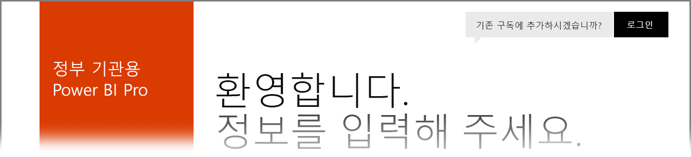

# 미국 정부 기관 고객용 Power BI
**Power BI 서비스**에는 **Office 365 미국 정부 기관 커뮤니티** 구독의 일부로 미국 정부 기관 고객이 사용할 수 있는 버전이 있습니다. 이 문서에서 설명하는 **Power BI 서비스** 버전은 미국 정부 기관 고객을 위해 특별히 설계되었으며 **Power BI 서비스** 상용 버전과는 별개입니다.

다음 섹션에서는 미국 정부 기관 버전의 **Power BI 서비스**에서 사용할 수 있는 기능에 대해 설명하고, 제한 사항 중 일부를 명확히 하고, 자주 묻는 질문(**FAQ**) 및 대답(등록 방법 포함)을 나열하고 자세한 정보에 대한 링크를 제공합니다.

## Power BI 미국 정부 기관의 기능
**Power BI 미국 정부**는 **Pro 라이선스**로만 제공되며 무료 라이선스로는 사용할 수 없습니다. Power BI 서비스의 특정 기능은 서비스의 **Power BI 미국 정부** 버전에서 사용할 수 있습니다.

다음 기능은 **Pro** 기능 라이선스 기능에 적용되므로 **Power BI 미국 정부** 사용자에게 제공됩니다. 

* 대시보드 및 보고서 만들기 및 보기
* [데이터 용량 제한](service-admin-manage-your-data-storage-in-power-bi.md)
* [예약된 데이터 새로 고침](refresh-data.md)
* 새로 고칠 수 있는 팀 대시보드
* 액세스 제어 공유 및 관리를 위한 Active Directory 그룹
* Excel, CSV 및 Power BI Desktop 파일에서 보고서 및 [데이터 가져오기](service-get-data.md)
* 데이터 관리 게이트웨이
* Azure SQL 및 Power BI용 Blob Storage 둘 다에서 모든 데이터 암호화
* [콘텐츠 팩](service-connect-to-services.md)을 사용하여 서비스에 연결

## Power BI 미국 정부 기관의 제한 사항
**Power BI 서비스** 상용 버전에서 사용할 수 있는 기능 중 일부는 미국 정부 기관 고객용 **Power BI 서비스**에서 사용할 수 *없습니다*. 미국 정부 기관 고객이 이러한 기능을 사용할 수 있도록 Power BI 팀에서 적극적으로 노력하고 있으며, 이러한 기능을 사용할 수 있게 되면 이 문서를 업데이트할 것입니다.

* **Power BI 미국 정부**는 **Pro** 라이선스로만 제공됩니다. 관리자 포털(또는 사용자)에서 실행되는 Power BI (무료) 라이선스에 대한 참조는 상용 Power BI 서비스 클라우드에서 실행됩니다.
* **감사** - Office 365 보안 및 규정 준수 포털을 통해 감사를 사용할 수 없습니다.

계정에 **Power BI** 무료 라이선스가 할당된 경우 해당 계정은 **Power BI** 서비스의 상용 버전에서 실행되며 **Power BI 미국 정부** 제품에 속하지 않습니다. 이러한 무료 계정에서 다음 상황이 발생할 수 있습니다.

* 게이트웨이, 모바일 및 데스크톱을 인증할 수 없습니다.
* Azure 상용 데이터 원본에 액세스할 수 없습니다.
* PBIX 파일은 상용 데이터 원본에서 수동으로 업로드해야 합니다.
* Power BI 모바일 앱을 사용할 수 없습니다.

문제를 해결하려면 계정 담당자에게 문의하세요.

## Power BI 서비스 미국 정부 기관 버전에 대한 FAQ(질문과 대답)
서비스에 관해 필요한 정보를 신속하게 얻을 수 있도록 다음과 같은 질문 (및 대답)이 제공됩니다.

**질문:** 상용 **Power BI** 데이터를 미국 정부 기관용 **Power BI 서비스**로 마이그레이션하려면 어떻게 해야 합니까?

**대답:** 관리자가 별도의 미국 정부 기관 특정의 구독 하에 **Power BI**의 새 인스턴스를 만들어야 합니다. 그런 다음 미국 정부 기관용 **Power BI 서비스**에서 상용 데이터를 복제하고, 상용 라이선스를 제거하고, 기존 도메인을 새로운 미국 정부 기관 특정 서비스에 연결하면 됩니다.

**질문:** 특정 콘텐츠 팩에 연결할 수 없는 이유는 무엇입니까?

**대답:** 해당 콘텐츠 팩에 연결하기 전에 구독을 사용하도록 설정되어 있어야 합니다.

**질문:** 미국 정부 기관용 **Power BI**를 가져오는 데 관심이 있습니다. 어떻게 시작할 수 있나요?

**대답:** 등록(종종 온보딩이라고 함)은 기존 라이선스 및 구독에 따라 다를 수 있습니다. 자세한 내용은 [미국 정부 기관용 Power BI 등록](service-govus-signup.md) 문서를 참조하세요.

**질문:** 미국 정부 기관용 **Power BI** 연결을 위한 URL은 상용 **Power BI** URL과 다릅니까?

**대답:** 예, URL이 다릅니다. 다음 표에서는 각각의 URL을 보여 줍니다.

| 상용 버전 URL | 미국 정부 기관 버전 URL |
| --- | --- |
| https://app.powerbi.com/ |[https://app.powerbigov.us](https://app.powerbigov.us) |

## 다음 단계
Power BI에서는 모든 종류의 작업을 수행할 수 있습니다. 서비스에 등록하는 방법을 보여 주는 문서를 포함하여 자세한 정보 및 학습에 대해서는 다음 리소스를 확인해 보세요.

* [미국 정부 기관용 Power BI 등록](service-govus-signup.md)
* <a href="https://channel9.msdn.com/Blogs/Azure/Cognitive-Services-HDInsight-and-Power-BI-on-Azure-Government">Power BI 미국 정부 데모</a>
* [Power BI 단계별 학습](guided-learning/gettingstarted.yml#step-1)
* [Power BI 서비스 시작](service-get-started.md)
* [Power BI Desktop 시작](desktop-getting-started.md)

