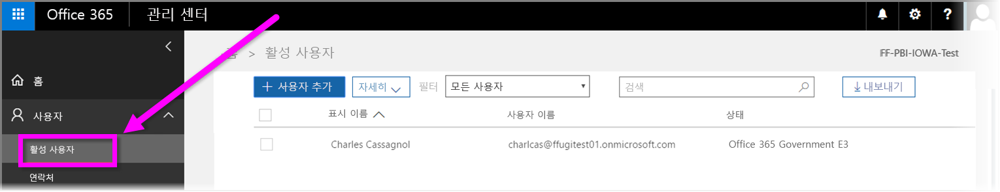

# Power BI 서비스에 미국 정부 기관 등록
**Power BI 서비스**에는 **Office 365 미국 정부 기관 커뮤니티** 구독의 일부로 미국 정부 기관 고객이 사용할 수 있는 버전이 있습니다. 이 문서에서 설명하는 **Power BI 서비스** 버전은 미국 정부 기관 고객을 위해 특별히 설계되었으며 **Power BI 서비스** 상용 버전과는 별개입니다.

미국 정부 기관용 **Power BI 서비스**(기능 및 제한 사항 포함)에 대한 자세한 내용은 [미국 정부 기관 고객용 Power BI - 개요](service-govus-overview.md)를 참조하세요.

> [!NOTE]
> 이 문서는 Power BI를 위해 미국 정부 기관에 등록할 수 있는 권한이 있는 관리자를 위한 것입니다. 최종 사용자인 경우 관리자에게 미국 정부 기관용 Power BI에 대한 구독을 가져오는 방법에 대해 문의하세요.
> 
> 

## 미국 정부 기관에 적합한 등록 프로세스 선택
미국 정부 기관에서 **Office 정부 클라우드**를 처음 사용하거나 구독이 이미 있을 수 있습니다. 다음 섹션에서는 Office 정부 클라우드 및 Power BI를 사용하는 위치에 따른 등록 단계를 자세히 설명하며, 이 단계는 기존 구독에 따라 다릅니다.

Power BI 미국 정부에 로그인한 후에 영업 또는 지원 담당자가 등록 프로세스를 완료하기 전까지 몇 가지 기능이 작동하지 않을 수 있습니다. 이러한 기능에 대해 알아보려면 [미국 정부 고객을 위한 Power BI - 개요](service-govus-overview.md)를 참조하세요. 이러한 기능을 사용하도록 설정하는 등록 프로세스를 완료하려면 영업 또는 지원 담당자에게 문의하세요.

### 새로운 Office 클라우드 고객인 미국 정부 기관
기관이 새로운 **Office 정부 클라우드** 고객인 경우 다음 단계를 수행합니다.

> [!NOTE]
> 포털 관리자가 이러한 단계를 수행해야 합니다.
>

1. [https://products.office.com/en-us/government/office-365-web-services-for-government](https://products.office.com/en-us/government/office-365-web-services-for-government)으로 이동합니다.

>[!NOTE]
>Office 정부 클라우드에 등록하지 않으려는 경우 영업 담당자에게 문의하세요.
>

2. Office 평가판을 Office G3을 선택하고 양식을 작성합니다.
3. Office 클라우드 고객의 경우 "기존 Office 정부 클라우드 고객"에 대한 다음 단계를 계속 진행합니다.

### 기존 Office 정부 클라우드 고객
기관이 기존 **Office 정부 클라우드** 고객이지만 **Power BI** 구독(무료 또는 기타)이 없는 경우 다음 단계를 수행합니다.

> [!NOTE]
> 포털 관리자가 이러한 단계를 수행해야 합니다.
> 
> 

1. 기존 Office 정부 클라우드 계정에 로그인하고 관리 포털로 이동합니다.
2. **청구**를 선택합니다.
3. **서비스 구매**를 선택합니다.
4. Power BI Pro 정부 옵션을 선택하고 **시도** 및 **지금 구입** 사이에 선택합니다.
5. 주문을 완료합니다.
6. 사용자를 계정에 할당합니다.
   
   
7. [https://app.powerbigov.us](https://app.powerbigov.us)에서 미국 정부 기관 고객용 **Power BI 서비스**에 로그인

## 추가 등록 정보
다음은 다양한 라이선스 마이그레이션 사례에서 **Power BI 미국 정부 기관**에 등록하는 것에 대한 자세한 내용입니다.

### 직접 Power BI 평가판에서 Pro 고객으로 온보딩
* Billing > Purchase Service > Power BI Pro Gov를 클릭하여 적용하고 평가판이 아닌 구매를 선택합니다.
* 필수 항목을 입력하고 라이선스를 얻습니다.
* Power BI Pro 평가판을 제거하거나 이전 라이선스를 제거하고 사용자에게 새로 할당합니다.
* [https://app.powerbigov.us](https://app.powerbigov.us)에 로그인

### 대리점 Power BI 평가판에서 Pro 고객으로 온보딩
**Billing > Subscriptions**으로 이동하고 **Power BI Pro for Government** 구독을 선택합니다. 다음이 표시됩니다.

* 사용 가능함
* 할당됨
* 사용자 링크에 할당
* 할당된 평가판이 아직 있는 경우:
  * 평가판 구독 아래에 있는 **할당됨**을 클릭하고 유료로 추가하려는 사용자를 제거합니다.
  * 유료 구독으로 이동하여 해당 사용자를 할당합니다.

### 허용 목록 작성 지침
*허용 목록 작성*은 Power BI 엔지니어링 팀에서 고객을 상용 클라우드 환경에서 안전한 정부 클라우드 환경으로 이동시키는 데 사용하는 프로세스입니다. 이렇게 하면 미국 정부 클라우드에서 사용할 수 있는 기능이 예상대로 작동하게 됩니다. 미국 정부 **Power BI** 서비스를 처음으로 구입하는 모든 기존(또는 새) 미국 정부 고객은 다음 허용 목록 프로세스를 시작*해야* 합니다. 프로세스는 미국 정부 **Power BI** 서비스를 설치하거나 마이그레이션하기 전에 수행되어야 합니다. 

미국 정부 클라우드에 대한 ‘허용 목록에 테넌트를 추가’하려면 Microsoft 계정 팀에 문의하여 허용 목록 추가를 요청합니다. 관리자만 이 요청을 수행할 수 있습니다. *허용 목록에 추가*하는 프로세스는 약 3주 정도 소요되며 이 기간 중에 Power BI 엔지니어링 팀에서 테넌트가 미국 정부 클라우드에서 올바르게 작동하도록 적합한 변경을 수행하게 됩니다.

Power BI **무료** 라이선스에서 **Power BI 미국 정부**로 마이그레이션하는 고객(및 이 문서의 앞 부분에서 설명한 대로 정의에 따라 관련 **Pro** 라이선스 기능으로 마이그레이션)은 Power BI의 엔지니어링 팀에서 해당 테넌트를 *허용 목록에 추가*할 때까지 이 문서의 다음 섹션에서 설명한 문제가 발생하게 됩니다.

### 미국 정부 테넌트에 무료 및 Pro 라이선스 혼합
테넌트에 무료 및 미국 정부 Pro 라이선스가 모두 있는 경우 무료 및 (미국 정부) Pro 라이선스가 모두 그대로 유지되지만 한 라이선스 유형은 제대로 작동하지 않습니다. 테넌트가 *허용 목록 작성* 프로세스를 모두 마친 뒤 다음 상황이 발생합니다.

* 모든 무료 라이선스 사용자가 더 이상 **Power BI Desktop**을 사용하여 Power BI에 로그인할 수 없고 다음 섹션에서 설명한 기능 차이가 발생하게 됩니다.
* 미국 정부 Pro 라이선스에 할당된 모든 클라이언트는 게이트웨이, Power BI Desktop 및 모바일 응용 프로그램 사용 등, 예상대로 작동합니다. 

무료와 Pro 라이선스를 미국 정부 테넌트에서 혼합 사용하며 *허용 목록 작성* 프로세스를 마친 경우 다음을 기대할 수 있습니다.

**_허용 목록 작성_** 전에

* 무료 라이선스 사용자가 상용 클라우드에서 실행
* Pro 미국 정부 라이선스가 포털에 표시되고 관리자가 사용자에게 이 라이선스를 할당할 수 있습니다. Pro 미국 정부 사용자의 경우 관리자가 미국 정부 Pro 라이선스를 할당한 뒤 무료 라이선스의 데이터가 사라지지 않습니다. 할당된 사용자는 미국 정부 기관 고객용 Power BI Pro 기능에 액세스할 수 있으나 다음 글머리 기호 목록의 기능은 테넌트가 *허용 목록에 추가*될 때까지 차이가 있습니다. 
  
  * 게이트웨이, 모바일 및 Power BI Desktop을 인증할 수 없습니다.
  * Azure 상용 데이터 원본에 액세스할 수 없습니다.
  * PBIX 파일은 상용 Power BI 서비스에서 수동으로 업로드해야 합니다.
  * Power BI 모바일 앱을 사용할 수 없습니다.

**_허용 목록 작성_** 후에

* 상용 Power BI 서비스에서 실행하는 무료 사용자는 계속 실행할 수 있지만 예상대로 인증을 수행하지 않습니다.
* 미국 정부 클라우드에서 실행되는 Pro 사용자는 **미국 정부 기관 고객용 Power BI** 서비스를 예상대로 사용할 수 있습니다.

Power BI 무료 라이선스를 실행하는 테넌트의 사용자를 확인하기 위해 관리자는 무료 라이선스 사용자가 **Power BI Standard**로 표시되는 라이선스 보고서를 실행할 수 있습니다.

## 다음 단계
Power BI에서는 모든 종류의 작업을 수행할 수 있습니다. 서비스에 등록하는 방법을 보여 주는 문서를 포함하여 자세한 정보 및 학습에 대해서는 다음 리소스를 확인해 보세요.

* [미국 정부 기관용 Power BI 개요](service-govus-overview.md)
* [Power BI 단계별 학습](guided-learning/gettingstarted.yml?tutorial-step=1)
* [Power BI 서비스 시작](service-get-started.md)
* [Power BI Desktop이란?](desktop-what-is-desktop.md)

