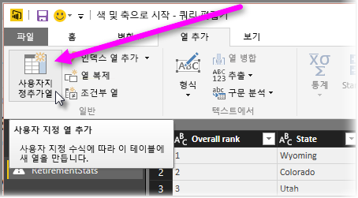

# 히스토그램
Power BI에서 히스토그램을 작성하는 방법은 여러 가지가 있습니다. 가장 간단한 작업부터 시작합니다.

## 간단한 히스토그램
시작하려면 히스토그램을 만들려는 필드가 포함된 쿼리를 결정합니다.  쿼리에 대한 *참조* 옵션을 사용하여 새 쿼리를 만들고 이름을 FieldName 히스토그램으로 지정합니다. **변환** 리본에서 **그룹화 기준** 옵션을 사용하고 **행 수** 집계를 선택합니다. 결과 집계 열의 데이터 형식이 숫자인지 확인합니다. 그런 다음 보고서 페이지에서 이 데이터를 시각화할 수 있습니다. 이 방법은 만들기 쉽고 빠르지만 데이터 요소가 많고 시각적 개체에 브러시가 허용되지 않는 경우 잘 작동하지 않습니다.

## 히스토그램을 작성할 버킷을 정의합니다.
히스토그램을 만들려는 필드가 포함된 쿼리를 결정합니다. 쿼리에 대한 *참조* 옵션을 사용하여 새 쿼리를 만들고 이름을 FieldName으로 지정합니다.  이제 규칙을 사용하여 버킷을 정의합니다. **열 추가** 리본에서 **사용자 지정 열 추가** 옵션을 사용하여 사용자 지정 규칙을 만듭니다.

결과 집계 열의 데이터 형식이 숫자인지 확인합니다. 이제 문서 앞에 있는 **간단한 히스토그램** 에 설명된 그룹화 기준 기술을 사용하여 히스토그램을 만들 수 있습니다. 이 옵션은 더 많은 데이터 요소를 처리하지만 여전히 브러시에는 도움이 되지 않습니다.

## 브러시를 지원하는 히스토그램 정의
브러시는 사용자가 한 시각적 개체에서 데이터 요소를 선택하면 보고서 페이지의 다른 시각적 개체가 선택한 데이터 요소와 관련된 데이터 요소를 강조 표시하거나 필터링하도록 시각적 개체가 함께 연결되는 경우에 이루어집니다.  쿼리 시간에 데이터를 조작하므로 테이블 간의 관계를 만들고 히스토그램의 버킷과 관련되는 세부 항목을 알아야 하며 그 반대의 경우에도 마찬가지입니다.

히스토그램을 만들려는 필드가 포함된 쿼리에 대해 *참조* 옵션을 사용하여 프로세스를 시작합니다.  새 쿼리의 이름을 Buckets로 지정합니다.  이 예제에서는 원래 쿼리를 Details라고 부르겠습니다.  이제 히스토그램에 대한 버킷으로 사용할 열을 제외한 모든 열을 제거합니다.  이제 쿼리에서 중복 제거 기능을 사용합니다. 이 기능은 열을 선택한 경우의 오른쪽 클릭 메뉴에 있으므로 나머지 값은 열에서 고유 값입니다. 10진수를 사용하는 경우 먼저 버킷을 정의하여 히스토그램을 만드는 팁을 사용하여 관리 가능한 버킷 집합을 가져올 수 있습니다.  이제 쿼리 미리 보기에 표시된 데이터를 확인합니다. 빈 값이나 null이 표시되는 경우 관계를 만들기 전에 해당 데이터를 수정해야 합니다. "데이터에 null 또는 빈 값이 있는 경우 관계 만들기"를 참조하세요. 이 방법을 사용할 경우 정렬해야 하므로 문제가 될 수 있습니다. 버킷을 제대로 정렬하려면 "정렬 순서: 원하는 순서로 범주 표시"를 참조하세요. 

> [!NOTE]
> 모든 시각적 개체를 만들기 전에 정렬 순서에 대해 생각하는 것이 좋습니다.   
> 
> 

프로세스의 다음 단계는 버킷 열에 있는 *버킷* 쿼리와 *세부 정보* 쿼리 간의 관계를 정의하는 것입니다.  Power BI Desktop의 리본에서 관계 관리 를 클릭합니다.  *버킷* 이 왼쪽 테이블에 있고 *세부 정보* 가 오른쪽 테이블에 있는 관계를 만들고 히스토그램에 사용할 필드를 선택합니다. 

마지막 단계는 히스토그램을 만드는 것입니다. *버킷* 테이블에서 버킷 필드를 끕니다. 결과 세로 막대형 차트에서 기본 필드를 제거합니다.  이제 *세부 정보* 테이블에서 동일한 시각적 개체로 히스토그램 필드를 끌어옵니다. 필드 집합에서 기본 집계를 개수로 변경합니다. 결과는 히스토그램입니다. Details 테이블에서 트리 맵과 같은 다른 시각적 개체를 만드는 경우 트리 맵에서 데이터 요소를 선택하여 히스토그램 강조 표시를 표시하고 전체 데이터 집합의 추세를 기준으로 선택한 데이터 요소에 대한 히스토그램을 표시합니다.

