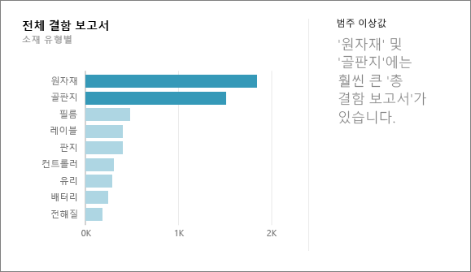
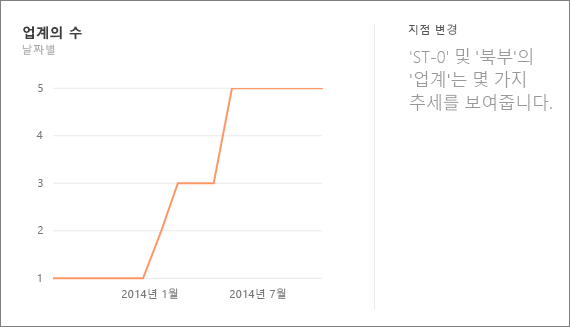
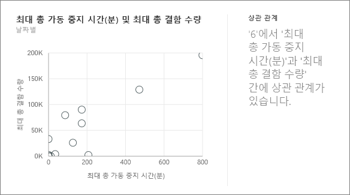
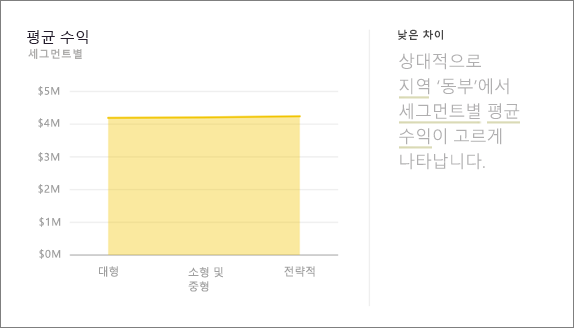
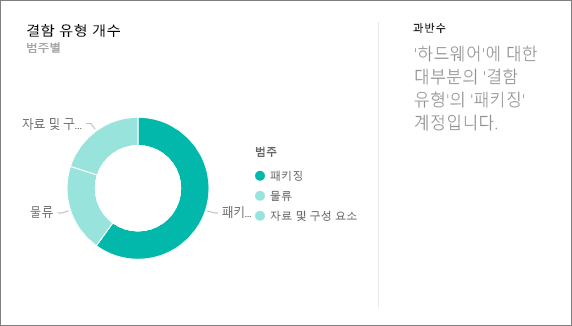
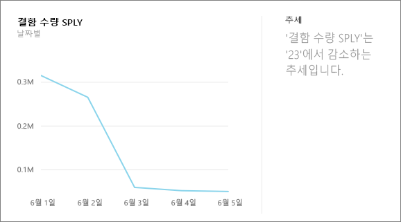
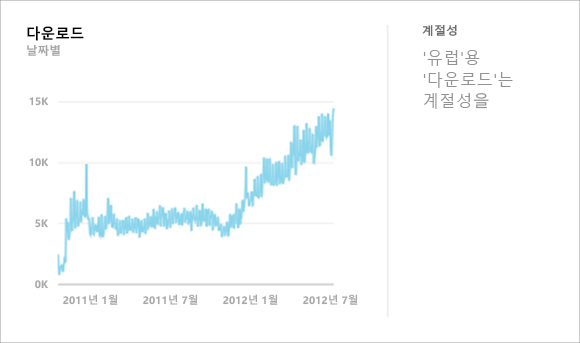
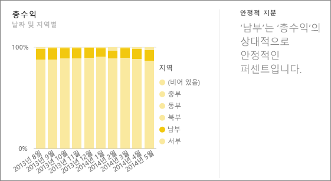
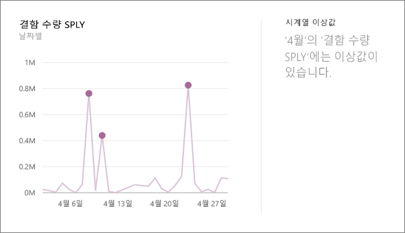

# Power BI에서 지원되는 정보의 유형
## 정보는 어떻게 작동하나요?
Power BI는 흥미로운 정보를 검색하기 위해 복잡한 알고리즘을 적용하는 동시에 데이터 집합의 여러 하위 집합을 신속하게 검색합니다. Power BI는 할당된 시간 내에 가능한 한 많은 데이터 집합을 검색합니다.

데이터 집합 또는 대시보드 타일에 대한 검색을 실행할 수 있습니다.   

## 어떤 유형의 정보를 찾을 수 있나요?
다음은 사용되는 알고리즘 중 일부입니다.

## 범주 이상값(상한/하한)
모델의 측정값에서 하나 또는 두 개의 차원 멤버가 차원의 다른 멤버보다 훨씬 더 큰 값을 가진 경우를 강조 표시합니다.  

## 시계열의 변경 지점
데이터의 시계열 추세에서 중요한 변경 내용이 있는 경우를 강조 표시합니다.

## 상관 관계
데이터 집합의 한 차원에 대해 그릴 때 여러 측정값이 서로 간의 상관 관계를 표시하는 경우를 검색합니다.

## 하위 분산
데이터 요소가 평균에 크게 못 미치는 사례를 검색합니다.

## 과반수(중요한 요인)
다른 차원을 기준으로 분석할 때 전체 값의 과반수가 단일 요인으로 인한 경우를 찾습니다.  

## 시계열의 전반적인 추세
시계열 데이터의 위쪽 또는 아래쪽 추세를 검색합니다.

## 시계열의 계절성
시계열 데이터에서 매주, 매월 또는 매년 계절성과 같은 주기적인 패턴을 찾습니다.

## 안정적 지분
연속 변수에서 부모의 전체 값과 자식 값의 지분 간에 부모-자식 상관 관계가 있는 경우를 강조 표시합니다.

## 시계열 이상값
시계열 데이터에서 값이 다른 날짜/시간 값과 크게 다른 특정 날짜 또는 시간이 있는 경우를 검색합니다.

## 다음 단계
[Power BI 정보](service-insights.md)

데이터 집합의 소유자인 경우 [정보를 위해 최적화](service-insights-optimize.md)

궁금한 점이 더 있나요? [Power BI 커뮤니티를 이용하세요.](http://community.powerbi.com/)

