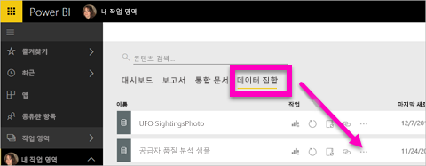
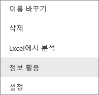
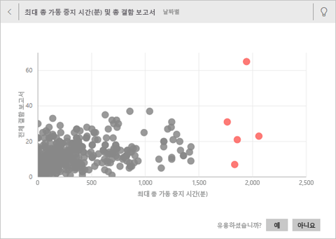
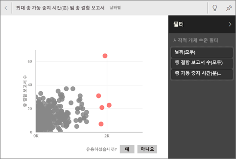
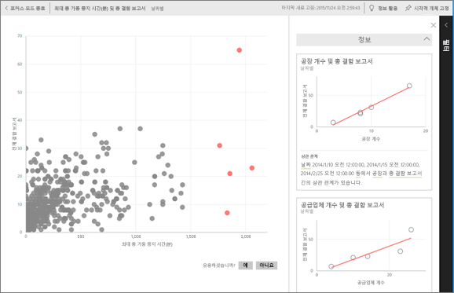
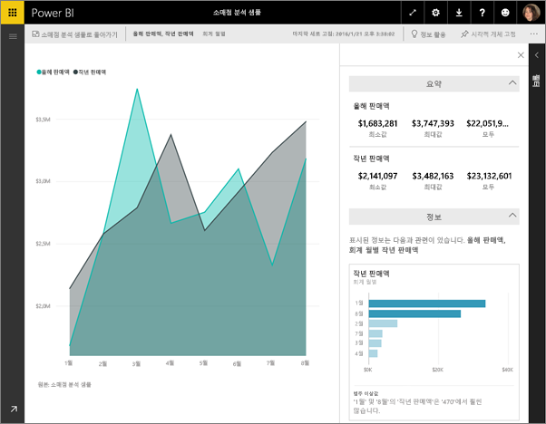

# Power BI를 사용하여 데이터 정보를 자동으로 생성
새 데이터 집합이 있고 어디서 시작해야 할지가 확실하지 않은 경우  빠르게 대시보드를 만들어야 하는 경우  놓쳤을 수 있는 정보를 찾으려는 경우

신속한 정보 활용을 실행하여 데이터를 기준으로 흥미로운 대화형 시각화를 생성합니다. 신속한 정보 활용은 데이터 집합 전체에 대해 실행하거나(신속한 정보 활용) 특정 대시보드 타일에 대해 실행할 수 있습니다(지정된 범위의 신속한 정보 활용). 정보 활용에 대해서도 정보 활용을 실행할 수 있습니다.

> **참고**: 정보 활용은 DirectQuery에서 작동되지 않고 Power BI에 업로드된 데이터에서만 작동합니다.
> 
> 

정보 활용 기능은 Microsoft Research와의 연계를 통해 개발되는 [고급 분석 알고리즘 집합](service-insight-types.md)의 성장을 기반으로 구축됩니다. 당사는 더 많은 사람들이 새롭고 직관적인 방식으로 각자 데이터의 정보를 활용할 수 있도록 하기 위해 노력할 것입니다.

## 데이터 집합에서 신속한 정보 활용 실행
Amanda가 데이터 집합에 대한 신속한 정보 활용을 실행하고, 정보를 포커스 모드에서 열고, 정보 중 하나를 대시보드에 타일로 고정한 다음 대시보드 타일에 대한 정보를 얻는 비디오를 시청하세요.

<iframe width="560" height="315" src="https://www.youtube.com/embed/et_MLSL2sA8" frameborder="0" allowfullscreen></iframe>

이제 여러분 차례입니다. [공급업체 품질 분석 샘플](sample-supplier-quality.md)을 사용하여 정보 활용을 살펴보세요.

1. **데이터 집합** 탭에서 줄임표(...)를 선택하고 **유용한 정보 얻기**를 선택합니다.
   
    
   
    
2. Power BI는 [다양한 알고리즘](service-insight-types.md)을 사용하여 데이터 집합의 추세를 검색합니다.
   
    
3. 몇 초 이내에 정보가 준비됩니다.  **View Insights(정보 보기)**를 선택하여 시각화를 표시합니다.
   
    
   
   > **참고**: 데이터가 통계적으로 중요하지 않기 때문에 일부 데이터 집합은 정보를 생성할 수 없습니다.  자세한 내용은 [정보 활용에 대한 데이터 최적화](service-insights-optimize.md)를 참조하세요.
   > 
   > 
1. 최대 32개의 개별 정보 카드가 있는 특수 **신속한 정보 활용** 캔버스에 시각화가 표시됩니다. 각 카드에는 차트 또는 그래프와 간략한 설명이 있습니다.
   
    

## 정보 활용 카드와 상호 작용
  

1. 시각화를 대시보드에 추가하려면 카드를 마우스로 가리키고 고정 아이콘을 선택합니다.
2. 카드를 마우스로 가리키고 줄임표(...)를 선택한 다음 **View Insights(정보 보기)**를 선택합니다. 이렇게 하면 정보 전체 화면이 열립니다.
   
    
3. 포커스 모드에서는 다음 작업을 수행할 수 있습니다.
   
   * 시각화를 필터링합니다.  필터를 표시하려면 오른쪽 위에 있는 화살표를 선택하여 필터 창을 확대합니다.
     
        
   *  아이콘 또는 **시각적 요소 고정**을 선택하여 대시보드에 정보 활용 카드를 고정합니다.
   * 카드 자체에서 정보 활용을 실행합니다. 이것을 **지정된 범위의 정보 활용**이라고 합니다. 오른쪽 위 모서리에서 전구 모양 아이콘  또는 **정보 활용**을 선택합니다.
     
       
     
     정보 활용이 왼쪽에 표시되고 해당 단일 정보 활용의 데이터에만 기초한 새 카드는 오른쪽에 표시됩니다.
     
       
4. 원래의 정보 활용 캔버스로 돌아가려면 왼쪽 위 모서리에서 **포커스 모드 종료**를 선택합니다.

## 대시보드 타일에서 정보 활용 실행
데이터 집합 전체를 대상으로 인사이트를 검색하기 보다는, 단일 대시보드 타일을 만드는 데 사용된 데이터로 검색 범위를 좁히세요. 이것 또한 **지정된 범위의 정보 활용**이라고 합니다.

1. 대시보드를 엽니다.
2. 타일을 마우스로 가리킵니다. 줄임표(...)를 선택하고 **View insights(정보 보기)**를 선택합니다. 타일이 오른쪽에 표시되는 정보 활용 카드와 함께 [포커스 모드](service-focus-mode.md)로 열립니다.    
   
        
4. 인사이트 하나로 호기심이 자극되나요? 자세히 알아보려면 해당 인사이트 카드를 선택합니다. 선택한 인사이트는 왼쪽에 나타나고 해당 단일 인사이트의 데이터에만 기초한 새 인사이트 카드는 오른쪽에 표시됩니다.    
6. 데이터를 계속 꼼꼼히 살펴보고, 흥미로운 정보가 있으면, 오른쪽 위 모서리에서 **시각적 개체 고정**을 선택하여 대시보드에 고정하세요.

## 다음 단계
데이터 집합의 소유자인 경우 [신속한 정보 활용을 위해 최적화](service-insights-optimize.md)

[사용 가능한 신속한 정보 활용 유형](service-insight-types.md)에 대해 알아보기

궁금한 점이 더 있나요? [Power BI 커뮤니티를 이용하세요.](http://community.powerbi.com/)

