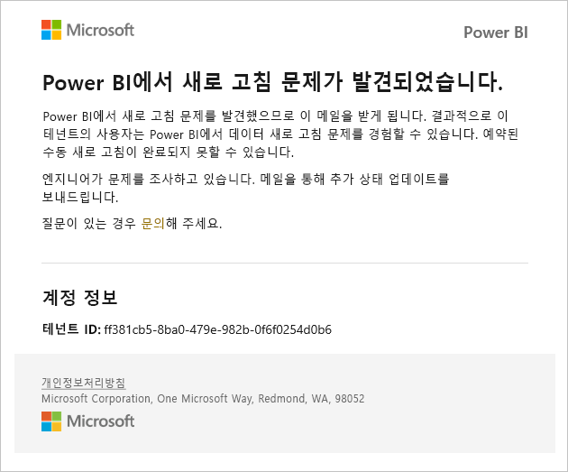
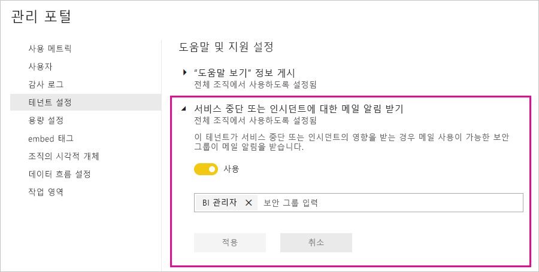

# 서비스 중단 알림

업무상 중요한 비즈니스 애플리케이션에 대한 가용성 인사이트가 있어야 합니다. Power BI는 서비스 중단 또는 성능 저하가 있을 경우 필요에 따라 메일을 받을 수 있도록 인시던트 알림을 제공합니다. Power BI의 99.9% SLA(서비스 수준 약정)에 따라 이와 같은 상황은 거의 발생하지 않지만, Microsoft는 고객에게 최신 정보를 제공하려고 합니다. 다음 스크린샷은 알림을 사용하도록 설정하는 경우 받게 될 메일 유형을 보여 줍니다.

현재 Microsoft는 다음 _안정성 시나리오_에 대한 메일을 보냅니다.

- 보고서 열기 안정성
- 모델 새로 고침 안정성
- 쿼리 새로 고침 안정성

보고서 열기, 데이터 세트 새로 고침, 쿼리 실행 등의 작업에 ‘확장 지연’이 있는 경우 알림이 전송됩니다. 인시던트가 해결되면 후속 메일을 받게 됩니다.

> [!NOTE]
> 이 기능은 현재 Power BI Premium의 전용 용량에만 사용할 수 있습니다. 공유 용량이나 포함된 용량에는 사용할 수 없습니다.

## 알림 사용

Power BI 테넌트 관리자는 관리 포털에서 알림을 사용하도록 설정합니다.

1. 알림을 받아야 하는 메일 사용 보안 그룹을 식별하거나 만듭니다.

1. 관리 포털에서 **테넌트 설정**을 선택합니다. **도움말 및 지원 설정**에서 **서비스 중단 또는 인시던트에 대한 메일 알림 받기**를 확장합니다.

1. 알림을 사용하도록 설정하고, 보안 그룹을 입력한 다음, **적용**을 선택합니다.

    

> [!NOTE]
> Power BI는 계정 no-reply-powerbi@microsoft.com에서 알림을 보냅니다. 알림이 스팸 또는 정크 폴더로 분류되지 않도록 이 계정이 허용 목록에 포함되어 있는지 확인합니다.

## 다음 단계

[Power BI Pro 및 Power BI Premium 지원 옵션](service-support-options.md)

궁금한 점이 더 있나요? [Power BI 커뮤니티를 이용하세요.](http://community.powerbi.com/)
