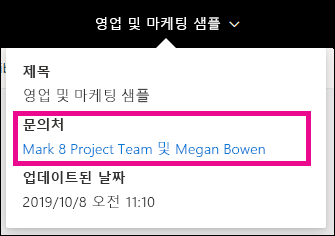
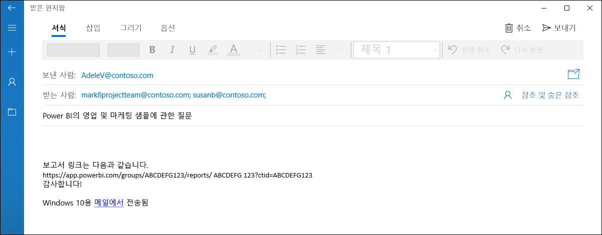
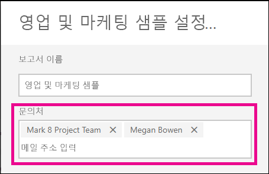
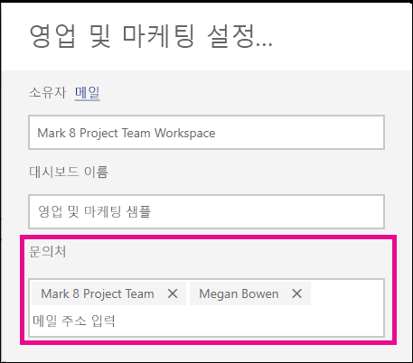

# Power BI 서비스의 보고서 및 대시보드에 대한 연락처 정보 설정
이 문서에서는 Power BI 서비스에서 대시보드 또는 보고서에 대한 연락처 정보를 설정하는 방법을 설명합니다.

> [!NOTE]
> 클래식 또는 새 작업 영역의 항목에 대한 연락처 정보를 설정할 수 있습니다. 내 작업 영역에서는 항목에 대한 연락처 정보를 설정할 수 없습니다. 정보 카드는 [새 디자인](service-new-look.md)에서 보고서 또는 대시보드를 볼 때 표시됩니다.

항목에 대한 연락처에 여러 사용자 또는 그룹을 추가할 수 있습니다. 예:
* 개인
* Office 365 그룹
* 이메일 사용 보안 그룹
* 배포 목록

기본적으로 새 보고서 또는 대시보드를 만드는 사람이 해당 항목에 대한 연락처입니다. 값을 설정하면 기본값을 재정의합니다. 물론 연락처 목록에서 모든 사람 또는 그룹을 제거할 수 있습니다. 클래식 작업 영역에서 이렇게 하면 해당 작업 영역의 Office 365 그룹이 표시됩니다. 새 환경 작업 영역의 경우 [작업 영역 연락처 목록](service-create-the-new-workspaces.md#workspace-contact-list)이 사용 됩니다. 작업 영역 연락처 목록이 설정되지 않은 경우 작업 영역 관리자가 표시됩니다.

연락처 정보는 항목을 보는 사용자에게 표시됩니다. 

 

연락처 목록을 클릭하면 질문을 하거나 도움을 받을 수 있도록 이메일이 생성됩니다. 

 
 
이 연락처 목록 정보는 다른 위치에서도 사용됩니다. 예를 들어 오류 대화 상자의 일부 오류 시나리오에 표시됩니다. 액세스 요청 등 항목과 관련된 자동 이메일 메시지가 연락처 목록으로 전송됩니다. 

> [!NOTE]
> 앱을 게시할 때 개별 항목에 설정되는 연락처 정보는 앱을 게시하거나 업데이트한 사용자로 설정됩니다. 앱 사용자가 필요한 도움을 받을 수 있도록 앱 지원 URL을 설정할 수 있습니다.

## 보고서에 대한 연락처 정보 설정
1. 내 작업 영역에서 **보고서** 탭을 선택합니다.
2. 원하는 보고서를 찾고 **설정** 아이콘을 선택합니다.
3. **연락처** 입력 필드를 찾아 값을 설정합니다.

     

## 대시보드에 대한 연락처 정보 설정
1. 작업 영역에서 **대시보드** 탭을 선택합니다.
2. 원하는 대시보드를 찾고 **설정** 아이콘을 선택합니다.
3. **연락처** 입력 필드를 찾아 값을 설정합니다.

     

## 제한 사항 및 고려 사항
* 연락처는 Power BI 서비스에서 만든 새 항목에 대해 자동으로 설정됩니다. 기존 항목에는 작업 영역 기본값이 표시됩니다.
* 연락처 목록에서 사용자 또는 그룹을 설정할 수 있지만 항목에 대한 권한은 자동으로 부여되지 않습니다. 공유를 사용하거나 역할을 통해 필요한 사용자에게 작업 영역 액세스 권한을 제공합니다. 

## 다음 단계

궁금한 점이 더 있나요? [Power BI 커뮤니티를 이용하세요.](https://community.powerbi.com/)
