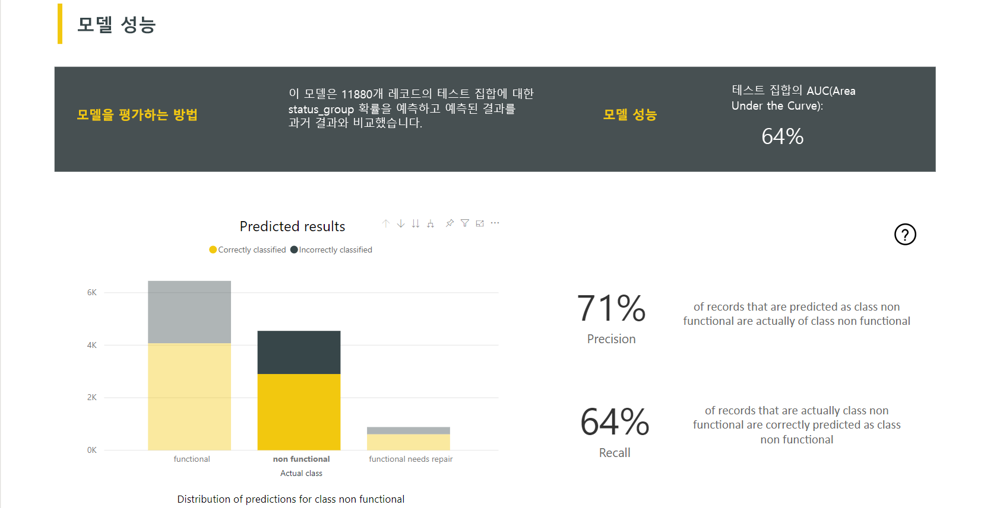
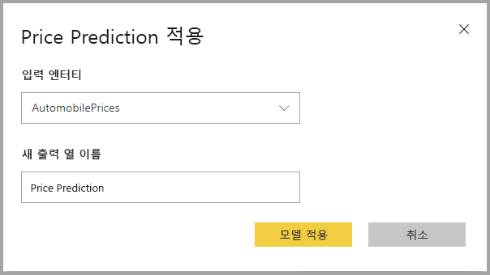

# Power BI의 자동화된 Machine Learning

데이터 흐름의 AutoML(자동화된 Machine Learning)을 사용하면 비즈니스 분석가가 Power BI에서 직접 ML(Machine Learning) 모델을 학습하고, 유효성을 검사하고, 호출할 수 있습니다. 분석가가 데이터 흐름을 사용하여 모델 학습을 위한 입력 데이터를 지정할 수 있는 새로운 ML 모델을 만들기 위한 간단한 환경이 포함되어 있습니다. 서비스는 가장 관련성이 높은 기능을 자동으로 추출하고, 적절한 알고리즘을 선택하며, ML 모델의 유효성을 검사합니다. 모델을 학습한 후에는 Power BI에서 유효성 검사 결과가 포함된 성능 보고서를 자동으로 생성합니다. 그런 다음 데이터 흐름 내의 새 데이터 또는 업데이트된 데이터에 대해 모델을 호출할 수 있습니다.

자동화된 Machine Learning은 Power BI Premium에서 호스트되는 데이터 흐름 및 Embedded 용량에 대해서만 사용할 수 있습니다.

## AutoML 작업

[Power BI 데이터 흐름](service-dataflows-overview.md)은 빅 데이터를 위한 셀프 서비스 데이터 준비를 제공합니다. AutoML은 데이터 흐름에 통합되며, Power BI 내에서 바로 기계 학습 모델을 빌드하기 위해 데이터 준비 작업을 활용할 수 있게 해줍니다.

Power BI의 AutoML을 사용하면 데이터 분석가가Power BI 기술만 사용하여 간소화된 환경에서 데이터 흐름를 사용해 기계 학습 모델을 빌드할 수 있습니다. ML 모델 생성의 기반이 되는 데이터 과학은 대부분 Power BI를 통해 자동화됩니다. 우수한 품질의 모델이 생성되도록 하고, ML 모델을 만드는 데 사용되는 프로세스를 확인할 수 있게 해주는 기능이 있습니다.

AutoML은 데이터 흐름에 대한 **이진 예측**, **분류** 및 **회귀 모델** 생성을 지원합니다. 이러한 감독된 기계 학습 기술 유형은 이전 관찰에서 알려진 결과를 학습하여 다른 관찰의 결과를 예측할 수 있음을 의미합니다. AutoML 모델 학습을 위한 입력 데이터 세트는 알려진 결과로 **레이블이 지정된** 레코드 집합입니다.

Power BI의 AutoML은 [Azure Machine Learning Service](https://docs.microsoft.com/azure/machine-learning/service/overview-what-is-azure-ml)의 [자동화된 ML](https://docs.microsoft.com/azure/machine-learning/service/concept-automated-ml)을 통합하여 ML 모델을 만듭니다. 그러나 Power BI에서 AutoML을 사용하기 위해 Azure 구독이 필요하지는 않습니다. ML 모델을 학습 및 호스팅하는 프로세스는 전적으로 Power BI 서비스에 의해 관리됩니다.

ML 모델을 학습한 후 AutoML은 ML 모델의 성능에 대해 설명하는 Power BI 보고서를 자동으로 생성합니다. AutoML은 사용자 입력 중 모델에서 반환되는 예측에 영향을 주는 주요 인플루언서를 강조 표시하여 설명 기능을 강조합니다. 보고서에는 모델의 주요 메트릭도 포함됩니다.

생성된 보고서의 다른 페이지에는 모델의 통계 요약과 학습 정보가 표시됩니다. 통계 요약은 모델 성능에 대한 표준 데이터 과학 측정값을 보려는 사용자에게 중요합니다. 학습 세부 정보에는 모델을 만들기 위해 실행된 모든 반복이 연결된 모델링 매개 변수와 함께 요약되어 있습니다. 또한 각 입력이 ML 모델을 만드는 데 사용된 방법도 설명합니다.

그런 다음 점수 매기기를 위해 ML 모델을 데이터에 적용할 수 있습니다. 데이터 흐름을 새로 고치면 ML 모델의 예측으로 데이터가 업데이트됩니다. Power BI는 ML 모델이 생성하는 각 특정 예측에 대해 개별 설명도 포함합니다.

## 기계 학습 모델 만들기

이 섹션에서는 AutoML 모델을 만드는 방법을 설명합니다.

### ML 모델을 만들기 위한 데이터 준비

Power BI에서 기계 학습 모델을 만들려면 먼저 ML 모델 학습에 사용되는 기록 결과 정보를 포함하는 데이터의 데이터 흐름을 만들어야 합니다. 또한 예측하려는 결과에 대해 강력한 예측 변수일 수 있는 모든 비즈니스 메트릭에 대해 계산 열을 추가해야 합니다. 데이터 흐름을 구성하는 방법에 대한 자세한 내용은 [Power BI에서 셀프 서비스 데이터 준비](service-dataflows-overview.md)를 참조하세요.

AutoML에는 기계 학습 모델을 학습하기 위한 특정 데이터 요구 사항이 있습니다. 이러한 요구 사항은 아래 섹션에 각 모델 유형에 따라 설명되어 있습니다.

### ML 모델 입력 구성

AutoML 모델을 만들려면 데이터 흐름 엔터티의 **작업** 열에서 ML 아이콘을 선택한 다음, **기계 학습 모델 추가**를 선택합니다.

ML 모델을 만드는 과정을 안내하는 마법사로 구성된 간소화된 환경이 시작됩니다. 이 마법사는 다음과 같은 간단한 단계를 포함합니다.

**1. 기록 데이터를 포함하는 엔터티와 예측하려는 결과 필드 선택**

결과 필드는 다음 이미지와 같이 ML 모델 학습에 사용되는 레이블 특성을 나타냅니다.

**2. 모델 유형 선택**

결과 필드를 지정하면 AutoML에서 레이블 데이터를 분석하여 가장 학습 가능성이 높은 ML 모델 유형을 제안합니다. “다른 모델 선택”을 클릭하면 아래와 같은 다른 모델 유형을 선택할 수 있습니다.

> [!NOTE]
> 일부 모델 유형은 선택한 데이터에 대해 지원되지 않을 수 있으며, 사용하지 않도록 설정됩니다. 위 예제에서는 텍스트 열이 결과 필드로 선택되었기 때문에 회귀를 사용할 수 없습니다.

**3. 모델에서 예측 신호로 사용할 입력 선택**

AutoML은 선택한 엔터티 샘플을 분석하여 ML 모델 학습에 사용할 수 있는 입력을 제안합니다. 선택하지 않은 필드 옆에는 설명이 제공됩니다. 특정 필드에 고유 값이 너무 많거나, 값이 하나뿐이거나, 출력 필드와 상관 관계가 낮거나 높은 경우에는 제안되지 않습니다.

결과 필드(또는 레이블 필드)에 따라 달라지는 입력은 성능에 영향을 주므로 ML 모델 학습에 사용하면 안 됩니다. 해당 필드는 “출력 필드와 비정상적으로 높은 상관 관계”가 있는 것으로 플래그가 지정됩니다. 이러한 필드를 학습 데이터에 도입하면 레이블이 유출되어, 유효성 검사나 테스트 데이터에서는 모델 성능이 좋지만 채점을 위해 프로덕션에서 사용할 때는 해당 성능을 얻을 수 없습니다. 모델 학습 성능이 믿을 수 없을 정도로 좋을 경우, 레이블 유출은 AutoML 모델에서 문제가 될 수 있습니다.

이 기능 권장 사항은 데이터 샘플을 기반으로 하므로 사용된 입력을 검토해야 합니다. 모델에서 학습할 필드만 포함되도록 선택 항목을 변경할 수 있습니다. 엔터티 이름 옆에 있는 확인란을 선택하여 모든 필드를 선택할 수도 있습니다.

**4. 모델 이름 지정 및 구성 저장**

최종 단계에서는 모델 이름을 지정하고 저장 및 학습을 선택하여 ML 모델 학습을 시작할 수 있습니다. 빠른 결과를 확인하기 위해 학습 시간을 줄이거나, 최상의 모델을 얻기 위해 학습 시간을 늘릴 수 있습니다.

### ML 모델 학습

AutoML 모델 학습은 데이터 흐름 새로 고침의 일부입니다. AutoML은 먼저 학습을 위해 데이터를 준비합니다.
AutoML은 제공된 기록 데이터를 학습 및 테스트 데이터 세트로 분할합니다. 테스트 데이터 세트는 학습 후 모델 성능의 유효성을 검사하는 데 사용되는 홀드아웃 집합입니다. 이들은 데이터 흐름에서 **학습 및 테스트** 엔터티로 실현됩니다. AutoML은 모델 유효성 검사에 교차 유효성 검사를 사용합니다.

그런 다음 각 입력 필드를 분석하고 대체를 적용하여 누락된 값을 대체된 값으로 바꿉니다. AutoML에서는 몇 가지 대체 전략을 사용합니다. 숫자 기능으로 취급되는 입력 특성의 경우 열 값의 평균이 대체에 사용됩니다. 범주 기능으로 취급되는 입력 특성의 경우 AutoML은 열 값의 모드를 대체에 사용합니다. 대체에 사용되는 값 평균과 모드는 하위 샘플링된 학습 데이터 세트에서 AutoML 프레임워크를 통해 계산됩니다.

그런 다음, 필요에 따라 샘플링 및 정규화가 데이터에 적용됩니다. 분류 모델의 경우, AutoML은 층화된 샘플링을 통해 입력 데이터를 실행하고 클래스의 균형을 조정하여 행 수가 모두 같도록 합니다.

AutoML은 데이터 형식 및 통계 속성에 따라 선택한 각 입력 필드에 여러 변환을 적용합니다. AutoML은 이러한 변환을 사용하여 ML 모델 학습에 사용할 기능을 추출합니다.

AutoML 모델에 대한 학습 프로세스는 최상의 성능을 가진 모델을 찾기 위해 다양한 모델링 알고리즘 및 하이퍼 매개 변수 설정을 사용하는 최대 50회 반복으로 구성됩니다. AutoML에서 관찰된 성능 향상이 없다고 알리면 반복 횟수를 줄여 학습이 조기 종료될 수 있습니다. 이러한 각 모델의 성능은 홀드아웃 테스트 데이터 세트를 사용하여 유효성 검사를 통해 평가됩니다. 이 학습 단계 중 AutoML은 이러한 반복의 학습 및 유효성 검사를 위한 여러 파이프라인을 만듭니다. 모델 성능을 평가하는 프로세스는 데이터 세트 크기 및 사용 가능한 전용 용량 리소스에 따라 몇 분에서 몇 시간 또는 마법사를 통해 구성된 학습 시간까지 걸릴 수 있습니다.

경우에 따라 생성되는 최종 모델은 여러 모델을 사용하여 더 나은 예측 성능을 제공하는 앙상블 학습을 사용할 수 있습니다.

### AutoML 모델 설명성

모델을 학습한 후 AutoML은 입력 기능과 모델 출력 간의 관계를 분석합니다. 각 입력 기능의 홀드아웃 테스트 데이터 세트에 대한 모델 출력의 변화 크기를 평가합니다. 이를 _기능 중요도_라고 합니다. 이 작업은 학습이 완료된 후 새로 고침 중에 수행됩니다. 따라서 새로 고침이 마법사에서 구성된 학습 시간보다 더 오래 걸릴 수도 있습니다.

### AutoML 모델 보고서

AutoML은 전역 기능 중요도와 함께 유효성 검사 중 모델의 성능을 요약하는 Power BI 보고서를 생성합니다. 이 보고서는 데이터 흐름 새로 고침이 성공한 후에 Machine Learning 모델 탭에서 액세스할 수 있습니다. 이 보고서에는 ML 모델을 홀드아웃 테스트 데이터에 적용하고 예측을 알려진 결과 값과 비교한 결과가 요약되어 있습니다.

모델 보고서를 검토하여 성능을 파악할 수 있습니다. 또한 모델의 주요 영향 요인에 대한 유효성을 검사하여 알려진 결과에 대한 비즈니스 인사이트에 맞출 수 있습니다.

보고서의 모델 성능을 설명하는 데 사용되는 차트와 측정값은 모델 유형에 따라 달라집니다. 이러한 성능 차트와 측정값에 대해서는 다음 섹션에서 설명합니다.

보고서의 추가 페이지는 데이터 과학 관점에서 모델에 대한 통계 측정값을 설명할 수 있습니다. 예를 들어 **이진 예측** 보고서에는 모델에 대한 게인 차트와 ROC 곡선이 포함되어 있습니다.

또한 보고서에는 모델이 학습된 방법에 대한 설명이 포함된 **학습 세부 정보** 페이지와 실행된 각 반복에 대해 모델 성능을 설명하는 차트가 있습니다.

이 페이지의 다른 섹션에서는 누락된 값을 채우는 데 사용되는 대체 방법과 입력 필드의 검색된 유형을 설명합니다. 또한 최종 모델에 사용되는 매개 변수도 포함합니다.

생성된 모델에서 앙상블 학습을 사용하는 경우, **학습 세부 정보** 페이지에는 앙상블에 포함된 각 구성 모델의 가중치와 해당 매개 변수를 보여 주는 차트도 있습니다.

## AutoML 모델 적용

만들어진 ML 모델의 성능에 만족하는 경우 데이터 흐름을 새로 고치면 새 데이터 또는 업데이트된 데이터에 적용할 수 있습니다. 모델 보고서에서 오른쪽 위에 있는 **적용** 단추를 선택하거나, Machine Learning 모델 탭에서 작업 아래에 있는 ML 모델 적용 단추를 선택하면 됩니다.

ML 모델을 적용하려면 해당 모델을 적용해야 하는 엔터티의 이름과 모델 출력에서 이 엔터티에 추가될 열에 대한 접두사를 지정해야 합니다. 열 이름에 대한 기본 접두사는 모델 이름입니다. _적용_ 함수는 모델 유형과 관련된 추가 매개 변수를 포함할 수 있습니다.

ML 모델을 적용하면 출력 엔터티에서 채점되는 각 행에 대한 예측 및 개별적인 설명이 포함된 두 개의 새 데이터 흐름 엔터티가 생성됩니다. 예를 들어 _OnlineShoppers_ 엔터티에 _PurchaseIntent_ 모델을 적용하면 출력에 **OnlineShoppers enriched PurchaseIntent** 및 **OnlineShoppers enriched PurchaseIntent explanations**가 생성됩니다. 보강 엔터티의 각 행에서 **Explanations**는 입력 기능에 따라 보강 설명 엔터티의 여러 행으로 분할됩니다. **ExplanationIndex**를 사용하면 보강 설명 엔터티의 행을 보강 엔터티의 행에 매핑할 수 있습니다.

모델을 적용한 후에는 데이터 흐름을 새로 고칠 때마다 AutoML에서 예측을 항상 최신 상태로 유지합니다.

Power BI 보고서에서 ML 모델의 인사이트 및 예측을 사용하려면 **dataflows** 커넥터를 사용하여 Power BI Desktop에서 출력 엔터티에 연결할 수 있습니다.

## 이진 예측 모델

보다 공식적으로는 **이진 분류 모델**로 알려진 이진 예측 모델은 데이터 세트를 두 그룹으로 분류하는 데 사용됩니다. 이진 결과를 가질 수 있는 이벤트를 예측하는 데 사용됩니다. 예를 들어 영업 기회의 전환 여부, 계정 이탈 여부, 기간 내 청구서 지불 여부, 거래의 사기 여부 등입니다.

이진 예측 모델의 출력은 목표 결과가 달성될 가능성을 나타내는 확률 점수입니다.

### 이진 예측 모델 학습

필수 조건:

- 각 결과 클래스에는 최소 20행의 기록 데이터가 필요합니다.

이진 예측 모델에 대한 생성 프로세스는 위의 **ML 모델 입력 구성** 섹션에 설명된 다른 AutoML 모델과 동일한 단계를 따릅니다. 유일한 차이점은 가장 관심 있는 목표 결과 값을 선택할 수 있는 “모델 선택” 단계입니다. 모델 유효성 검사 결과를 요약하는 자동 생성된 보고서에 사용할 친숙한 레이블을 결과에 제공할 수도 있습니다.

### 이진 예측 모델 보고서

이진 예측 모델은 레코드에서 목표 결과를 달성할 확률을 출력으로 생성합니다. 보고서에 확률 임계값 슬라이서가 포함되어 확률 임계값을 상회 또는 하회하는 점수를 해석하는 방법에 영향을 줍니다.

이 보고서는 ‘진양성, 가양성, 참 부정 및 거짓 부정’을 기준으로 모델의 성능을 설명합니다.  참 긍정 및 참 부정이 결과 데이터의 두 클래스에 대해 올바르게 예측된 결과입니다. 가양성은 목표 결과가 있을 것으로 예측되었지만 실제로 없었던 레코드입니다. 반대로, 거짓 부정은 목표 결과가 있었지만 없을 것으로 예측된 레코드입니다.

정밀도 및 재현율과 같은 측정값은 예측된 결과에 대한 확률 임계값의 영향을 설명합니다. 확률 임계값 슬라이서를 사용하여 정밀도와 재현율 사이에서 균형 있게 타협한 임계값을 선택할 수 있습니다.

이 보고서에는 가장 높은 수익을 창출하기 위해 타기팅해야 하는 인구의 하위 집합을 확인하는 데 도움이 되는 비용-수익 분석 도구도 포함되어 있습니다. 타기팅의 예상 단위 비용과 목표 결과 달성에서 발생하는 단위 혜택을 감안하여 비용-수익 분석은 수익을 최대화하려고 합니다. 이 도구를 사용하여 수익을 최대화하는 그래프의 최대 지점을 기준으로 확률 임계값을 선택할 수 있습니다. 그래프를 사용하여 선택한 확률 임계값의 수익 또는 비용을 계산할 수도 있습니다.

모델 보고서의 **정확도 보고서** 페이지에는 모델에 대한 _누적 게인_ 차트와 ROC 곡선이 포함되어 있습니다. 이들은 모델 성능의 통계 측정값입니다. 보고서에는 표시된 차트에 대한 설명이 포함됩니다.

### 이진 예측 모델 적용

이진 예측 모델을 적용하려면 ML 모델에서 예측을 적용하려는 데이터가 포함된 엔터티를 지정해야 합니다. 다른 매개 변수에는 예측 결과를 분류하기 위한 출력 열 이름 접두사 및 확률 임계값이 포함됩니다.

이진 예측 모델을 적용하면 보강 출력 엔터티에 **Outcome**, **PredictionScore**, **PredictionExplanation**, **ExplanationIndex**라는 4개의 출력 열이 추가됩니다. 모델을 적용할 때 엔터티의 열 이름에 접두사가 지정됩니다.

**PredictionScore**는 목표 결과가 달성될 가능성을 나타내는 백분율 확률입니다.

**Outcome** 열에는 예측된 결과 레이블이 포함됩니다. 확률이 임계값을 초과하는 레코드는 목표 결과를 달성할 가능성이 있는 것으로 예측되며 True로 레이블이 지정됩니다. 임계값 아래의 레코드는 결과를 달성할 가능성이 없는 것으로 예측되며 False로 레이블이 지정됩니다.

**PredictionExplanation** 열에는 입력 기능이 **PredictionScore**에 미치는 특정 영향에 대한 설명이 포함되어 있습니다.

## 분류 모델

분류 모델은 데이터 세트를 여러 그룹이 나 클래스로 분류하는 데 사용됩니다. 여러 가지 가능한 결과 중 하나를 가질 수 있는 이벤트를 예측하는 데 사용됩니다. 예를 들어 고객 생애 가치가 매우 높음, 높음, 중간 또는 낮음인지 여부, 채무 불이행 위험이 높음, 보통, 낮음 또는 매우 낮음인지 여부 등입니다.

분류 모델의 출력은 레코드가 특정 클래스에 대한 조건을 달성할 가능성을 식별하는 확률 점수입니다.

### 분류 모델 학습

분류 모델의 학습 데이터를 포함하는 입력 엔터티에는 이전의 알려진 결과를 나타내는 결과 필드로 문자열 또는 정수 필드가 있어야 합니다.

필수 조건:

- 각 결과 클래스에는 최소 20행의 기록 데이터가 필요합니다.

분류 모델에 대한 생성 프로세스는 위의 **ML 모델 입력 구성** 섹션에 설명된 다른 AutoML 모델과 동일한 단계를 따릅니다.

### 분류 모델 보고서

분류 모델 보고서는 홀드아웃 테스트 데이터에 ML 모델을 적용하고 실제 알려진 클래스와 레코드의 예측된 클래스를 비교하여 생성됩니다.

모델 보고서에는 알려진 각 클래스에 대해 정확하게 분류된 레코드와 잘못 분류된 레코드를 구분하는 차트가 포함됩니다.

추가 클래스 관련 드릴 다운을 사용하면 알려진 클래스에 대한 예측을 분산하는 방법을 분석할 수 있습니다. 알려진 클래스의 레코드가 잘못 분류될 가능성이 있는 다른 클래스를 보여 줍니다.

또한 보고서의 모델 설명에는 각 클래스에 대한 상위 예측 변수도 포함됩니다.

분류 모델 보고서에는 이 문서의 앞부분에 나오는 **AutoML 모델 보고서** 섹션에서 설명한 다른 모델 유형에 대한 페이지와 유사한 학습 세부 정보 페이지도 포함됩니다.

### 분류 모델 적용

분류 ML 모델을 적용하려면 입력 데이터를 포함하는 엔터티와 출력 열 이름 접두사를 지정해야 합니다.

분류 모델을 적용하면 보강 출력 엔터티에 **ClassificationScore**, **ClassificationResult**, **ClassificationExplanation**, **ClassProbabilities**, **ExplanationIndex**라는 5개의 출력 열이 추가됩니다. 모델을 적용할 때 엔터티의 열 이름에 접두사가 지정됩니다.

**ClassProbabilities** 열에는 가능한 각 클래스에 대한 레코드의 확률 점수가 포함됩니다.

**ClassificationScore**는 레코드가 지정된 클래스의 조건을 달성할 가능성을 나타내는 백분율 확률입니다.

**ClassificationResult** 열에는 레코드에 대한 가장 가능성이 높은 예측 클래스가 포함됩니다.

**ClassificationExplanation** 열에는 입력 기능이 **ClassificationScore**에 미치는 특정 영향에 대한 설명이 포함됩니다.

## 회귀 모델

회귀 모델은 숫자 값을 예측하는 데 사용됩니다. 예를 들어 판매 거래에서 실현될 가능성이 있는 수익, 계정의 생애 가치, 지불 가능성이 있는 미수금 청구서 금액, 청구서가 지불될 수 있는 날짜 등입니다.

회귀 모델의 출력은 예측 값입니다.

### 회귀 모델 학습

회귀 모델에 대한 학습 데이터를 포함하는 입력 엔터티는 알려진 결과 값을 나타내는 결과 필드로 숫자 필드를 포함해야 합니다.

필수 조건:

- 회귀 모델에는 최소 100개 행의 기록 데이터가 필요합니다.

회귀 모델에 대한 생성 프로세스는 위의 **ML 모델 입력 구성** 섹션에 설명된 다른 AutoML 모델과 동일한 단계를 따릅니다.

### 회귀 모델 보고서

다른 AutoML 모델 보고서와 마찬가지로 회귀 보고서는 홀드아웃 테스트 데이터에 모델을 적용한 결과를 기반으로 합니다.

모델 보고서에는 예측 값을 실제 값과 비교하는 차트가 포함됩니다. 이 차트에서 대각선 거리는 예측의 오차를 나타냅니다.

잔여 오차 차트는 홀드아웃 테스트 데이터 세트의 여러 값에 대한 평균 오차 백분율의 분포를 보여 줍니다. 가로 축은 그룹에 대한 실제 값의 평균을 나타내며, 거품 크기는 해당 범위의 값 빈도 또는 횟수를 표시합니다. 세로 축은 평균 잔여 오차입니다.

회귀 모델 보고서에는 위의 **AutoML 모델 보고서** 섹션에서 설명한 다른 모델 유형에 대한 보고서와 같은 학습 세부 정보 페이지도 포함됩니다.

### 회귀 모델 적용

회귀 ML 모델을 적용하려면 입력 데이터를 포함하는 엔터티와 출력 열 이름 접두사를 지정해야 합니다.

회귀 모델을 적용하면 보강 출력 엔터티에 **RegressionResult**, **RegressionExplanation**, **ExplanationIndex**라는 3개의 출력 열이 추가됩니다. 모델을 적용할 때 엔터티의 열 이름에 접두사가 지정됩니다.

**RegressionResult** 열에는 입력 필드를 기반으로 하는 레코드의 예측 값이 포함됩니다. **RegressionExplanation** 열에는 입력 기능이 **RegressionResult**에 미치는 특정 영향에 대한 설명이 포함됩니다.

## 다음 단계

이 문서에서는 Power BI 서비스의 데이터 흐름에 대한 자동화된 Machine Learning의 개요를 제공했습니다. 다음 문서도 유용할 수 있습니다.

- [자습서: Power BI에서 Machine Learning 모델 빌드](service-tutorial-build-machine-learning-model.md)
- [자습서: Power BI에서 Cognitive Services 사용](service-tutorial-use-cognitive-services.md)
- [자습서: Power BI에서 Machine Learning Studio 모델 호출(미리 보기)](service-tutorial-invoke-machine-learning-model.md)
- [Power BI의 Cognitive Services](service-cognitive-services.md)
- [Power BI에서 Azure Machine Learning 통합](service-machine-learning-integration.md)

데이터 흐름에 대한 자세한 내용은 다음 문서를 참조할 수 있습니다.

- [Power BI에서 데이터 흐름 만들기 및 사용](service-dataflows-create-use.md)
- [Power BI Premium의 계산된 엔터티 사용](service-dataflows-computed-entities-premium.md)
- [온-프레미스 데이터 원본으로 만든 데이터 흐름 사용](service-dataflows-on-premises-gateways.md)
- [Power BI 데이터 흐름에 사용할 수 있는 개발자 리소스](service-dataflows-developer-resources.md)
- [데이터 흐름 및 Azure Data Lake 통합(미리 보기)](service-dataflows-azure-data-lake-integration.md)
