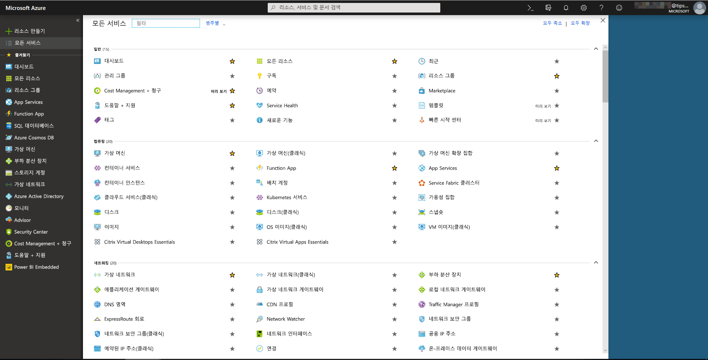
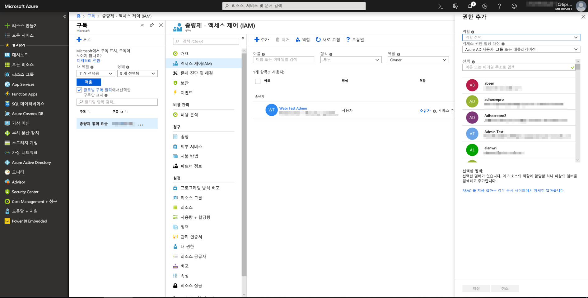
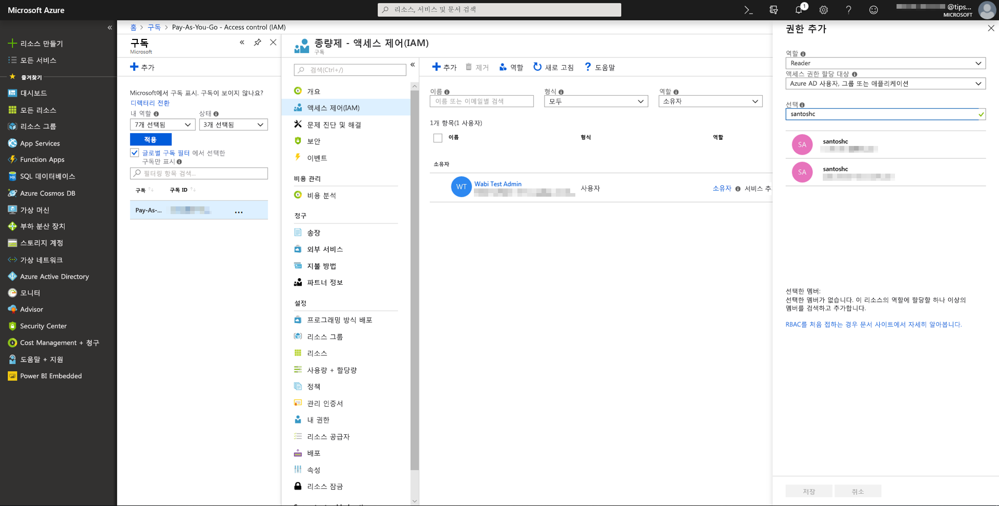
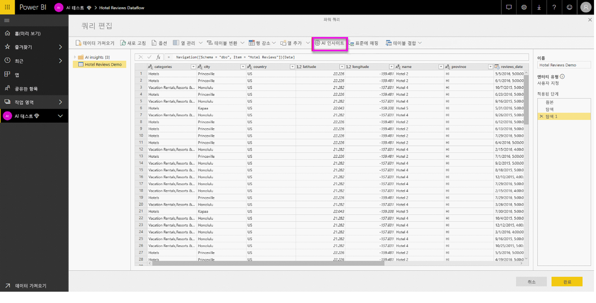
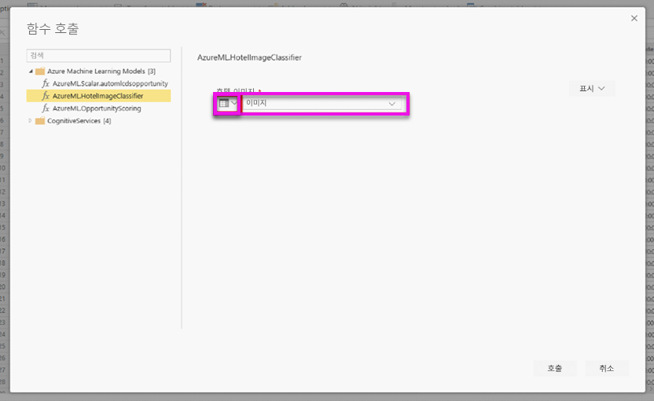
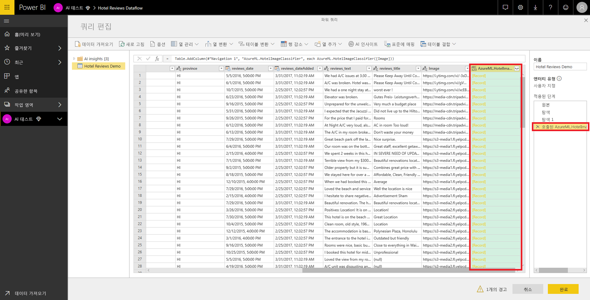
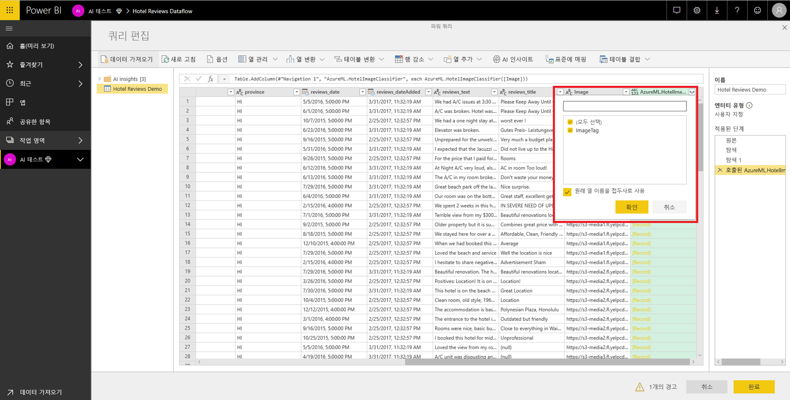

# Power BI에서 Azure Machine Learning 통합(미리 보기)

수많은 조직이 비즈니스에 대한 더 나은 인사이트와 예측을 얻기 위해 **Machine Learning** 모델을 사용합니다. 보고서, 대시보드 및 기타 분석에서 이러한 모델의 인사이트를 시각화하고 호출하는 기능은 인사이트를 가장 필요로 하는 비즈니스 사용자에게 인사이트를 전달하는 데 도움이 될 수 있습니다.  이제 Power BI를 사용하여 가리킨 다음 클릭하는 쉬운 동작으로 Azure Machine Learning Service에 호스트된 모델의 인사이트를 간편하게 통합할 수 있습니다.

이 기능을 사용하려면 데이터 과학자가 간단히 Azure Portal을 사용하여 BI 분석가에게 Azure ML 모델에 대한 액세스 권한을 부여합니다.  그러면 각 세션이 시작할 때 파워 쿼리가 사용자에게 액세스 권한이 있는 모든 Azure ML 모델을 검색하여 동적 파워 쿼리 함수로 표시합니다.  사용자는 파워 쿼리 편집기의 리본에서 함수에 액세스하거나 직접 M 함수를 호출하는 방법으로 해당 함수를 호출할 수 있습니다. Power BI도 성능 향상을 위해 일련의 행에 대한 Azure ML 모델을 호출할 때 자동으로 액세스 요청을 일괄 처리합니다.

이 기능은 현재 Power BI 데이터 흐름과 Power BI 서비스의 파워 쿼리 온라인에서만 지원됩니다.

데이터 흐름에 대한 자세한 내용은 [Power BI의 셀프 서비스 데이터 준비](service-dataflows-overview.md)를 참조하세요.

Azure Machine Learning에 대해 자세히 알아보려면 다음을 참조하세요.

- 개요:  [Azure Machine Learning Service란?](https://docs.microsoft.com/azure/machine-learning/service/overview-what-is-azure-ml)
- Azure Machine Learning 빠른 시작 및 자습서:  [Azure Machine Learning 설명서](https://docs.microsoft.com/azure/machine-learning/)

## Power BI 사용자에게 Azure ML 모델에 대한 액세스 권한 부여

Power BI에서 Azure ML 모델에 액세스하려면 사용자에게 Azure 구독에 대한 **읽기** 액세스 권한이 있어야 합니다.  다음 액세스 권한도 필요합니다.

- Machine Learning Studio 모델의 경우 Machine Learning Studio 웹 서비스에 대한 **읽기** 액세스 권한
- Machine Learning Service 모델의 경우 Machine Learning Service 작업 영역에 대한 **읽기** 액세스 권한

이 문서에서는 Power BI 사용자에게 Azure ML Service에 호스트된 모델에 대한 액세스 권한을 부여하는 방법을 설명합니다. 설명된 단계를 수행하면 Power BI 사용자가 파워 쿼리 함수로 이러한 모델에 액세스할 수 있습니다.  자세한 내용은 [RBAC 및 Azure Portal을 사용하여 액세스 관리](https://docs.microsoft.com/azure/role-based-access-control/role-assignments-portal)를 참조하세요.

1. [Azure Portal](https://portal.azure.com)에 로그인합니다.

2. **구독** 페이지로 이동합니다. **구독** 페이지는 Azure Portal의 왼쪽 탐색 메뉴에 있는 **모든 서비스** 목록에서 찾을 수 있습니다.

    

3. 구독을 선택합니다.

    

4. **액세스 제어(IAM)** 를 선택하고 **추가** 단추를 선택합니다.

    

5. **읽기 권한자**를 역할로 선택합니다. Azure ML 모델에 대한 액세스 권한을 부여할 Power BI 사용자를 선택합니다.

    

6. **저장**을 선택합니다.

7. 3단계부터 6단계까지 반복하여 특정 Machine Learning Studio 웹 서비스 ‘또는’ 모델을 호스트하는 Machine Learning Service 작업 영역 사용자에게 **읽기 권한자** 액세스 권한을 부여합니다. 

## Machine Learning Service 모델에 대한 스키마 검색

데이터 과학자는 주로 Python을 사용하여 Machine Learning Service에 대한 기계 학습 모델을 개발하고 배포합니다.  모델에 대한 스키마 파일 만들기 작업을 자동화하도록 도와주는 Machine Learning Studio와 달리, Machine Learning Service의 경우에는 데이터 과학자가 Python을 사용하여 스키마 파일을 명시적으로 생성해야 합니다.

이 스키마 파일이 포함되어 있어야 합니다.

## Power BI에서 Azure ML 모델 호출

액세스 권한이 부여된 Azure ML 모델을 데이터 흐름의 파워 쿼리 편집기에서 직접 호출할 수 있습니다. Azure ML 모델에 액세스하려면 다음 이미지에 표시된 것처럼 Azure ML 모델의 인사이트로 보강하려는 엔터티의 **편집** 단추를 선택합니다.

**편집** 단추를 선택하면 데이터 흐름의 엔터티에 대한 파워 쿼리 편집기가 열립니다.

리본에서 **AI 인사이트** 단추를 선택하고 왼쪽 탐색 메뉴의 _Azure Machine Learning 모델_ 폴더를 선택합니다. 액세스 권한이 있는 모든 Azure ML 모델이 여기에 파워 쿼리 함수로 나열됩니다. Azure ML 모델에 대한 입력 매개 변수도 자동으로 해당 파워 쿼리 함수의 매개 변수로 매핑됩니다.

Azure ML 모델을 호출하려면 선택한 엔터티의 열을 드롭다운에서 입력으로 지정합니다. 입력 대화 상자 왼쪽으로 열 아이콘을 전환하여 입력으로 사용할 상수 값을 지정할 수도 있습니다.

Azure ML 모델 출력 미리 보기를 엔터티 테이블에 새 열로 표시하려면 **호출**을 선택합니다. 모델 호출을 쿼리의 적용 단계로 표시할 수도 있습니다.

모델이 여러 출력 매개 변수를 반환하는 경우 해당 매개 변수가 출력 열에서 레코드로 그룹화됩니다. 이 열을 확장하여 별도의 열에 개별 출력 매개 변수를 생성할 수 있습니다.

데이터 흐름을 저장하면 엔터티 테이블의 모든 새 행 또는 업데이트된 행에 대해 데이터 흐름을 새로 고치는 경우 자동으로 모델이 호출됩니다.

## 다음 단계

이 문서에서는 Power BI 서비스에 Machine Learning을 통합하는 방법을 간략하게 살펴봤습니다. 관심을 가질 만한 다른 유용한 문서는 다음과 같습니다. 

* [자습서: Power BI에서 Machine Learning Studio 모델 호출(미리 보기)](service-tutorial-invoke-machine-learning-model.md)
* [자습서: Power BI에서 Cognitive Services 사용](service-tutorial-use-cognitive-services.md)
* [Power BI에서 Cognitive Services 사용(미리 보기)](service-cognitive-services.md)

데이터 흐름에 대한 자세한 내용은 다음 문서를 참조할 수 있습니다.
* [Power BI에서 데이터 흐름 만들기 및 사용](service-dataflows-create-use.md)
* [Power BI 프리미엄에 계산 된 엔터티를 사용 하 여](service-dataflows-computed-entities-premium.md)
* [데이터 흐름을 사용 하 여 온-프레미스 데이터 원본](service-dataflows-on-premises-gateways.md)
* [Power BI 데이터 흐름에 대 한 개발자 리소스](service-dataflows-developer-resources.md)
* [데이터 흐름 및 Azure Data Lake 통합(미리 보기)](service-dataflows-azure-data-lake-integration.md)

