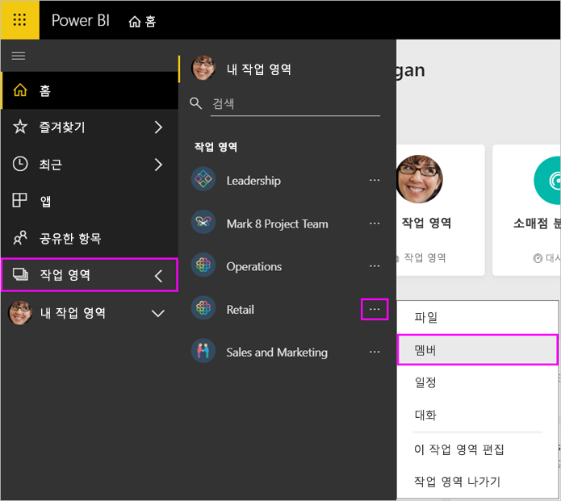

# Power BI 및 Office 365에서 앱 작업 영역 관리

[Power BI 또는 Office 365에서 앱 작업 영역](service-create-distribute-apps.md)의 작성자나 관리자는 Power BI의 작업 영역에 대한 몇 가지 측면을 관리합니다. Office 365에서 관리하는 기타 측면.

> [!NOTE]
> 새 작업 영역 환경 미리 보기를 통해 Power BI 작업 영역과 Office 365 그룹 간의 관계를 변경합니다. 새 작업 영역 중 하나를 만들 때마다 Office 365 그룹을 자동으로 만드는 것은 아닙니다. [새 작업 영역 만들기](service-create-the-new-workspaces.md)를 참조하세요.

**Power BI**에서 다음을 수행할 수 있습니다.

* 작업 영역 구성원을 관리자로 만들기를 비롯하여 모든 작업 영역 구성원 추가 또는 제거
* 앱 작업 영역 이름 편집
* 앱 작업 영역 삭제

**Office 365**에서 다음을 수행할 수 있습니다.

* 구성원을 소유자로 설정하는 등, 앱 작업 영역의 그룹 구성원을 추가 또는 제거합니다.
* 그룹 이름, 이미지, 설명 및 기타 설정을 편집합니다.
* 그룹 전자 메일 주소를 참조하세요.
* 그룹 삭제.

앱 작업 영역의 관리자 또는 구성원이 되려면 [Power BI Pro 라이선스](service-features-license-type.md)가 필요합니다. 앱 작업 영역이 Power BI 프리미엄 용량에 있는 경우를 제외하고 앱 사용자는 Power BI Pro 라이선스가 필요합니다. 자세한 내용은 [Power BI 프리미엄이란?](service-premium-what-is.md)을 참조하세요.

## Power BI에서 앱 작업 영역 편집

1. Power BI 서비스에서 **작업 영역** 옆에 있는 화살표를 선택하고 > 작업 영역 이름 옆에 있는 줄임표(…)를 선택한 다음 > **이 작업 영역 편집**을 선택합니다.

   

   > [!NOTE]
   > 앱 작업 영역 관리자인 경우에만 **이 작업 영역 편집**이 표시됩니다.

1. 여기서 작업 영역의 이름을 바꾸거나, 구성원을 추가 또는 제거하거나, 작업 영역을 삭제할 수 있습니다.

   

1. **저장** 또는 **취소**를 선택합니다.

## Office 365에서 Power BI 앱 작업 영역 속성 편집

Office 365용 Outlook에서 직접 앱 작업 영역의 기능을 편집할 수도 있습니다.

### 앱 작업 영역 그룹의 구성원 편집

1. Power BI 서비스에서 **작업 영역** 옆에 있는 화살표를 선택하고 > 작업 영역 이름 옆에 있는 줄임표(…)를 선택한 다음 > **구성원**을 선택합니다.

   

   그러면 그룹의 앱 작업 영역에 대한 Outlook for Office 365 그룹 보기가 열립니다. 회사 계정에 로그인해야 할 수도 있습니다.

1. 팀 구성원의 이름 옆에 있는 역할을 선택하여 해당 사용자를 **구성원** 또는 **소유자**로 만듭니다. 그룹에서 사용자를 제거하려면 **X**를 선택합니다.

   

### 이미지 추가 및 기타 작업 영역 속성 설정

앱 작업 영역에서 앱을 배포하는 경우, 여기서 추가한 이미지가 앱 이미지가 됩니다. **새 작업 영역 만들기** 문서의 [Office 365 앱 작업 영역에 이미지 추가](service-create-workspaces.md#add-an-image-to-your-office-365-workspace-optional)를 참조하세요.

1. 앱 작업 영역의 Office 365용 Outlook 보기에서 **정보** 탭으로 이동하여 **편집**을 선택합니다.

    
1. 그룹 관련 알림의 이름, 설명 및 언어를 편집할 수 있습니다. 여기에서 이미지를 추가하고 다른 속성을 설정할 수도 있습니다.

   

1. **저장** 또는 **취소**를 선택합니다.

## 다음 단계

* [Power BI에 앱 게시](service-create-distribute-apps.md)

* 궁금한 점이 더 있나요? [Power BI 커뮤니티를 이용하세요.](http://community.powerbi.com/)
