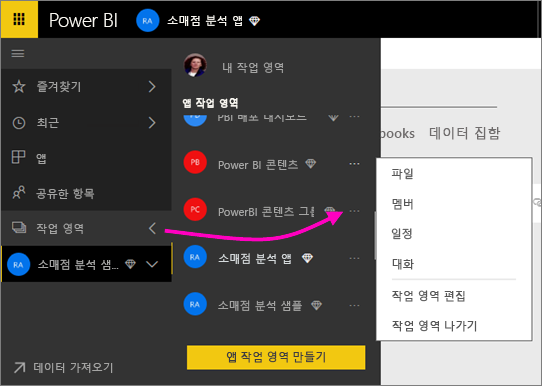
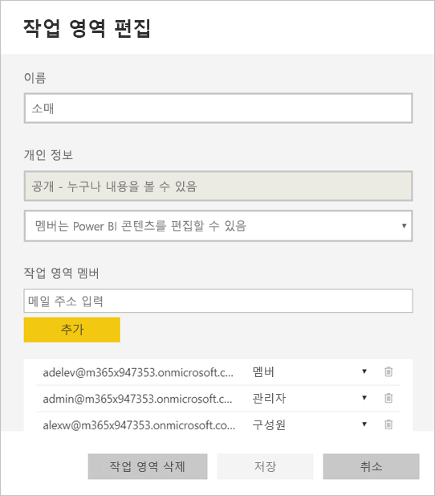
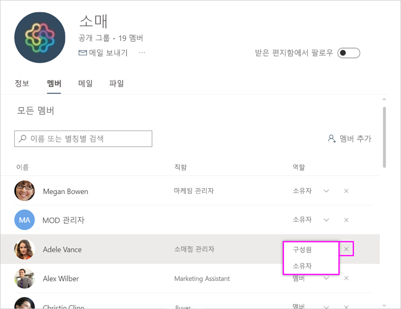
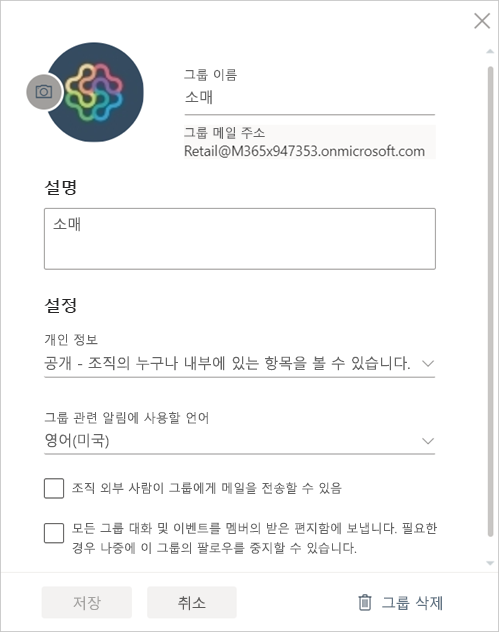

# Power BI 및 Office 365에서 앱 작업 영역 관리
[Power BI 또는 Office 365에서 앱 작업 영역](service-install-use-apps.md)의 작성자나 관리자는 Power BI의 작업 영역에 대한 몇 가지 측면을 관리합니다. Office 365에서 관리하는 기타 측면. 

**Power BI에서** 다음을 수행할 수 있습니다.

* 작업 영역 구성원을 관리자로 만들기를 비롯하여 모든 작업 영역 구성원 추가 또는 제거
* 앱 작업 영역 이름 편집
* 앱 작업 영역 삭제

**Office 365에서** 다음을 수행할 수 있습니다.

* 구성원을 관리자로 만드는 것을 포함하여 앱 작업 영역의 그룹 구성원을 추가 또는 제거합니다.
* 그룹 이름, 이미지, 설명 및 기타 설정을 편집합니다.
* 그룹 전자 메일 주소를 참조하세요.
* 그룹 삭제.

앱 작업 공간의 관리자 또는 구성원이 되려면 [Power BI Pro](service-free-vs-pro.md) 라이선스가 필요합니다. 앱 작업 영역이 Power BI 프리미엄 용량에 있는 경우를 제외하고 앱 사용자는 Power BI Pro 라이선스가 필요합니다. 그런 다음 비즈니스 사용자는 대신 Power BI 무료 라이선스를 사용하여 앱에 액세스할 수 있습니다. 자세한 내용은 [Power BI 프리미엄이란?](service-premium.md)을 참조하세요.

## Power BI에서 앱 작업 영역 편집
1. Power BI 서비스에서 **작업 영역** 옆에 있는 화살표를 선택하고 > 작업 영역 이름 옆에 있는 줄임표(**…**)를 선택한 다음 > **작업 영역 편집**을 선택합니다. 
   
   
   
   > [!NOTE]
   > 앱 작업 영역 관리자인 경우에만 **작업 영역 편집**이 표시됩니다.
   > 
   > 
2. 여기서 구성원의 이름을 변경하고 구성원을 추가 또는 제거하거나 앱 작업 영역을 삭제할 수 있습니다. 
   
   
3. **저장** 또는 **취소**를 선택합니다.

## Office 365에서 Power BI 앱 작업 영역 속성 편집
1. Power BI 서비스에서 **작업 영역** 옆에 있는 화살표를 선택하고 > 작업 영역 이름 옆에 있는 줄임표(**…**)를 선택하고 > **구성원**을 선택합니다. 
   
   
   
   그러면 그룹의 앱 작업 영역에 대한 Outlook for Office 365 그룹 보기가 열립니다.
   
   회사 계정에 로그인해야 합니다.
2. 구성원 이름 옆의 줄임표(**...**)를 탭하여 구성원을 관리자로 지정하거나 앱 작업 영역에서 구성원을 삭제합니다. 
   
   

## Office 365 그룹에서 이미지 추가 및 기타 작업 영역 속성 설정
앱 작업 영역에서 앱을 배포할 때 여기에 추가하는 이미지는 앱에 대한 이미지가 됩니다. [Power BI에서 앱 만들기 및 배포](service-create-distribute-apps.md) 문서의 [앱에 이미지 추가](service-create-distribute-apps.md#add-an-image-to-your-app-optional) 섹션을 참조하세요.

1. 앱 작업 영역의 Office 365용 Outlook 보기에서 그룹 작업 영역 속성을 편집할 그룹 이미지를 선택합니다.
   
   
2. 여기에서 이름, 설명 및 언어를 편집하고 이미지를 추가하며 기타 속성을 설정할 수 있습니다.
   
   
3. **저장** 또는 **취소**를 선택합니다.

## 다음 단계
* [Power BI에서 앱이란?](service-install-use-apps.md)
* [Power BI에서 앱 및 앱 작업 영역 만들기](service-create-distribute-apps.md)
* 궁금한 점이 더 있나요? [Power BI 커뮤니티를 이용하세요.](http://community.powerbi.com/)

