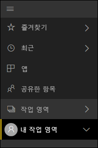
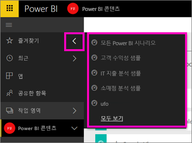
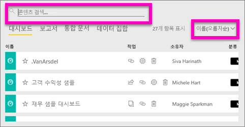
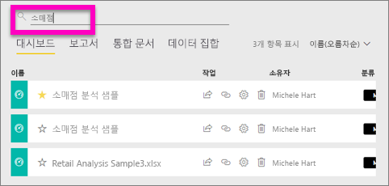

# Power BI에서 콘텐츠 검색 및 정렬
Power BI 자동화 조직, 사용자 태깅, 검색 및 정렬이 조합되어 Power BI 서비스에서 필요한 것을 신속하게 찾을 수 있습니다.

## Power BI에서 콘텐츠 탐색을 지원하는 방법
Power BI 서비스는 사용자의 콘텐츠를 여러 방법으로 구성합니다.  먼저, 콘텐츠를 대시보드, 보고서, 통합 문서 및 데이터 집합으로 구분합니다. 상당수의 Power BI 화면에서 이 조직을 보게 됩니다. 다음으로, Power BI 서비스는 사용자가 필요한 것을 더 쉽게 빨리 찾을 수 있는 방식으로 콘텐츠를 분류합니다. 왼쪽 탐색을 살펴 보겠습니다.

직접 사용하기 위해 만드는 콘텐츠는 **내 작업 영역**에, 만들어서 그룹과 공유하는 콘텐츠는 **앱 작업 영역**에 있으며, 빨리 액세스하길 원하는 콘텐츠는 **즐겨찾기**에,사용자와 공유한 콘텐츠는 **공유한 항목**에 있으며, 최근 본 콘텐츠는 **최근**에 있습니다.

자세한 내용은 [Power BI 서비스에서 콘텐츠 구성 방법](service-basic-concepts.md)을 참조하세요.

> **참고**: 콘텐츠를 구성하는 또 하나의 방법은 자주 볼 것으로 예상하는 하나의 대시보드를 선택하고 이를 *주요* 대시보드로 설정하는 것입니다. Power BI 서비스를 열 때마다 먼저 표시되는 대시보드입니다. 자세한 내용은 [주요 대시보드](service-dashboard-featured.md)를 참조하세요.
> 
> 

## 대시보드 및 앱을 즐겨찾기에 추가
자주 방문하는 여러 대시보드 및 앱이 있나요? [이들을 *즐겨찾기*](service-dashboard-favorite.md)로 설정하면 왼쪽 탐색 표시줄에서 항상 사용할 수 있습니다.

.

즐겨찾기 사용 방법은 [Power BI 서비스의 즐겨찾기](service-dashboard-favorite.md) 문서에 더 자세히 설명되어 있습니다.

## 작업 영역에서 검색 및 정렬
작업 영역에는 대시보드, 보고서, 통합 문서, 데이터 집합이라는 4개의 콘텐츠 탭이 있습니다.  이러한 각 탭에는 검색 필드와 정렬 단추가 있습니다.  Power BI 서비스를 처음 시작할 때는 탭당 단 하나 또는 두 개의 항목만 있으므로 유용하지 않을 수 있습니다.  그러나 시간이 지남에 따라 콘텐츠 목록이 길어집니다.  검색 및 정렬 기능을 사용하면 필요한 것을 쉽게 찾을 수 있습니다.

* 검색어를 입력하여 현재 화면에서 일치하는 항목을 찾은 후
  
   
* 정렬 단추를 선택하여 현재 페이지에 대한 옵션을 표시합니다. 이름 또는 소유자별로 정렬할지 선택할 수 있습니다.
  
   

## 고려 사항 및 문제 해결
* 데이터 집합의 경우 **정렬 기준**에서 소유자별 기준은 사용할 수 없습니다.

## 다음 단계
[Power BI - 기본 개념](service-basic-concepts.md)

궁금한 점이 더 있나요? [Power BI 커뮤니티를 이용하세요.](http://community.powerbi.com/)

