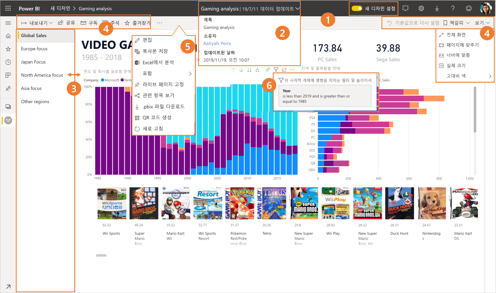
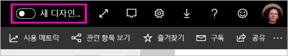
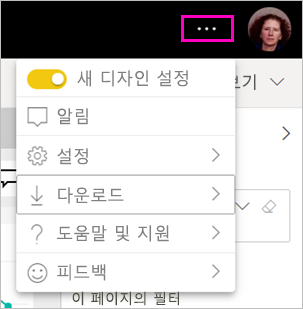
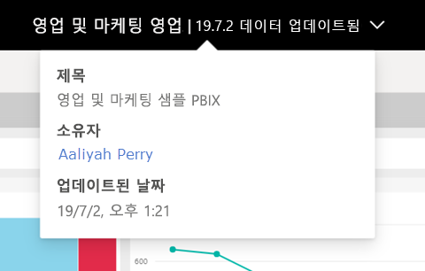
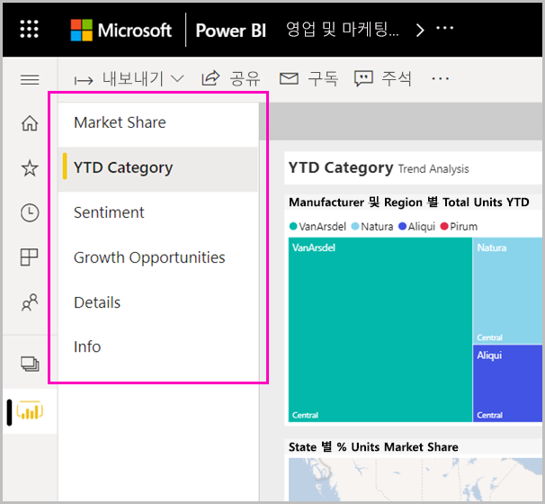
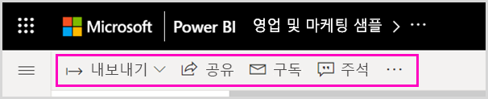
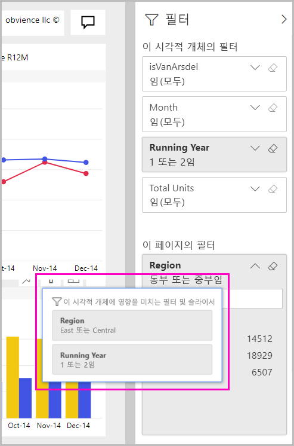

# Power BI 서비스의 ‘새 디자인’

Power BI 서비스(app.powerbi.com)의 디자인이 보고서를 더욱 편리하게 보고 조작할 수 있도록 변경되었습니다. 새 디자인은 더 간단하고 다른 친숙한 Microsoft 제품과 비슷하게 빌드되었습니다. Power BI 서비스 전체를 밝은 색 테마로 전환하고 아이콘을 업데이트하여 보고서 내용을 주요 포커스 지점으로 만들었습니다. 다음은 새 디자인에서 변경된 내용의 개요입니다. 자세한 내용은 번호를 매긴 섹션을 참조하세요.

특정 작업을 찾으십니까? [‘새 디자인’: 작업이 어디로 이동했나요?](service-new-look-where-actions.md)를 참조하세요.

## 변경 내용 둘러보기

이 애니메이션은 보고서 모양의 변경 내용을 실행하면서 보여 줍니다.

## 1. 새 디자인 옵트인(opt in)

Power BI 서비스 사용자는 새 디자인을 옵트인(opt in)할 수 있습니다. **새 디자인 해제**를 **새 디자인 사용**으로 밀기만 하면 됩니다.

이전 디자인으로 돌아가야 하는 경우 다시 밀어서 을 **해제**하면 됩니다. 표시되지 않는 경우 오른쪽 위 모서리에 있는 줄임표 메뉴를 선택합니다.

## 2. 보고서 정보 보기 

위쪽 배너에서 마지막 새로 고침 날짜, 연락처 정보 등의 세부 정보를 빠르게 확인합니다.  보고서에 대한 추가 정보를 보려면 메뉴를 엽니다. 보고서 소유자에게 메일을 보낼 수도 있습니다.

## 3. 세로 페이지 목록 
이제 보고서 페이지 이름이 세로 창의 목록에 나열됩니다. Word 및 PowerPoint의 탐색과 비슷하게 눈에 띄게 표시됩니다. 세로 창의 크기를 조정하여 보고서 영역의 나머지 부분을 늘리거나 줄일 수 있습니다.

## 4. 간소화된 작업 모음 

위쪽의 업데이트된 작업 모음에는 보고서 소비자와 가장 관련된 명령이 전면 중앙에 표시됩니다. 내보내기, 구독, 다른 사람과 협업, 필터 및 책갈피를 통한 자세히 살펴보기 등이 훨씬 간편해졌습니다.

## 5. 보고서 명령 위치

이전 디자인에서 제거된 기능은 없습니다. 작업 모음에서 줄임표(... 메뉴)를 펼치면 편집, 복사본 저장 등의 추가 명령을 찾을 수 있습니다. 또한 콘텐츠 목록에서 사용량 메트릭에 액세스할 수 있습니다.

### 파일 메뉴 작업 위치

**파일** 메뉴 작업을 찾고 있나요? **파일** 메뉴에 있었던 작업이 **추가 옵션**(...) 메뉴에도 있습니다. 

## 6. 새 필터 환경

새 디자인에서는 적용된 필터 보기, 새 필터 창 등의 최근 업데이트를 기본적으로 사용할 수 있습니다. 보고서 디자이너가 새 필터 환경으로 업그레이드되지 않았지만, 새 필터 창이 표시됩니다.

## 대시보드 ‘새 디자인’ 환경 

대시보드에도 일관된 경험을 위해 보고서와 앱처럼 간소화된 작업 모음이 있습니다. 단, 기능 차이는 그대로 유지됩니다. 다음은 대시보드의 작업 연습입니다.
 

## 편집 모드는 변경되지 않음 

작성 환경은 Desktop의 환경과 유사하도록 유지되었습니다. 새 디자인 변경 내용은 읽기용 보기에만 적용됩니다.

## 다음 단계

[소비자용 Power BI](consumer/end-user-consumer.md)
