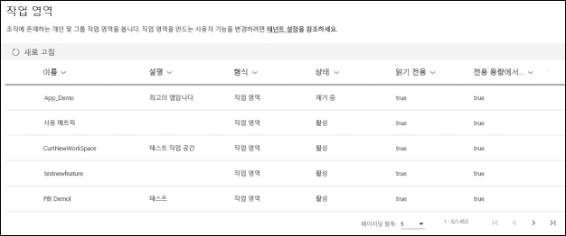

# Power BI의 새 작업 영역에서 작업 구성

 ‘작업 영역’은 동료와 협업하여 대시보드, 보고서 및 페이지를 매긴 보고서의 컬렉션을 만드는 공간입니다.  새 작업 영역 환경을 사용하면 콘텐츠에 대한 액세스를 더 잘 관리할 수 있습니다. 이 문서에서는 새 작업 영역에 대해 설명하고 클래식 작업 영역과 어떻게 다른지 설명합니다.  클래식 작업 영역과 마찬가지로 새 작업 영역을 사용하여 앱을 만들고 배포합니다. [새 작업 영역 환경을 만드는](service-create-the-new-workspaces.md) 방법에 대해 읽어보세요.

새 작업 영역 환경이 GA(일반 공급)에 도달했으며 이제 기본 작업 영역입니다. 계속해서 Office 365 그룹을 기반으로 [클래식 작업 영역](service-create-workspaces.md)을 만들고 사용할 수 있습니다. 

> [!NOTE]
> 작업 영역에서 콘텐츠를 찾아보는 사용자에 대한 RLS(행 수준 보안)를 적용하려면 뷰어 역할을 사용합니다. 작업 영역에 대한 액세스 권한을 부여하지 않고 RLS를 적용하려면 Power BI 앱을 해당 사용자에게 게시하거나 공유를 사용하여 콘텐츠를 배포합니다.

새 작업 영역을 사용하면 다음을 수행할 수 있습니다.

- 보안 그룹, 배포 목록, Office 365 그룹 및 개인과 같은 사용자 그룹에 작업 영역 역할을 할당합니다.
- Office 365 그룹을 만들지 않고 Power BI에서 작업 영역을 만듭니다.
- 작업 영역에서 더 유연한 사용 권한 관리에 대해 세분화된 작업 영역 역할을 사용합니다.
- Power BI 관리자는 Power BI에서 작업 영역을 만들 수 있는 사용자를 제어할 수 있습니다.

새 작업 영역 중 하나를 만들면 연결된 기본 Office 365 그룹을 만들지 않습니다. 모든 작업 영역 관리는 Office 365가 아닌 Power BI에 위치합니다. 이제 새 작업 영역 환경에서는 Office 365 그룹을 통해 콘텐츠에 대한 사용자 액세스 권한을 계속 관리하기 위해 작업 영역 액세스 목록에 Office 365 그룹을 추가할 수 있습니다.

## 새 작업 영역 환경의 작업 영역 관리
이제 Power BI에 새 작업 영역 환경의 작업 영역 관리가 제공되며 Power BI 관리자는 조직에서 작업 영역을 만들 수 있는 사용자를 결정합니다. Power BI 관리 포털 또는 PowerShell Cmdlet을 사용하여 작업 영역을 관리하고 복구할 수도 있습니다. Office 365 그룹을 기반으로 하는 클래식 작업 영역의 경우 Office 365 관리 포털 및 Azure Active Directory에서 관리가 계속 수행됩니다.

관리 포털의 **작업 영역 설정**에서 관리자는 작업 영역(새 작업 영역 환경) 만들기 설정을 사용하여 조직의 모든 사용자가 새 작업 영역 환경의 작업 영역을 만들도록 허용하거나 누구도 만들지 못하도록 할 수 있습니다. 특정 보안 그룹의 구성원으로만 만들기를 제한할 수도 있습니다.

> [!NOTE]
> 작업 영역(새 작업 영역 경험) 만들기 설정은 기본적으로 Office 365 그룹을 만들 수 있는 사용자만 Power BI에서 새 작업 영역을 만들도록 설정됩니다. 해당하는 사용자가 새 작업 영역 환경의 작업 영역을 만들 수 있도록 Power BI 관리 포털에서 값을 설정해야 합니다.

Power BI 관리 포털에서 [작업 영역 목록을 사용할 수 있습니다](service-admin-portal.md#workspaces). 

## 클래식 작업 영역과 나란히 공존하는 새 작업 영역

업그레이드된 새 작업 영역과 기존 클래식 작업 영역은 나란히 공존하며 각각 만들 수 있습니다. 새 작업 영역 환경은 기본 작업 영역 유형입니다. Power BI는 기존 워크플로가 변경되지 않도록 사용자가 Power BI의 구성원인 모든 Office 365 그룹을 계속 나열합니다. 새 작업 영역을 작성하는 방법을 알아보려면 [새 작업 영역 만들기](service-create-the-new-workspaces.md)를 참조하세요. 클래식 작업 영역을 작성하는 방법을 알아보려면 [클래식 작업 영역 만들기](service-create-workspaces.md)를 참조하세요.

## 새 작업 영역의 역할

새 작업 영역에 대한 액세스 권한을 부여하려면 사용자 그룹 또는 개인을 작업 영역 역할(뷰어, 구성원, 참가자 또는 관리자) 중 하나에 추가합니다. 사용자 그룹의 모든 사용자는 정의된 역할을 가져옵니다. 개인이 여러 사용자 그룹에 속해 있는 경우 할당된 역할에서 제공하는 가장 높은 수준의 권한을 얻을 수 있습니다.

역할을 통해 팀이 공동 작업할 수 있도록 작업 영역에서 수행할 수 있는 작업 및 사용자를 관리할 수 있습니다. 새 작업 영역을 사용하면 개인 및 사용자 그룹(보안 그룹, Office 365 그룹 및 배포 목록)에 역할을 할당할 수 있습니다. 

사용자 그룹에 역할을 할당하면 그룹의 개인은 콘텐츠에 대한 액세스 권한을 갖습니다. 사용자 그룹을 중첩하는 경우 포함된 모든 사용자에게는 사용 권한이 있습니다.

다음은 관리자, 구성원, 참가자, 뷰어 등 네 가지 역할의 기능입니다. 보기와 상호 작용을 제외한 모든 기능에는 Power BI Pro 라이선스가 필요합니다.

|기능   | 관리자  | 멤버  | 참가자  | 뷰어 |
|---|---|---|---|---|
| 작업 영역 업데이트 및 삭제  | X  |   |   |   | 
| 다른 관리자를 비롯한 사람 추가/제거  | X  |   |   |   |
| 낮은 권한을 가진 구성원 또는 다른 사용자 추가  |  X | X  |   |   |
| 앱 게시 및 업데이트 |  X | X  |   |   |
| 항목 공유 또는 앱 공유 |  X | X  |   |   |
| 다른 사용자가 항목을 다시 공유하도록 허용 |  X | X  |   |   |
| 작업 영역에서 콘텐츠 만들기, 편집 및 삭제  |  X | X  | X  |   |
| 작업 영역에 보고서 게시, 콘텐츠 삭제  |  X | X  | X  |   |
| 이 작업 영역의 데이터 세트를 기반으로 하여 다른 작업 영역에 보고서 만들기.1 |  X | X  | X  |   |
| 보고서 복사.1 | X | X | X |  |
| 항목 보기 및 상호 작용.2 |  X | X  | X  | X  |

1. 보고서를 복사하고 이 작업 영역의 데이터 세트를 기반으로 하여 다른 작업 영역에서 보고서를 만들려면 추가 조건을 충족해야 합니다.
    - Power BI Pro 라이선스가 있어야 합니다. 자세한 내용은 다음 섹션인 [라이선싱](#licensing)을 참조하세요.
    - 데이터 세트의 빌드 권한이 필요합니다. 이 작업 영역의 데이터 세트에서 관리자, 구성원 및 참가자 역할이 있는 사용자는 작업 영역 역할을 통해 빌드 권한을 보유합니다.
2. Power BI Pro 라이선스가 없더라도, 항목이 프리미엄 용량의 작업 영역에 있는 경우 Power BI 서비스에서 항목을 보고 상호 작용할 수 있습니다.

## 라이선싱
공유된 용량의 작업 영역에 추가하는 모든 사용자는 Power BI Pro 라이선스가 필요합니다. 작업 영역에서 이러한 사용자는 물론, 더 광범위한 대상 그룹이나 조직 전체에 게시할 계획이 있는 대시보드, 보고서에 대해 공동 작업을 수행할 수 있습니다. 

조직 내 다른 사용자에게 콘텐츠를 배포하려는 경우 해당 사용자에게 Power BI Pro 라이선스를 할당하거나 Power BI Premium 용량에 작업 영역을 배치할 수 있습니다.

작업 영역이 Power BI Premium 용량에 있으면 뷰어 역할을 가진 사용자는 Power BI Pro 라이선스가 없어도 작업 영역에 액세스할 수 있습니다. 그러나 이 사용자에게 관리자, 구성원 또는 참가자와 같은 상위 역할을 할당하면 사용자가 작업 영역에 액세스할 때 Pro 평가판을 시작하라는 메시지가 표시됩니다. Pro 라이선스가 없는 사용자에 대해 뷰어 기능을 이용하려면 뷰어 역할의 사용자가 개별적으로 또는 사용자 그룹을 통해 다른 작업 영역에 포함되지 않도록 합니다. 

> [!NOTE]
> 보고서를 새 작업 영역 환경에 게시하는 경우에는 기존 라이선스 규칙이 더 엄격하게 적용됩니다. 사용자가 Pro 라이선스 없이 Power BI Desktop 또는 다른 클라이언트 도구에서 게시하려고 하면 “Power BI Pro 라이선스를 가진 사용자만 이 작업 영역에 게시할 수 있습니다.”라는 오류가 표시됩니다.

## 새 작업 영역의 변경 내용

새 작업 영역에서는 몇 가지 기능이 다시 디자인되었습니다. 영구적일 것으로 예상되는 변경 내용은 다음과 같습니다. 

* 작업 영역을 만들어도 클래식 작업 영역의 경우처럼 Office 365 그룹이 생성되지 않습니다. 그러나 이제는 Office 365 그룹을 통해 사용자에게 역할을 할당하여 작업 영역 액세스 권한을 부여할 수 있습니다. 
* 클래식 작업 영역에 구성원 및 관리자 목록에는 개인만 추가할 수 있습니다. 새 작업 영역에서 사용자 관리를 간소화하기 위해 이러한 목록에 여러 AD 보안 그룹, 배포 항목 또는 Office 365 그룹을 추가할 수 있습니다. 
- 클래식 작업 영역에서 조직 콘텐츠 팩을 만들 수 있습니다. 새 작업 영역에서 콘텐츠 팩을 만들 수 없습니다.
- 클래식 작업 영역에서 조직 콘텐츠 팩을 사용할 수 있습니다. 새 작업 영역에서 콘텐츠 팩을 사용할 수 없습니다.

## 작업 영역 연락처 목록
새 **연락처 목록** 기능을 사용하면 작업 영역에서 발생하는 문제에 대한 알림을 받는 사용자를 지정할 수 있습니다. 기본적으로 작업 영역 관리자로 지정된 사용자 또는 그룹은 알림을 받지만 목록을 사용자 지정할 수 있습니다. 연락처 목록에 나열된 사용자 또는 그룹은 UI(사용자 인터페이스)에 표시되어 사용자가 작업 영역에 관련된 도움말을 확인할 수 있습니다. 

[작업 영역 연락처 목록 설정](service-create-the-new-workspaces.md#workspace-contact-list)에 대해 자세히 알아봅니다.

## 작업 영역 OneDrive
작업 영역 OneDrive 기능을 사용하면 작업 영역 사용자가 SharePoint 문서 라이브러리 파일 스토리지를 사용할 수 있는 Office 365 그룹을 구성할 수 있습니다. 그룹은 Power BI 외부에서 만들어야 합니다. 

Power BI는 작업 영역 액세스 권한을 가지도록 구성된 사용자 또는 그룹의 권한을 Office 365 그룹 멤버 자격과 동기화하지 않습니다. 이 설정에서 구성한 파일 스토리지가 포함된 동일한 Office 365 그룹을 통해 작업 영역 액세스를 관리하는 것이 좋습니다. 

[작업 영역 OneDrive를 설정하고 액세스](service-create-the-new-workspaces.md#workspace-onedrive)하는 방법에 대해 알아봅니다.  

## 감사

새 작업 영역 환경의 작업 영역에 대한 다음 작업은 Power BI에서 감사됩니다.

| 식별 이름 | 작업 이름 |
|---|---|
| Power BI 폴더 만듦 | CreateFolder |
| Power BI 폴더 삭제됨 | DeleteFolder |
| Power BI 폴더 업데이트됨 | UpdateFolder |
| Power BI 폴더 액세스 권한 업데이트됨| UpdateFolderAccess |

[Power BI 감사](service-admin-auditing.md)에 대해 자세히 알아봅니다.

## 제한 사항 및 고려 사항

알아야 할 제한 사항:

- 작업 영역은 최대 1,000개 데이터 세트 또는 데이터 세트당 1,000개 보고서를 포함할 수 있습니다. 
- Power BI Pro 라이선스가 있는 사용자는 최대 1,000개 작업 영역의 구성원일 수 있습니다.
- Excel용 Power BI 게시자는 지원되지 않습니다.

## 다르게 작동하는 작업 영역 기능

일부 기능은 새 작업 영역의 현재 작업 영역과 다르게 작동합니다. 고객 피드백에 따르면 이러한 차이는 의도적이며, 작업 영역에서의 협업에서 더욱 유연한 접근 방식을 가능하게 합니다.

- 라이선스 적용: 보고서를 새 작업 영역 환경에 게시하면 작업 영역에서 협업하거나 Power BI 서비스에서 다른 사용자와 콘텐츠를 공유하는 사용자의 경우 Power BI Pro 라이선스가 필요한 기존 라이선스 규칙이 적용됩니다. Pro 라이선스가 없는 사용자에게는 “Power BI Pro 라이선스를 가진 사용자만 이 작업 영역에 게시할 수 있습니다.”라는 오류가 표시됩니다.
- 구성원은 다시 공유할 수 있거나 다시 공유할 수 없습니다: 참가자 역할로 대체됩니다.
- 읽기 전용 작업 영역: 사용자에게 작업 영역에 대한 읽기 전용 액세스 권한을 부여하는 대신 뷰어 역할에 사용자를 할당합니다. 그러면 작업 영역의 콘텐츠에 유사한 읽기 전용 액세스 권한을 허용합니다.
- Pro 라이선스가 없는 사용자는 사용자에게 뷰어 역할만 있더라도 작업 영역이 Power BI Premium 용량에 있으면 작업 영역에 액세스할 수 있습니다.
- 뷰어 역할이 있는 사용자가 데이터를 내보낼 수 있도록 하려면 작업 영역의 데이터 세트에 대한 빌드 권한이 있는지 확인합니다. [데이터 세트 빌드 권한](service-datasets-build-permissions.md)에 대해 자세히 알아보세요.
- **작업 영역 나가기** 단추가 없습니다.

## 질문과 대답

**새 작업 영역 환경 GA가 기존 콘텐츠의 링크에 영향을 주나요?**

아니요. 새 작업 영역 환경은 클래식 작업 영역의 기존 항목 링크에 영향을 주지 않습니다. 새 작업 영역 환경의 GA(일반 공급)는 사용자가 만드는 기본 작업 영역을 변경하지만 기존 작업 영역을 변경하지는 않습니다. 

**GA를 통해 기존 작업 영역이 새 작업 영역 환경으로 업그레이드되나요?**

아니요. 새 작업 영역 환경 GA는 기본 작업 영역 유형만 새 작업 영역 환경으로 변경합니다. Office 365 그룹을 기반으로 하는 기존 클래식 작업 영역은 변경되지 않습니다.

**Office 365 그룹에 대한 작업 영역이 계속 자동으로 생성되나요?**

예. 두 가지 유형의 작업 영역을 모두 나란히 지원하므로 작업 영역 목록에서 사용자가 액세스할 수 있는 모든 Office 365 그룹을 계속 나열합니다.

## 다음 단계
* [Power BI에서 새 작업 영역 만들기](service-create-the-new-workspaces.md)
* [클래식 작업 영역 만들기](service-create-workspaces.md)
* [Power BI에서 앱 설치 및 사용](service-create-distribute-apps.md)
* 궁금한 점이 더 있나요? [Power BI 커뮤니티에 질문합니다.](https://community.powerbi.com/)
