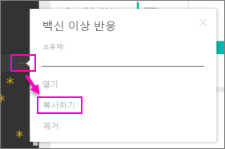

# 조직 콘텐츠 팩: 복사, 새로 고침 및 액세스 권한
> [!NOTE]
> 새 *앱*에 대해 아직 못 들으셨나요? 앱은 Power BI에서 대규모 대상에게 콘텐츠를 배포하는 새로운 방법입니다. *앱 작업 영역*에서 그룹 및 그룹 작업 영역을 대체하는 앱을 만듭니다. 조직 콘텐츠 팩이나 읽기 전용 작업 영역 대신 앱을 사용하는 것이 좋습니다. [앱](service-install-use-apps.md)에서 자세히 알아보세요.
> 
> 

조직 콘텐츠 팩이 게시되면 모든 받는 사람에게 동일한 대시보드, 보고서, Excel 통합 문서, 데이터 집합 및 데이터가 표시됩니다(SSAS(SQL Server Analysis Services) 데이터 원본이 아닌 경우).  [콘텐츠 팩 작성자만 콘텐츠 팩을 편집 및 다시 게시](service-organizational-content-pack-manage-update-delete.md)할 수 있습니다.  그러나 모든 받는 사람은 원본과 함께 보관이 가능한 콘텐츠 팩 복사본을 저장할 수 있습니다.

콘텐츠 팩을 만드는 것은 대시보드를 공유하거나 그룹 내에서 공동 작업하는 것과 다릅니다. [대시보드 및 보고서를 공동 작업 및 공유하는 방법](service-how-to-collaborate-distribute-dashboards-reports.md)에 대해 알아보고 상황에 맞는 최상의 옵션을 결정하세요.

## 조직 콘텐츠 팩의 복사본 만들기
다른 사용자가 볼 수 없는 나만의 콘텐츠 팩 복사본을 만들 수 있습니다.

1. 콘텐츠 팩 대시보드 옆에서 줄임표(...) > 복사본 만들기를 선택합니다.
   
    
2. **저장**을 선택합니다.  

이제 변경할 수 있는 복사본이 있습니다. 아무도 변경 내용을 볼 수 없습니다.

## 도와주세요!  콘텐츠 팩에 더 이상 액세스할 수 없습니다.
여러 가지 이유로 이와 같은 현상이 발생할 수 있습니다.

* **멤버 자격 변경**: 콘텐츠 팩이 메일 배포 그룹, 보안 그룹 및 [Office 365에 기반한 Power BI 그룹](https://support.office.com/article/Create-a-group-in-Office-365-7124dc4c-1de9-40d4-b096-e8add19209e9)에 게시됩니다.  그룹에서 제거된 경우 콘텐츠 팩에 더 이상 액세스할 수 없습니다.
* **배포 변경**: 콘텐츠 팩 작성자는 배포를 변경합니다. 예를 들어 콘텐츠 팩이 원래 전체 조직에 게시되었지만 작성자가 소규모의 대상 그룹에 다시 게시한 경우 귀하가 더 이상 포함되지 않습니다.
* **보안 설정 변경**: 대시보드 및 보고서가 온-프레미스 SSAS 데이터 원본에 연결되고 보안 설정이 변경되면 해당 서버에 대한 권한이 취소될 수 있습니다.

## 조직 콘텐츠 팩이 새로 고침되는 방식
콘텐츠 팩을 만들면 새로 고침 설정이 데이터 집합과 함께 상속됩니다.  콘텐츠 팩 복사본을 만들면 새 버전은 원본 데이터 집합과 새로 고침 일정에 대한 링크를 유지합니다. 

[조직 콘텐츠 팩 관리, 업데이트 및 삭제](service-organizational-content-pack-manage-update-delete.md)를 참조하세요.

## 다음 단계
* [조직 콘텐츠 팩 소개](service-organizational-content-pack-introduction.md)
* [Power BI에서 그룹 만들기](service-create-distribute-apps.md)
* 궁금한 점이 더 있나요? [Power BI 커뮤니티를 이용하세요.](http://community.powerbi.com/)

