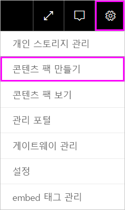
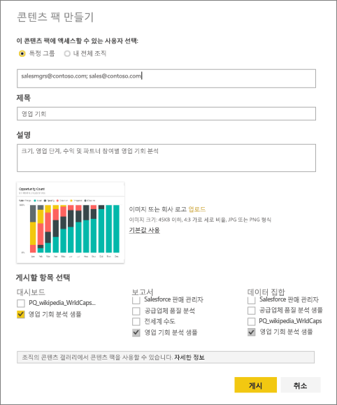
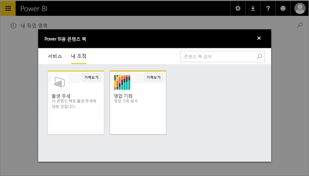

# Power BI 조직 콘텐츠 팩 만들기 및 게시(자습서)
> [!NOTE]
> 새 *앱*에 대해 아직 못 들으셨나요? 앱은 Power BI에서 대규모 대상에게 콘텐츠를 배포하는 새로운 방법입니다. 조직 콘텐츠 팩이나 읽기 전용 작업 영역 대신 앱을 사용하는 것이 좋습니다. [앱](service-install-use-apps.md)에서 자세히 알아보세요.
> 
> 

이 자습서에서는 조직 콘텐츠 팩을 만들고, 특정 그룹에 대한 액세스 권한을 부여하고, Power BI에서 조직의 콘텐츠 팩 라이브러리에 게시합니다.

콘텐츠 팩을 만드는 것은 대시보드를 공유하거나 그룹 내에서 공동 작업하는 것과 다릅니다. [대시보드 및 보고서를 공동 작업 및 공유하는 방법](service-how-to-collaborate-distribute-dashboards-reports.md)에 대해 알아보고 상황에 맞는 최상의 옵션을 결정하세요.

> [!NOTE]
> 조직 콘텐츠 팩을 만들려면 귀하와 귀하의 동료를 위한 [Power BI Pro 계정](https://powerbi.microsoft.com/pricing)이 필요합니다.
> 
> 

Contoso의 릴리스 관리자이고 신제품 출시를 준비하는 중이라고 가정해 보겠습니다.  출시를 관리하는 다른 직원과 공유할 보고서와 함께 대시보드를 만들었습니다. 사용할 동료를 위한 솔루션으로 대시보드 및 보고서를 패키징하는 방법을 원합니다. 

함께 진행해볼까요? [Power BI 서비스](https://powerbi.com)에서 **데이터 가져오기 > 샘플 > 기회 분석 샘플** > **연결**로 차례로 이동하여 자신의 복사본을 가져옵니다. 

1. 왼쪽 탐색 창에서 **기회 분석 샘플** 대시보드를 선택합니다.
2. 위쪽 탐색 모음에서 톱니 아이콘  > **콘텐츠 팩 만들기**를 선택합니다.    
   
3. **콘텐츠 팩 만들기** 창에서 다음 정보를 입력합니다.  
   
   조직의 콘텐츠 팩 라이브러리에서 조직 또는 그룹을 위해 게시된 콘텐츠 팩이 수백 개에 이를 수 있다는 점에 유의하세요. 콘텐츠 팩에 의미 있는 이름을 부여하고, 적절한 설명을 추가하고, 적절한 대상을 선택하는 데 시간이 걸립니다.  검색을 통해 콘텐츠 팩을 쉽게 찾을 수 있는 단어를 사용합니다.
   
   1.  **특정 그룹**을 선택하고 개인에 대한 전체 메일 주소, [Office 365 그룹](https://support.office.com/article/Create-a-group-in-Office-365-7124dc4c-1de9-40d4-b096-e8add19209e9), 메일 그룹 또는 보안 그룹을 입력합니다. 예:
      
         salesmgrs@contoso.com; sales@contoso.com
      
      이 자습서에서는 사용자 고유의 또는 그룹의 전자 메일 주소를 사용하겠습니다.
   
   2.  콘텐츠 팩 이름을 **영업 기회**로 지정합니다.
   
      > [!TIP]
      > 콘텐츠 팩의 이름에 대시보드 이름을 포함하는 것이 좋습니다. 이런 방식을 사용하여 동료가 콘텐츠 팩에 연결하여 대시보드를 더 쉽게 찾을 수 있습니다.
      > 
      > 
   
   3.  권장 사항: **설명**을 추가합니다. 이렇게 하면 동료들이 필요한 콘텐츠 팩을 더욱 쉽게 찾을 수 있습니다. 설명 외에도 동료들이 이 콘텐츠 팩을 검색하는 데 사용할 수 있는 키워드를 추가합니다. 동료가 질문이 있거나 도움이 필요한 경우 연락할 수 있는 연락처 정보를 포함합니다.
   
   4.  텍스트를 찾는 것보다 이미지를 검색하는 것이 더 빠르므로 **이미지 또는 로고를 업로드**하여 그룹 구성원이 콘텐츠 팩을 쉽게 찾을 수 있도록 합니다. 아래 스크린샷에서는 기회 수 100%의 세로 막대형 차트 타일 이미지를 사용했습니다.
   
   5.  **기회 분석 샘플** 대시보드를 선택하고 콘텐츠 팩에 추가합니다.  Power BI는 관련된 보고서 및 데이터 집합을 자동으로 추가합니다. 원하는 경우 다른 항목을 추가할 수 있습니다.
   
      > [!NOTE]
      >  편집할 수 있는 대시보드, 보고서, 데이터 집합 및 통합 문서만 나열됩니다. 따라서 공유한 내용은 목록에 없습니다.
      > 
      > 
   
       
   
   6. Excel 통합 문서가 있는 경우 보고서에서 Excel 아이콘으로 표시됩니다. 콘텐츠 팩에도 추가할 수 있습니다.
   
     
   
      > [!NOTE]
      > 그룹 구성원이 Excel 통합 문서를 볼 수 없는 경우 [비즈니스용 OneDrive에서 통합 문서를 공유](https://support.office.com/en-us/article/Share-documents-or-folders-in-Office-365-1fe37332-0f9a-4719-970e-d2578da4941c)해야 할 수 있습니다.
      > 
      > 
4. **게시** 를 선택하여 콘텐츠 팩을 그룹의 조직 콘텐츠 팩 라이브러리에 추가합니다.  
   
   성공적으로 게시되면 성공 메시지가 표시됩니다. 
5. 그룹의 구성원인 경우 **데이터 가져오기 > 내 조직**으로 이동하고 검색 상자를 탭하여 "영업 기회"를 입력합니다.
   
    
6. 콘텐츠 팩이 표시됩니다.  
    
   
   > [!TIP]
   > 브라우저에 표시되는 URL은 이 콘텐츠 팩의 고유 주소입니다.  동료에게 이 새 콘텐츠 팩에 대해 알리시겠습니까?  전자 메일에 URL을 붙여넣습니다.
   > 
   > 
7. **연결**을 선택하면 [콘텐츠 팩을 보고 작업](service-organizational-content-pack-copy-refresh-access.md)할 수 있습니다. 

### 다음 단계
* [조직 콘텐츠 팩 소개](service-organizational-content-pack-introduction.md)  
* [조직 콘텐츠 팩 관리, 업데이트 및 삭제](service-organizational-content-pack-manage-update-delete.md)  
* [Power BI에서 그룹 만들기](service-create-distribute-apps.md)  
* [비즈니스용 OneDrive란?](https://support.office.com/en-us/article/What-is-OneDrive-for-Business-187f90af-056f-47c0-9656-cc0ddca7fdc2)
* 궁금한 점이 더 있나요? [Power BI 커뮤니티를 이용하세요.](http://community.powerbi.com/)

