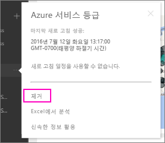

# Power BI 조직 콘텐츠 팩에 대한 연결 제거
동료가 콘텐츠 팩을 생성했습니다. 귀하가 AppSource에서 이 콘텐츠 팩을 검색하고 Power BI 작업 영역에 추가했습니다. 이제 더 이상 필요하지 않습니다.  제거하려면 어떻게 해야 하나요?

콘텐츠 팩을 제거하려면 해당 데이터 집합을 제거합니다.  

* 왼쪽 탐색 창에서 데이터 집합 오른쪽에 있는 줄임표를 선택하고 **제거 \> 예**를 선택합니다.  
  
  

데이터 집합을 제거하면 연결된 모든 보고서 및 대시보드도 제거됩니다. 하지만 콘텐츠 팩에 대한 연결을 제거하더라도 조직의 AppSource에서 콘텐츠 팩이 삭제되지 않습니다.  항상 AppSource로 돌아가서 콘텐츠 팩을 작업 영역에 다시 추가할 수 있습니다. 콘텐츠를 만든 경우 [AppSource에서 콘텐츠 팩을 삭제](service-organizational-content-pack-manage-update-delete.md)할 수 있습니다.

## 다음 단계
* [조직 콘텐츠 팩 소개](service-organizational-content-pack-introduction.md) 
* [Power BI에서 앱 만들기 및 배포](service-create-distribute-apps.md) 
* [Power BI 기본 개념](service-basic-concepts.md)  
* 궁금한 점이 더 있나요? [Power BI 커뮤니티를 이용하세요.](http://community.powerbi.com/)

