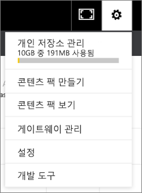

# 조직 콘텐츠 팩 관리, 업데이트 및 삭제
> [!NOTE]
> 새 *앱*에 대해 아직 못 들으셨나요? 앱은 Power BI에서 대규모 대상에게 콘텐츠를 배포하는 새로운 방법입니다. 조직 콘텐츠 팩이나 읽기 전용 작업 영역 대신 앱을 사용하는 것이 좋습니다. [앱](service-install-use-apps.md)에서 자세히 알아보세요.
> 
> 

대시보드, 보고서, Excel 통합 문서 및 데이터 집합을 [조직 콘텐츠 팩](service-organizational-content-pack-introduction.md)으로 패키징하고 동료와 공유할 수 있습니다. 동료는 이것을 그대로 사용하거나 자신만의 복사본을 만들 수 있습니다.

콘텐츠 팩을 만드는 것은 대시보드를 공유하거나 그룹 내에서 공동 작업하는 것과 다릅니다. [대시보드 및 보고서를 공동 작업 및 공유하는 방법](service-how-to-collaborate-distribute-dashboards-reports.md)에 대해 알아보고 상황에 맞는 최상의 옵션을 결정하세요.

콘텐츠 팩 작성자일 경우 일부 조직 콘텐츠 팩 작업만 수행할 수 있습니다.

* 다시 게시
* 콘텐츠 팩에 대한 액세스 제한 또는 확장
* 예약된 새로 고침 설정 및 변경
* 콘텐츠 팩 삭제

## 조직 콘텐츠 팩 수정 및 다시 게시
원래 콘텐츠 팩 대시보드, 보고서 또는 Excel 통합 문서를 변경하는 경우 Power BI에서 다시 게시할지 묻는 메시지가 표시됩니다. 또한 콘텐츠 팩 작성자로 원래 콘텐츠 팩을 만들 때 콘텐츠 팩 만들기 창에서 선택한 옵션을 업데이트할 수 있습니다. 

## 새 콘텐츠 다시 게시
콘텐츠 팩에 포함된 대시보드를 변경하고 저장하면 Power BI에서 다른 사람이 변경 내용을 볼 수 있도록 알려줍니다. 예를 들어, 새 타일을 고정하거나 대시보드의 이름을 단순히 변경하는 경우 알림을 제공합니다.

1. 메시지에서 **콘텐츠 팩 보기**를 선택합니다.
   
   
2. 또는 오른쪽 위 모퉁이에서 톱니바퀴 아이콘 을 선택하고 **콘텐츠 팩 보기**를 선택합니다.
   
   
   
   경고 아이콘 이 표시됩니다.  이렇게 하면 어떤 방식으로든 콘텐츠 팩을 수정했고 게시했던 내용이 더 이상 일치하지 않음을 알 수 있습니다.
3. **편집**을 선택합니다.  
4. **콘텐츠 팩 업데이트** 창에서 필요한 변경을 수행하고 **업데이트**를 선택합니다. **성공** 메시지가 나타납니다.
   
   * 콘텐츠 팩을 사용자 지정하지 않은 그룹 구성원인 경우 업데이트가 자동으로 적용됩니다.
   * 콘텐츠 팩을 사용자 지정한 그룹 구성원은 새 버전이 있다는 알림을 받게 됩니다.  구성원은 AppSource로 가서 자신의 개인 설정된 버전을 손실하지 않고도 업데이트된 콘텐츠 팩을 얻을 수 있습니다.  이제 구성원에게는 개인 설정된 버전과 업데이트된 콘텐츠 팩의 두 가지 버전이 있습니다.  개인 설정된 버전에서 원래 콘텐츠 팩의 모든 타일이 사라집니다.  그러나 다른 보고서에서 고정한 타일은 계속 렌더링됩니다.    

## 대상 그룹 업데이트: 액세스 확장 또는 제한
콘텐츠 팩 작성자에 제공되는 다른 수정 항목으로는 콘텐츠 팩에 대한 액세스를 확장 및 제한하는 것입니다.  사용자는 콘텐츠 팩을 광범위한 대상 그룹에 게시했고 작은 그룹에 대한 액세스를 제한하도록 결정했을 것입니다.  

1. 톱니 아이콘 을 선택하고 **콘텐츠 팩 보기**를 선택합니다.
2. **편집**을 선택합니다. 
3. **콘텐츠 팩 업데이트** 창에서 필요한 변경을 수행하고 **업데이트**를 선택합니다. 예를 들어 **특정 그룹** 필드에서 원래 메일 그룹을 삭제하고 구성원 수가 적은 다른 메일 그룹으로 바꿉니다.
   
   성공 메시지가 나타납니다.
   
   새 별칭에 포함되지 않은 동료의 경우:
   
   * 콘텐츠 팩을 사용자 지정하지 않은 그룹 구성원인 경우 해당 콘텐츠 팩과 연결된 대시보드 및 보고서를 더 이상 사용할 수 없고 콘텐츠 팩이 탐색 창에 표시되지 않습니다.
   * 콘텐츠 팩을 사용자 지정한 그룹 구성원인 경우 다음에 사용자 지정된 대시보드를 열 때 원래 콘텐츠 팩의 모든 타일이 사라집니다.  그러나 다른 보고서에서 고정한 타일은 계속 렌더링됩니다. 원래 콘텐츠 팩 보고서 및 데이터 집합은 더 이상 사용할 수 없으며 콘텐츠 팩이 탐색 창에 나타나지 않습니다.   

## 조직 콘텐츠 팩 새로 고침
콘텐츠 팩 작성자로 [데이터 집합의 새로 고침을 예약](refresh-data.md)할 수 있습니다.  콘텐츠 팩을 만들고 업로드하는 경우 새로 고침 일정이 데이터 집합으로 업로드됩니다. 새로 고침 일정을 변경하는 경우 콘텐츠 팩을 다시 게시해야 합니다.(위 참조)

## AppSource에서 조직 콘텐츠 팩 삭제
콘텐츠 팩을 만든 경우 AppSource에서 그것을 삭제할 수 있습니다. 

> [!TIP]
> 다른 사람이 만든 [콘텐츠 팩에 대한 연결을 삭제](service-organizational-content-pack-disconnect.md)할 수 있습니다. AppSource에서 콘텐츠 팩을 삭제하지 않습니다.
> 
> 

1. AppSource에서 콘텐츠 팩을 삭제하려면 콘텐츠 팩을 만든 앱 작업 영역으로 이동하여 톱니바퀴 아이콘 을 선택하고 **콘텐츠 팩 보기**를 합니다.
2. **삭제 \> 삭제**를 선택합니다. 
   
   * 콘텐츠 팩을 사용자 지정하지 않은 그룹 구성원의 경우 해당 콘텐츠 팩과 연결된 대시보드 및 보고서가 자동으로 제거됩니다. 이러한 대시보드 및 보고서는 더 이상 사용할 수 없으며 콘텐츠 팩이 탐색 창에 표시되지 않습니다.
   * 콘텐츠 팩을 사용자 지정한 그룹 구성원인 경우 다음에 사용자 지정된 대시보드를 열 때 원래 콘텐츠 팩의 모든 타일이 사라집니다.  그러나 다른 보고서에서 고정한 타일은 계속 렌더링됩니다. 원래 콘텐츠 팩 보고서 및 데이터 집합은 더 이상 사용할 수 없으며 콘텐츠 팩이 탐색 창에 나타나지 않습니다.   

## 다음 단계
* [조직 콘텐츠 팩 소개](service-organizational-content-pack-introduction.md)
* [Power BI에서 앱 만들기 및 배포](service-create-distribute-apps.md) 
* 궁금한 점이 더 있나요? [Power BI 커뮤니티를 이용하세요.](http://community.powerbi.com/)

