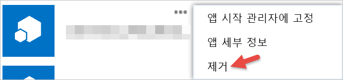

# 타사 앱 시작

Power BI를 통해 Microsoft 이외의 회사 또는 개인이 빌드한 앱을 사용할 수 있습니다. 예를 들어 사용자 지정 작성된 웹 애플리케이션에 Power BI 타일을 통합하는 타사 앱을 사용할 수 있습니다. 타사 앱을 사용할 경우 Power BI 계정 및 리소스에 대한 특정 사용 권한을 해당 애플리케이션에 부여하라는 메시지가 표시됩니다. 알고 있고 신뢰할 수 있는 애플리케이션에만 사용 권한을 부여해야 합니다. 언제든지 애플리케이션에 대한 사용 권한을 해지할 수 있습니다. [타사 앱 사용 권한 해지](#revoke)를 참조하세요.

애플리케이션에서 요청할 수 있는 액세스 유형은 다음과 같습니다.

## Power BI 앱 사용 권한

* **모든 대시보드 보기**
  
  * 이 사용 권한은 사용자가 액세스할 수 있는 모든 대시보드를 볼 수 기능을 애플리케이션에 제공합니다. 여기에는 사용자의 고유한 대시보드, 사용자가 콘텐츠 팩에서 가져온 대시보드, 사용자와 공유된 대시보드, 사용자가 소속된 그룹의 대시보드가 포함됩니다. 애플리케이션에서 대시보드를 수정할 수는 없습니다. 무엇보다도 애플리케이션에서 이 사용 권한을 사용하여 사용자의 대시보드 콘텐츠를 해당 환경에 포함할 수 있습니다.

* **모든 보고서 보기**
  
  * 이 사용 권한은 사용자가 액세스할 수 있는 모든 보고서를 볼 수 기능을 애플리케이션에 제공합니다. 여기에는 사용자의 고유한 대시보드, 사용자가 콘텐츠 팩에서 가져온 대시보드, 사용자가 소속된 그룹의 대시보드가 포함됩니다. 보고서를 볼 수 있다는 것은 애플리케이션에서 보고서 내의 데이터도 볼 수 있다는 뜻입니다. 애플리케이션에서 보고서 자체를 수정할 수는 없습니다. 무엇보다도 애플리케이션에서 이 사용 권한을 사용하여 사용자의 보고서 콘텐츠를 해당 환경에 포함할 수 있습니다.

* **모든 데이터 세트 보기**
  
  * 이 사용 권한은 사용자가 액세스할 수 있는 모든 데이터 세트를 나열하는 기능을 애플리케이션에 제공합니다. 여기에는 사용자가 소유한 데이터 세트, 콘텐츠 팩에서 가져온 대시보드가 포함되며 사용자가 속한 그룹에 있습니다. 애플리케이션에서 모든 데이터 세트의 이름뿐 아니라 테이블 및 열 이름을 포함한 구조까지 볼 수 있습니다. 이 사용 권한은 데이터 세트의 데이터를 읽을 수 있는 권한을 부여합니다. 이 사용 권한은 애플리케이션에서 데이터 세트를 변경하거나 항목을 추가하는 권한을 제공하지 않습니다.
* **모든 데이터 세트 읽기 및 쓰기**
  
  * 이 사용 권한은 사용자가 액세스할 수 있는 모든 데이터 세트를 나열하는 기능을 애플리케이션에 제공합니다. 여기에는 사용자가 소유한 데이터 세트, 콘텐츠 팩에서 가져온 대시보드가 포함되며 사용자가 속한 그룹에 있습니다. 애플리케이션에서 모든 데이터 세트의 이름뿐 아니라 테이블 및 열 이름을 포함한 구조까지 볼 수 있습니다. 이 사용 권한은 데이터 세트의 데이터를 읽고 쓸 수 있는 권한을 부여합니다. 또한 애플리케이션에서 새 데이터 세트를 만들고, 기존 데이터 세트를 수정할 수 있습니다. 이 사용 권한은 Power BI로 직접 데이터를 보내는 애플리케이션에 주로 사용됩니다.

* **사용자 그룹 보기**
  
  * 이 사용 권한은 사용자가 소속된 모든 그룹을 나열하는 기능을 애플리케이션에 제공합니다. 나열된 다른 사용 권한과 함께 이 사용 권한을 사용하여 특정 그룹에 대한 콘텐츠를 보거나 업데이트할 수 있습니다. 애플리케이션에서 그룹 자체를 수정할 수는 없습니다.

<a name="revoke"/>

## 타사 앱 사용 권한 해지

Office 365 내 앱 사이트로 이동하여 타사 앱에 대한 사용 권한을 취소합니다.

**Office 365 내 앱** 사이트에서 타사 사용 권한을 취소하는 방법은 다음과 같습니다.

1. [Office 365 내 앱 사이트](https://portal.office.com/myapps)로 이동합니다.

2. **내 앱** 페이지에서 타사 앱을 찾습니다.

3. 앱 타일을 마우스로 가리키고 **(...)** 단추를 클릭하고 **제거**를 클릭합니다.

   