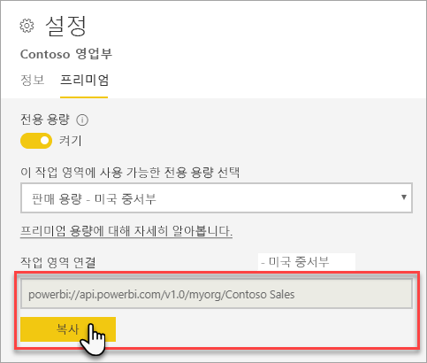
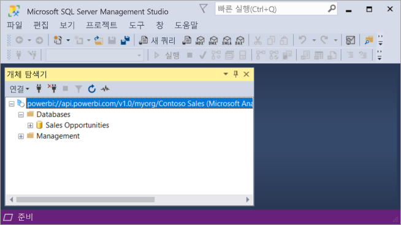

# 클라이언트 애플리케이션 및 도구를 사용하여 데이터 세트에 연결(미리 보기)

Power BI Premium 작업 영역 및 데이터 세트는 Microsoft 및 타사 클라이언트 애플리케이션 및 도구에서 *읽기 전용* 연결을 지원합니다. 기본적으로 연결이 사용됩니다.

> [!NOTE]
> 이 문서는 Power BI Premium 작업 영역 및 데이터 세트에 대한 읽기 전용 연결만을 소개하기 위한 것입니다. 프로그래밍 기능, 도구 및 애플리케이션, 아키텍처 및 작업 영역과 데이터 세트 관리에 대한 자세한 정보를 제공하기 것은 *아닙니다*. 여기에 설명된 주제는 Analysis Services 테이블 형식 모델 데이터베이스 아키텍처 및 관리에 대한 확실한 이해를 필요로 합니다.

## 프로토콜

Power BI Premium은 클라이언트 애플리케이션과 작업 영역 및 데이터 세트를 관리하는 엔진 간의 통신을 위해 [XML for Analysis](https://docs.microsoft.com/bi-reference/xmla/xml-for-analysis-xmla-reference)(XMLA) 프로토콜을 사용합니다. 이러한 통신은 일반적으로 XMLA 엔드포인트라고 하는 것을 통해 이루어집니다. XMLA는 내부적으로 Power BI의 의미 체계 모델링, 거버넌스, 수명 주기 및 데이터 관리를 실행하는 Microsoft Analysis Services 엔진에서 사용되는 것과 동일한 통신 프로토콜입니다. 

대부분의 클라이언트 애플리케이션과 도구는 XMLA 엔드포인트를 사용하여 엔진과 명시적으로 통신하지 않습니다. 대신 XMLA를 사용하여 단독으로 통신하는 클라이언트 애플리케이션과 엔진 간의 중개자로 MSOLAP, ADOMD 및 AMO와 같은 클라이언트 라이브러리를 사용합니다.

## 지원되는 도구

이러한 도구는 Power BI Premium 작업 영역 및 데이터 세트에 대한 읽기 전용 액세스를 지원합니다.

**SSMS(SQL Server Management Studio)** - DAX, MDX, XMLA 및 TraceEvent 쿼리를 지원합니다. 18.0 버전이 필요합니다. [여기서](https://docs.microsoft.com/sql/ssms/download-sql-server-management-studio-ssms) 다운로드합니다. 

**SQL Server Profiler** - SSMS 18.0(미리 보기)에 포함된 이 도구는 서버 이벤트 추적 및 디버깅을 제공합니다. 각 이벤트에 대한 데이터를 캡처하고 파일이나 테이블에 저장하여 나중에 분석할 수 있습니다. 공식적으로 SQL Server용으로 사용되지 않지만 Profiler는 SSMS에 계속 포함되며 Analysis Services 및 현재 Power BI Premium에 대한 지원을 계속합니다. 자세한 내용은 [SQL Server Profiler](https://docs.microsoft.com/sql/tools/sql-server-profiler/sql-server-profiler)를 참조하세요.

**DAX Studio** - Analysis Services에 대한 DAX 쿼리를 실행 및 분석하기 위한 오픈 소스 커뮤니티 도구입니다. 버전 2.8.2 이상이 필요합니다. 자세한 내용은 [daxstudio.org](https://daxstudio.org/)를 참조하세요.

**Excel 피벗 테이블** - Click-to-Run 버전의 Office 16.0.11326.10000 이상이 필요합니다.

**타사** - Power BI Premium의 데이터 세트에 연결, 쿼리 및 사용할 수 있는 클라이언트 데이터 시각화 애플리케이션 및 도구가 포함됩니다. 대부분의 도구에는 MSOLAP 클라이언트 라이브러리의 최신 버전이 필요하지만 일부는 ADOMD를 사용할 수 있습니다.

## 클라이언트 라이브러리

클라이언트 라이브러리는 Power BI Premium 작업 영역에 연결하기 위한 클라이언트 애플리케이션과 도구가 필요합니다. Analysis Services에 연결하는 데 사용되는 것과 동일한 클라이언트 라이브러리도 Power BI Premium에서 지원됩니다. Excel, SSMS(SQL Server Management Studio) 및 SSDT(SQL Server Data Tools)와 같은 Microsoft 클라이언트 애플리케이션은 세 개의 클라이언트 라이브러리를 모두 설치하고 이를 일반 애플리케이션 업데이트와 함께 업데이트합니다. 경우에 따라, 특히 타사 애플리케이션과 도구를 사용하여 클라이언트 라이브러리의 최신 버전을 설치해야 할 수 있습니다. 클라이언트 라이브러리는 매월 업데이트됩니다. 자세한 내용은 [Analysis Services에 연결하기 위한 클라이언트 라이브러리](https://docs.microsoft.com/azure/analysis-services/analysis-services-data-providers)를 참조하세요.

## 프리미엄 작업 영역에 연결

프리미엄 전용 용량에 할당된 작업 영역에 연결할 수 있습니다. 전용 용량에 할당된 작업 영역에는 URL 형식의 연결 문자열이 있습니다. 

작업 영역 연결 문자열을 가져오려면 Power BI의 **작업 영역 설정**에 있는 **Premium** 탭의 **작업 영역 연결**에서 **복사**를 클릭합니다.

작업 영역 연결은 다음 URL 형식을 사용하여 작업 영역을 Analysis Services 서버 이름인 것처럼 처리합니다.   
`powerbi://api.powerbi.com/v1.0/[tenant name]/[workspace name]` 

예: `powerbi://api.powerbi.com/v1.0/contoso.com/Sales Workspace`

### SSMS에 연결하려면

**서버에 연결** > **서버 유형**에서 **Analysis Services**를 선택합니다. **서버 이름**에 URL을 입력합니다. **인증**에서 **Active Directory - MFA를 통한 유니버셜 인증**을 선택한 다음, **사용자 이름**에 조직 사용자 ID를 입력합니다. 

연결되면 작업 영역은 Analysis Services 서버로 표시되고 작업 영역의 데이터 세트는 데이터베이스로 표시됩니다.  

### 초기 카탈로그

SQL Server Profiler와 같은 일부 도구는 *초기 카탈로그*를 지정해야 할 수 있습니다. 작업 영역에 데이터 세트(데이터베이스)를 지정합니다. **서버에 연결**에서 **옵션**을 클릭합니다. **서버에 연결** 대화 상자의 **연결 속성** 탭에서 **데이터베이스에 연결**에 데이터 세트 이름을 입력합니다.

### 중복 작업 영역 이름

다른 작업 영역과 이름이 같은 작업 영역에 연결할 때 다음 오류가 발생할 수 있습니다. **powerbi://api.powerbi.com/v1.0/[tenant name]/[workspace name]에 연결할 수 없습니다.**

이 오류를 해결하려면 작업 영역 이름 외에 URL의 작업 영역 objectID에서 복사할 수 있는 ObjectIDGuid를 지정합니다. 연결 URL에 objectID를 추가합니다. 예: `powerbi://api.powerbi.com/v1.0/myorg/Contoso Sales - 9d83d204-82a9-4b36-98f2-a40099093830'

### 중복 데이터 세트 이름

동일한 작업 영역에서 다른 데이터 세트와 동일한 이름을 가진 데이터 세트에 연결할 때 데이터 세트 이름에 데이터 세트 guid를 추가합니다. SSMS의 작업 영역에 연결하는 경우 두 데이터 세트 이름 *및* guid를 모두 가져올 수 있습니다. 

### 표시된 데이터 세트의 지연

작업 영역에 연결할 때 새 데이터 세트, 삭제된 데이터 세트 및 이름이 바뀐 데이터 세트의 변경 내용이 표시되는 데 최대 5분이 소요될 수 있습니다. 

### 지원되지 않는 데이터 세트

다음 데이터 세트는 XMLA 엔드포인트를 사용하여 액세스할 수 없습니다. 이러한 데이터 세트는 SSMS 또는 다른 도구의 작업 영역 아래에 나타나지 *않습니다*. 

- Analysis Services 모델에 라이브 연결이 포함된 데이터 세트. 
- REST API를 사용하여 Push 데이터를 포함하는 데이터 세트.
- Excel 통합 문서 데이터 세트. 

다음 데이터 세트는 Power BI 서비스에서 지원되지 않습니다.   

- Power BI 데이터 세트에 라이브 연결이 포함된 데이터 세트.

### 역할 및 역할 멤버 자격

현재 모델 역할 및 역할 멤버 자격은 검색할 수 없거나 XMLA 엔드포인트를 사용하여 표시되지 않습니다.

## 연결 사용 안 함

기본적으로 데이터 세트 워크로드에서 XMLA 엔드포인트 연결이 사용됩니다. [워크로드 설정](service-admin-premium-workloads.md#workload-settings)에서 연결을 사용하지 않도록 설정할 수 있습니다.

## 감사 로그 

클라이언트 애플리케이션 및 도구가 작업 영역에 연결되면 XMLA 엔드포인트를 통한 액세스는 **GetWorkspaces** 작업 아래의 Power BI 감사 로그에 기록됩니다. 자세한 내용은 [Power BI 감사](service-admin-auditing.md)를 참조하세요.

## 참고 항목

[Analysis Services 참조](https://docs.microsoft.com/bi-reference/#pivot=home&panel=home-all)   
[SQL Server Management Studio](https://docs.microsoft.com/sql/ssms/sql-server-management-studio-ssms)   
[SQL Server Analysis Services 표 형식 프로토콜](https://docs.microsoft.com/openspecs/sql_server_protocols/ms-ssas-t/b98ed40e-c27a-4988-ab2d-c9c904fe13cf)   
[동적 관리 뷰(DMV)](https://docs.microsoft.com/sql/analysis-services/instances/use-dynamic-management-views-dmvs-to-monitor-analysis-services)   

궁금한 점이 더 있나요? [Power BI 커뮤니티에 질문합니다.](https://community.powerbi.com/)
