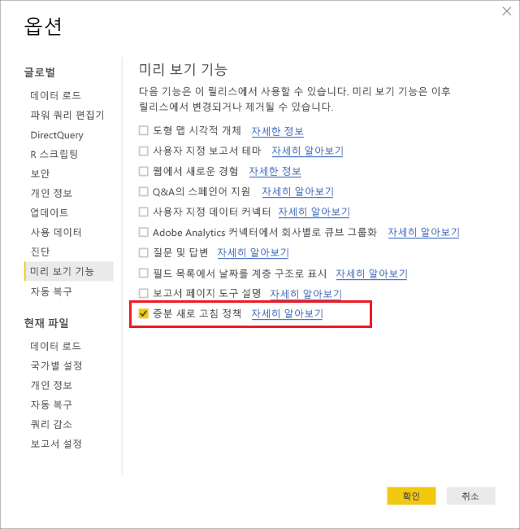
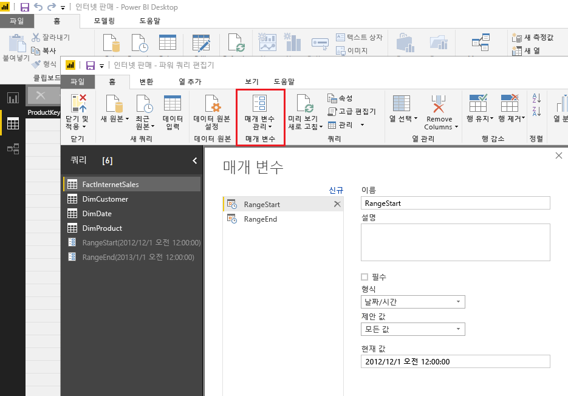
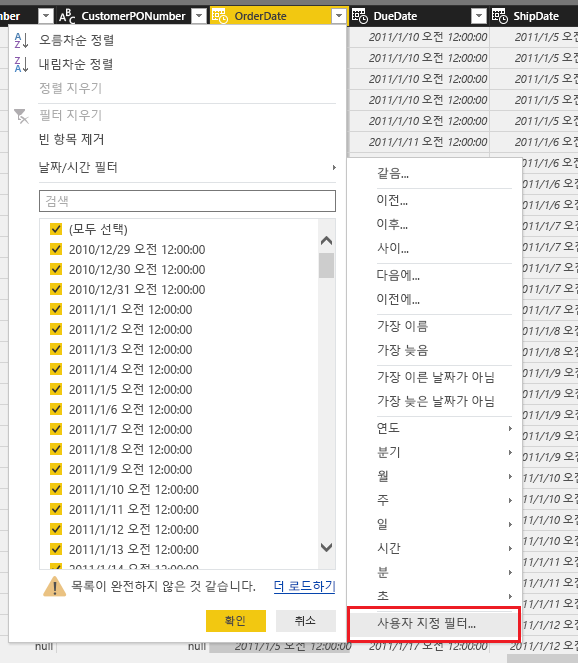
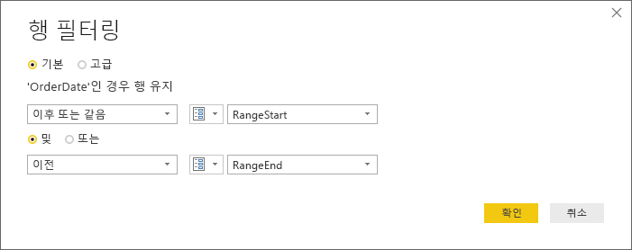
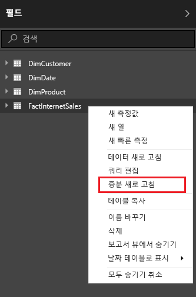
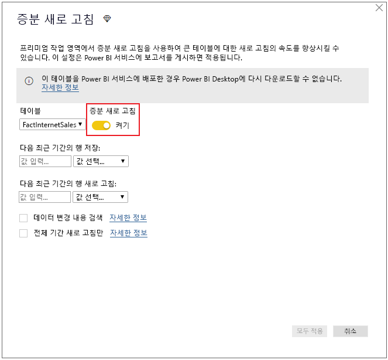
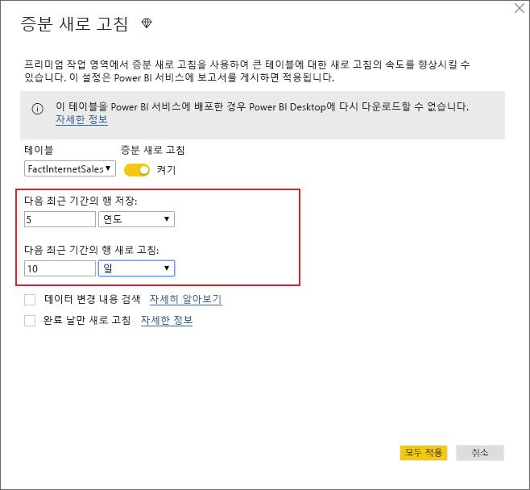
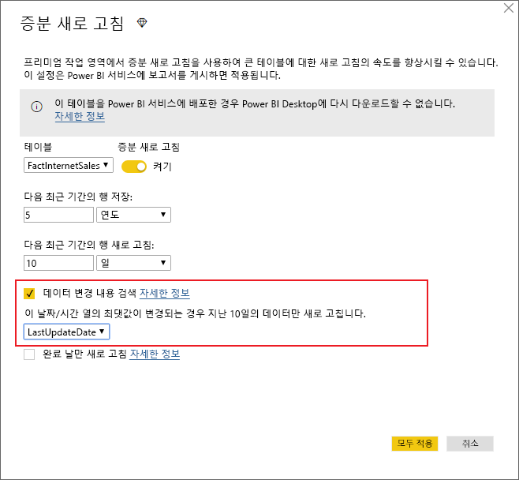
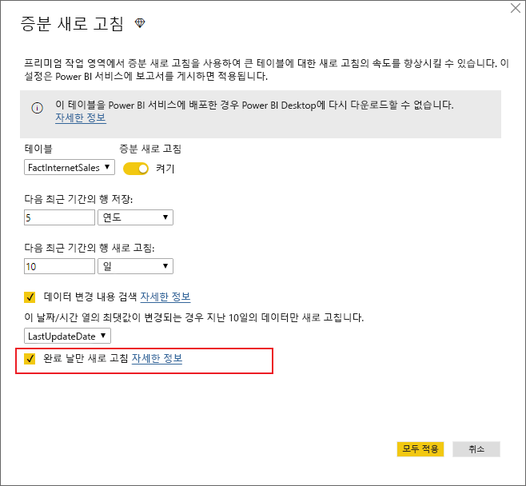
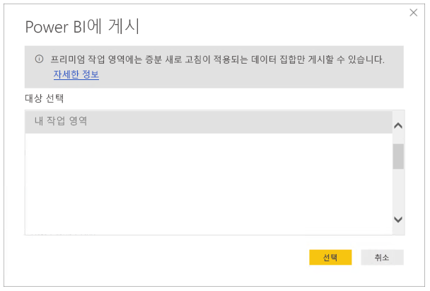

# <a name="incremental-refresh-in-power-bi-premium"></a>Power BI Premium의 증분 새로 고침

증분 새로 고침을 사용하면 다음과 같은 이점이 있는 Power BI Premium 서비스에서 매우 큰 데이터 집합을 사용할 수 있습니다.

- **새로 고침이 더 빠릅니다.** 변경된 데이터만 새로 고칠 필요가 있습니다. 예를 들어 10년 데이터 집합의 마지막 5일만 새로 고칩니다.

- **새로 고침이 더 안정적입니다.** 예를 들어 휘발성 원본 시스템에 대한 장기 실행 연결을 유지할 필요가 없습니다.

- **리소스 사용이 줄어듭니다.** 새로 고칠 데이터가 적어지므로 메모리 및 기타 리소스 사용을 전반적으로 줄여줍니다.

## <a name="how-to-use-incremental-refresh"></a>증분 새로 고침을 사용하는 방법

증분 새로 고침 정책은 Power BI Desktop에서 정의되고, Power BI 서비스에 게시되면 적용됩니다.

먼저 미리 보기 기능에서 증분 새로 고침을 사용하도록 설정합니다.



### <a name="filter-large-datasets-in-power-bi-desktop"></a>Power BI Desktop에서 큰 데이터 집합 필터링

잠재적으로 수십억 개의 행이 있는 큰 데이터 집합은 일반적으로 사용자의 데스크톱 PC에서 사용할 수 있는 리소스에서 제한하므로 Power BI Desktop에 적합하지 않을 수 있습니다. 따라서 이러한 데이터 집합은 일반적으로 가져올 때 Power BI Desktop에 맞게 필터링됩니다. 이는 증분 새로 고침을 사용하는지 여부에 관계없이 계속됩니다.

#### <a name="rangestart-and-rangeend-parameters"></a>RangeStart 및 RangeEnd 매개 변수

Power BI 서비스에서 증분 새로 고침을 활용하려면 예약된 **RangeStart** 및 **RangeEnd**(대/소문자 구분 이름)이 포함된 파워 쿼리 날짜/시간 매개 변수를 사용하여 필터링을 수행해야 합니다.

파워 쿼리 편집기에서 **매개 변수 관리**를 선택하여 매개 변수를 기본값으로 정의합니다.



정의된 매개 변수를 사용하면 열에 대한 **사용자 지정 필터** 메뉴 옵션을 선택하여 필터를 적용할 수 있습니다.



열 값이 **RangeStart***보다 이후이거나 같고* **RangeEnd**보다 *이전*인 행이 필터링되는지 확인합니다.



> [!TIP]
> 매개 변수의 데이터 형식은 날짜/시간이어야 하지만 데이터 원본의 요구 사항에 맞게 변환할 수 있습니다. 예를 들어, 다음 파워 쿼리 함수는 날짜/시간 값을 데이터 웨어하우스에 일반적인 *yyyymmdd* 형식의 정수 서로게이트 키와 비슷한 값으로 변환합니다. 이 함수는 필터 단계에서 호출할 수 있습니다.
>
> `(x as datetime) => Date.Year(x)*10000 + Date.Month(x)*100 + Date.Day(x)`

파워 쿼리 편집기에서 **닫기 및 적용**을 선택합니다. 데이터 집합의 하위 집합이 Power BI Desktop에 있습니다.

> [!NOTE]
> 일단 게시되면 Power BI 서비스에서 매개 변수 값이 자동으로 재정의됩니다. 따라서 데이터 집합 설정에서 이를 설정할 필요가 없습니다.

### <a name="define-the-refresh-policy"></a>새로 고침 정책 정의

증분 새로 고침은 라이브 연결 모델을 제외하고 테이블의 상황에 맞는 메뉴에서 사용할 수 있습니다.



#### <a name="incremental-refresh-dialog"></a>증분 새로 고침 대화 상자

증분 새로 고침 대화 상자가 표시됩니다. 토글을 사용하여 대화 상자를 사용하도록 설정합니다.



> [!NOTE]
> 테이블에 대한 파워 쿼리 식에서 예약된 이름의 매개 변수를 참조하지 않는 경우 토글이 비활성화되어 있습니다.

머리글 텍스트에서 설명하는 내용은 다음과 같습니다.

-   증분 새로 고침은 프리미엄 용량의 작업 영역에서만 지원됩니다. 새로 고침 정책은 Power BI Desktop에서 정의되며, 서비스의 새로 고침 작업을 통해 적용됩니다.

-   Power BI 서비스에서 증분 새로 고침 정책이 포함된 PBIX 파일을 다운로드할 수 있으면 Power BI Desktop에서 열리지 않습니다. 곧 다운로드할 수 없게 됩니다. 이는 앞으로도 지원될 수 있지만, 이러한 데이터 집합이 일반 데스크톱 PC에서 다운로드하고 열 수 없을 정도로 커질 수 있다는 점에 주의하세요.

#### <a name="refresh-ranges"></a>범위 새로 고침

다음 예에서는 전체적으로 5년 동안의 데이터를 저장하고, 10일 분량의 데이터를 증분 방식으로 새로 고치는 새로 고침 정책을 정의합니다. 데이터 집합을 매일 새로 고치는 경우 각 새로 고침 작업에서 수행되는 작업은 다음과 같습니다.

-   새 날짜의 데이터를 추가합니다.

-   현재 날짜까지 10일을 새로 고칩니다.

-   현재 날짜에서 5년을 초과하는 오래된 역년을 삭제합니다. 예를 들어 현재 날짜가 2019년 1월 1일이면 2013년이 제거됩니다.

Power BI 서비스의 첫 번째 새로 고침에서 5년 동안의 데이터를 모두 가져오는 데 시간이 오래 걸릴 수 있습니다. 이후의 새로 고침은 짧은 시간 내에 완료될 수 있습니다.



**이러한 범위에 대한 정의는 필요한 모든 것일 수 있으며, 이 경우 아래의 게시 단계로 바로 이동할 수 있습니다. 추가 드롭다운은 고급 기능을 위한 것입니다.**

#### <a name="detect-data-changes"></a>데이터 변경 내용 검색

10일 증분 새로 고침은 5년 전체 새로 고침보다 훨씬 더 효율적입니다. 그러나 훨씬 더 효율적으로 수행할 수 있습니다. **데이터 변경 내용 검색** 확인란을 선택하면 데이터가 변경된 날짜만 식별하고 새로 고치는 데 사용되는 날짜/시간 열을 선택할 수 있습니다. 여기서는 이러한 열이 일반적으로 감사 목적으로 원본 시스템에 있다고 가정합니다. 이 열의 최댓값은 증분 범위의 각 기간에 대해 계산됩니다. 마지막 새로 고침 이후 변경되지 않은 경우 기간을 새로 고칠 필요가 없습니다. 예를 들어 이 경우에는 증분 방식으로 새로 고치는 날짜를 10에서 2로 더 줄일 수 있습니다.



> [!TIP]
> 현재 설계에서는 데이터 변경 내용을 검색하는 열을 유지하고 메모리에 캐시해야 합니다. 카디널리티 및 메모리 사용을 줄이려면 다음 기술 중 하나를 사용하는 것이 좋을 수 있습니다.
>
> 파워 쿼리 함수를 사용하여 새로 고침 시간에 이 열의 최댓값만 유지합니다.
>
> 새로 고침 빈도 요구 사항에 따라 허용되는 수준으로 전체 자릿수를 줄입니다.
>
> 앞으로 데이터 변경 검색에 대한 사용자 지정 쿼리 정의를 허용할 예정입니다. 이를 사용하여 열 값을 모두 유지하지 않도록 방지할 수 있습니다.

#### <a name="only-refresh-complete-periods"></a>전체 기간 새로 고침만

새로 고침이 매일 오전 4시에 실행되도록 예약했다고 가정해 보겠습니다. 원본 시스템에 이 4시간 동안의 데이터가 표시되면 설명하지 않아도 됩니다. 석유 및 가스 산업의 일일 배럴과 같은 일부 비즈니스 지표에서 하루의 일정 시간은 의미가 없습니다.

또 다른 예로, 이전 월의 데이터가 다음 월의 12번째 역일에 승인되는 금융 시스템에서 데이터를 새로 고치는 경우가 있습니다. 증분 범위를 1개월로 설정하고, 새로 고침이 다음 월의 12일에 실행되도록 예약할 수 있습니다. 예를 들어 이 옵션을 선택하면 2월 12일에 1월 데이터를 새로 고칩니다.



> [!NOTE]
> 서비스의 새로 고침 작업은 UTC 시간으로 실행됩니다. 이 경우 유효 날짜를 결정하고 전체 기간에 영향을 줄 수 있습니다. 새로 고침 작업에 대한 유효 날짜를 재정의하는 기능을 추가할 예정입니다.

## <a name="publish-to-the-service"></a>서비스에 게시

증분 새로 고침은 프리미엄 전용 기능이므로 게시 대화 상자에서만 프리미엄 용량에 대한 작업 영역을 선택할 수 있습니다.



이제 모델을 새로 고칠 수 있습니다. 첫 번째 새로 고침에서 기록 데이터를 가져오는 데 시간이 오래 걸릴 수 있습니다. 이후의 새로 고침은 증분 새로 고침을 사용하므로 훨씬 더 빠를 수 있습니다.

## <a name="query-timeouts"></a>쿼리 시간 제한

[새로 고침 문제 해결](https://docs.microsoft.com/power-bi/refresh-troubleshooting-refresh-scenarios) 문서에서는 Power BI 서비스의 새로 고침 작업 시간을 제한할 수 있다고 설명합니다. 쿼리도 데이터 원본에 대한 기본 시간 제한으로 제한할 수 있습니다. 대부분의 관계형 원본은 M 식에서 시간 제한을 재정의할 수 있습니다. 예를 들어 아래 식에서는 [SQL Server 데이터 액세스 함수](https://msdn.microsoft.com/query-bi/m/sql-database)를 사용하여 시간 제한을 2시간으로 설정합니다. 정책 범위로 정의된 각 기간에는 명령 시간 제한 설정을 준수하는 쿼리가 제출됩니다.

```
let
    Source = Sql.Database("myserver.database.windows.net", "AdventureWorks", [CommandTimeout=#duration(0, 2, 0, 0)]),
    dbo_Fact = Source{[Schema="dbo",Item="FactInternetSales"]}[Data],
    #"Filtered Rows" = Table.SelectRows(dbo_Fact, each [OrderDate] >= RangeStart and [OrderDate] < RangeEnd)
in
    #"Filtered Rows"
```
