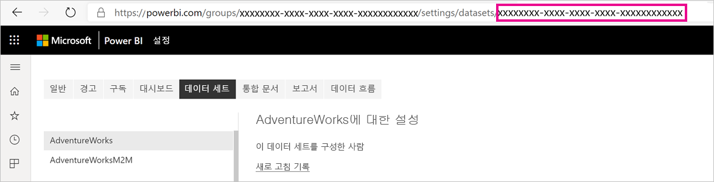
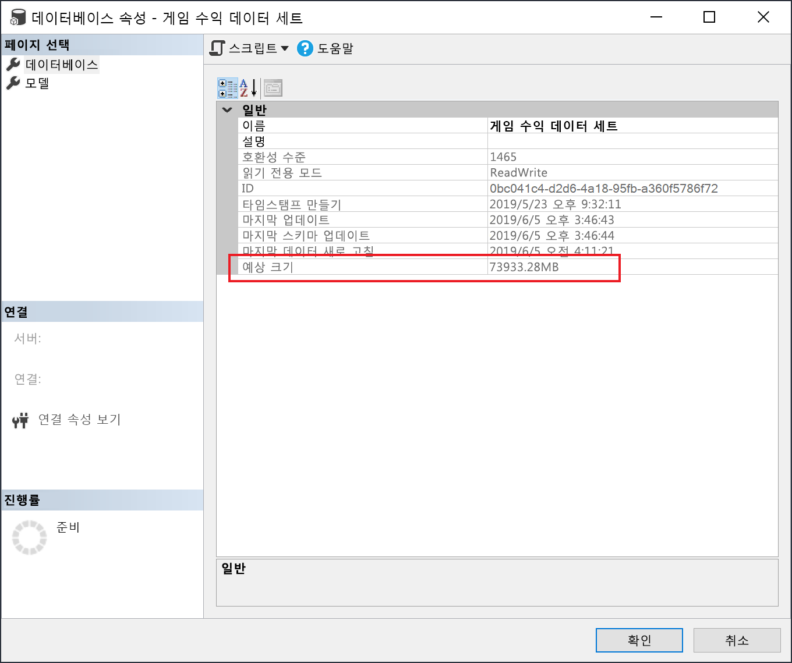

# <a name="large-models-in-power-bi-premium-preview"></a>Power BI Premium의 대형 모델(미리 보기)

Power BI 데이터 세트는 최적화된 쿼리 성능을 위해 압축률이 높은 메모리 내 캐시에 데이터를 저장할 수 있습니다. 이를 통해 사용자는 큰 데이터 세트에 대해 빠르게 대화형 작업을 수행할 수 있습니다. 대형 모델 기능을 사용하면 Power BI Premium의 데이터 세트가 10GB를 초과할 수 있습니다. 대신 데이터 세트의 크기가 Power BI Premium 용량 크기로 제한됩니다. 이는 모델 크기 제한에 대한 Azure Analysis Services의 작동 방식과 비슷합니다. Power BI Premium의 용량 크기에 대한 자세한 내용은 용량 노드를 참조하세요. 모든 Premium P SKU와 Embedded A SKU에 대해 대형 모델을 설정할 수 있지만 대형 모델은 [새 작업 영역](service-create-the-new-workspaces.md)에서만 작동합니다.

대형 모델은 PBIX 업로드 크기에 영향을 주지 않으며 PBIX 업로드 크기는 계속 10GB로 제한됩니다. 대신 새로 고칠 때 데이터 세트 크기가 10GB를 초과합니다. 증분 새로 고침을 사용하여 10GB를 초과하도록 데이터 세트를 구성할 수 있습니다.

## <a name="enable-large-models"></a>대형 모델 사용

10GB를 초과하는 데이터 세트를 만들려면 다음 단계를 수행합니다.

1. Power BI Desktop에서 데이터 세트를 만들고 [증분 새로 고침](service-premium-incremental-refresh.md)을 구성합니다.

1. Power BI Premium 서비스에 데이터 세트를 게시합니다.

1. 아래 PowerShell cmdlet을 실행하여 대형 모델에 데이터 세트를 사용하도록 설정합니다. 이러한 cmdlet을 실행하면 Azure Premium File에 데이터 세트가 저장되고 10GB 제한이 적용되지 않습니다.

1. 새로 고침을 호출하여 증분 새로 고침 정책에 따라 기록 데이터를 로드합니다. 처음 새로 고칠 때 기록을 로드하는 데 시간이 걸릴 수 있습니다. 이후에 새로 고칠 때는 증분하기 때문에 더 빠릅니다.

### <a name="powershell-cmdlets"></a>PowerShell cmdlet

최신 버전의 대형 모델에서는 PowerShell cmdlet을 통해 Premium Files 스토리지에 데이터 세트를 사용하도록 설정합니다. PowerShell cmdlet을 실행하려면 용량 관리자 및 작업 영역 관리자 권한이 있어야 합니다.

1. 데이터 세트 ID(GUID)를 찾습니다. 작업 영역에 대한 **데이터 세트** 탭의 데이터 세트 설정 아래에 표시되는 URL에서 ID를 확인할 수 있습니다.

    

1. PowerShell 관리자 프롬프트에서 [MicrosoftPowerBIMgmt](/powershell/module/microsoftpowerbimgmt.data/) 모듈을 설치합니다.

    ```powershell
    Install-Module -Name MicrosoftPowerBIMgmt
    ```

1. 다음 cmdlet을 실행하여 로그인하고 데이터 세트 스토리지 모드를 확인합니다.

    ```powershell
    Login-PowerBIServiceAccount

    (Get-PowerBIDataset -Scope Organization -Id <Dataset ID> -Include actualStorage).ActualStorage
    ```

    다음과 같은 응답을 받습니다. 스토리지 모드가 기본값인 ABF(Analysis Services 백업 파일)입니다.

    ```
    Id                   StorageMode

    --                   -----------

    <Dataset ID>         Abf
    ```

1. 다음 cmdlet을 실행하여 스토리지 모드를 Premium Files로 설정하고 확인합니다. Premium Files로 변환하는 데 몇 초 정도 걸릴 수 있습니다.

    ```powershell
    Set-PowerBIDataset -Id <Dataset ID> -TargetStorageMode PremiumFiles

    (Get-PowerBIDataset -Scope Organization -Id <Dataset ID> -Include actualStorage).ActualStorage
    ```

    다음과 같은 응답을 받습니다. 스토리지 모드가 Premium Files로 설정되었습니다.

    ```
    Id                   StorageMode
    
    --                   -----------
    
    <Dataset ID>         PremiumFiles
    ```

[Get-PowerBIWorkspaceMigrationStatus](/powershell/module/microsoftpowerbimgmt.workspaces/get-powerbiworkspacemigrationstatus) cmdlet을 사용하여 Premium Files에서 또는 Premium Files로 데이터 세트 변환 상태를 확인할 수 있습니다.

## <a name="dataset-eviction"></a>데이터 세트 제거

Power BI는 동적 메모리 관리를 사용하여 메모리에서 비활성 데이터 세트를 제거합니다. 사용자 쿼리 처리를 위해 다른 데이터 세트를 로드할 수 있도록 Power BI에서 데이터 세트를 제거할 수 있습니다. 동적 메모리 관리를 사용하면 데이터 세트 크기의 합이 용량에서 사용할 수 있는 메모리보다 훨씬 클 수 있지만 단일 데이터 세트가 메모리에 맞아야 합니다. 동적 메모리 관리에 대한 자세한 내용은 [용량 함수 작동 방법](service-premium-what-is.md#how-capacities-function)을 참조하세요.

제거가 대형 모델에 미치는 영향을 고려해야 합니다. 데이터 세트 로드 시간이 비교적 빠름에도 불구하고, 제거된 큰 데이터 세트가 다시 로드될 때까지 기다려야 하는 경우 상당한 지연이 발생할 수 있습니다. 이러한 이유로 대형 모델 기능은 셀프 서비스 BI 요구 사항과 혼합된 용량이 아닌 엔터프라이즈 BI 요구 사항 전용 용량에 주로 권장됩니다. 엔터프라이즈 BI 요구 사항 전용 용량은 제거를 자주 트리거하고 데이터 세트를 다시 로드해야 할 가능성이 낮습니다. 반면 셀프 서비스 BI용 용량에는 메모리에서 더 자주 로드되는 작은 데이터 세트가 많을 수 있습니다.

## <a name="checking-dataset-size"></a>데이터 세트 크기 확인

기록 데이터를 로드한 후 [XMLA 엔드포인트](service-premium-connect-tools.md)를 통해 [SSMS](https://docs.microsoft.com/sql/ssms/download-sql-server-management-studio-ssms)를 사용하여 모델 속성 창에서 예상 데이터 세트 크기를 확인할 수 있습니다.



SSMS에서 다음 DMV 쿼리를 실행하여 데이터 세트 크기를 확인할 수도 있습니다. 출력에서 DICTIONARY\_SIZE 열과 USED\_SIZE 열의 합을 구하여 데이터 세트 크기(바이트 단위)를 확인합니다.

```sql
SELECT * FROM SYSTEMRESTRICTSCHEMA
($System.DISCOVER_STORAGE_TABLE_COLUMNS,
 [DATABASE_NAME] = '<Dataset Name>') //Sum DICTIONARY_SIZE (bytes)

SELECT * FROM SYSTEMRESTRICTSCHEMA
($System.DISCOVER_STORAGE_TABLE_COLUMN_SEGMENTS,
 [DATABASE_NAME] = '<Dataset Name>') //Sum USED_SIZE (bytes)
```

## <a name="current-feature-restrictions"></a>현재 기능 제한 사항

대형 모델 사용 시 다음 제한 사항에 유의하세요.

- **BYOK(Bring Your Own Key) 암호화**: Premium Files에 사용되는 데이터 세트는 [BYOK](service-encryption-byok.md)로 암호화되지 않습니다.
- **다중 지역 지원**: Premium Files에 사용되는 데이터 세트는 [다중 지역](service-admin-premium-multi-geo.md)도 사용되는 용량에서 실패합니다.

- **Power BI Desktop으로 다운로드**: 데이터 세트가 Premium Files에 저장되는 경우 [.pbix 파일로 다운로드](service-export-to-pbix.md)가 실패합니다.
- **지원되는 지역**: Premium Files Storage를 지원하는 모든 Azure 지역에서 큰 모델이 지원됩니다. 자세한 내용은 [지역별 사용 가능한 제품](https://azure.microsoft.com/global-infrastructure/services/?products=storage)을 참조하세요.
