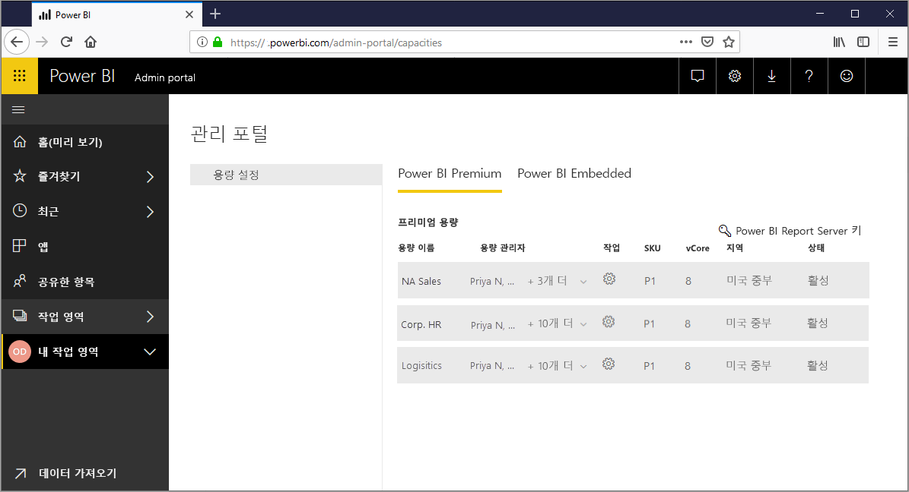
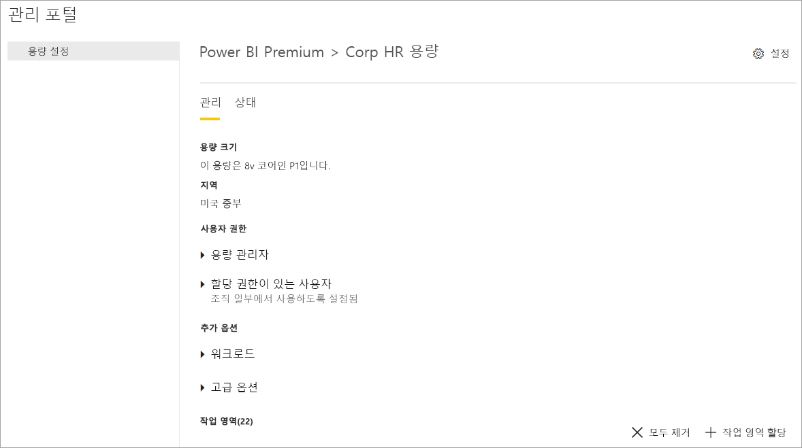
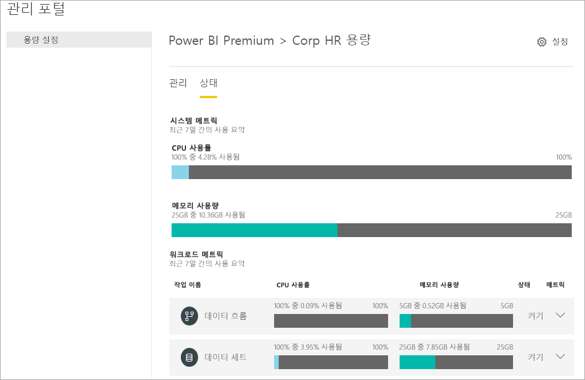
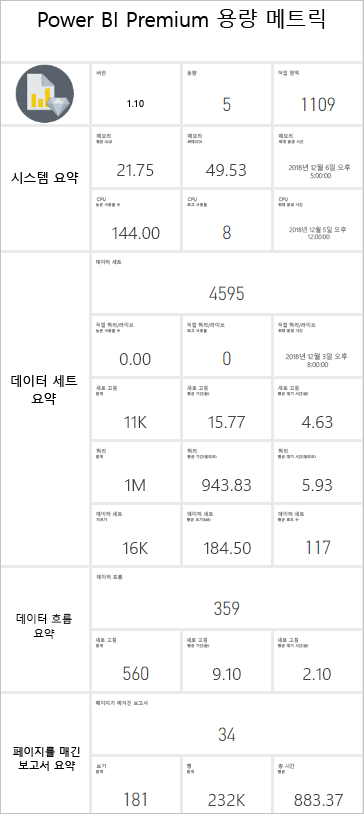
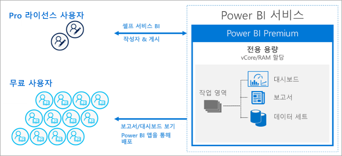
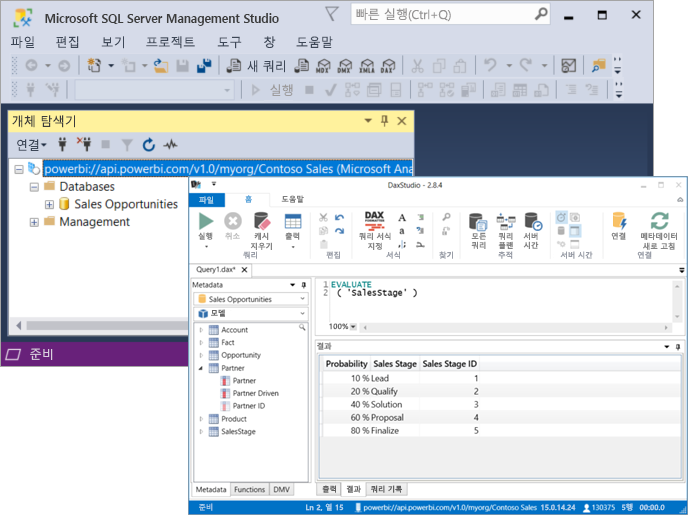

# Power BI Premium이란?

Power BI Premium은 조직에 대해 Power BI 서비스를 실행할 수 있는 전용 리소스와 향상된 리소스를 제공합니다. 예:

- 더 커진 규모 및 성능
- 용량별 라이선스 유연성
- 셀프 서비스 및 엔터프라이즈 BI 통합
- Power BI Report Server를 사용하여 온-프레미스 BI 확장
- 지역별 데이터 상주 지원(다중 지역)
- 사용자별 라이선스를 구입하지 않고 다른 사용자와 데이터 공유

이 문서는 Power BI Premium의 모든 기능에 대한 자세한 정보를 제공하는 것이 아니라 사실 표면적으로만 제공합니다. 필요한 경우 보다 자세한 정보가 포함된 추가 문서에 대한 링크를 제공합니다.

## 구독 및 라이선스

Power BI Premium은 두 개의 SKU(Stock-Keeping Unit) 제품군에서 사용할 수 있는 테넌트 수준 Office 365 구독입니다.

- 포함에 대한 **EM** SKU(EM1-EM3)는 매월 청구되며 연간 약정이 필요합니다. EM1 및 EM2 SKU는 볼륨 라이선스 계획을 통해서만 사용할 수 있습니다. 직접 구입할 수는 없습니다.
- 포함 및 엔터프라이즈 기능에 대한 **P** SKU(P1-P3)는 월간 또는 연간 약정이 필요하며 매월 청구되고 Power BI Report Server 온-프레미스를 설치하기 위한 라이선스를 포함합니다.

다른 방법은 포함 및 용량 테스트 목적으로만 사용할 수 있는 단일 **A**(A1-A6) SKU 제품군이 있는 **Azure Power BI Embedded** 구독을 구입하는 것입니다. 모든 SKU는 v 코어를 제공하여 용량을 만들지만 EM SKU는 소규모 포함용으로 제한됩니다. 4개 미만의 v 코어를 가진 EM1, EM2, A1 및 A2 SKU는 전용 인프라에서 실행되지 않습니다.

이 문서의 초점은 P SKU에 맞춰져 있지만 설명된 내용의 대부분은 A SKU와 관련이 있습니다. 프리미엄 구독 SKU와 달리 Azure SKU는 시간 약정 없이 시간당 청구됩니다. 크기 확장, 크기 축소, 일시 중지, 다시 시작 및 삭제를 가능하게 하는 완벽한 탄력성을 제공합니다. 

Azure Power BI Embedded는 이 문서의 범위를 크게 벗어나지만 워크로드를 테스트하고 측정하기 위한 실용적이고 경제적인 옵션으로 Optimizing Premium 용량 문서의 [Testing Approaches](service-premium-capacity-optimize.md#testing-approaches) 섹션에 설명되어 있습니다. Azure SKU에 대한 자세한 내용은 [Azure Power BI Embedded 설명서](https://azure.microsoft.com/services/power-bi-embedded/)를 참조하세요.

### 구매

Power BI Premium 구독은 Microsoft 365 관리 센터에서 관리자가 구입합니다. 특히, Office 365 글로벌 관리자 또는 대금 청구 관리자만 SKU를 구입할 수 있습니다. 구매 시 테넌트는 *v 코어 풀링*으로 알려진 용량에 할당할 해당 v 코어 수를 받습니다. 예를 들어 P3 SKU를 구매하면 32 V 코어의 테넌트를 제공합니다. 자세히 알아보려면 [Power BI Premium 구매 방법](service-admin-premium-purchase.md)을 참조하세요.

## 전용 용량

Power BI Premium을 사용하면 *전용 용량*을 가져올 수 있습니다. 워크로드가 다른 고객과 공유되는 계산 리소스에서 실행되는 공유 용량과는 달리 전용 용량은 조직에서 단독으로 사용하는 것입니다. 호스팅된 콘텐츠에 대해 신뢰할 수 있고 일관된 성능을 제공하는 전용 계산 리소스로 격리됩니다. 

작업 영역은 용량 내에 상주합니다. 각 Power BI 사용자는 **내 작업 영역**이라는 개인 작업 영역을 갖습니다. 협업 및 배포를 지원하기 위해 추가 작업 영역을 만들 수 있으며 이를 **앱 작업 영역**이라고 합니다. 기본적으로 개인 작업 영역을 포함한 작업 영역은 공유 용량에서 생성됩니다. 프리미엄 용량이 있는 경우 내 작업 영역 및 앱 작업 영역을 모두 프리미엄 용량에 할당할 수 있습니다.

### 용량 노드

[구독 및 라이선스](#subscriptions-and-licensing) 섹션에 설명된 것처럼 다음 두 개의 Power BI Premium SKU 제품군이 있습니다. **EM** 및 **P**. 모든 Power BI Premium SKU는 프로세서, 메모리 및 스토리지로 구성된 리소스 양을 나타내는 용량 *노드*로 제공됩니다. 리소스 외에도 각 SKU에는 초당 DirectQuery 및 Live Connection 수 및 병렬 모델 새로 고침 수에 대한 운영상의 제한이 있습니다.

프로세싱은 백 엔드와 프런트 엔드 간에 균등하게 나누어진 v 코어의 세트 수에 의해 이루어집니다.

**백 엔드 V 코어**는 쿼리 처리, 캐시 관리, R 서비스 실행, 모델 새로 고침, 자연어 처리(Q&A), 보고서 및 이미지의 서버 쪽 렌더링 비롯한 핵심 Power BI 기능을 담당합니다. 백 엔드 v 코어에는 주로 활성 데이터 세트라고도 하는 모델을 호스팅하는 데 사용되는 고정된 양의 메모리가 할당됩니다.

**프런트 엔드 V 코어**는 웹 서비스, 대시보드 및 보고서 문서 관리, 액세스 권한 관리, 예약, API, 업로드 및 다운로드, 일반적으로 사용자 환경과 관련된 모든 항목에 책임이 있습니다.

스토리지는 **용량 노드당 100TB**로 설정됩니다.

각 프리미엄 SKU(및 이와 동등한 크기의 A SKU)의 리소스 및 제한은 다음 표에 설명되어 있습니다.

| 용량 노드 | 총 V 코어 | 백 엔드 V 코어 | RAM(GB) | 프런트 엔드 V 코어 | DirectQuery/Live Connection(초당) | 모델 새로 고침 병렬 처리 |
| --- | --- | --- | --- | --- | --- | --- |
| EM1/A1 | 1 | 0.5 | 2.5 | 0.5 | 3.75 | 1 |
| EM2/A2 | 2 | 1 | 5 | 1 | 7.5 | 2 |
| EM3/A3 | 4 | 2 | 10 | 2 | 15 | 3 |
| P1/A4 | 8 | 4 | 25 | 4 | 30 | 6 |
| P2/A5 | 16 | 8 | 50 | 8 | 60 | 12 |
| P3/A6 | 32 | 16 | 100 | 16 | 120 | 24 |
| | | | | | | |

### 용량 워크로드

용량 워크로드는 사용자가 사용할 수 있도록 만든 서비스입니다. 기본적으로 프리미엄 및 Azure 용량은 Power BI 쿼리 실행과 관련된 데이터 세트 워크로드만 지원합니다. 데이터 세트 워크로드를 비활성화할 수 없습니다. 추가 워크로드는 [AI(Cognitive Services)](https://powerbi.microsoft.com/blog/easy-access-to-ai-in-power-bi-preview/), [데이터 흐름](service-dataflows-overview.md#dataflow-capabilities-on-power-bi-premium) 및 [페이지를 매긴 보고서](paginated-reports-save-to-power-bi-service.md)에 대해 활성화할 수 있습니다. 이러한 워크로드는 프리미엄 구독에서만 지원됩니다. 

각 추가 워크로드는 워크로드에서 사용할 수 있는 최대 메모리(사용 가능한 총 메모리의 백분율)를 구성할 수 있습니다. 최대 메모리의 기본값은 SKU에 의해 결정됩니다. 해당 추가 워크로드만 사용할 수 있도록 설정하여 용량의 사용 가능한 리소스를 최대화할 수 있습니다. 또한 기본 설정이 용량 리소스 요구 사항을 충족하지 않는다고 결정한 경우에만 메모리 설정을 변경합니다. [관리 포털](service-admin-portal.md)에서 **용량 설정**을 사용하거나 [용량 REST API](https://docs.microsoft.com/rest/api/power-bi/capacities)를 사용하여 워크로드를 사용하도록 설정하고 구성할 수 있습니다.  

자세한 내용은 [프리미엄 용량에서 워크로드 구성](service-admin-premium-workloads.md)을 참조하세요. 

### 용량 함수 작동 방법

항상 Power BI 서비스는 용량에 적용된 제한을 초과하지 않으면서 용량 리소스를 최대한 활용합니다.

용량 작업은 *대화형* 또는 *백그라운드*로 분류됩니다. 대화형 작업에는 요청 렌더링 및 사용자 상호 작용(필터링, Q&A 쿼리 등)에 대한 응답이 포함됩니다. 일반적으로 가져오기 모델 쿼리는 메모리 리소스를 많이 사용하는 반면 DirectQuery 및 라이브 연결 모델 쿼리는 CPU를 많이 사용합니다. 백그라운드 작업에는 데이터 흐름, 가져오기 모델 새로 고침 및 대시보드 쿼리 캐싱이 포함됩니다.

가능한 최상의 사용자 환경을 보장하기 위해 대화형 작업이 백그라운드 작업보다 항상 우선시된다는 것을 이해하는 것이 중요합니다. 리소스가 부족한 경우 백그라운드 작업은 리소스가 비어 있을 때 처리하기 위해 큐에 추가됩니다. 데이터 세트 새로 고침과 같은 백그라운드 작업은 Power BI 서비스에 의해 중간 프로세스에서 중지되고 큐에 추가될 수 있습니다.

가져오기 모델은 쿼리 또는 새로 고칠 수 있도록 메모리에 완전히 로드해야 합니다. Power BI 서비스는 사용 가능한 메모리의 최대 사용을 보장하기 위해 정교한 알고리즘을 사용하여 메모리 사용을 관리하며 용량을 초과 커밋할 수 있습니다. 용량이 많은 가져오기 모델(프리미엄 용량당 최대 100TB)을 저장할 수 있지만 결합된 디스크 스토리지가 지원되는 메로리를 초과하는 경우(쿼리 및 새로 고침 시 추가 메모리가 필요함) 모든 데이터를 동시에 메모리에 로드할 수는 없습니다.

따라서 가져오기 모델은 사용량에 따라 메모리에 로드되고 메모리에서 제거됩니다. 가져오기 모델은 쿼리(대화형 작업)되고 아직 메모리에 있지 않거나 새로 고쳐야 할 때(백그라운드 작업) 로드됩니다.

메모리에서 모델을 제거하는 것은 *축출*로 알려져 있습니다. Power BI 모델의 크기에 따라 신속하게 수행할 수 있는 작업입니다. 용량에 메모리 압력이 없을 경우 모델은 메모리에 로드되어 그대로 남아 있습니다. 그러나 모델을 로드할 수 있는 메모리가 부족할 경우 Power BI 서비스는 먼저 메모리를 확보해야 합니다. 최근 3분 동안 \[[1](#endnote-1)\]에서 사용되지 않은 모델을 찾아 비활성 상태가 된 모델을 검색하여 이를 퇴출시켜 메모리를 확보합니다. 제거할 비활성 모델이 없는 경우 Power BI 서비스는 백그라운드 작업을 위해 로드된 모델을 제거하려고 시도합니다. 마지막 방법은 \[[1](#endnote-1)\] 시도 실패 30초 후 대화형 작업이 실패하는 것입니다. 이 경우 보고서 사용자에게 곧 다시 시도하라는 제안과 함께 실패했음을 알립니다. 경우에 따라 모델은 서비스 작업으로 인해 메모리에서 언로드될 수 있습니다.

데이터 세트 제거가 정상적이고 예상되는 동작임을 강조하는 것이 중요합니다. 결합된 크기가 사용 가능한 메모리를 초과할 수 있는 모델을 로드 및 언로드하여 메모리 사용량을 극대화하려고 노력합니다. 이는 의도적인 것으로 사용자를 보고하는 것은 완전히 투명합니다. 높은 제거율이 반드시 용량이 충분하지 않다는 것을 의미하지는 않습니다. 그러나 높은 제거율로 인해 쿼리 또는 새로 고침 응답성이 저하되면 문제가 발생할 수 있습니다.

모델을 메모리에 로드해야 하므로 가져오기 모델의 새로 고침은 항상 메모리 집약적입니다. 처리를 위해 추가 메모리가 필요합니다. 전체 새로 고침은 모델에 필요한 메모리 양의 약 두 배를 사용할 수 있습니다. 이렇게 하면 새로 고침이 완료되고 새 모델 데이터를 사용할 수 있을 때까지 쿼리가 기존 모델로 전송되기 때문에 모델을 처리할 때도 쿼리할 수 있습니다. 증분 새로 고침은 메모리가 적게 필요하며 더 빠르게 완료할 수 있으므로 용량 리소스에 대한 부담을 크게 줄일 수 있습니다. 새로 고침은 모델, 특히 복잡한 Power Query 변환이 있는 복잡하거나 큰 테이블을 기반으로 계산된 테이블/열에 대해 CPU가 많이 사용될 수 있습니다.

쿼리와 마찬가지로 새로 고침은 모델을 메모리에 로드해야 합니다. 메모리가 부족한 경우 Power BI 서비스는 비활성 모델을 제거하려고 시도하며, 이것이 불가능한 경우(모든 모델이 활성 상태이므로) 새로 고침 작업이 대기합니다. 새로 고침은 일반적으로 CPU 집약적이며 쿼리보다 더 많이 사용합니다. 이러한 이유로 동시 새로 고침 수에 대한 용량 제한이 있으며 백 엔드 v 코어 수를 1.5를 곱하고 반올림해서 설정합니다. 동시 새로 고침이 너무 많으면 예약된 새로 고침이 대기합니다. 이러한 상황이 발생하면 새로 고침을 완료하는 데 시간이 오래 걸립니다. 사용자 요청 또는 API 호출에 의해 트리거된 것과 같은 주문형 새로 고침은 \[[1](#endnote-1)\] 세 번 다시 시도합니다. 여전히 리소스가 충분하지 않으면 새로 고침이 실패합니다.

섹션 참고 사항:   
\[1\] 변경될 수 있습니다.

### 지역 지원

새 용량을 만들 때 Office 365 글로벌 관리자 및 Power BI 서비스 관리자는 해당 용량에 할당된 작업 영역이 상주하는 지역을 지정할 수 있습니다. 이를 **다중 지역**이라고 합니다. 다중 지역을 사용하면 조직은 Office 365 구독이 상주하는 지역과 다른 경우에도 특정 지역의 데이터 센터에 콘텐츠를 배포하여 데이터 상주 요구 사항을 충족할 수 있습니다. 자세한 내용은 [Power BI Premium에 대한 다중 지역 지원](service-admin-premium-multi-geo.md)을 참조하세요.

### 용량 관리

프리미엄 용량 관리에는 용량 생성 또는 삭제, 관리자 할당, 작업 영역 할당, 워크로드 구성, 모니터링 및 용량 성능 최적화를 위한 조정 작업이 포함됩니다. 

Office 365 글로벌 관리자 및 Power BI 서비스 관리자는 사용 가능한 v 코어에서 프리미엄 용량을 만들거나 기존 프리미엄 용량을 수정할 수 있습니다. 용량이 생성되면 용량 크기 및 지리적 영역이 지정되고 하나 이상의 용량 관리자가 할당됩니다. 

용량이 생성되면 대부분의 관리 작업은 [관리 포털](service-admin-portal.md)에서 완료됩니다.

용량 관리자는 작업 영역을 용량에 할당하고, 사용자 권한을 관리하고, 다른 관리자를 할당할 수 있습니다. 용량 관리자는 워크로드를 구성하고, 메모리 할당을 조정하고, 필요한 경우 용량을 다시 시작하여 용량이 오버로드될 경우 작업을 재설정할 수도 있습니다.

용량 관리자는 용량이 원활하게 실행되고 있는지도 확인할 수 있습니다. 관리 포털에서 또는 프리미엄 용량 메트릭 앱을 사용하여 용량 상태를 모니터링할 수 있습니다.

생성 용량, 관리자 할당 및 작업 영역 할당에 대한 자세한 내용은 [프리미엄 용량 관리](service-premium-capacity-manage.md)를 참조하세요. 역할에 대한 자세한 내용은 [Power BI와 관련된 관리자 역할](service-admin-administering-power-bi-in-your-organization.md#administrator-roles-related-to-power-bi)을 참조하세요.

### 모니터링

프리미엄 용량 모니터링을 통해 관리자는 용량의 작동 방식을 이해할 수 있습니다. 관리 포털 및 [Power BI Premium 용량 메트릭 앱](https://app.powerbi.com/groups/me/getapps/services/capacitymetrics)을 사용하여 용량을 모니터링할 수 있습니다.

포털에서 모니터링하면 지난 7일 동안 배치된 로드 및 용량에 의해 평균적으로 사용된 리소스를 나타내는 높은 수준의 메트릭을 신속하게 볼 수 있습니다. 

**Power BI Premium Capacity Metrics** 앱은 용량이 수행되는 방법에 대해 가장 심층적인 정보를 제공합니다. 이 앱은 높은 수준의 대시보드와 보다 상세한 보고서를 제공합니다.

앱의 대시보드에서 메트릭 셀을 클릭하여 심층적인 보고서를 열 수 있습니다. 보고서는 용량을 원활하게 실행하는 데 필요한 가장 중요한 정보를 드릴다운할 수 있는 심층적인 메트릭 및 필터링 기능을 제공합니다.

용량 모니터링에 대한 자세한 내용은 [Power BI 관리 포털에서 모니터링](service-admin-premium-monitor-portal.md) 및 [Power BI Premium 용량 메트릭 앱을 통한 모니터링](service-admin-premium-monitor-capacity.md)을 참조하세요.

### 용량 최적화

사용자가 성과를 얻고 프리미엄 투자 가치를 극대화하려면 용량을 최대한 활용하는 것이 중요합니다. 주요 메트릭을 모니터링함으로써 관리자는 병목 현상을 해결하고 필요한 조치를 취할 수 있는 최선의 방법을 결정할 수 있습니다. 자세한 내용은 [프리미엄 용량 최적화](service-premium-capacity-optimize.md) 및 [프리미엄 용량 시나리오](service-premium-capacity-scenarios.md)를 참조하세요.

### 용량 REST API

Power BI REST API에는 [용량 API](https://docs.microsoft.com/rest/api/power-bi/capacities)의 컬렉션이 포함됩니다. API를 통해 관리자는 워크로드 활성화 및 비활성화, 용량에 작업 영역 할당 등을 비롯한 프리미엄 용량에 대한 다양한 측면을 프로그래밍 방식으로 관리할 수 있습니다.

## 대규모 데이터 세트

SKU에 따라 Power BI Premium은 최대 **10GB** 크기까지 Power BI Desktop(.pbix) 모델 파일 업로드를 지원합니다. 로드되면 모델을 프리미엄 용량에 할당된 작업 영역에 게시할 수 있습니다. 그런 다음, 데이터 세트를 최대 **12GB** 크기까지 새로 고칠 수 있습니다.

### 크기 고려 사항

큰 모델은 리소스를 많이 사용할 수 있습니다. 1GB 보다 큰 모델에는 최소 P1 SKU를 사용해야 합니다. A3까지 A SKU가 지원하는 작업 영역에 대형 모델을 게시하는 것이 효과적일 수 있지만 새로 고치는 작업은 가능하지 않습니다.

다음 표에는 다양한 .pbix 크기에 대한 권장 SKU를 설명합니다.

   |SKU  |.pbix의 크기   |
   |---------|---------|
   |P1    | < 3GB        |
   |P2    | < 6GB        |
   |P3, P4, P5    | 최대 10GB   |

Power BI Embedded A4 SKU는 P1 SKU, A5 = P2 및 A6 = P3과 같습니다. 대형 모델을 A 및 EM SKU에 게시하면 공유 용량의 모델 크기 제한 오류와 관련이 없는 오류가 반환될 수 있습니다. A 및 EM SKU의 대형 모델에 대한 새로 고침 오류로 인해 시간 초과를 가리킬 가능성이 높습니다. 

.pbix 파일은 *고도로 압축된 상태*의 데이터를 나타냅니다. 데이터는 메모리에 로드될 때 여러 번 확장할 가능성이 있으며, 거기서부터 데이터 새로 고침 중 여러 번 더 확장할 수도 있습니다.

큰 데이터 세트의 예정된 새로 고침에는 시간이 오래 걸리고 리소스를 많이 사용할 수 있습니다. 너무 많이 겹치는 새로 고침은 예약하지 않는 것이 중요합니다. [증분 새로 고침](service-premium-incremental-refresh.md)이 구성되어 있는 것이 좋습니다. 더 빠르고 안정적이며 적은 리소스를 소모하기 때문입니다.

큰 데이터 세트의 초기 보고서 로드에는 데이터 세트를 마지막으로 사용한 후 시간이 꽤 지난 경우 시간이 오래 걸릴 수 있습니다. 로딩 시간이 더 긴 보고서의 로딩 표시줄에 로드 진행률이 표시됩니다.

쿼리당 메모리 및 시간 제약 조건은 프리미엄 용량에서 훨씬 더 높지만, 필터 및 슬라이서를 사용하여 필요한 것만 표시하도록 시각적 개체를 제한하는 것이 좋습니다.

## 증분 새로 고침

증분 새로 고침은 Power BI Premium에서 큰 데이터 세트를 보유하고 유지 관리하는 데 필수적인 부분을 제공합니다. 증분 새로 고침에 많은 이점이 있습니다. 예를 들어 변경된 데이터만 새로 고치면 되기 때문에 새로 고침이 빠릅니다. 휘발성 데이터 원본에 대한 장기 실행 연결을 유지할 필요가 없기 때문에 새로 고침이 더 안정적입니다. 새로 고칠 데이터가 적어지면 메모리 및 기타 리소스 전체 사용량이 감소하기 때문에 리소스 사용이 줄어듭니다. 증분 새로 고침 정책은 **Power BI Desktop**에 정의되어 있으며, 프리미엄 용량의 작업 영역에 게시될 때 적용됩니다. 

자세한 내용은 [Power BI Premium의 증분 새로 고침](service-premium-incremental-refresh.md)을 참조하세요.

## 페이지를 매간 보고서

P1-P3 및 A4_A6 SKU에서 지원되는 페이지를 매긴 보고서는 SQL Server Reporting Services의 RDL(Report Definition Language) 기술을 기반으로 합니다. RDL 기술을 기반으로 하지만, Power BI Premium에도 포함된 온-프레미스에 설치할 수 있는 다운로드 가능한 보고 플랫폼인 Power BI Report Server와는 다릅니다. 페이지를 매긴 보고서는 인쇄하거나 공유할 수 있는 페이지에 잘 맞도록 형식이 지정됩니다. 테이블이 여러 페이지에 걸쳐 있더라도 데이터는 테이블에 표시됩니다. 무료 [**Power BI 보고서 작성기**](https://go.microsoft.com/fwlink/?linkid=2086513) Windows Desktop 애플리케이션을 사용하여 사용자가 페이지를 매긴 보고서를 작성하여 서비스에 게시합니다.

Power BI Premium에서 페이지를 매긴 보고서는 관리 포털을 사용하여 용량을 활성화해야 하는 워크로드입니다. 용량 관리자는 용량 전체 메모리 리소스의 백분율로 메모리 양을 활성화한 다음, 지정할 수 있습니다. 다른 유형의 워크로드와 달리 프리미엄은 용량 내 포함된 공간에서 페이지를 매긴 보고서를 실행합니다. 워크로드가 활성 상태인지 여부와 관계없이 이 공간에 지정하는 최대 메모리가 사용됩니다. 기본값은 20%입니다. 

자세한 내용은 [Power BI Premium의 페이지를 매긴 보고서](paginated-reports-report-builder-power-bi.md)를 참조하세요. 페이지를 매긴 보고서 워크로드를 사용하도록 설정하는 방법에 대한 자세한 내용은 [워크로드 구성](service-admin-premium-workloads.md)을 참조하세요.

## Power BI Report Server
 
Power BI Premium과 함께 제공되는 Power BI Report Server는 웹 포털이 있는 *온-프레미스* 보고서 서버입니다. 온-프레미스에 BI 환경을 빌드하고 조직의 방화벽 뒤에서 보고서를 배포할 수 있습니다. Report Server는 사용자에게 SQL Server Reporting Services의 풍부하고 대화형이며 엔터프라이즈 보고 기능에 대한 액세스를 제공합니다. 사용자는 시각적 개체 데이터를 탐색하고 패턴을 빠르게 검색하여 더 빠르고 더 나은 의사 결정을 내릴 수 있습니다. Report Server는 고유한 용어에 따라 거버넌스를 제공합니다. 때가 되면 Power BI Report Server를 통해 조직에서 모든 Power BI Premium 기능을 완전히 활용할 수 있는 클라우드로 쉽게 마이그레이션할 수 있습니다.

자세한 내용은 [Power BI Report Server](report-server/get-started.md)를 참조하세요.

## 무제한 콘텐츠 공유

프리미엄을 사용하면 조직의 내외에 있는 누구나 개별 라이선스를 구입하지 않고도 페이지를 매긴 대화형 보고서를 비롯한 Power BI 콘텐츠를 볼 수 있습니다. 

프리미엄을 통해 콘텐츠를 보는 수신자에게 Pro 라이선스를 요구하지 않고도 Pro 사용자별 콘텐츠를 광범위하게 배포할 수 있습니다. 콘텐츠 작성자에게는 Pro 라이선스가 필요합니다. 작성자는 데이터 원본, 모델 데이터에 연결하여 작업 영역 앱으로 패키징된 보고서와 대시보드를 만듭니다. 

자세한 내용은 [Power BI 라이선스](service-admin-licensing-organization.md)를 참조하세요.

## 도구 연결(미리 보기)

내부적으로 엔터프라이즈에서 입증된 Microsoft **Analysis Services Vertipaq 엔진**은 Power BI 데이터 세트를 구동합니다. Analysis Services는 개방형 표준 XMLA 프로토콜을 지원하는 클라이언트 라이브러리 및 API를 통해 프로그래밍 기능과 클라이언트 애플리케이션 및 도구 지원을 제공합니다. 현재 Power BI Premium 데이터 세트는 **XMLA 엔드포인트**를 통해 Microsoft과 타사 클라이언트 애플리케이션 및 도구에서 *읽기 전용* 작업을 지원합니다. 

SQL Server Management Studio 및 SQL Server Profiler와 같은 Microsoft 도구와 DAX Studio 및 데이터 시각화 애플리케이션과 같은 타사 앱은 XMLA, DAX, MDX, DMV 및 Trace 이벤트를 사용하여 프리미엄 데이터 세트를 연결하고 쿼리할 수 있습니다. 

자세한 내용은 [클라이언트 애플리케이션 및 도구를 사용하여 데이터 세트에 연결](service-premium-connect-tools.md)을 참조하세요.

## 다음 단계

> [!div class="nextstepaction"]
> [프리미엄 용량 관리](service-premium-capacity-manage.md)

궁금한 점이 더 있나요? [Power BI 커뮤니티에 질문합니다.](https://community.powerbi.com/)

||||||
