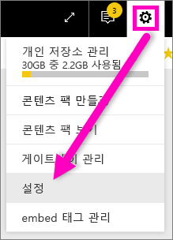
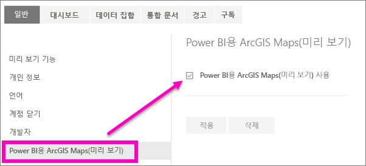

# Power BI 미리 보기 기능용 옵트인
## *미리 보기 기능* 이란?
Power BI를 개선하면서 *미리 보기 기능* 으로 몇 가지 새로운 기능을 출시할 예정입니다. 이제 미리 보기 기능을 설정하거나 해제할 수 있으므로 이를 시험해 볼 수 있습니다.

> [!TIP]
> 질문이나 의견이 있으십니까? [Power BI 커뮤니티 포럼 방문](http://community.powerbi.com/t5/Navigation-Preview-Forum/bd-p/NavigationPreview)
> 
> 

## 사용 가능한 현재 미리 보기
**Power BI 미리 보기용 ArcGIS 맵** ArcGIS 맵과 Power BI의 조합은 맵에서 요소의 표현을 넘어서 완전히 새로운 수준으로 매핑합니다.
[Power BI 서비스 및 Power BI 데스크톱에서 esri로 ArcGIS 맵을 둘러봅니다](power-bi-visualization-arcgis.md).

## ArcGIS 미리 보기 기능 설정(및 해제)
1. Power BI 화면의 오른쪽 위에 있는 기어 아이콘을 선택하고 **설정**을 선택하여 [설정] 메뉴를 엽니다.
   
   .
2. **일반** 탭을 선택하고 **미리 보기 기능**을 선택합니다.
   
   
3. 새로운 환경을 시도하려면 **설정** 라디오 단추를 선택합니다. **적용**을 클릭합니다.
4. 미리 보기 기능을 해제하려면 위의 1-2단계를 따르고 3단계에서 **해제** > **적용**을 선택합니다.

## 다음 단계
[새로운 Power BI 탐색 환경](service-the-new-power-bi-experience.md)

질문이나 의견이 있으십니까? [Power BI 커뮤니티 포럼 방문](http://community.powerbi.com/t5/Navigation-Preview-Forum/bd-p/NavigationPreview)

