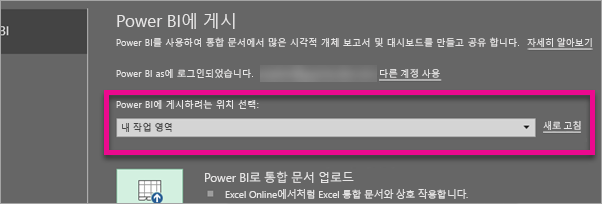
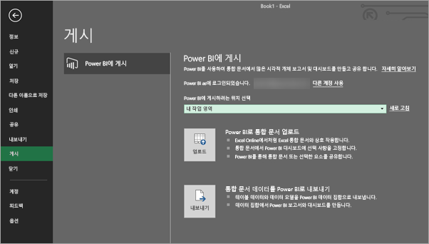
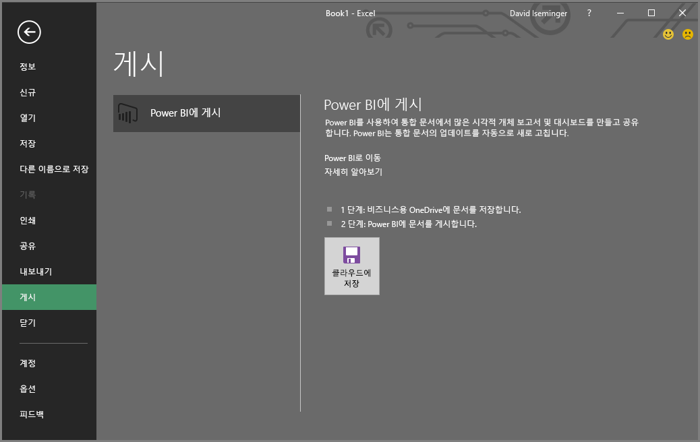
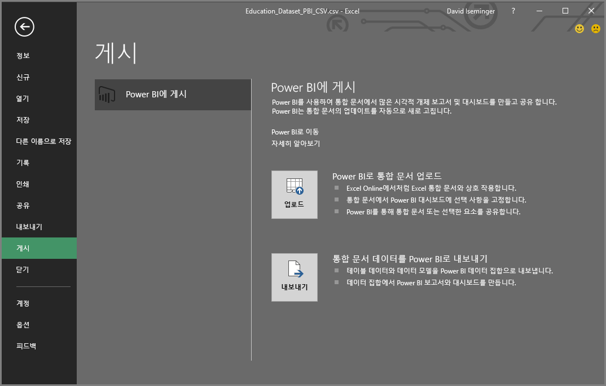
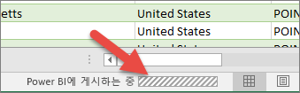

# Excel 2016에서 Power BI로 게시
Excel 2016에서는 Excel 통합 문서를 [Power BI](https://powerbi.microsoft.com) 사이트에 바로 게시하여 통합 문서의 데이터에 기반하여 대화형 작업이 많은 보고서와 대시보드를 만들 수 있습니다. 그러면 조직에서 다른 사용자와 정보를 공유할 수 있습니다.

더 진행하기 전에 몇 가지 사항을 유념해야 합니다.

* 통합 문서를 Power BI에 게시하려면 비즈니스용 OneDrive에 저장되어 있어야 합니다.
* Office, 비즈니스용 OneDrive와 Power BI에 로그인하는 데 사용하는 계정은 같아야 합니다.
* 빈 통합 문서 또는 Power BI 지원 콘텐츠가 없는 통합 문서를 게시할 수 없습니다
* 암호로 보호되고 정보 보호 관리가 있는 통합 문서인 암호화된 통합 문서를 게시할 수 없습니다.
* Power BI에 게시하려면 최신 인증이 사용하도록 설정되어 있어야 합니다(기본값). 사용하지 않도록 설정되어 있는 경우 파일 메뉴에서 게시 옵션을 사용할 수 없습니다.

## Excel 통합 문서에서 게시하려면
Excel에서 **파일** > **게시**를 선택합니다.

### 로컬 파일 게시
2017년 2월 업데이트부터 Excel 2016은 로컬 Excel 파일을 게시하도록 지원합니다. 비즈니스용 OneDrive 또는 SharePoint Online에 저장할 필요는 없습니다.

> [!IMPORTANT]
> Office 365 구독을 사용하는 Excel 2016의 환경에서는 로컬 파일을 게시하는 것을 확인할 수 있습니다. Excel 2016 독립 실행형 설치에는 비즈니스용 OneDrive 또는 SharePoint Online에 Excel 통합 문서를 저장해야 하는 "게시" 전용 동작이 있습니다.
> 
> 

**게시**를 선택하면 게시하려는 작업 영역을 선택할 수 있게 됩니다. 액세스할 수 있는 개인 또는 그룹 작업 영역일 수 있습니다.

통합 문서를 Power BI로 가져오는 방법에 대한 두 가지 옵션이 있습니다.

일단 게시되면 Power BI에서는 로컬 파일과 별도의 복사본으로 유지됩니다. Power BI에서 파일을 업데이트하려는 경우 업데이트된 버전을 다시 게시해야 합니다. 데이터를 새로 고치고 Power BI의 통합 문서 또는 데이터 집합에 예정된 새로 고침을 설정할 수 있습니다.

### Excel 독립 실행형에서 게시
통합 문서가 이미 OneDrive에 저장되어 있지 않은 경우 먼저 저장해야 합니다. 클라우드로 저장을 선택하고 비즈니스용 OneDrive에서 위치를 선택합니다.

통합 문서가 OneDrive로 저장된 후 **게시**를 선택하면 통합 문서를 Power BI로 가져오는 두 가지 옵션이 나타납니다.

#### Power BI로 통합 문서 업로드
이 옵션을 선택하면 Excel Online에서와 같이 통합 문서가 Power BI에 나타납니다. 하지만, Excel Online과는 달리 워크시트의 요소를 대시보드에 고정하는 데 도움이 되는 몇 가지 훌륭한 기능이 제공됩니다.

Power BI에서 연 통합 문서는 편집할 수 없지만, 일부 내용을 변경해야 할 경우 **편집**을 선택한 다음 Excel Online에서 통합 문서를 편집하거나 컴퓨터의 Excel에서 열어볼 수 있습니다. 적용한 모든 변경 내용이 OneDrive의 통합 문서에 저장됩니다.

업로드하면 Power BI에서 만들어지는 데이터 집합은 없습니다. 통합 문서는 작업 영역 탐색 창의 보고서에 나타납니다. Power BI로 업로드된 통합 문서에는 특별한 Excel 아이콘이 있어 업로드된 Excel 통합 문서임을 알 수 있습니다.

워크시트에 데이터만 있거나 대시보드에 Power BI에서 보고 싶은 피벗 테이블 및 차트가 있는 경우 이 옵션을 선택합니다.
Excel에서 Power BI에 게시에서 업로드를 사용하는 것은 브라우저의 Power BI에서 [데이터 가져오기 > 파일 > 비즈니스용 OneDrive > Power BI에서 Excel 연결, 관리 및 보기]를 사용하는 것과 매우 같습니다.

#### 통합 문서 데이터를 Power BI로 내보내기
이 옵션을 선택할 경우 테이블에서 지원되는 데이터 및/또는 데이터 모델을 Power BI에서 새로운 데이터 집합으로 내보냅니다. 파워 뷰 시트가 있는 경우 Power BI에서 보고서로 다시 생성됩니다.

통합 문서 편집을 계속할 수 있습니다. 변경 내용이 저장되면 일반적으로 한 시간 이내에 Power BI에서 해당 데이터 집합과 동기화됩니다. 더 즉각적인 결과가 필요할 경우 게시를 다시 선택하면 변경 내용이 즉시 내보내집니다. 보고서에 있는 모든 시각화 및 대시보드도 업데이트됩니다.

데이터 가져오기 및 변환 또는 파워 피벗을 사용하여 데이터 모델로 데이터를 로드했거나 통합 문서에 Power BI에서 보려고 하는 시각화가 있는 파워 뷰 시트가 있을 경우 이 옵션을 선택합니다.

Excel에서 Power BI에 게시에서 내보내기를 사용하는 것은 브라우저의 Power BI에서 [데이터 가져오기 > 파일 > 비즈니스용 OneDrive > Power BI로 Excel 데이터 내보내기]를 사용하는 것과 거의 같습니다.

## 게시
두 옵션 중 하나를 선택하면 Excel은 현재 계정으로 Power BI에 로그인한 다음 사용자의 통합 문서를 Power BI 사이트로 게시합니다. Excel에서 상태 표시줄에 주목하세요. 진행 상황을 보여줍니다.

완료되면 Excel에서 바로 Power BI로 이동할 수 있습니다.

## 다음 단계
[Power BI의 Excel 데이터](service-excel-workbook-files.md)  
궁금한 점이 더 있나요? [Power BI 커뮤니티를 이용하세요.](http://community.powerbi.com/)

