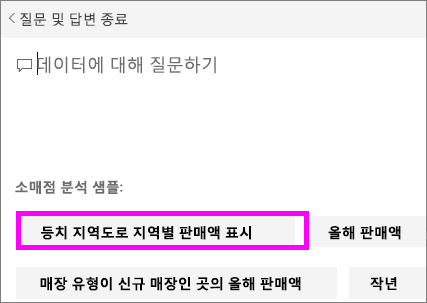

# Power BI 질문 및 답변에 대한 추천 질문 만들기
데이터 집합을 소유하는 경우 해당 데이터 집합에 고유한 추천 질문을 추가할 수 있습니다.  Power BI 질문 및 답변은 이러한 질문을 데이터 집합을 사용하는 동료에게 보여줍니다.  추천 질문은 동료에게 데이터 집합에 대해 문의할 수 있는 형식의 질문에 대한 아이디어를 제공합니다. 추가한 추천 질문은 인기있는 질문, 흥미로운 결과를 표시하는 질문 또는 표현하기 어려울 수 있는 질문을 추가하는 등 다양하게 만들 수 있습니다.

Will이 Power BI 질문 및 답변에 몇 가지 추천 질문을 추가하고 이러한 주요 질문을 사용하여 자신의 데이터 집합을 탐색하는 과정을 시청합니다. 그런 다음 비디오 아래에 있는 단계별 지침을 따라서 직접 시도해 볼 수 있습니다.

<iframe width="560" height="315" src="https://www.youtube.com/embed/E1mIAyEXuF4" frameborder="0" allowfullscreen></iframe>

> [!NOTE]
> Q&A 추천 질문은 [iPads, iPhones, iPod Touch 장치에서 iOS용 Microsoft Power BI 앱](mobile-apps-ios-qna.md)에서도 사용할 수 있습니다.
> 
> 

이 아티클에서는 [소매 분석 판매 샘플](sample-datasets.md)을 사용합니다.

1. 질문과 대답 질문 상자를 선택합니다.   질문과 대답은 데이터 집합에 나타나는 용어 목록을 표시하여 도움을 주고 있습니다.
2. 이 목록에 추가하려면 Power BI의 오른쪽 위 모서리에서 톱니 바퀴형 아이콘을 선택합니다.  
   
3. **설정** &gt; **데이터 집합** &gt; **소매점 분석 샘플** &gt; **추천 Q&A 질문**을 선택합니다.  
4. **질문 추가**를 선택합니다.
   
   
5. 텍스트 상자에 질문을 입력하고 **적용**을 선택합니다.   필요에 따라 **질문 추가**를 선택하여 다른 질문을 추가합니다.  
   
6. 소매점 분석 샘플을 위해 Power BI 대시보드로 이동하고 질문 및 답변 질문하기 상자에 커서를 놓습니다.   
   
7. 새 추천 질문인 **지역별 판매를 지도로**가 목록에서 첫 번째에 있습니다. 선택합니다.  
8. 등치 지역도 시각화로 답변이 표시됩니다.  
   

### 다음 단계
[Power BI의 질문 및 답변](service-q-and-a.md)  
[자습서: Power BI 질문 및 답변 소개](power-bi-visualization-introduction-to-q-and-a.md)  
[Power BI - 기본 개념](service-basic-concepts.md)  
궁금한 점이 더 있나요? [Power BI 커뮤니티를 이용하세요.](http://community.powerbi.com/)

