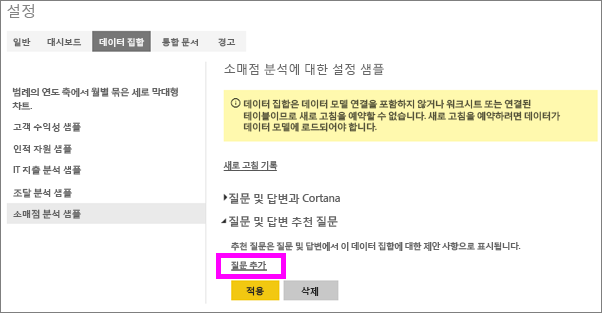
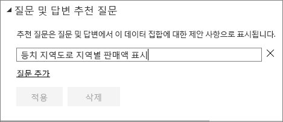
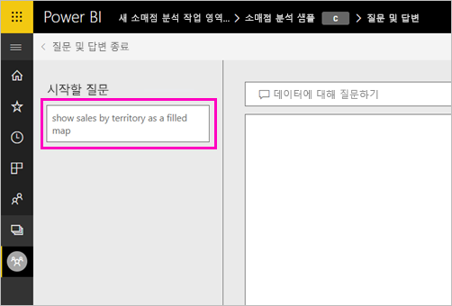
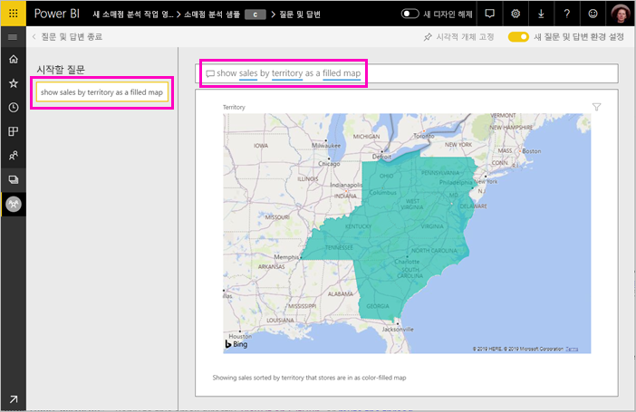

# Power BI 질문 및 답변에 대한 추천 질문 만들기
데이터 세트를 소유하는 경우 해당 데이터 세트에 고유한 추천 질문을 추가할 수 있습니다. Power BI q&a는 해당 데이터 집합을 기반으로 보고서를 사용 하는 동료에 게 이러한 질문 표시 됩니다.  추천 질문은 동료에게 데이터 세트에 대해 문의할 수 있는 형식의 질문에 대한 아이디어를 제공합니다. 추가한 추천 질문은 인기있는 질문, 흥미로운 결과를 표시하는 질문 또는 표현하기 어려울 수 있는 질문을 추가하는 등 다양하게 만들 수 있습니다.

> [!NOTE]
> 질문 및 답변 추천된 질문에서 사용할 수는 [iPads, iPhones, iPod Touch 장치에서 iOS 용 Microsoft Power BI 앱](consumer/mobile/mobile-apps-ios-qna.md) 및 Power BI Desktop 질문과 대답 질문 작성은 Power BI 서비스 (app.powerbi.com)에서 사용할 수만 있습니다.
> 

## 추천된 질문 만들기

이 아티클에서는 [소매 분석 판매 샘플](sample-datasets.md)을 사용합니다. 데이터 집합을 직접 탐색 해 보세요. 하려면 다음 단계별 지침을 따릅니다.

1. 대시보드에서 질문 및 답변의 질문 상자를 선택합니다.   질문과 대답은 데이터 세트에 나타나는 용어 목록을 표시하여 도움을 주고 있습니다.
2. 이 목록에 추가 하려면 Power BI의 오른쪽 위 모퉁이에서 기어 아이콘을 선택 합니다.  
   
3. **설정**&gt;**데이터 세트**&gt;**Retail Analysis Sample**&gt;**질문 및 답변 추천 질문**을 선택합니다.  
4. **질문 추가**를 선택합니다.
   
   
5. 텍스트 상자에 질문을 입력하고 **적용**을 선택합니다.   필요에 따라 **질문 추가**를 선택하여 다른 질문을 추가합니다.  
   
6. 소매점 분석 샘플을 위해 Power BI 대시보드로 이동하고 질문 및 답변 질문하기 상자에 커서를 놓습니다.   
   
7. 새 추천 질문인 **Sales by territory as a map**가 목록에서 첫 번째에 있습니다. 선택합니다.  
8. 등치 지역도 시각화로 답변이 표시됩니다.  
   

## 다음 단계

- [소비자에 대 한 질문과 대답](consumer/end-user-q-and-a.md)  
- [대시보드 및 보고서에서 질문 및 답변 사용](power-bi-tutorial-q-and-a.md)  
- [Power BI - 기본 개념](consumer/end-user-basic-concepts.md)  

궁금한 점이 더 있나요? [Power BI 커뮤니티를 이용하세요.](http://community.powerbi.com/)

