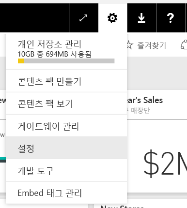
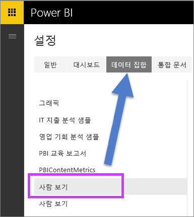
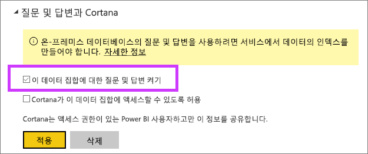

# 라이브 연결로 질문 및 답변 사용
## 온-프레미스 데이터 게이트웨이란 무엇인가요?  라이브 연결이란?
Power BI의 데이터 집합을 Power BI로 가져올 수 있거나 이에 대한 라이브 연결을 만들 수 있습니다. 라이브 연결 데이터 집합은 보통 "온-프레미스"라고 합니다. 라이브 연결은 [게이트웨이](service-gateway-onprem.md) 및 데이터를 사용하여 관리되고 라이브 쿼리를 사용하여 앞뒤로 조사가 전송됩니다.

## 온-프레미스 데이터 게이트웨이 데이터 집합에 대한 질문 및 답변
게이트웨이를 통해 액세스하는 데이터 집합에 대한 질문 및 답변을 사용하려는 경우 먼저 사용하도록 설정해야 합니다.

활성화되면 Power BI는 데이터 원본의 인덱스를 만들고 Power BI에 해당 데이터의 하위 집합을 업로드하여 묻는 질문을 사용합니다. 초기 인덱스를 만들려면 몇 분 정도 걸릴 수 있습니다. Power BI는 데이터 변경에 따른 인덱스를 자동으로 유지 관리하고 업데이트합니다. 이러한 데이터 집합에 대한 질문 및 답변을 사용하면 Power BI에 게시된 데이터와 동일하게 작동합니다. 질문 및 답변 환경에서 사용할 수 있는 전체 기능은 Cortana 데이터 원본 사용을 포함하여 두 경우 모두에 지원됩니다.

Power BI에서 질문을 하면 질문 및 답변에서는 데이터 집합의 인덱스를 사용하여 질문에 대답하는 데 사용할 수 있는 시트를 구성하고 보고하기 위해 가장 훌륭한 시각적 개체를 결정합니다. 잠재적인 정답을 결정한 후에 질문 및 답변에서는 차트와 그래프를 채울 게이트웨이를 통해 데이터 원본에서 라이브 데이터를 인출하는 DirectQuery를 사용합니다. 이렇게 하면 Power BI 질문 및 답변은 기본 데이터 원본에서 직접 최신 데이터를 표시하게 됩니다.

Power BI 질문 및 답변은 데이터 원본에서 텍스트 및 스키마 값을 사용하여 답변에 대한 기본 모델을 쿼리하는 방법을 결정합니다. 따라서 특정한 새롭거나 삭제된 텍스트 값을 검색하기 위해(예: 새로 추가된 텍스트 레코드와 관련된 고객 이름 요청) 최신 값을 최신 버전으로 유지하는 인덱스를 사용합니다. Power BI에서는 변경된 60분 창 내에서 텍스트 및 스키마 인덱스를 자동으로 최신 상태로 유지합니다.

자세한 내용은 다음을 참조하세요.

* [온-프레미스 데이터 게이트웨이](service-gateway-onprem.md)란 무엇인가요?
* [Power BI 질문 및 답변 소개](power-bi-q-and-a.md)

## 질문 및 답변 사용
데이터 게이트웨이를 등록한 후에 Power BI에서 데이터에 연결합니다.  온-프레미스 데이터를 사용하여 대시보드를 만들거나 온-프레미스 데이터를 사용하는 .pbix 파일을 업로드합니다.  또한 사용자와 공유된 대시보드, 보고서 및 데이터 집합에 온-프레미스 데이터가 이미 있을 수 있습니다.

1. Power BI의 오른쪽 위에서 톱니바퀴 아이콘 을 선택하고 **설정**을 선택합니다.
   
   
2. **데이터 집합**을 선택하고 질문 및 답변에 사용할 데이터 집합을 선택합니다.
   
   
3. **질문 및 답변 및 Cortana**를 확장하고 **이 데이터 집합에 대한 질문 및 답변 설정** 확인란을 선택하고 **적용**을 선택합니다.
   
    

## 데이터 캐시의 의미와 개인 정보 보호 방법은 무엇인가요?
온-프레미스 데이터에 대한 질문 및 답변을 사용하면 데이터의 하위 집합이 서비스에 캐시됩니다. 이렇게 하려면 질문 및 답변을 적절한 성능으로 사용하여야 합니다. Power BI는 24자보다 긴 값을 캐싱에서 제외합니다. **이 데이터 집합에 대한 질문 및 답변 켜기** 선택을 취소하여 질문 및 답변을 사용하지 않거나 데이터 집합을 삭제하면 몇 시간 이내에 캐시가 삭제됩니다.

## 고려 사항 및 문제 해결
이 기능은 미리 보기 단계 중에 일부가 제한됩니다.

* 처음부터 이 기능은 SQL Server 2016 Analysis Services 테이블 형식 데이터 원본에만 사용할 수 있습니다. 기능은 표 형식 데이터에 맞게 최적화됩니다. 일부 기능은 다차원 데이터 원본에 사용할 수 있지만 전체 질문 및 답변 환경은 아직 다차원에 지원되지 않습니다. 온-프레미스 데이터 게이트웨이에서 지원하는 추가 데이터 원본은 시간이 지나면 출시될 예정입니다.
* SQL Server Analysis Services에 정의된 행 수준 보안에 대한 완벽한 지원은 처음부터 공개 미리 보기에서 지원되지 않습니다. 질문 및 답변에서 질문하는 동안 입력하는 질문의 "자동 완성"은 사용자가 액세스할 수 없는 문자열 값을 나타낼 수 있습니다. 그러나 모델에 정의된 RLS는 보고서 및 차트 시각적 개체를 고려하므로 기본 숫자 데이터가 노출되지 않습니다. 이 동작을 제어하는 옵션은 향후 업데이트에서 출시될 예정입니다.
* OLS(개체 수준 보안)가 지원되지 않습니다. 질문 및 답변은 개체 수준 보안을 고려하지 않고 테이블 또는 열 이름을 액세스 권한이 없는 사용자에게 노출할 수 있습니다. 데이터 값이 적절하게 보호되는지 확인하려면 RLS를 사용하도록 설정해야 합니다. 
* 라이브 연결은 온-프레미스 데이터 게이트웨이를 통해서만 지원됩니다. 결과적으로, 개인 게이트웨이와 함께 사용할 수 없습니다.

## 다음 단계
[온-프레미스 데이터 게이트웨이](service-gateway-onprem.md)  
[데이터 원본 관리 - Analysis Services](service-gateway-enterprise-manage-ssas.md)  
[Power BI - 기본 개념](service-basic-concepts.md)  
[Power BI 질문 및 답변 개요](power-bi-q-and-a.md)  

궁금한 점이 더 있나요? [Power BI 커뮤니티에 질문합니다.](http://community.powerbi.com/)

