# Power BI에서 실시간 스트리밍
Power BI 실시간 스트리밍을 사용하여 실시간으로 데이터를 스트리밍하고 대시보드를 업데이트할 수 있습니다. Power BI에서 만들 수 있는 시각적 개체 또는 대시보드를 실시간 데이터 및 시각적 개체를 표시하고 업데이트하도록 만들 수도 있습니다. 스트리밍 데이터의 장치 및 원본은 팩터리 센서, 소셜 미디어 원본, 서비스 사용 메트릭 및 시간이 중요한 데이터가 수집되거나 전송되는 모든 것일 수 있습니다.

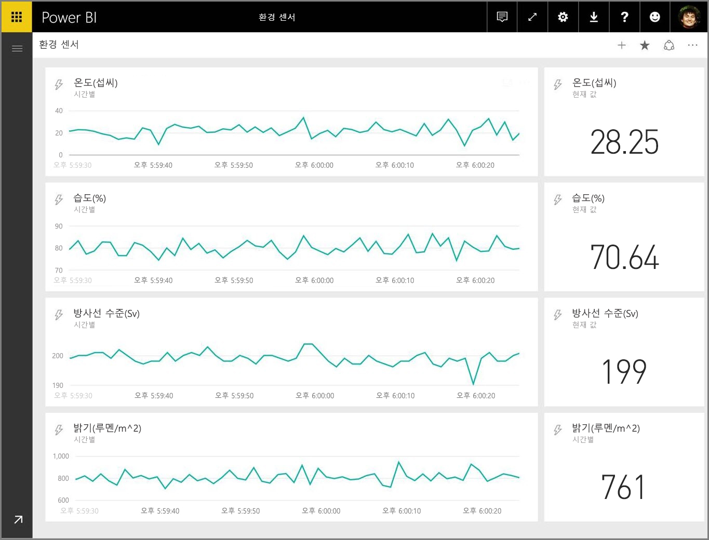

이 문서에서는 Power BI에서 실시간 스트리밍 데이터 집합을 설정하는 방법을 보여 줍니다. 시작하기 전에 타일(및 대시보드)에 표시하도록 설계된 실시간 데이터 집합의 형식들과 그러한 데이터 집합들이 어떻게 다른지 이해하는 것이 중요합니다.

## 실시간 데이터 집합의 형식
실시간 대시보드에 표시하도록 설계된 실시간 데이터 집합에는 세 가지 형식이 있습니다.

* 푸시 데이터 집합
* 스트리밍 데이터 집합
* PubNub 스트리밍 데이터 집합

먼저 이러한 데이터 집합이 서로 어떻게 다른지에 대해 알아보고(이 섹션), 그 다음 이러한 데이터 집합 각각에 데이터를 푸시하는 방법에 대해 살펴봅니다.

### 푸시 데이터 집합
**푸시 데이터 집합**에서 데이터는 Power BI 서비스에 푸시됩니다. 데이터 집합 만들어질 때 Power BI 서비스는 데이터를 저장하는 서비스에서 새 데이터베이스를 자동으로 만듭니다. 계속 데이터를 그대로 저장하는 기본 데이터베이스가 있으므로 보고서를 데이터와 함께 만들 수 있습니다. 이러한 보고서 및 시각적 개체는 모든 다른 보고서 시각적 개체와 똑같습니다. 다시 말해, 모든 Power BI의 보고서 작성 기능을 사용하여 사용자 지정 시각적 개체, 데이터 경고, 고정된 대시보드 타일 등과 같은 시각적 개체를 만들 수 있습니다.

푸시 데이터 집합을 사용하여 보고서를 만들었으면, 해당 시각적 개체 중 하나를 대시보드에 고정할 수 있습니다. 대시보드에서 시각적 개체는 데이터가 업데이트될 때마다 실시간으로 업데이트합니다. 서비스 내에서 대시보드는 새 데이터를 수신할 때마다 타일 새로 고침을 트리거합니다.

푸시 데이터 집합에서 고정된 타일에 관한 고려 사항이 두 가지 있습니다.

* *라이브 고정 페이지* 옵션을 사용하여 전체 보고서를 고정하면 데이터가 자동으로 업데이트되지 **않습니다**.
* 시각적 개체를 대시보드에 고정하면 **Q&A**를 사용하여 자연어로 푸시 데이터 집합에 관한 질문을 할 수 있습니다. **Q&A** 쿼리를 만들면 결과 시각적 개체를 다시 대시보드에 고정할 수 있고 해당 대시보드 *역시* 실시간으로 업데이트하게 됩니다.

### 스트리밍 데이터 집합
**스트리밍 데이터 집합**을 사용하면 역시 데이터가 Power BI 서비스에 푸시되는데, 중요한 차이점이 있습니다. Power BI는 단지 데이터를 빠르게 만료되는 임시 캐시에 저장합니다. 임시 캐시는 한 시간의 시간 창이 있는 꺾은선형 차트와 같이 일시적인 이력 감지를 나타내는 시각적 개체를 표시하는 데만 사용됩니다.

**스트리밍 데이터 집합**을 사용하면 기본 데이터베이스가 *없기* 때문에 스트림에서 흐르는 데이터를 사용하여 보고서 시각적 개체를 만들 수 *없습니다*. 이와 같이 필터링, 사용자 지정 시각적 개체 및 다른 보고서 기능과 같은 보고서 기능을 사용할 수 없습니다.

스트리밍 데이터 집합을 시각화하는 유일한 방법은 타일을 추가하고 스트리밍 데이터 집합을 **사용자 지정 스트리밍 데이터** 데이터 원본으로 사용하는 것입니다. **스트리밍 데이터 집합**에 기반한 사용자 지정 스트리밍 타일은 실시간 데이터를 빠르게 표시하기 위해 최적화되어 있습니다. 데이터를 데이터베이스에 입력하거나 읽을 필요가 없기 때문에 데이터가 Power BI 서비스에 푸시될 때와 시각적 개체가 업데이트될 때 사이의 대기 시간은 매우 짧습니다.

실제로 스트리밍 데이터 집합과 동반하는 스트리밍 시각적 개체는 데이터가 푸시될 때와 시각화될 때 사이의 대기 시간을 최소화하는 것이 중요한 상황에 최적화되어 있습니다. 또한 어떠한 추가 집계 없이 있는 그대로 시각화할 수 있는 형식으로 푸시된 데이터를 갖는 것이 최상의 방법입니다. 있는 그대로 준비되는 데이터의 예에는 온도 및 미리 계산된 평균이 있습니다.

### PubNub 스트리밍 데이터 집합
**PubNub** 스트리밍 데이터 집합을 사용하면 Power BI 웹 클라이언트는 PubNub SDK를 사용하여 기존 PubNub 데이터 스트림을 읽으며, Power BI 서비스에서 저장하는 데이터가 없습니다.

**스트리밍 데이터 집합**과 마찬가지로, **PubNub 스트리밍 데이터 집합**을 사용하면 Power BI에 기본 데이터베이스가 없으므로 흐르는 데이터에 대한 보고서 시각적 개체를 만들 수 없으며 필터링, 사용자 지정 시각적 개체 등과 같은 보고서 기능의 장점을 활용할 수 없습니다. 이와 같이 **PubNub 스트리밍 데이터 집합**은 또한 대시보드에 타일을 추가하고 PubNub 데이터 스트림을 원본으로 구성하는 방법으로만 시각화할 수 있습니다.

**PubNub 스트리밍 데이터 집합**에 기반한 타일은 실시간 데이터를 빠르게 표시하기 위해 최적화되어 있습니다. Power BI는 PubNub 데이터 스트림에 직접 연결되어 있기 때문에 데이터가 Power BI 서비스에 푸시될 때와 시각적 개체가 업데이트될 때 사이의 대기 시간은 매우 짧습니다.

### 스트리밍 데이터 집합 행렬
다음 테이블(또는 행렬을 사용하려는 경우)에는 실시간 스트리밍의 세 가지 형식이 설명되어 있으며, 각각의 기능과 제한 사항이 나열되어 있습니다.

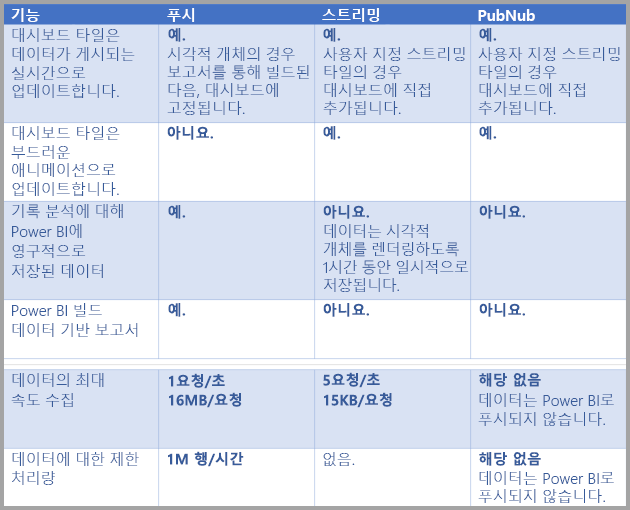

> [!NOTE]
> 얼마나 많은 데이터를 푸시할 수 있는지에 대한 **푸시** 한도 정보는 [이 MSDN 문서](https://msdn.microsoft.com/library/dn950053.aspx)를 참조하세요.
> 
> 

## 데이터 집합에 데이터 푸시
이전 섹션에서는 실시간 스트리밍에서 사용할 수 있는 실시간 데이터 집합의 세 가지 기본 형식과 차이점에 대해 설명하였습니다. 이 섹션에서는 데이터를 만들어서 그러한 데이터 집합으로 푸시하는 방법을 설명합니다.

세 가지 기본 방법으로 데이터를 데이터 집합으로 푸시할 수 있습니다.

* Power BI REST API 사용
* 스트리밍 데이터 집합 UI 사용
* Azure Stream Analytics 사용

접근 방법들을 각각 차례로 살펴보겠습니다.

### Power BI REST API를 사용하여 데이터 푸시
**Power BI REST API**는 데이터를 만들고 **푸시** 데이터 집합 및 **스트리밍** 데이터 집합으로 전송하는 데 사용할 수 있습니다. Power BI REST API를 사용하여 데이터 집합을 만드는 경우 *defaultMode* 플래그에서 데이터 집합이 푸시인지 스트리밍인지 여부를 지정합니다. *defaultMode* 플래그가 설정되어 있지 않은 경우 데이터 집합은 **푸시** 데이터 집합으로 기본 설정됩니다.

defaultMode 값이 pushStreaming으로 설정되어 있는 경우 데이터 집합은 모두 **푸시** *및* **스트리밍** 데이터 집합이며 두 데이터 집합 형식의 이점을 모두 제공합니다. [**데이터 집합 만들기**에 관한 REST API 문서](https://msdn.microsoft.com/library/mt203562.aspx)는 스트리밍 데이터 집합 만들기에 대해 설명하고 작업 중인 *defaultMode* 플래그를 보여 줍니다.

> [!NOTE]
> *defaultMode* 플래그를 *pushStreaming*으로 설정한 상태로 데이터 집합을 사용할 때, 요청이 **스트리밍** 데이터 집합에 대해 15Kb 크기 제한을 초과하되 **푸시** 데이터 집합의 16MB 크기 제한보다는 작은 경우 요청은 성공하고 데이터가 푸시 데이터 집합에서 업데이트됩니다. 그러나 모든 스트리밍 타일은 일시적으로 실패하게 됩니다.
> 
> 

데이터 집합을 만들고 나면 REST API를 통해 [이 문서에 설명된](https://msdn.microsoft.com/library/mt203561.aspx) 대로 [API에 **행 추가**](https://msdn.microsoft.com/library/mt203561.aspx)를 사용하여 데이터를 푸시합니다.

REST API에 대한 모든 요청은 **Azure AD OAuth**를 사용하여 보안이 설정됩니다.

### 스트리밍 데이터 집합 UI를 사용하여 데이터 푸시
Power BI 서비스에서는 다음 이미지에 나와 있는 것처럼 **API** 접근 방식을 선택하여 데이터 집합을 만들 수 있습니다.

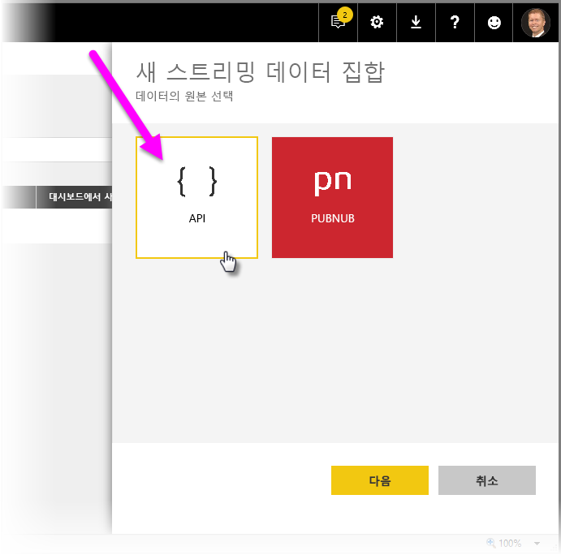

새 스트리밍 데이터 집합을 만들 때 아래 나온 것처럼 **기록 데이터 분석**을 활성화하도록 선택할 수 있는데 이는 막대한 영향을 줍니다.

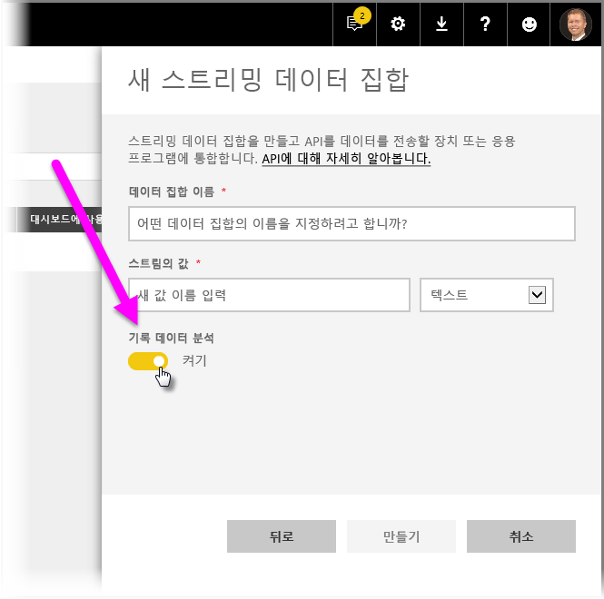

**기록 데이터 분석**이 사용하지 않도록 설정된 경우(기본적으로 사용하지 않도록 설정되어 있음) 이 문서에서 앞서 설명한 대로 **스트리밍 데이터 집합**을 만들 수 있습니다. **기록 데이터 분석**이 사용하도록 설정된 경우 만든 데이터 집합은 **스트리밍 데이터 집합** 및 **푸시 데이터 집합** 모두가 됩니다. 이는 이 문서의 앞부분에 설명된 대로 defaultMode가 pushStreaming으로 설정되어 있는 상태에서 Power BI REST API를 사용하여 데이터 집합을 만드는 것과 동일합니다.

> [!NOTE]
> 이전 문단에서 설명된 Power BI 서비스 UI를 사용하여 만든 스트리밍 데이터 집합의 경우 Azure AD 인증이 필요하지 않습니다. 이러한 데이터 집합에서 데이터 집합 소유자는 Rowkey가 포함된 URL을 받게 되는데, 이는 Azure AD OAuth 전달자 토큰을 사용하지 않고 요청자가 데이터 집합에 데이터를 푸시하도록 권한을 부여합니다. 하지만 Azure AD(AAD) 접근 방식은 여전히 작동하여 데이터 집합에 데이터를 푸시합니다.
> 
> 

### Azure Stream Analytics를 사용하여 데이터를 푸시
Power BI를 **Azure Stream Analytics**(ASA) 내 출력으로 추가한 다음, 그러한 데이터 스트림을 실시간으로 Power BI 서비스에서 시각화할 수 있습니다. 이 섹션에서는 그러한 프로세스가 어떻게 일어나는지에 대해 기술적인 세부 정보를 설명합니다.

Azure Stream Analytics는 defaultMode를 pushStreaming으로 설정한 상태에서(defaultMode에 대한 정보는 이 문서의 이전 섹션 참조) Power BI REST API를 사용하여 Power BI에 출력 데이터 스트림을 만듭니다. 그러면 **푸시**와 **스트리밍**의 장점을 모두 이용할 수 있는 데이터 집합을 얻을 수 있습니다. 데이터 집합을 만드는 동안 Azure Stream Analytics는 또한 *retentionPolicy 플래그를 basicFIFO로 설정하는데, 이 설정을 사용하면 데이터베이스는 푸시 데이터 집합이 200,000개 행을 저장하도록 지원하며 이후 한도에 도달하면 행은 선입 선출(FIFO) 방식으로 삭제됩니다.

> [!CAUTION]
> Azure Stream Analytics 쿼리가 Power BI에 매우 신속하게 출력되는 경우(예: 초당 한 번 또는 두 번) Azure Stream Analytics는 그러한 출력을 단일 요청으로 일괄 처리할 것입니다. 이로 인해 요청 크기가 스트리밍 타일 한도를 초과할 수도 있습니다. 그러한 경우 이전 섹션에서 설명한 대로 스트리밍 타일은 렌더링에 실패하게 됩니다. 그러한 경우에는 Power BI로 출력되는 데이터 속도를 늦추는 것이 가장 좋습니다. 예를 들어 초당 최대 값 대신 10초 이상 최대값으로 설정합니다.
> 
> 

## Power BI에서 실시간 스트리밍 데이터 집합 설정
지금까지 실시간 스트리밍에 대한 데이터 집합의 세 가지 기본 형식과 데이터 집합에 데이터를 푸시할 수 있는 세 가지 기본 방식에 대해 살펴보았습니다. 이제 Power BI에서 작업 중인 실시간 스트리밍 데이터 집합에 대해 알아보겠습니다.

실시간 스트리밍을 시작하려면 Power BI에서 스트리밍 데이터가 사용될 수 있는 두 가지 방법 중 하나를 선택해야 합니다.

* 스트리밍 데이터에서 시각적 개체를 사용하는 **타일**
* Power BI에서 유지되는 스트리밍 데이터에서 생성된 **데이터 집합**

두 옵션 중 하나로 Power BI에서 **스트리밍 데이터**를 설정해야 합니다. 이렇게 하려면 대시보드에서(기존 대시보드 또는 새 대시보드) **타일 추가**를 선택한 다음 **스트리밍 데이터 사용자 지정**을 선택합니다.

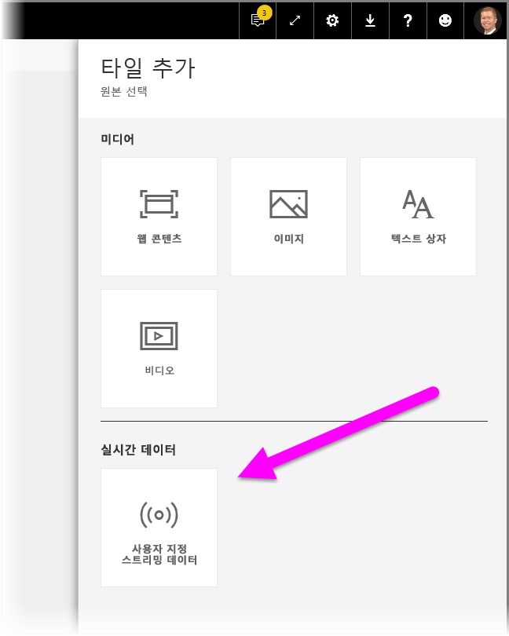

스트리밍 데이터 집합을 아직 설정하지 않은 경우 걱정하지 마세요. **데이터 관리**를 선택하여 시작할 수 있습니다.

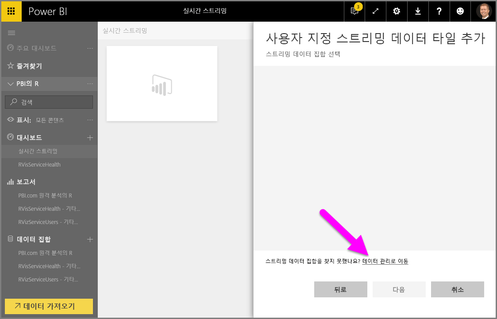

이 페이지에서 이미 만든 경우 스트리밍 데이터 집합의 끝점을 (텍스트 상자로) 입력할 수 있습니다. 스트리밍 데이터 집합이 아직 없는 경우 오른쪽 위 모서리에서 더하기 아이콘( **+** )을 선택하여 스트리밍 데이터 집합을 만들기 위한 사용 가능한 옵션을 표시합니다.

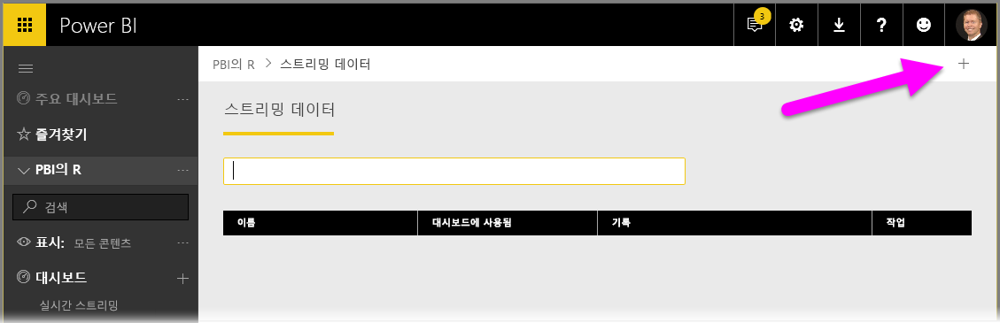

**+** 아이콘을 클릭하면 두 가지 옵션이 나타납니다.

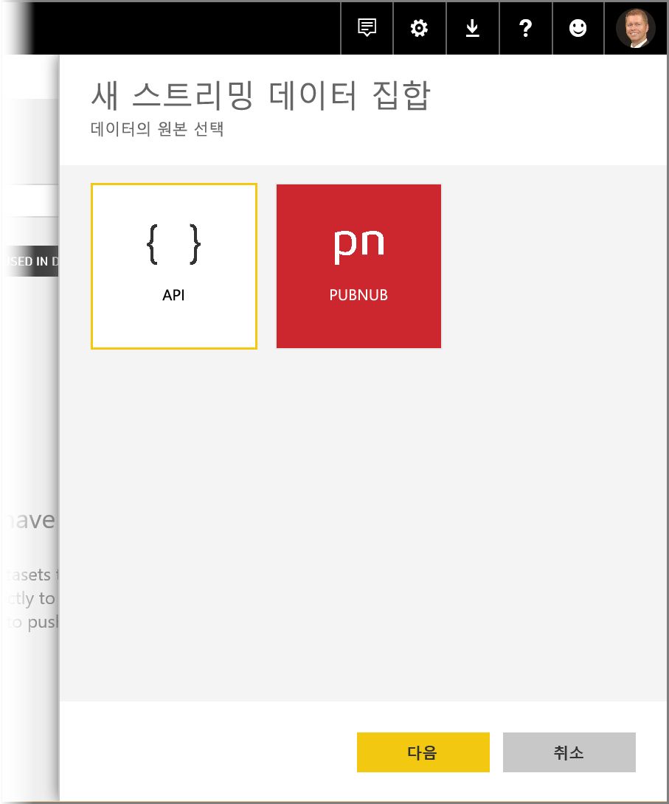

다음 섹션은 이러한 옵션을 설명하고 보고서를 작성하기 위해 나중에 사용할 수 있는 스트리밍 데이터 원본에서 스트리밍 **타일**을 만드는 방법 또는 **데이터 집합**을 만드는 방법에 대한 자세한 내용으로 이어집니다.

## 가장 마음에 드는 옵션으로 스트리밍 데이터 집합 만들기
Power BI에서 사용하고 시각화할 수 있는 실시간 스트리밍 데이터 피드를 만드는 두 가지 방법이 있습니다.

* 실시간 스트리밍 끝점을 사용하여 **Power BI REST API**
* **PubNub**

다음 섹션에서는 각 옵션을 차례로 확인합니다.

### POWER BI REST API 사용
**Power BI REST API** - 개발자가 쉽게 실시간 스트리밍을 사용하도록 Power BI REST API에 대한 최근 개선 기능이 설계되었습니다. **새 스트리밍 데이터 집합** 창에서 **API**를 선택하면 Power BI를 연결하고 끝점을 사용하도록 제공하는 항목이 제공됩니다.

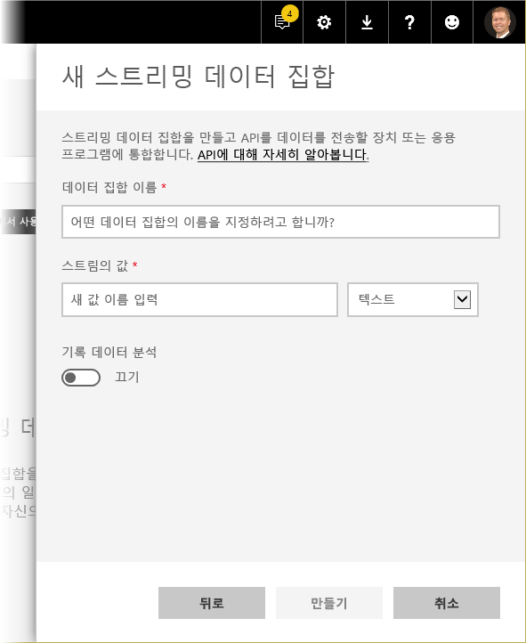

이 데이터 스트림을 통해 전송되는 데이터를 Power BI에 저장하려는 경우 기록 데이터 분석을 활성화하고 수집된 데이터 스트림에 대한 보고서 작성 및 분석을 수행할 수 있습니다. [API에 대해 자세히 알아볼](https://msdn.microsoft.com/library/dn877544.aspx) 수도 있습니다.

데이터 스트림을 성공적으로 만들면 응용 프로그램이 *POST* 요청을 사용하여 데이터를 사용자가 만든 Power BI **스트리밍 데이터** 데이터 집합으로 푸시하도록 호출할 수 있는 REST API URL 끝점이 제공됩니다.

*POST* 요청 시 요청 본문이 Power BI 사용자 인터페이스에서 제공하는 JSON 샘플과 일치하는지 확인해야 합니다. 예를 들어, 배열에서 JSON 개체를 래핑합니다.

### PubNub 사용
Power BI와 **PubNub** 스트리밍의 통합을 통해 낮은 지연율 **PubNub** 데이터 스트림을 사용하고 (또는 새로 만들고) Power BI에서 사용할 수 있습니다. **PubNub**를 선택한 후 **다음**을 선택하면 다음과 같은 창이 표시됩니다.

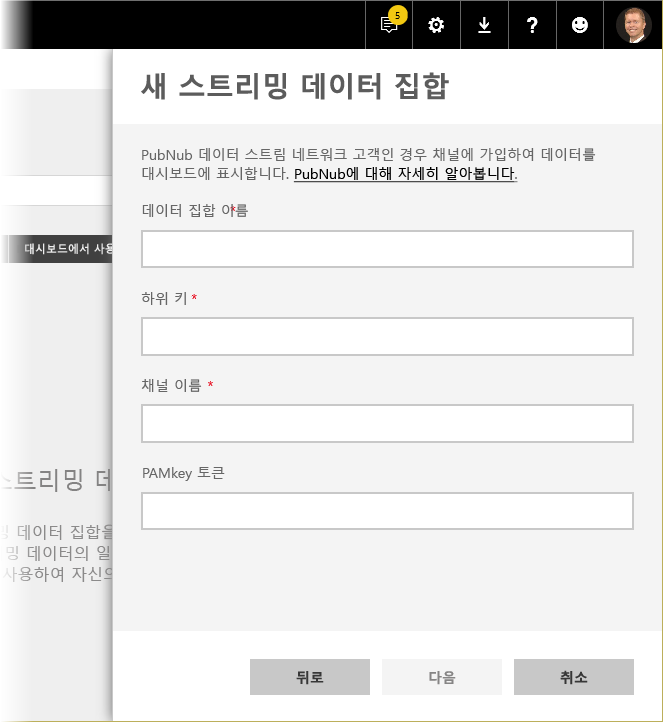

> [!WARNING]
> PubNub 채널은 PAM(PubNub Access Manager) 인증 키를 사용하여 보호할 수 있습니다. 이 키는 대시보드에 액세스한 모든 사용자와 공유됩니다. [PubNub 액세스 제어에 대해 자세히](https://www.pubnub.com/docs/web-javascript/pam-security) 알아볼 수 있습니다.
> 
> 

**PubNub** 데이터 스트림은 종종 고용량이며 원래 형태로 저장소 및 기록 분석에 항상 적합하지 않습니다. PubNub 데이터의 기록 분석에 대해 Power BI를 사용하려면 원시 PubNub 스트림을 집계하고 Power BI로 보내야 합니다. 작업을 수행하는 한 가지 방법은 인 [Azure 스트림 분석](https://azure.microsoft.com/services/stream-analytics/)을 사용하는 것입니다.

## Power BI에서 실시간 스트리밍 사용의 예
Power BI에서 실시간 스트리밍이 작동되는 방법에 대한 간단한 예는 다음과 같습니다. 이 샘플을 따라 실시간 스트리밍의 값을 볼 수 있습니다.

이 샘플에서는 **PubNub**에서 공개적으로 사용할 수 있는 스트림을 사용합니다. 수행하는 단계는 다음과 같습니다.

1. **Power BI 서비스**에서 대시보드를 선택하고 (또는 새로 만들고) **타일 추가** > **스트리밍 데이터 사용자 지정**을 선택한 후 **다음** 단추를 선택합니다.
   
   
2. 스트리밍 데이터 원본이 아직 없는 경우 **데이터 관리** 링크를 선택한 다음(**다음** 단추 위) 창의 오른쪽 위 링크에서 **+ 스트리밍 데이터 추가**를 선택합니다. **PubNub**를 선택한 다음 **다음**을 선택합니다.
3. 데이터 집합에 대한 이름을 만든 다음 표시되는 창에 다음 값을 붙여 넣은 후 **다음**을 선택합니다.
   
   *구독 키:*
   
       sub-c-5f1b7c8e-fbee-11e3-aa40-02ee2ddab7fe
   *채널:*
   
       pubnub-sensor-network
   
   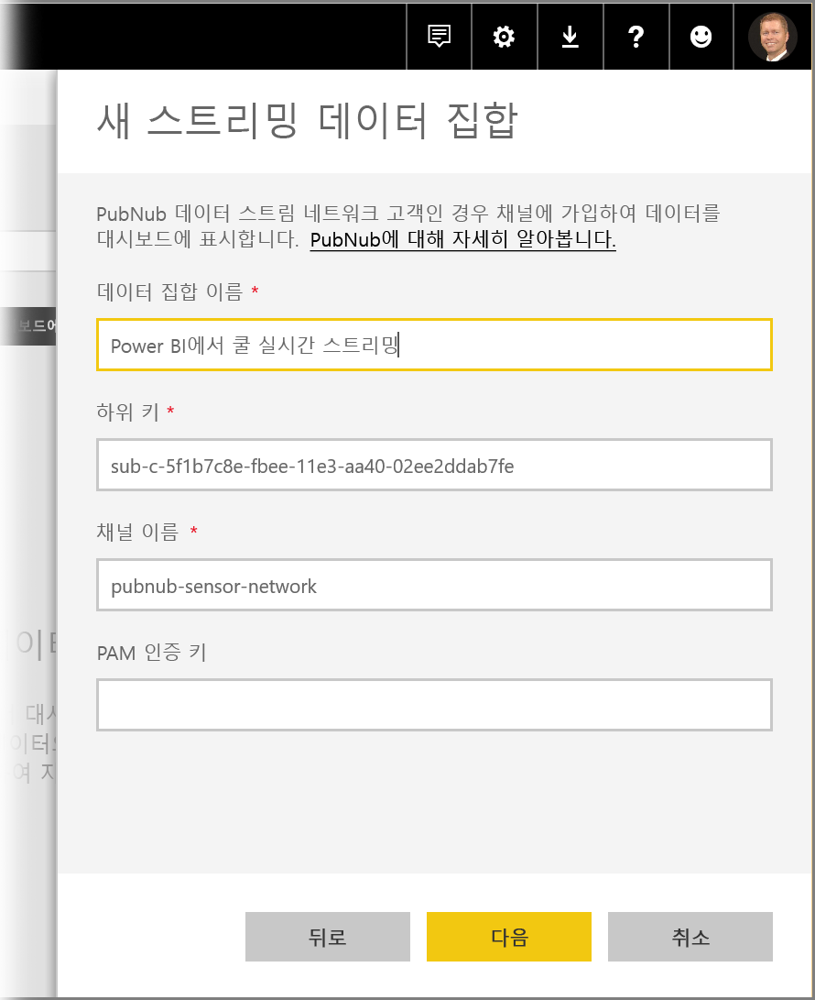
4. 다음 창에서 기본값을 선택한 다음(자동으로 채워지는) **만들기**를 선택합니다.
   
   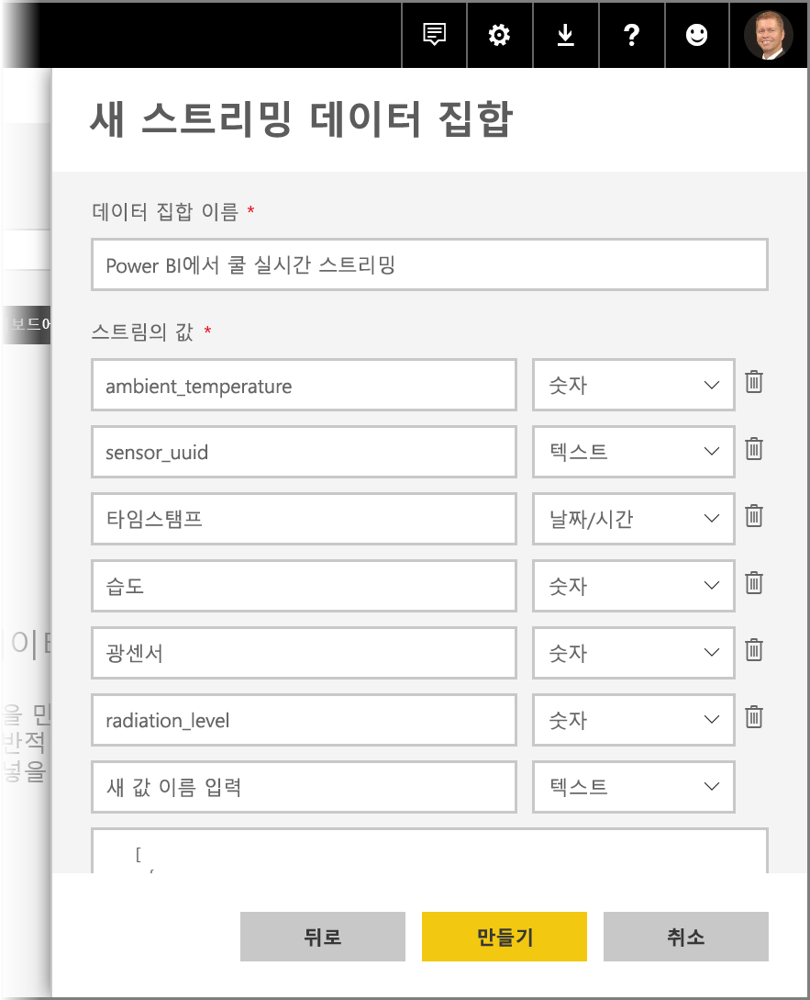
5. 다시 Power BI 작업 영역에서 새 대시보드를 만든 다음 타일을 추가합니다(필요할 경우 위의 단계 참조). 타일을 만들고 **스트리밍 데이터 사용자 지정**을 선택할 때 스트리밍 데이터 집합을 함께 사용하도록 설정했습니다. 계속 진행하여 알아봅니다. *번호* 필드를 꺾은선형 차트에 추가한 다음 다른 타일을 추가하여 다음과 같이 보이는 실시간 대시보드를 얻을 수 있습니다.
   
   

직접 시도해보고 샘플 데이터 집합을 살펴봅니다. 그런 다음 Power BI에 고유한 데이터 집합 및 스트림 라이브 데이터를 만듭니다.

## 질문 및 답변
다음은 Power BI의 실시간 스트리밍에 대한 몇 가지 일반적인 질문과 그에 대한 답변입니다.

#### 푸시 데이터 집합에 필터를 사용할 수 있습니까? 스트리밍 데이터 집합은 어떻습니까?
아쉽게도 스트리밍 데이터 집합은 필터링을 지원하지 않습니다. 푸시 데이터 집합의 경우 보고서를 만들고, 보고서를 필터링한 다음, 필터링된 시각적 개체를 대시보드에 고정할 수 있습니다. 단, 한 번 대시보드에 고정된 시각적 개체의 필터는 변경할 수 없습니다.

이와 별도로, 라이브 보고서 타일을 대시보드에 고정할 수 있습니다. 이 경우에는 필터를 변경할 수 있습니다. 그러나 라이브 보고서 타일은 데이터가 푸시됨에 따라 실시간으로 업데이트되지는 않습니다. **자세히** 메뉴의 *대시보드 타일 새로 고침* 옵션을 사용하여 시각적 개체를 수동으로 업데이트해야 합니다.

밀리초 자릿수로 *DateTime* 필드를 포함한 데이터 집합을 푸시하는 필터를 적용할 경우 *동등* 연산자는 지원되지 않습니다. 그러나 보다 큼(>) 또는 보다 작음(<)과 같은 연산자는 올바르게 작동합니다.

#### 푸시 데이터 집합에서 최신 값을 보려면 어떻게 해야 합니까? 스트리밍 데이터 집합은 어떻습니까?
스트리밍 데이터 집합은 최신 데이터를 표시하도록 설계되었습니다. **카드** 스트리밍 시각적 개체를 사용하여 손쉽게 최신 숫자 값을 확인할 수 있습니다. 아쉽게도 카드는 *DateTime* 또는 *텍스트* 형식의 데이터를 지원하지 않습니다.
푸시 데이터 집합의 경우 스키마에 타임 스탬프를 가지고 있다고 가정하여 마지막 N 필터를 사용하여 보고서 시각적 개체 만들기를 시도할 수 있습니다.

#### Power BI Desktop의 푸시 또는 스트리밍 데이터 집합에 연결할 수 있습니까?
아쉽게도 현재는 사용할 수 없습니다.

#### 이전 질문을 고려해 볼 때, 실시간 데이터 집합에 관한 모델링을 하려면 어떻게 해야 합니까?
데이터가 영구적으로 저장되지 않으므로 모델링은 스트리밍 데이터 집합에서 불가능합니다. 푸시 데이터 집합의 경우 데이터 집합/테이블 REST API 업데이트를 사용하여 측정값 및 관계를 추가할 수 있습니다. [테이블 스키마 업데이트 문서](https://msdn.microsoft.com/library/mt203560.aspx) 및 [데이터 집합 속성 문서](https://msdn.microsoft.com/library/mt742155.aspx)에서 자세한 정보를 얻을 수 있습니다.

#### 푸시 데이터 집합의 모든 값을 지우려면 어떻게 해야 합니까? 스트리밍 데이터 집합은 어떻습니까?
푸시 데이터 집합에서 행 삭제 REST API 호출을 사용할 수 있습니다. 이와 별도로, REST API에 대한 래퍼로, 이 유용한 도구를 사용할 수도 있습니다. 현재 스트리밍 데이터 집합에서 데이터를 지울 수 있는 방법은 없습니다만 데이터는 자체적으로 한 시간 후에 삭제됩니다.

#### Power BI에 대해 Azure Stream Analytics 출력을 설정했지만 Power BI에 표시되지 않습니다. 문제가 무엇입니까?
다음은 문제를 해결하는 데 사용할 수 있는 검사 목록입니다.

1. Azure Stream Analytics 작업을 다시 시작합니다. (스트리밍 GA 릴리스 전에 만든 작업은 다시 시작할 필요가 있습니다.)
2. Azure Stream Analytics에서 Power BI 연결에 대한 권한 부여를 다시 시도합니다.
3. Azure Stream Analytics 출력에서 지정한 작업 영역은 무엇입니까? Power BI 서비스에서 해당(동일한) 작업 영역을 확인했습니까?
4. Azure Stream Analytics 쿼리가 명확하게 Power BI 출력으로 출력합니까? (INTO 키워드 사용)
5. Azure Stream Analytics 작업에 이를 통해 흐르는 데이터가 있습니까? 데이터 집합은 전송되는 데이터가 있는 경우에만 만들어집니다.
6. Azure Stream Analytics 로그를 살펴보아 경고 또는 오류가 있는지 확인할 수 있습니까?

## 다음 단계
다음은 Power BI의 실시간 스트리밍으로 작업하는 경우 유용한 몇 가지 링크입니다.

* [실시간 데이터를 사용한 Power BI REST API의 개요](https://msdn.microsoft.com/library/dn877544.aspx)
* [Power BI REST API 제한 사항](https://msdn.microsoft.com/library/dn950053.aspx)
* [**데이터 집합 만들기**에 대한 REST API 문서](https://msdn.microsoft.com/library/mt203562.aspx)
* [Power BI REST API **행 추가**](https://msdn.microsoft.com/library/mt203561.aspx)
* [Azure Stream Analytics](https://azure.microsoft.com/services/stream-analytics/)

